---
第2节 面向对象介绍及应用
	2、演示面向对象的开发过程（已看，略）  面向对象是对面向过程的封装
	3、创建对象的三种方式  
	4、构造函数 
第7节 正则表达式及应用
	2正则表达式介绍
	3元字符1
	4元字符开头和结尾
	17split(视频缺少，删)
	***19贪婪模式与非贪婪模式（?）
---


# JavaScript 高级

## 词法作用域和动态作用域 

https://github.com/mqyqingfeng/Blog/issues/3

### 作用域

作用域是指程序源代码中定义变量的区域。

作用域规定了如何查找变量，也就是确定当前执行代码对变量的访问权限。

JavaScript 采用词法作用域(lexical scoping)，也就是静态作用域。

### 静态作用域与动态作用域

因为 JavaScript 采用的是词法作用域，函数的作用域在函数定义的时候就决定了。

而与词法作用域相对的是动态作用域，函数的作用域是在函数调用的时候才决定的。

让我们认真看个例子就能明白之间的区别：

```
var value = 1;

function foo() {
    console.log(value);
}

function bar() {
    var value = 2;
    foo();
}

bar();

// 结果是 ???
```

假设JavaScript采用静态作用域，让我们分析下执行过程：

执行 foo 函数，先从 foo 函数内部查找是否有局部变量 value，如果没有，就根据书写的位置，查找上面一层的代码，也就是 value 等于 1，所以结果会打印 1。

假设JavaScript采用动态作用域，让我们分析下执行过程：

执行 foo 函数，依然是从 foo 函数内部查找是否有局部变量 value。如果没有，就从调用函数的作用域，也就是 bar 函数内部查找 value 变量，所以结果会打印 2。

前面我们已经说了，JavaScript采用的是静态作用域，所以这个例子的结果是 1。

### 动态作用域

也许你会好奇什么语言是动态作用域？

bash 就是动态作用域，不信的话，把下面的脚本存成例如 scope.bash，然后进入相应的目录，用命令行执行 `bash ./scope.bash`，看看打印的值是多少。

```
value=1
function foo () {
    echo $value;
}
function bar () {
    local value=2;
    foo;
}
bar
```

这个文件也可以在 [Github 博客仓库](https://github.com/mqyqingfeng/Blog/blob/master/demos/scope/scope.bash)中找到。

### 思考题

最后，让我们看一个《JavaScript权威指南》中的例子：

```
var scope = "global scope";
function checkscope(){
    var scope = "local scope";
    function f(){
        return scope;
    }
    return f();
}
checkscope();
var scope = "global scope";
function checkscope(){
    var scope = "local scope";
    function f(){
        return scope;
    }
    return f;
}
checkscope()();
```

猜猜两段代码各自的执行结果是多少？

这里直接告诉大家结果，两段代码都会打印：`local scope`。

原因也很简单，因为JavaScript采用的是词法作用域，函数的作用域基于函数创建的位置。

而引用《JavaScript权威指南》的回答就是：

JavaScript 函数的执行用到了作用域链，这个作用域链是在函数定义的时候创建的。嵌套的函数 f() 定义在这个作用域链里，其中的变量 scope 一定是局部变量，不管何时何地执行函数 f()，这种绑定在执行 f() 时依然有效。

但是在这里真正想让大家思考的是：

虽然两段代码执行的结果一样，但是两段代码究竟有哪些不同呢？

如果要回答这个问题，就要牵涉到很多的内容，词法作用域只是其中的一小部分，让我们期待下一篇文章————《JavaScript深入之执行上下文栈》。

# JavaScript深入之执行上下文栈 

https://github.com/mqyqingfeng/Blog/issues/4


## 立即执行函数表达式（IIFE）

立即执行函数，就是在定义函数的时候直接执行，这里不是申明函数而是一个**函数表达式**

#### **1.问题**

在javascript中，每一个函数在被调用的时候都会创建一个执行上下文，在函数内部定义的变量和函数只能在该函数内部调用，正是因为这个上下文，使得在调用函数的时候可以创建一些私有变量。如下代码

```js
    //makeCounter，返回一个新的函数（闭包）,这个函数可以访问makeCounter里的局部变量i
    function makeCounter() {
      var i = 0;
      return function () {
        document.write(++i);
        document.write('<br>');
      }
    }

    //counter1和counter2是不同的实例，分别拥有自己范围内的变量i
    var counter1 = makeCounter();
    counter1();
    counter1();

    var counter2 = makeCounter();
    counter2();
    counter2();
```

这里i是函数makeCounter函数内的局部变量，所以定义的counter1和counter2都有自己的变量i，上面代码输出结果如下：


注意闭i始终保存在内存中，所以第二次调用的时候输出的是2。

普通情况下我们定义一个函数，然后在语句中函数名字后面加上一对圆括号就可以直接调用它，能不能定义完之后直接在后面加上小括号调用呢？如下

```
function(){ counter1(); }(); // SyntaxError: Unexpected token (
```

答案是不行，这样会报错的。为什么呢？在javascript解释代码的时候，遇到function关键字的时候就认为这里是一个**函数声明**，**而不是函数表达式**，如果没有显式地定义成函数表达式就会报错，因为**函数声明需要一个函数名**，上面的代码没有函数名。

既然是因为没有函数名字报错那好就加上一个函数名，如下：

```
function foo(){ counter1(); }(); // SyntaxError: Unexpected token )
```

依然会报错，为什么呢？在一个函数声明语句（这次是正确的）后面加上一对圆括号，这对圆括号和前面的声明语句没有任关系，而只是一个**分组操作符**，用来控制运算的优先级，这里的意思是小括号里面优先计算，所以上面代码等同于：

```
function foo(){ counter1(); }
(); // SyntaxError: Unexpected token )
```

 

#### **2.概念**

正确的写法是怎样的呢？简单，如下：

```
(function () { counter1(); }());
```

这样为什么就可以呢？在javascript里圆括号内不能包含语句，**当解释器对代码进行解释的时候遇到圆括号就认为这里面是表达式，然后遇到function关键字就认为这是一个函数表达式，而不是函数声明**。而更加奇妙的是只要是能将后面语句预先解释为表达式都可以，不一定是分分组操作符，于是立即执行函数表达式有了五花八门的写法，如下：

[](javascript:void(0);)

```js
(function () { counter1(); }());
(function () { counter1(); })();
var i = function(){ counter1(); }();
true && function () { counter1(); }();
0, function(){ counter1() }();
!function () { counter1(); }();
~function () { counter1(); }();
-function () { counter1(); }();
+function () { counter1(); }();
```

[](javascript:void(0);)

输出结果如下：


甚至可以这样：

```
    new function(){ counter1(); }
    new function(){ counter1(); }() // 带参数
```

这样：

```js
var i = function(){ counter1(); }();
var j = (function(){ return 10; }());
```

这是为什么呢？因为new，=是运算符，和+，-，*，/一个样，都会把后面的语句预先解释为表达式。这里推荐上面一种写法，因为function内部代码如果太多，我们不得不滚到最后去看function(){}后是否带有()。

#### 3.立即执行函数和闭包

 和普通函数传参一样，立即执行函数也可以传递参数。如果在函数内部定一个函数，而里面的那个函数能引用外部的变量和参数（闭包），我们就能用立即执行函数锁定变量保存状态。

我们在hmtl页面中方两个超链接标签，然后用下面的代码来测试：

[](javascript:void(0);)

```js
<div>
    <ul>
        <li><a>第一个超链接</a></li>
        <li><a>第二个超链接</a></li>
    </ul>
</div>
    var elems = document.getElementsByTagName('a');
    for(var i=0; i<elems.length; i++) {
      elems[i].addEventListener('click', function (e) {
        e.preventDefault();
        alert('I am click Link #' + i);
      }, 'false')
    }
```

[](javascript:void(0);)

这段代码意图是点击第一个超链接提示“I am click Link #0”，点击第二个提示“I am click Link #1”。真的是这样吗？ 不是，每一次都是“I am click Link #2”


因为i的值没有被锁住，当我们点击链接的时候其实for循环早已经执行完了，于是在点击的时候i的值已经是elems.length了。

修改代码如下：

```js
var elems = document.getElementsByTagName('a');
for (var i = 0; i < elems.length; i++) {
    (function (LockedInIndex) {
        elems[LockedInIndex].addEventListener('click', function (e) {
            e.preventDefault();
            alert('I am cliick Link #' + LockedInIndex);
        }, 'false')
    })(i)
}
```

这次可以正确的输出结果，i的值被传给了LockedIndex，并且被锁定在内存中，尽管for循环之后i的值已经改变，但是立即执行函数内部的LockedIndex的值并不会改变。

还可以这样写：

```js
    var elems = document.getElementsByTagName('a');
    for ( var i = 0; i < elems.length; i++ ) {
      elems[ i ].addEventListener( 'click', (function( lockedInIndex ){
        return function(e){
          e.preventDefault();
          alert( 'I am link #' + lockedInIndex );
        };
      })( i ), 'false' );
    }
```

[](javascript:void(0);)

但是我觉得如果用let是不是就可以一下子解决了：

[](javascript:void(0);)

```js
   var elems = document.getElementsByTagName('a');
    for(let i=0; i<elems.length; i++) {
      elems[i].addEventListener('click', function (e) {
        e.preventDefault();
        alert('I am click Link #' + i);
      }, 'false')
    }
```

let是块级作用域内的变量，是es6新定义的，这里不展开。


JavaScript 面向对象编程

### 面向对象介绍

```javascript
1面向对象介绍(完)
2、演示面向对象的开发过程（已看，略）  面向对象是对面向过程的封装
	3、创建对象的三种方式  
	4、构造函数 
	5、静态成员和实例成员 
	6、构造函数的原型****
	7、对象的原型****
	8、三角关系
	9、原型链
10属性查找规则
11注意点
	12、扩展内置对象  不能直接设置内置对象的prototpye  Array.prototype = {....}
					只能Array.prototype.getSum = function() {.....}
13随机方块-工具对象
14随机方块-方块对象
15随机方块-随机生成坐标
16随机方块-调用
```

**什么是对象**

> Everything is object （万物皆对象）

对象到底是什么，我们可以从两次层次来理解。


**(1) 对象是单个事物的抽象。**

一本书、一辆汽车、一个人都可以是对象，一个数据库、一张网页、一个与远程服务器的连接也可以是对象。当实物被抽象成对象，实物之间的关系就变成了对象之间的关系，从而就可以模拟现实情况，针对对象进行编程。

**(2) 对象是一个容器，封装了属性（property）和方法（method）。**

属性是对象的状态，方法是对象的行为（完成某种任务）。

比如，我们可以把动物抽象为animal对象，

使用“属性”记录具体是那一种动物，

使用“方法”表示动物的某种行为（奔跑、捕猎、休息等等）。

在实际开发中，对象是一个抽象的概念，可以将其简单理解为：**数据集或功能集**。

ECMAScript-262 把对象定义为：**无序属性的集合，其属性可以包含基本值、对象或者函数**。
严格来讲，这就相当于说对象是一组没有特定顺序的值。对象的每个属性或方法都有一个名字，而每个名字都映射到一个值。


  提示：每个对象都是基于一个引用类型创建的，这些类型可以是系统内置的原生类型，也可以是开发人员自定义的类型。

**什么是面向对象**

> 面向对象不是新的东西，它只是过程式代码的一种高度封装，目的在于提高代码的开发效率和可维护性。


面向对象编程 —— Object Oriented Programming，简称 OOP ，是一种编程开发思想。
它将真实世界各种复杂的关系，抽象为一个个对象，然后由对象之间的分工与合作，完成对真实世界的模拟。

在面向对象程序开发思想中，每一个对象都是功能中心，具有明确分工，可以完成接受信息、处理数据、发出信息等任务。
因此，面向对象编程具有灵活、代码可复用、高度模块化等特点，容易维护和开发，比起由一系列函数或指令组成的传统的过程式编程（procedural programming），更适合多人合作的大型软件项目。

面向对象与面向过程： 

- 面向过程就是亲力亲为，事无巨细，面面俱到，步步紧跟，有条不紊
- 面向对象就是找一个对象，指挥得结果
- 面向对象将执行者转变成指挥者
- **面向对象不是面向过程的替代，而是面向过程的封装**

面向对象的特性：

- 封装性 
- 继承性
- [多态性]抽象

扩展阅读：

- [维基百科 - 面向对象程序设计](https://zh.wikipedia.org/wiki/%E9%9D%A2%E5%90%91%E5%AF%B9%E8%B1%A1%E7%A8%8B%E5%BA%8F%E8%AE%BE%E8%AE%A1)
- [知乎：如何用一句话说明什么是面向对象思想？](https://www.zhihu.com/question/19854505)
- [知乎：什么是面向对象编程思想？](https://www.zhihu.com/question/31021366)

**程序中面向对象的基本体现**

在 JavaScript 中，所有数据类型都可以视为对象，当然也可以自定义对象。
自定义的对象数据类型就是面向对象中的类（ Class ）的概念。

我们以一个例子来说明面向过程和面向对象在程序流程上的不同之处。

假设我们要处理学生的成绩表，为了表示一个学生的成绩，面向过程的程序可以用一个对象表示：

```javascript
var std1 = { name: 'Michael', score: 98 }
var std2 = { name: 'Bob', score: 81 }
```

而处理学生成绩可以通过函数实现，比如打印学生的成绩：

```javascript
function printScore (student) {
  console.log('姓名：' + student.name + '  ' + '成绩：' + student.score)
}
```

如果采用面向对象的程序设计思想，我们首选思考的不是程序的执行流程，
而是 `Student` 这种数据类型应该被视为一个对象，这个对象拥有 `name` 和 `score` 这两个属性（Property）。
如果要打印一个学生的成绩，首先必须创建出这个学生对应的对象，然后，给对象发一个 `printScore` 消息，让对象自己把自己的数据打印出来。

抽象数据行为模板（Class）：

```javascript
function Student(name, score) {
  this.name = name;
  this.score = score;
  this.printScore = function() {
    console.log('姓名：' + this.name + '  ' + '成绩：' + this.score);
  }
}
```

根据模板创建具体实例对象（Instance）：

```javascript
var std1 = new Student('Michael', 98)
var std2 = new Student('Bob', 81)
```

实例对象具有自己的具体行为（给对象发消息）：

```javascript
std1.printScore() // => 姓名：Michael  成绩：98
std2.printScore() // => 姓名：Bob  成绩 81
```

面向对象的设计思想是从自然界中来的，因为在自然界中，类（Class）和实例（Instance）的概念是很自然的。
Class 是一种抽象概念，比如我们定义的 Class——Student ，是指学生这个概念，
而实例（Instance）则是一个个具体的 Student ，比如， Michael 和 Bob 是两个具体的 Student 。

所以，面向对象的设计思想是：

- 抽象出 Class(构造函数)
- 根据 Class(构造函数) 创建 Instance
- 指挥 Instance 得结果

面向对象的抽象程度又比函数要高，因为一个 Class 既包含数据，又包含操作数据的方法。

### 创建对象

#### 1、简单方式

我们可以直接通过 `new Object()` 创建：

```javascript
var person = new Object()
person.name = 'Jack'
person.age = 18

person.sayName = function () {
  console.log(this.name)
}
```

每次创建通过 `new Object()` 比较麻烦，所以可以通过它的简写形式对象字面量来创建：

```javascript
var person = {
  name: 'Jack',
  age: 18,
  sayName: function () {
    console.log(this.name)
  }
}
```

对于上面的写法固然没有问题，但是假如我们要生成两个 `person` 实例对象呢？

```javascript
var person1 = {
  name: 'Jack',
  age: 18,
  sayName: function () {
    console.log(this.name)
  }
}

var person2 = {
  name: 'Mike',
  age: 16,
  sayName: function () {
    console.log(this.name)
  }
}
```

通过上面的代码我们不难看出，这样写的代码太过冗余，重复性太高。

#### 2、工厂函数

我们可以写一个函数，解决代码重复问题：

```javascript
function createPerson (name, age) {
  return {
    name: name,
    age: age,
    sayName: function () {
      console.log(this.name)
    }
  }
}
```

然后生成实例对象：

```javascript
var p1 = createPerson('Jack', 18)
var p2 = createPerson('Mike', 18)
```

这样封装确实爽多了，通过工厂模式我们解决了创建多个相似对象代码冗余的问题，
但却没有解决对象识别的问题（即怎样知道一个对象的类型）。

#### 3、构造函数

可同过new关键字调用 实例化一个对象的函数 一般将其首字母大写以和其他函数相区分

new 关键字的作用

新生成一个空白对象 改变this指向新创建出来的对象。


内容引导：

- 构造函数语法
- 分析构造函数
- 构造函数和实例对象的关系
  + 实例的 constructor 属性
  + instanceof 操作符
- 普通函数调用和构造函数调用的区别
- 构造函数的返回值
- 构造函数的问题

一种更优雅的工厂函数就是下面这样，构造函数：

```javascript
function Person (name, age) {
  this.name = name
  this.age = age
  this.sayName = function () {
    console.log(this.name)
  }
}

var p1 = new Person('Jack', 18)
p1.sayName() // => Jack

var p2 = new Person('Mike', 23)
p2.sayName() // => Mike
```

解析构造函数代码的执行

在上面的示例中，`Person()` 函数取代了 `createPerson()` 函数，但是实现效果是一样的。
这是为什么呢？

我们注意到，`Person()` 中的代码与 `createPerson()` 有以下几点不同之处：

- 没有显示的创建对象
- 直接将属性和方法赋给了 `this` 对象
- 没有 `return` 语句
- 函数名使用的是大写的 `Person`

而要创建 `Person` 实例，则必须使用 `new` 操作符。
以这种方式调用构造函数会经历以下 4 个步骤：

1. 创建一个新对象
2. 将构造函数的作用域赋给新对象（因此 this 就指向了这个新对象）
3. 执行构造函数中的代码
4. 返回新对象

下面是具体的伪代码：

```javascript
function Person (name, age) {
  // 当使用 new 操作符调用 Person() 的时候，实际上这里会先创建一个对象
  // var instance = {}
  // 然后让内部的 this 指向 instance 对象
  // this = instance
  // 接下来所有针对 this 的操作实际上操作的就是 instance

  this.name = name
  this.age = age
  this.sayName = function () {
    console.log(this.name)
  }

  // 在函数的结尾处会将 this 返回，也就是 instance
  // return this
}
```

构造函数和实例对象的关系

静态成员：直接使用对象来调用的

```
var myMath = {
    PI: 3.1415926,
    max: function() {
         .....
    },
    min： function() {
        .....
    }
}
myMath.PI;
myMath.min();
```

实例成员：构造函数中的成员是实例成员


使用构造函数的好处不仅仅在于代码的简洁性，更重要的是我们可以识别对象的具体类型了。
在每一个实例对象中同时有一个 `constructor` 属性，该属性指向创建该实例的构造函数：

```javascript
console.log(p1.constructor === Person) // => true
console.log(p2.constructor === Person) // => true
console.log(p1.constructor === p2.constructor) // => true
```

对象的 `constructor` 属性最初是用来标识对象类型的，
但是，如果要检测对象的类型，还是使用 `instanceof` 操作符更可靠一些：

```javascript
console.log(p1 instanceof Person) // => true
console.log(p2 instanceof Person) // => true
```

总结：

- 构造函数是根据具体的事物抽象出来的抽象模板
- 实例对象是根据抽象的构造函数模板得到的具体实例对象
- 每一个实例对象都具有一个 `constructor` 属性，指向创建该实例的构造函数
  + 注意： `constructor` 是实例的属性的说法不严谨，具体后面的原型会讲到
- 可以通过实例的 `constructor` 属性判断实例和构造函数之间的关系
  + 注意：这种方式不严谨，推荐使用 `instanceof` 操作符，后面学原型会解释为什么

#### 构造函数的问题

使用构造函数带来的最大的好处就是创建对象更方便了，但是其本身也存在一个浪费内存的问题：

```javascript
function Person (name, age) {
  this.name = name
  this.age = age
  this.type = 'human'
  this.sayHello = function () {
    console.log('hello ' + this.name)
  }
}

var p1 = new Person('Tom', 18)
var p2 = new Person('Jack', 16)
```

在该示例中，从表面上好像没什么问题，但是实际上这样做，有一个很大的弊端。
那就是对于每一个实例对象，`type` 和 `sayHello` 都是一模一样的内容，
每一次生成一个实例，都必须为重复的内容，多占用一些内存，如果实例对象很多，会造成极大的内存浪费。

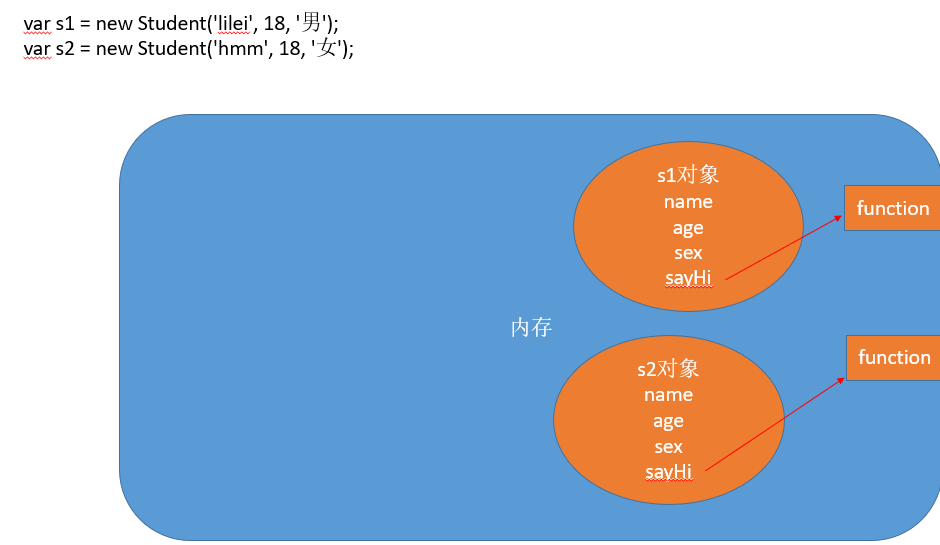


```javascript
console.log(p1.sayHello === p2.sayHello) // => false
```

对于这种问题我们可以把需要共享的函数定义到构造函数外部：

```javascript
function sayHello = function () {
  console.log('hello ' + this.name)
}

function Person (name, age) {
  this.name = name
  this.age = age
  this.type = 'human'
  this.sayHello = sayHello
}

var p1 = new Person('Top', 18)
var p2 = new Person('Jack', 16)

console.log(p1.sayHello === p2.sayHello) // => true
```

这样确实可以了，但是如果有多个需要共享的函数的话就会造成全局命名空间冲突的问题。

你肯定想到了可以把多个函数放到一个对象中用来避免全局命名空间冲突的问题：

```javascript
var fns = {
  sayHello: function () {
    console.log('hello ' + this.name)
  },
  sayAge: function () {
    console.log(this.age)
  }
}

function Person (name, age) {
  this.name = name
  this.age = age
  this.type = 'human'
  this.sayHello = fns.sayHello
  this.sayAge = fns.sayAge
}

var p1 = new Person('lpz', 18)
var p2 = new Person('Jack', 16)

console.log(p1.sayHello === p2.sayHello) // => true
console.log(p1.sayAge === p2.sayAge) // => true
```

至此，我们利用自己的方式基本上解决了构造函数的内存浪费问题。
但是代码看起来还是那么的格格不入，那有没有更好的方式呢？

## 原型

https://github.com/mqyqingfeng/Blog/issues/2

JavaScript 常被描述为一种**基于原型的语言 (prototype-based language)**——每个对象拥有一个**原型对象**，对象以其原型为模板、从原型继承方法和属性。原型对象也可能拥有原型，并从中继承方法和属性，一层一层、以此类推。这种关系常被称为**原型链 (prototype chain)**，它解释了为何一个对象会拥有定义在其他对象中的属性和方法。

准确地说，这些属性和方法定义在Object的构造器函数(constructor functions)之上的`prototype`属性上，而非对象实例本身。


内容引导：

- 使用 prototype 原型对象解决构造函数的问题
- 分析 构造函数、prototype 原型对象、实例对象 三者之间的关系
- 属性成员搜索原则：原型链
- 实例对象读写原型对象中的成员
- 原型对象的简写形式
- 原生对象的原型
  + Object
  + Array
  + String
  + ..
- 原型对象的问题
- 构造的函数和原型对象使用建议

#### 解决方案：prototype

在构造函数中添加某个属性，与在构造函数的原型上添加某个属性是一样的效果

**只不过某些构造函数不对我们开放，而还想改变该构造函数生产出来的所有实例的属性，那就只能通过构造函数的原型来改变**


JavaScript 规定，每一个构造函数都有一个 prototype属性，指向另一个对象（原型对象）。
这个对象的所有属性和方法，都会被构造的函数所拥有。

这也就意味着，我们可以把所有对象实例需要共享的属性和方法直接定义在prototype对象上。

```javascript
function Person (name, age) {
  this.name = name
  this.age = age
}

console.log(Person.prototype)

Person.prototype.type = 'human'

Person.prototype.sayName = function () {
  console.log(this.name)
}

var p1 = new Person(...)
                    
var p2 = new Person(...)

console.log(p1.sayName === p2.sayName) // => true
```

这时所有实例的 `type` 属性和 `sayName()` 方法，

其实都是同一个内存地址，指向prototype对象，因此就提高了运行效率。

```javascript
function Person(name) {
    this.name = name;
}
Person.prototype.favorites = ['apple', 'banana'];
var p1 = new Person('zhangsan');
var p2 = new Person('lisi');
p1.favorites.push('pear');
console.log(p1.favorites, p2.favorites);// ["apple", "banana", "pear"] (3) ["apple", "banana", "pear"]

```


## 构造函数、实例原型关系

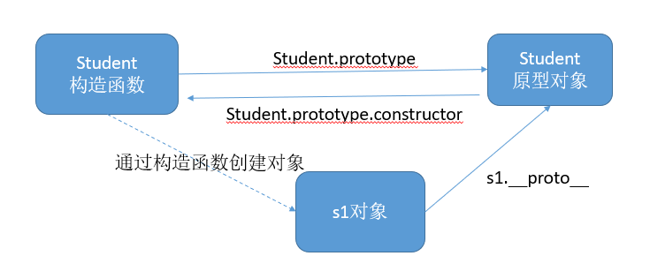

```
    console.log(person1.__proto__ === Person.prototype);
    console.dir(person1.__proto__);
    console.dir(Person.prototype);
    // constructor 构造器/构造函数
    console.dir(person1.constructor);
    console.dir(Person.prototype.constructor);
    console.dir(Person);
    console.log(person1.constructor === Person);
```


任何函数都具有一个 `prototype` 属性，该属性是一个对象。

```javascript
function F () {}
console.log(F.prototype) // => object

F.prototype.sayHi = function () {
  console.log('hi!')
}
```

构造函数的 `prototype` 对象默认都有一个 `constructor` 属性，指向 `prototype` 对象所在函数。

```javascript
console.log(F.prototype.constructor === F) // => true
```

通过构造函数得到的实例对象内部会包含一个指向构造函数的 `prototype` 对象的指针 `__proto__`。

```javascript
var instance = new F()
console.log(instance.__proto__ === F.prototype) // => true
```

<p class="tip">
  `__proto__` 是非标准属性。
</p>

实例对象可以直接访问原型对象成员。

```javascript
instance.sayHi() // => hi!
```

总结：

- 任何函数都具有一个 `prototype` 属性，该属性是一个对象
- 构造函数的 `prototype` 对象默认都有一个 `constructor` 属性，指向 `prototype` 对象所在函数
- 通过构造函数得到的实例对象内部会包含一个指向构造函数的 `prototype` 对象的指针 `__proto__`
- 所有实例都直接或间接继承了原型对象的成员

#### 属性成员的原则：原型链

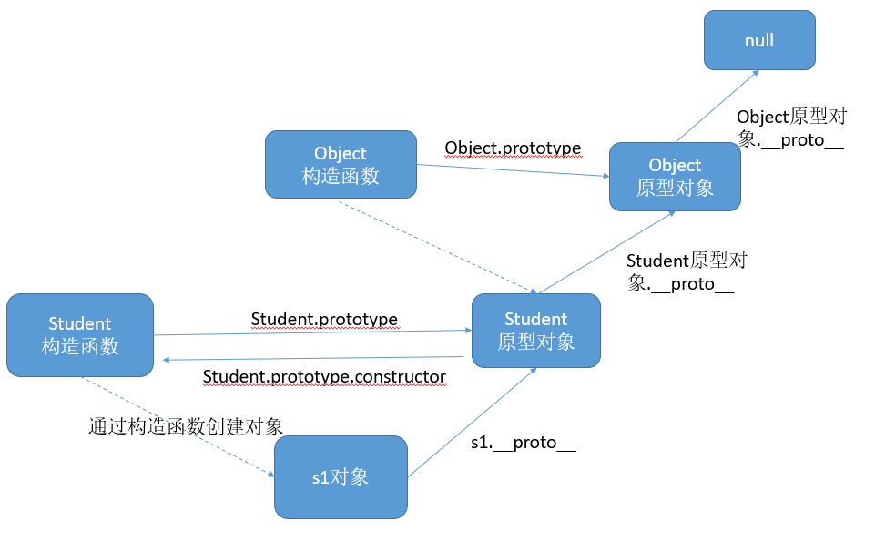

了解了 **构造函数-实例-原型对象** 三者之间的关系后，接下来我们来解释一下为什么实例对象可以访问原型对象中的成员。

每当代码读取某个对象的某个属性时，都会执行一次搜索，目标是具有给定名字的属性

- 搜索首先从对象实例本身开始
- 如果在实例中找到了具有给定名字的属性，则返回该属性的值
- 如果没有找到，则继续搜索指针指向的原型对象，在原型对象中查找具有给定名字的属性
- 如果在原型对象中找到了这个属性，则返回该属性的值

也就是说，在我们调用 `person1.sayName()` 的时候，会先后执行两次搜索：

- 首先，解析器会问：“实例 person1 有 sayName 属性吗？”答：“没有。
- ”然后，它继续搜索，再问：“ person1 的原型有 sayName 属性吗？”答：“有。
- ”于是，它就读取那个保存在原型对象中的函数。
- 当我们调用 person2.sayName() 时，将会重现相同的搜索过程，得到相同的结果。

而这正是多个对象实例共享原型所保存的属性和方法的基本原理。

总结：

- 先在自己身上找，找到即返回
- 自己身上找不到，则沿着原型链向上查找，找到即返回
- 如果一直到原型链的末端还没有找到，则返回 `undefined`


#### 补充

最后，补充三点大家可能不会注意的地方：

##### constructor

首先是 constructor 属性，我们看个例子：

```
function Person() {

}
var person = new Person();
console.log(person.constructor === Person); // true
```

当获取 person.constructor 时，其实 person 中并没有 constructor 属性,当不能读取到constructor 属性时，会从 person 的原型也就是 Person.prototype 中读取，正好原型中有该属性，所以：

```
person.constructor === Person.prototype.constructor
```

##### __proto__

其次是 __proto__ ，绝大部分浏览器都支持这个非标准的方法访问原型，然而它并不存在于 Person.prototype 中，实际上，它是来自于 Object.prototype ，与其说是一个属性，不如说是一个 getter/setter，当使用 obj.__proto__ 时，可以理解成返回了 Object.getPrototypeOf(obj)。

##### 真的是继承吗？

最后是关于继承，前面我们讲到“每一个对象都会从原型‘继承’属性”，实际上，继承是一个十分具有迷惑性的说法，引用《你不知道的JavaScript》中的话，就是：

继承意味着复制操作，然而 JavaScript 默认并不会复制对象的属性，相反，JavaScript 只是在两个对象之间创建一个关联，这样，一个对象就可以通过委托访问另一个对象的属性和函数，所以与其叫继承，委托的说法反而更准确些

#### 实例对象读写原型对象成员

读取：

- 先在自己身上找，找到即返回
- 自己身上找不到，则沿着原型链向上查找，找到即返回
- 如果一直到原型链的末端还没有找到，则返回 `undefined`

值类型成员写入（`实例对象.值类型成员 = xx`）：

- 当实例期望重写原型对象中的某个普通数据成员时实际上会把该成员添加到自己身上
- 也就是说该行为实际上会屏蔽掉对原型对象成员的访问

引用类型成员写入（`实例对象.引用类型成员 = xx`）：

- 同上

复杂类型修改（`实例对象.成员.xx = xx`）：

- 同样会先在自己身上找该成员，如果自己身上找到则直接修改
- 如果自己身上找不到，则沿着原型链继续查找，如果找到则修改
- 如果一直到原型链的末端还没有找到该成员，则报错（`实例对象.undefined.xx = xx`）

#### 更简单的原型语法

我们注意到，前面例子中每添加一个属性和方法就要敲一遍 `Person.prototype` 。
为减少不必要的输入，更常见的做法是用一个包含所有属性和方法的对象字面量来重写整个原型对象：

```javascript
function Person (name, age) {
  this.name = name
  this.age = age
}

Person.prototype = {
  type: 'human',
  sayHello: function () {
    console.log('我叫' + this.name + '，我今年' + this.age + '岁了')
  }
    call:
}
```

在该示例中，我们将 `Person.prototype` 重置到了一个新的对象。
这样做的好处就是为 `Person.prototype` 添加成员简单了，但是也会带来一个问题，那就是原型对象丢失了 `constructor` 成员。

所以，我们为了保持 `constructor` 的指向正确，建议的写法是：

```javascript
function Person (name, age) {
  this.name = name
  this.age = age
}

Person.prototype = {
  constructor: Person, // => 手动将 constructor 指向正确的构造函数
  type: 'human',
  sayHello: function () {
    console.log('我叫' + this.name + '，我今年' + this.age + '岁了')
  }
}
```

#### 原生对象的原型

<p class="tip">
  所有函数都有 prototype 属性对象。
</p>

- Object.prototype
- Function.prototype
- Array.prototype
- String.prototype
- Number.prototype
- Date.prototype
- ...

练习：为数组对象和字符串对象扩展原型方法。

#### 原型对象使用建议

- 私有成员（一般就是非函数成员）放到构造函数中
- 共享成员（一般就是函数）放到原型对象中
- 如果重置了 `prototype` 记得修正 `constructor` 的指向

#### Object.setPrototypeOf

将对象obj2`设置为对象`obj1`的原型对象的方法。


注意，对象的解构赋值可以取到继承的属性。

```javascript
const obj1 = {};
const obj2 = { foo: 'bar' };
Object.setPrototypeOf(obj1, obj2);

const { foo } = obj1;
foo // "bar"
```

上面代码中，对象`obj1`的原型对象是`obj2`。`foo`属性不是`obj1`自身的属性，而是继承自`obj2`的属性，解构赋值可以取到这个属性。


---

## 面向对象游戏案例：贪吃蛇

游戏的目的是用来体会js高级语法的使用 不需要具备抽象对象的能力，使用面向对象的方式分析问题，需要一个漫长的过程。

功能实现

搭建页面

放一个容器盛放游戏场景 div#map，设置样式

```css
#map {
  width: 800px;
  height: 600px;
  background-color: #ccc;
  position: relative;
}
```

分析对象

- 游戏对象
- 蛇对象
- 食物对象

创建食物对象

- Food

  - 属性

    - x       
    - y
    - width
    - height
    - color       

  - 方法

    - render       随机创建一个食物对象，并输出到map上

- 创建Food的构造函数，并设置属性

```js
var position = 'absolute';
var elements = [];
function Food(x, y, width, height, color) {
  this.x = x || 0;
  this.y = y || 0;
  // 食物的宽度和高度(像素)
  this.width = width || 20;
  this.height = height || 20;
  // 食物的颜色
  this.color = color || 'green';
}
```

- 通过原型设置render方法，实现随机产生食物对象，并渲染到map上

```js
Food.prototype.render = function (map) {
  // 随机食物的位置，map.宽度/food.宽度，总共有多少分food的宽度，随机一下。然后再乘以food的宽度
  this.x = parseInt(Math.random() * map.offsetWidth / this.width) * this.width;
  this.y = parseInt(Math.random() * map.offsetHeight / this.height) * this.height;

  // 动态创建食物对应的div
  var div = document.createElement('div');
  map.appendChild(div);
  div.style.position = position;
  div.style.left = this.x + 'px';
  div.style.top = this.y + 'px';
  div.style.width = this.width + 'px';
  div.style.height = this.height + 'px';
  div.style.backgroundColor = this.color;
  elements.push(div);
}
```

- 通过自调用函数，进行封装，通过window暴露Food对象

```js
window.Food = Food;
```

创建蛇对象


- Snake

- 属性

  - width    蛇节的宽度 默认20
  - height   蛇节的高度 默认20
  - body     数组，蛇的头部和身体，第一个位置是蛇头
  - direction    蛇运动的方向  默认right  可以是 left  top bottom

- 方法

  - render  把蛇渲染到map上

- Snake构造函数

```js
var position = 'absolute';
var elements = [];
function Snake(width, height, direction) {
  // 设置每一个蛇节的宽度
  this.width = width || 20;
  this.height = height || 20;
  // 蛇的每一部分, 第一部分是蛇头
  this.body = [
    {x: 3, y: 2, color: 'red'},
    {x: 2, y: 2, color: 'red'},
    {x: 1, y: 2, color: 'red'}
  ];
  this.direction = direction || 'right';
}
```

- render方法

```js
Snake.prototype.render = function(map) {
  for(var i = 0; i < this.body.length; i++) {
    var obj = this.body[i];
    var div = document.createElement('div');
    map.appendChild(div);
    div.style.left = obj.x * this.width + 'px';
    div.style.top = obj.y * this.height + 'px';
    div.style.position = position;
    div.style.backgroundColor = obj.color;
    div.style.width = this.width + 'px';
    div.style.height = this.height + 'px';
  }
}
```

- 在自调用函数中暴露Snake对象

```js
window.Snake = Snake;
```

创建游戏对象

游戏对象，用来管理游戏中的所有对象和开始游戏

- Game

  - 属性

    - food

    - snake

    - map

  - 方法

    - start            开始游戏（绘制所有游戏对象）


- 构造函数

```js
function Game(map) {
  this.food = new Food();
  this.snake = new Snake();
  this.map = map;
}
```

- 开始游戏，渲染食物对象和蛇对象

```js
Game.prototype.start = function () {
  this.food.render(this.map);
  this.snake.render(this.map);
}
```

### 游戏的逻辑

写蛇的move方法

- 在蛇对象(snake.js)中，在Snake的原型上新增move方法

1. 让蛇移动起来，把蛇身体的每一部分往前移动一下
2. 蛇头部分根据不同的方向决定 往哪里移动

```js
Snake.prototype.move = function (food, map) {
  // 让蛇身体的每一部分往前移动一下
  var i = this.body.length - 1;
  for(; i > 0; i--) {
    this.body[i].x = this.body[i - 1].x;
    this.body[i].y = this.body[i - 1].y;
  }
  // 根据移动的方向，决定蛇头如何处理
  switch(this.direction) {
    case 'left': 
      this.body[0].x -= 1;
      break;
    case 'right':
      this.body[0].x += 1;
      break;
    case 'top':
      this.body[0].y -= 1;
      break;
    case 'bottom':
      this.body[0].y += 1;
      break;
  }
}
```

- 在game中测试

```js
this.snake.move(this.food, this.map);
this.snake.render(this.map);
```

让蛇自己动起来

- 私有方法

    ```
    什么是私有方法？
      不能被外部访问的方法
    如何创建私有方法？
      使用自调用函数包裹
    ```

- 在game.js中 添加runSnake的私有方法，开启定时器调用蛇的move和render方法，让蛇动起来
- 判断蛇是否撞墙

```js
function runSnake() {
  var timerId = setInterval(function() {
    this.snake.move(this.food, this.map);
    // 在渲染前，删除之前的蛇
    this.snake.render(this.map);

    // 判断蛇是否撞墙
    var maxX = this.map.offsetWidth / this.snake.width;
    var maxY = this.map.offsetHeight / this.snake.height;
    var headX = this.snake.body[0].x;
    var headY = this.snake.body[0].y;
    if (headX < 0 || headX >= maxX) {
      clearInterval(timerId);
      alert('Game Over');
    }

    if (headY < 0 || headY >= maxY) {
      clearInterval(timerId);
      alert('Game Over');
    }

  }.bind(that), 150);
}
```

- 在snake中添加删除蛇的私有方法，在render中调用

```js
function remove() {
  // 删除渲染的蛇
  var i = elements.length - 1;
  for(; i >= 0; i--) {
    // 删除页面上渲染的蛇
    elements[i].parentNode.removeChild(elements[i]);
    // 删除elements数组中的元素
    elements.splice(i, 1);
  }
}
```

- 在game中通过键盘控制蛇的移动方向

```js
function bindKey() {
  document.addEventListener('keydown', function(e) {
    switch (e.keyCode) {
      case 37:
        // left
        this.snake.direction = 'left';
        break;
      case 38:
        // top
        this.snake.direction = 'top';
        break;
      case 39:
        // right
        this.snake.direction = 'right';
        break;
      case 40:
        // bottom
        this.snake.direction = 'bottom';
        break;
    }
  }.bind(that), false);
}
```

- 在start方法中调用

```js
bindKey();
```

判断蛇是否吃到食物

```js
// 在Snake的move方法中

// 在移动的过程中判断蛇是否吃到食物
// 如果蛇头和食物的位置重合代表吃到食物
// 食物的坐标是像素，蛇的坐标是几个宽度，进行转换
var headX = this.body[0].x * this.width;
var headY = this.body[0].y * this.height;
if (headX === food.x && headY === food.y) {
  // 吃到食物，往蛇节的最后加一节
  var last = this.body[this.body.length - 1];
  this.body.push({
    x: last.x,
    y: last.y,
    color: last.color
  })
  // 把现在的食物对象删除，并重新随机渲染一个食物对象
  food.render(map);
}
```

其它处理

把html中的js代码放到index.js中

避免html中出现js代码

#### 自调用函数的参数

```js
(function (window, undefined) {
  var document = window.document;

}(window, undefined))
```

- 传入window对象

将来代码压缩的时候，可以吧 function (window)  压缩成 function (w)

- 传入undefined

在将来会看到别人写的代码中会把undefined作为函数的参数(当前案例没有使用)
因为在有的老版本的浏览器中 undefined可以被重新赋值，防止undefined 被重新赋值

整理代码

现在的代码结构清晰，谁出问题就找到对应的js文件即可。
通过自调用函数，已经防止了变量命名污染的问题

但是，由于js文件数较多，需要在页面上引用，会产生文件依赖的问题(先引入那个js，再引入哪个js)
将来通过工具把js文件合并并压缩。现在手工合并js文件演示

- 问题1

```js
// 如果存在多个自调用函数要用分号分割，否则语法错误
// 下面代码会报错
(function () {
}())

(function () {
}())
// 所以代码规范中会建议在自调用函数之前加上分号
// 下面代码没有问题
;(function () {
}())

;(function () {
}())
```

- 问题2 

```js
// 当自调用函数 前面有函数声明时，会把自调用函数作为参数
// 所以建议自调用函数前，加上;
var a = function () {
  alert('11');
}
    
(function () {
  alert('22');
}())
```

---

## 继承

### 1 原型链继承

**将父类的实例作为子类的原型(prototype);**


```javascript
function Person () {
    this.name = 'zs';
    this.age = '18';
    this.gender = '男';
}
function Student () {
    this.score = '100';
}
var person = new  Person();

Student.prototype = new Person();
Student.prototype.constructor = Student;//没有这一行，则stu.constructor为Person
    var stu = new Student();
    console.log(stu.constructor);
    console.log(stu.__proto__);
```

#### 优缺点

优点：实例是子类的实例，也是父类的实例。简单、易于实现

原型继承缺点：无法设置构造函数的参数（？？？），无法实现多继承。

```javascript
function Person (name, age) {
  this.type = 'human'
  this.name = name
  this.age = age
}

Person.prototype.sayName = function () {
  console.log('hello ' + this.name)
}

function Student (name, age) {
  Person.call(this, name, age)
}

// 利用原型的特性实现继承
Student.prototype = new Person()
var s1 = Student('张三', 18)
console.log(s1.type) // => human
s1.sayName() // => hello 张三
```


#### 分析

```javascript
var Person = function () { };
Person.prototype.Say = function () {
    alert("Person say");
}
Person.prototype.Salary = 50000;

var Programmer = function () { };
Programmer.prototype = new Person();//
Programmer.prototype.WriteCode = function () {
    alert("programmer writes code");
};
Programmer.prototype.Salary = 500;

var pro = new Programmer();
pro.Say();
pro.WriteCode();
alert(pro.Salary);
```


```
Programmer.prototype=new Person();
```

```
var p1 = new Person();
```

由上面两个等式可得：  `Programmer.prototype = p1;`                 `1`

又因为`p1.__proto__ = Person.prototype;`     `2`

把等式`2`左边的p1换成等式`1`中的Programmer.prototype，可得：

`Programmer.prototype.__proto__ = Person.prototype;`  `3`


由var pro = new Programmer()  可得 `pro.__proto__=Programmer.prototype`。 `4`

。(pro为Programmer的实例)，由`3``4`可得：

`pro.__proto__.__proto__=Person.prototype。`


好，算清楚了之后我们来看上面的结果,p.Say()。由于p没有Say这个属性，于是去`p.__proto__`，也就是 Programmer.prototype，也就是p1中去找，由于p1中也没有Say，那就去`p.__proto__.__proto__`，也就是 Person.prototype中去找，于是就找到了alert(“Person say”)的方法。

### 2 借用构造函数继承

```javascript
   function Person (name,age,gender) {
        this.name = name;
        this.age = age;
        this.gender = gender;
    }
    Person.prototype.sayHi = function() {
        console.log('你好');
    }
    function Teacher (salary) {
        this.salary = salary;
    }
    function Student (name,age,gender,score) {
        this.score = score;
        // call调用Person构造函数，并让Person中的this指向构造函数Student，
        Person.call(this,name,age,gender);
    }
    var stu = new Student('zs','18','男','100分');
    console.log(stu);//Student {score: "100分", name: "zs", age: "18", gender: "男"}
```

#### 缺点：

- 只能继承父类的实例属性和方法，不能继承原型属性/方法（ 即stu不能继承Person原型上的方法sayHi）
- 无法实现复用，每个子类都有父类实例函数的副本，影响性能

### 3  组合继承

定义

- 用原型链实现对原型属性和方法的继承，用借用构造函数技术来实现实例属性的继承。
- 有时候也叫做伪经典继承

##### 缺点

- 调用两次超类型, 存在两份相同的属性/方法,实例和原型上各有一份

```js
function SuperType (name){
  this.colors = ["red", "blue", "green"];
  this.name = name;
}
SuperType.prototype.sayName = function(){
  console.log(this.name)
} 

function SubType(name,age){
  // 关键点 继承 属性
  SuperType.call(this,name)  //第二次调用
  this.age = age
}

//继承超类型原型方法
SubType.prototype = new SuperType() //第一次调用

// 重写SubType.prototype的constructor属性，指向自己的构造函数SubType 否自指向超类型
SubType.prototype.constructor = SubType; 
SubType.prototype.sayAge = function(){
  console.log(this.age)
}

var instance1 = new SubType('小明',20);
instance1.colors.push("black");
console.log(instance1.colors)// ["red", "blue", "green", "black"]
instance1.sayAge() //20
instance1.sayName() // 小明

var instance2 = new SubType('小红',21);
console.log(instance2.colors)// ["red", "blue", "green"]
instance2.sayAge() //21
instance2.sayName() //小红
```


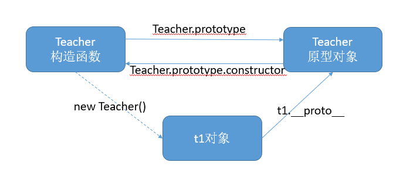


### 4 原型式继承

利用一个空 对象作为中介，将某个对象直接赋值给空对象构造函数的原型。

##### 缺点

- 不能做到函数复用
- 共享引用类型属性的值
- 无法传递参数

```js
function object(obj){
  function F(){}
  F.prototype = obj;
  return new F();
}

var person = {
  name: 'Nicholas',
  friends : ["Shelby","Coury","Van"]
}

var anotherPerson  = object(person)
// 与Object.create 相同 相比之下 Object.create更规范化 
// var anotherPerson  = Object.create(person) 
anotherPerson.name = "Greg";
anotherPerson.friends.push("Rob");

var yetAnotherPerson = object(person);
yetAnotherPerson.name = "Linda";
yetAnotherPerson.friends.push("Barbie");

alert(person.friends);   //"Shelby,Court,Van,Rob,Barbie"
```


### 5 寄生式继承

定义

- 寄生式继承是与原型式继承继承紧密相关的一种思路
- 在原型式继承的基础上，增强对象，返回构造函数

##### 缺点(同原型式继承)

- 不能做到函数复用
- 共享引用类型属性的值
- 无法传递参数

代码

```js
 function createAnother(original){
  var clone = object(original); // 或 Object.create(original) 
  clone.sayHi = function(){  // 以某种方式来增强对象
    alert("hi");
  };
  return clone; // 返回这个对象
}


var person = {
  name: 'Nicholas',
  friends : ["Shelby","Coury","Van"]
}

var anotherPerson  = createAnother(person) 

anotherPerson.name = "Greg";
anotherPerson.friends.push("Rob");

var yetAnotherPerson = createAnother(person);
yetAnotherPerson.name = "Linda";
yetAnotherPerson.friends.push("Barbie");

alert(person.friends);   //"Shelby,Court,Van,Rob,Barbie"
```

### 6 寄生组合式继承

定义

- 结合借用构造函数传递参数和寄生模式实现继承
- 通过借用构造函数继承属性,通过原型链的混成形式继承方法
- 使用寄生式继承来继承超类型的原型,然后在将结果指定给子类型的原型

##### 实现

```js
  function inheritPrototype(subType, superType){
  var prototype =Object.create( superType.prototype); // 创建对象，创建父类原型的一个副本
  prototype.constructor = subType; // 增强对象，弥补因重写原型而失去的默认的constructor 属性
  subType.prototype = prototype  // 指定对象，将新创建的对象赋值给子类的原型

}

// 父类初始化实例属性和原型属性
function SuperType (name){
  this.name =  name;
  this.colors = ["red", "blue", "green"];
}

SuperType.prototype.sayName = function(){
  alert(this.name);
};

// 借用构造函数传递增强子类实例属性（支持传参和避免篡改）
function SubType(name, age){
  SuperType.call(this, name);
  this.age = age;
}


// 将父类原型指向子类
inheritPrototype(SubType, SuperType);
SubType.prototype.sayAge = function (){
  alert(this.age)
}

var instance1 = new SubType("xyc", 23);
var instance2 = new SubType("lxy", 23);

instance1.colors.push("black"); // ["red", "blue", "green", "black"]
instance2.colors.push("gray"); // ["red", "blue", "green", "gray"]
```

作者：zxh1307
链接：https://juejin.im/post/6844904057509789703
来源：掘金
著作权归作者所有。商业转载请联系作者获得授权，非商业转载请注明出处。

### 7 ES6类继承extends

##### 定义

- extends关键字主要用于类声明或者类表达式中，以创建一个类，该类是另一个类的子类。
- 一个类中只能有一个构造函数
- Class 定义的方法 直接挂载到原型上
- 子类没有自己的this对象，所以必须先调用父类的super()方法，否则新建实例报错。

##### 实现

```js
 class SuperType {
  constructor(name,age){
    this.age = age;
    this.mame = name;
  }

  
  getAge(){
    return this.age
  }

  getName(){
    return this.name
  }

}

class SubType extends  SuperType{
  constructor(name,age,sex){
    //调用超类型  必须在使用“this”之前首先调用 super()。
    super(name,age)
    this.sex = sex
  }
}

var instance = new SubType('渣渣辉',18,'男')

console.log(instance.getAge())
```

### 8 构造函数的原型方法继承：拷贝继承（for-in）

```javascript
function Person (name, age) {
  this.type = 'human'
  this.name = name
  this.age = age
}

Person.prototype.sayName = function () {
  console.log('hello ' + this.name)
}

function Student (name, age) {
  Person.call(this, name, age)
}

// 原型对象拷贝继承原型对象成员
for(var key in Person.prototype) {
  Student.prototype[key] = Person.prototype[key]
}

var s1 = Student('张三', 18)

s1.sayName() // => hello 张三
```

```javascript
function Fn() {
	return new Person();
}
let fn = new Fn();
console.log(fn instanceof Person)  //false
```


### 1 对象之间的继承

```javascript
 var wjl = {
        name: '王健林',
        money: '1000000',
        cars: ['玛莎拉蒂'],
        play: function () {
            console.log('打高尔夫')
        }
    }
    var wsc = {
        name: '王思聪'
    }
    
    /* for (var key in wjl) {
        if(wsc[key]) {
            continue;
        }
        wsc[key] = wjl[key];
    }
    console.log(wsc) */
    
    //封装后
    function extend(parent,child) {
        for(var key in parent) {
            if(child[key]) {
                continue;
            }
            child[key] = parent[key];
        }
    }
    extend(wjl,wsc);
    console.log(wsc) 
```

### 3 实例继承

### 4 call bind 


# 函数进阶

##  函数的定义方式

- 函数声明
- 函数表达式
- `new Function`

**函数声明**

```javascript
function foo () {
    
}
```

**函数表达式**

```javascript
var foo = function () {

}
```

**构造函数的方式定义**

```javascript
//每一条语句用分号；分隔
var fn = new Function('var name = “张三”；'console.log(name)');

fn();

var fn1 = new Function('a','b','console.log(a+b)');
fn1(1,2);

```

通过声明式或表达式创建函数，直接将{}中的代码块转化成CPU识别的代码

new Function 的方式会先将参数中的字符串转化成JavaScript代码，再转化为CPU识别的代码。二次解析。

执行速度慢，一般不用

**函数声明与函数表达式的区别**

- 函数声明必须有名字
- 函数声明会函数提升，在预解析阶段就已创建，声明前后都可以调用
- 函数表达式类似于变量赋值
- 函数表达式可以没有名字，例如匿名函数
- 函数表达式没有变量提升，在执行阶段创建，必须在表达式执行之后才可以调用

下面是一个根据条件定义函数的例子：

```javascript
if (true) {
  function f () {
    console.log(1)
  }
} else {
  function f () {
    console.log(2)
  }
}
```

以上代码执行结果在不同浏览器中结果不一致。新的浏览器版本中if语句中函数声明不会提升。

而旧的IE浏览器if语句中会存在函数提升。

不过我们可以使用函数表达式解决上面的问题：

```javascript
var f
if (true) {
  f = function () {
    console.log(1)
  }
} else {
  f = function () {
    console.log(2)
  }
}
```

### 函数也是对象

- 所有函数都是 `Function` 的实例

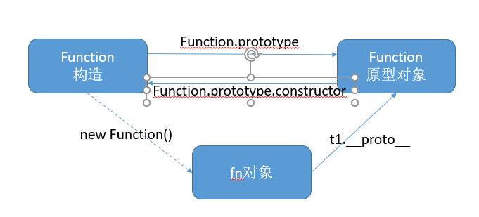

### 函数的调用方式

- 普通函数
- 构造函数
- 对象方法

### 11 函数内this指向的不同场景

**函数的调用方式（调用的时候）决定了this的指向：**

谁（哪个对象）调用这个函数，this就指向谁。

| 调用方式   | 非严格模式   | 备注                |
| ------ | ------- | ----------------- |
| 普通函数调用 | window  | 严格模式下是 undefined  |
| 构造函数调用 | 实例对象    | 原型方法中 this 也是实例对象 |
| 对象方法调用 | 该方法所属对象 | 紧挨着的对象            |
| 事件绑定方法 | 绑定事件对象  |                   |
| 定时器函数  | window  |                   |


```javascript
//1、普通函数调用 
function fn () {
    console.log(this)
}
//this指向window
//2、对象方法调用 this
var obj = {
    fn: function() {
        console.log(this)
    }
}
obj.fn();
// 对象方法调用 this 指向obj
//3、构造函数内部的this指向由该构造函数创建的对象
//4、事件绑定方法 
btn.onclick = function(e) {
    console.log(this);
}
//this为事件处理函数绑定的对象。
//5 定时器 setInterval和 setTimeout
setInterval(function() {
    console.log(this);
},1000);
// 定时器中的匿名函数由window对象调用 this指向window
```

这就是对函数内部 this 指向的基本整理，写代码写多了自然而然就熟悉了。

### call、apply、bind

那了解了函数 this 指向的不同场景之后，我们知道有些情况下我们为了使用某种特定环境的 this 引用，
这时候时候我们就需要采用一些特殊手段来处理了，例如我们经常在定时器外部备份 this 引用，然后在定时器函数内部使用外部 this 的引用。
然而实际上对于这种做法我们的 JavaScript 为我们专门提供了一些函数方法用来帮我们更优雅的处理函数内部 this 指向问题。
这就是接下来我们要学习的 call、apply、bind 三个函数方法。

#### call

`call()` 方法调用一个函数, 其具有一个指定的 `this` 值和分别地提供的参数(参数的列表)。

<p class="danger">
  注意：该方法的作用和 `apply()` 方法类似，只有一个区别，就是 `call()` 方法接受的是若干个参数的列表，而 `apply()` 方法接受的是一个包含多个参数的数组。
</p>

语法：

```javascript
fun.call(thisArg[, arg1[, arg2[, ...]]])
```

参数：

- `thisArg`
  + 在 fun 函数运行时指定的 this 值
  + 如果指定了 null 或者 undefined 则内部 this 指向 window

- `arg1, arg2, ...`
  + 指定的参数列表

#### apply

`apply()` 方法调用一个函数, 其具有一个指定的 `this` 值，以及作为一个数组（或类似数组的对象）提供的参数。

<p class="danger">
  注意：该方法的作用和 `call()` 方法类似，只有一个区别，就是 `call()` 方法接受的是若干个参数的列表，而 `apply()` 方法接受的是一个包含多个参数的数组。
</p>

语法：

```javascript
fun.apply(thisArg, [argsArray])
```

参数：

- `thisArg`
- `argsArray`

`apply()` 与 `call()` 非常相似，不同之处在于提供参数的方式。
`apply()` 使用参数数组而不是一组参数列表。例如：

```javascript
fun.apply(this, ['eat', 'bananas'])
```

#### bind

bind() 函数会创建一个新函数（称为绑定函数），新函数与被调函数（绑定函数的目标函数）具有相同的函数体（在 ECMAScript 5 规范中内置的call属性）。
当目标函数被调用时 this 值绑定到 bind() 的第一个参数，该参数不能被重写。绑定函数被调用时，bind() 也接受预设的参数提供给原函数。
一个绑定函数也能使用new操作符创建对象：这种行为就像把原函数当成构造器。提供的 this 值被忽略，同时调用时的参数被提供给模拟函数。

语法：

```javascript
fun.bind(thisArg[, arg1[, arg2[, ...]]])
```

参数：

- thisArg
  + 当绑定函数被调用时，该参数会作为原函数运行时的 this 指向。当使用new 操作符调用绑定函数时，该参数无效。

- arg1, arg2, ...
  + 当绑定函数被调用时，这些参数将置于实参之前传递给被绑定的方法。

返回值：

返回由指定的this值和初始化参数改造的原函数拷贝。

示例1：

```javascript
this.x = 9; 
var module = {
  x: 81,
  getX: function() { return this.x; }
};

module.getX(); // 返回 81

var retrieveX = module.getX;
retrieveX(); // 返回 9, 在这种情况下，"this"指向全局作用域

// 创建一个新函数，将"this"绑定到module对象
// 新手可能会被全局的x变量和module里的属性x所迷惑
var boundGetX = retrieveX.bind(module);
boundGetX(); // 返回 81
```

示例2：

```javascript
function LateBloomer() {
  this.petalCount = Math.ceil(Math.random() * 12) + 1;
}

// Declare bloom after a delay of 1 second
LateBloomer.prototype.bloom = function() {
  window.setTimeout(this.declare.bind(this), 1000);
};

LateBloomer.prototype.declare = function() {
  console.log('I am a beautiful flower with ' +
    this.petalCount + ' petals!');
};

var flower = new LateBloomer();
flower.bloom();  // 一秒钟后, 调用'declare'方法
```

#### 小结

- call 和 apply 特性一样
  + 都是用来调用函数，而且是立即调用
  + 但是可以在调用函数的同时，通过第一个参数指定函数内部 `this` 的指向
  + call 调用的时候，参数必须以参数列表的形式进行传递，也就是以逗号分隔的方式依次传递即可
  + apply 调用的时候，参数必须是一个数组，然后在执行的时候，会将数组内部的元素一个一个拿出来，与形参一一对应进行传递
  + 如果第一个参数指定了 `null` 或者 `undefined` 则内部 this 指向 window

- bind
  + 可以用来指定内部 this 的指向，然后生成一个改变了 this 指向的新的函数
  + 它和 call、apply 最大的区别是：bind 不会调用
  + bind 支持传递参数，它的传参方式比较特殊，一共有两个位置可以传递
    * 1. 在 bind 的同时，以参数列表的形式进行传递
    * 2. 在调用的时候，以参数列表的形式进行传递
    * 那到底以谁 bind 的时候传递的参数为准呢还是以调用的时候传递的参数为准
    * 两者合并：bind 的时候传递的参数和调用的时候传递的参数会合并到一起，传递到函数内部

### 函数的其它成员

- arguments
  + 实参集合
- caller
  + 函数的调用者
- length
  + 形参的个数
- name
  + 函数的名称

```javascript
function fn(x, y, z) {
  console.log(fn.length) // => 形参的个数
  console.log(arguments) // 伪数组实参参数集合
  console.log(arguments.callee === fn) // 函数本身
  console.log(fn.caller) // 函数的调用者 全局作用域调用显示null
  console.log(fn.name) // => 函数的名字
}

function f() {
  fn(10, 20, 30)
}
function test() {
    fn(1,2,3);
}
f()
test()//caller 是test函数 
```

### 高阶函数

- 函数可以作为参数
- 函数可以作为返回值

#### 作为参数

```javascript
function eat (callback) {
  setTimeout(function () {
    console.log('吃完了')
    callback()
  }, 1000)
}

eat(function () {
  console.log('去唱歌')
})
```

#### 作为返回值

```javascript
function genFun (type) {
  return function (obj) {
    return Object.prototype.toString.call(obj) === type
  }
}

var isArray = genFun('[object Array]')
var isObject = genFun('[object Object]')

console.log(isArray([])) // => true
console.log(isArray({})) // => true
```

## 函数闭包

局部变量

**二、如何从外部读取局部变量？**

出于种种原因，我们有时候需要得到函数内的局部变量。但是，前面已经说过了，正常情况下，这是办不到的，只有通过变通方法才能实现。

那就是在函数的内部，再定义一个函数。

```
　　function f1(){
　　　　var n=999;
　　　　function f2(){
　　　　　　alert(n); // 999
　　　　}
　　}
```

既然f2可以读取f1中的局部变量，那么只要把f2作为返回值，我们不就可以在f1外部读取它的内部变量了吗！

```
　function f1(){
　　　　var n=999;
　　　　function f2(){
　　　　　　alert(n); 
　　　　}
　　　　return f2;
　　}
　　var result=f1();
　　result(); // 999
```

代码中的f2函数，就是闭包。

### 闭包的定义

各种专业文献上的"闭包"（closure）定义非常抽象，很难看懂。我的理解是，闭包就是能够读取其他函数内部变量的函数。

由于在 Javascript 语言中，只有函数内部的子函数才能读取局部变量，
因此可以把闭包简单理解成 “定义在一个函数内部的函数”。
所以，在本质上，闭包就是将函数内部和函数外部连接起来的一座桥梁。

闭包的用途：

- 可以在函数外部读取函数内部成员
- 让函数内成员始终存活在内存中

```
　　function f1(){
　　　　var n=999;
　　　　nAdd=function(){n+=1}
　　　　function f2(){
　　　　　　alert(n);
　　　　}
　　　　return f2;
　　}
　　var result=f1();
　　result(); // 999
　　nAdd();
　　result(); // 1000
```

在这段代码中，result实际上就是闭包f2函数。它一共运行了两次，第一次的值是999，第二次的值是1000。这证明了，函数f1中的局部变量n一直保存在内存中，并没有在f1调用后被自动清除。

为什么会这样呢？原因就在于f1是f2的父函数，而f2被赋给了一个全局变量，这导致f2始终在内存中，而f2的存在依赖于f1，因此f1也始终在内存中，不会在调用结束后，被垃圾回收机制（garbage collection）回收。

这段代码中另一个值得注意的地方，就是"nAdd=function(){n+=1}"这一行，首先在nAdd前面没有使用var关键字，因此nAdd是一个全局变量，而不是局部变量。其次，nAdd的值是一个匿名函数（anonymous function），而这个匿名函数本身也是一个闭包，所以nAdd相当于是一个setter，可以在函数外部对函数内部的局部变量进行操作。

```
  function foo() {
        var i = 0;
        return function () {
            console.log(++i);
        }
    }
    var f1 = foo();
    /* 活动对象 */
    var f2 = foo();
    f1();//1
    f1();//2
    f2();//1
```


```javascript
  function getRandom() {
        var random = parseInt(Math.random()*10) + 1;
        return function() {
            return random;
        }
    }
    console.log(getRandom()())//2
    console.log(getRandom()())//5
    console.log(getRandom()())//6

    var fn = getRandom();
    /*当调用getRandom函数时，执行代码块的内代码，函数getRandom作用域中的变量random会产生一个值，*/
    console.log(fn());//7
	/*当调用函数fn时，其自身作用域中没有变量random，向上一级作用域找，找到函数getRandom的作用域*/
    console.log(fn());//7
    console.log(fn());//7
```

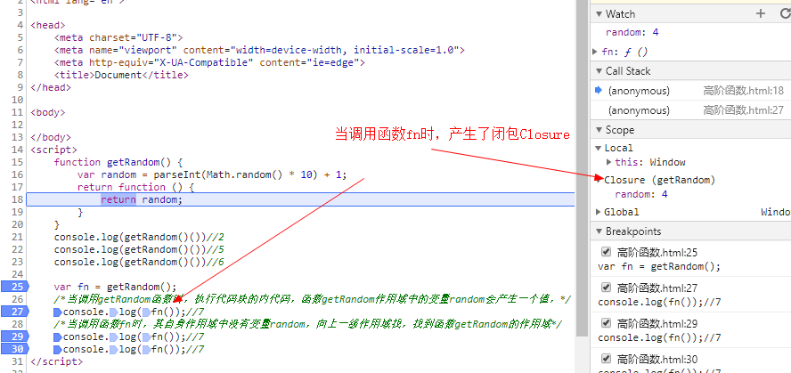

### 闭包举例

获取li的index值

```
   <ul id="ul">
        <li>1</li>
        <li>2</li>
        <li>3</li>
        <li>4</li>
        <li>5</li>
    </ul>
</body>

<script>
    var ul = document.getElementById('ul');
    var uli = ul.children;
    for(var i = 0; i < uli.length; i++) {
        (function(k){
            uli[i].onclick = function() {
                console.log(k);
            }
        })(i)
    }
```

如下图，点击选中37行，F5刷新，点击任一li，右侧作用域Scope会产生闭包Closure。

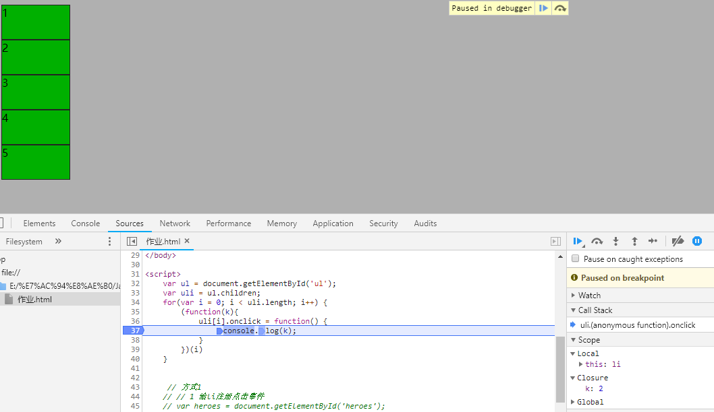

示例1：

```javascript
 console.log('start');
    setTimeout(function () {
        console.log('timeout');
    }, 0);
console.log('over');
//
start
over
timeout
```

**定时器setInterval，setTimeout工作原理**

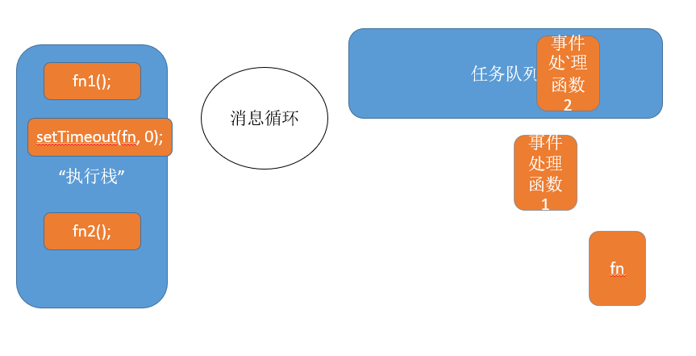

示例2：

```javascript
console.log(111)

for(var i = 0; i < 3; i++) {
  setTimeout(function () {
    console.log(i)
  }, 0)
}
console.log(222)
```

**闭包的思考题**

思考题 1：

```javascript
var name = "The Window";
var object = {
  name: "My Object",
  getNameFunc: function () {
    return function () {
      return this.name;
    };
  }
};

console.log(object.getNameFunc()())
```

思考题 2：

```javascript
var name = "The Window";　　
var object = {　　　　
  name: "My Object",
  getNameFunc: function () {
    var that = this;
    return function () {
      return that.name;
    };
  }
};
console.log(object.getNameFunc()())
```

### **闭包的注意点**

1）由于闭包会使得函数中的变量都被保存在内存中，内存消耗很大，所以不能滥用闭包，否则会造成网页的性能问题，在IE中可能导致内存泄露。解决方法是，在退出函数之前，将不使用的局部变量全部删除。

2）闭包会在父函数外部，改变父函数内部变量的值。所以，如果你把父函数当作对象（object）使用，把闭包当作它的公用方法（Public Method），把内部变量当作它的私有属性（private value），这时一定要小心，不要随便改变父函数内部变量的值

### **六、思考题**

如果你能理解下面两段代码的运行结果，应该就算理解闭包的运行机制了。

代码片段一。

> 　　var name = "The Window";
>
> 　　var object = {
> 　　　　name : "My Object",
>
> 　　　　getNameFunc : function(){
> 　　　　　　return function(){
> 　　　　　　　　return this.name;
> 　　　　　　};
>
> 　　　　}
>
> 　　};
>
> 　　alert(object.getNameFunc()());


代码片段二。

> 　　var name = "The Window";
>
> 　　var object = {
> 　　　　name : "My Object",
>
> 　　　　getNameFunc : function(){
> 　　　　　　var that = this;
> 　　　　　　return function(){
> 　　　　　　　　return that.name;
> 　　　　　　};
>
> 　　　　}
>
> 　　};
>
> 　　alert(object.getNameFunc()());

阮一峰http://www.ruanyifeng.com/blog/2009/08/learning_javascript_closures.html


### JavaScript深入之闭包 #9

https://github.com/mqyqingfeng/Blog/issues/9

MDN 对闭包的定义为：

> 闭包是指那些能够访问自由变量的函数。

那什么是自由变量呢？

> 自由变量是指在函数中使用的，但既不是函数参数也不是函数的局部变量的变量。

由此，我们可以看出闭包共有两部分组成：

> 闭包 = 函数 + 函数能够访问的自由变量

举个例子：

```
var a = 1;

function foo() {
    console.log(a);
}

foo();
```

foo 函数可以访问变量 a，但是 a 既不是 foo 函数的局部变量，也不是 foo 函数的参数，所以 a 就是自由变量。

那么，函数 foo + foo 函数访问的自由变量 a 不就是构成了一个闭包嘛……

还真是这样的！

所以在《JavaScript权威指南》中就讲到：从技术的角度讲，所有的JavaScript函数都是闭包。

咦，这怎么跟我们平时看到的讲到的闭包不一样呢！？

别着急，这是理论上的闭包，其实还有一个实践角度上的闭包，让我们看看汤姆大叔翻译的关于闭包的文章中的定义：

ECMAScript中，闭包指的是：

1. 从理论角度：所有的函数。因为它们都在创建的时候就将上层上下文的数据保存起来了。哪怕是简单的全局变量也是如此，因为函数中访问全局变量就相当于是在访问自由变量，这个时候使用最外层的作用域。
2. 从实践角度：以下函数才算是闭包：
   1. 即使创建它的上下文已经销毁，它仍然存在（比如，内部函数从父函数中返回）
   2. 在代码中引用了自由变量

接下来就来讲讲实践上的闭包。

#### 分析

让我们先写个例子，例子依然是来自《JavaScript权威指南》，稍微做点改动：

```
var scope = "global scope";
function checkscope(){
    var scope = "local scope";
    function f(){
        return scope;
    }
    return f;
}

var foo = checkscope();
foo();
```

首先我们要分析一下这段代码中执行上下文栈和执行上下文的变化情况。

另一个与这段代码相似的例子，在[《JavaScript深入之执行上下文》](https://github.com/mqyqingfeng/Blog/issues/8)中有着非常详细的分析。如果看不懂以下的执行过程，建议先阅读这篇文章。

这里直接给出简要的执行过程：

1. 进入全局代码，创建全局执行上下文，全局执行上下文压入执行上下文栈
2. 全局执行上下文初始化
3. 执行 checkscope 函数，创建 checkscope 函数执行上下文，checkscope 执行上下文被压入执行上下文栈
4. checkscope 执行上下文初始化，创建变量对象、作用域链、this等
5. checkscope 函数执行完毕，checkscope 执行上下文从执行上下文栈中弹出
6. 执行 f 函数，创建 f 函数执行上下文，f 执行上下文被压入执行上下文栈
7. f 执行上下文初始化，创建变量对象、作用域链、this等
8. f 函数执行完毕，f 函数上下文从执行上下文栈中弹出

了解到这个过程，我们应该思考一个问题，那就是：

当 f 函数执行的时候，checkscope 函数上下文已经被销毁了啊(即从执行上下文栈中被弹出)，怎么还会读取到 checkscope 作用域下的 scope 值呢？

以上的代码，要是转换成 PHP，就会报错，因为在 PHP 中，f 函数只能读取到自己作用域和全局作用域里的值，所以读不到 checkscope 下的 scope 值。(这段我问的PHP同事……)

然而 JavaScript 却是可以的！

当我们了解了具体的执行过程后，我们知道 f 执行上下文维护了一个作用域链：

```
fContext = {
    Scope: [AO, checkscopeContext.AO, globalContext.VO],
}
```

对的，就是因为这个作用域链，f 函数依然可以读取到 checkscopeContext.AO 的值，说明当 f 函数引用了 checkscopeContext.AO 中的值的时候，即使 checkscopeContext 被销毁了，但是 JavaScript 依然会让 checkscopeContext.AO 活在内存中，f 函数依然可以通过 f 函数的作用域链找到它，正是因为 JavaScript 做到了这一点，从而实现了闭包这个概念。

所以，让我们再看一遍实践角度上闭包的定义：

1. 即使创建它的上下文已经销毁，它仍然存在（比如，内部函数从父函数中返回）
2. 在代码中引用了自由变量

在这里再补充一个《JavaScript权威指南》英文原版对闭包的定义:

> This combination of a function object and a scope (a set of variable bindings) in which the function’s variables are resolved is called a closure in the computer science literature.

闭包在计算机科学中也只是一个普通的概念，大家不要去想得太复杂。

#### 必刷题

接下来，看这道刷题必刷，面试必考的闭包题：

```
var data = [];

for (var i = 0; i < 3; i++) {
  data[i] = function () {
    console.log(i);
  };
}

data[0]();
data[1]();
data[2]();
```

答案是都是 3，让我们分析一下原因：

当执行到 data[0] 函数之前，此时全局上下文的 VO 为：

```
globalContext = {
    VO: {
        data: [...],
        i: 3
    }
}
```

当执行 data[0] 函数的时候，data[0] 函数的作用域链为：

```
data[0]Context = {
    Scope: [AO, globalContext.VO]
}
```

data[0]Context 的 AO 并没有 i 值，所以会从 globalContext.VO 中查找，i 为 3，所以打印的结果就是 3。

data[1] 和 data[2] 是一样的道理。

所以让我们改成闭包看看：

```
var data = [];

for (var i = 0; i < 3; i++) {
  data[i] = (function (i) {
        return function(){
            console.log(i);
        }
  })(i);
}

data[0]();
data[1]();
data[2]();
```

当执行到 data[0] 函数之前，此时全局上下文的 VO 为：

```
globalContext = {
    VO: {
        data: [...],
        i: 3
    }
}
```

跟没改之前一模一样。

当执行 data[0] 函数的时候，data[0] 函数的作用域链发生了改变：

```
data[0]Context = {
    Scope: [AO, 匿名函数Context.AO globalContext.VO]
}
```

匿名函数执行上下文的AO为：

```
匿名函数Context = {
    AO: {
        arguments: {
            0: 0,
            length: 1
        },
        i: 0
    }
}
```

data[0]Context 的 AO 并没有 i 值，所以会沿着作用域链从匿名函数 Context.AO 中查找，这时候就会找 i 为 0，找到了就不会往 globalContext.VO 中查找了，即使 globalContext.VO 也有 i 的值(值为3)，所以打印的结果就是0。

data[1] 和 data[2] 是一样的道理。

## 函数递归

可设置断点了解递归的运行过程

#### 递归执行模型

```javascript
function fn1 () {
  console.log(111)
  fn2()
  console.log('fn1')
}

function fn2 () {
  console.log(222)
  fn3()
  console.log('fn2')
}

function fn3 () {
  console.log(333)
  fn4()
  console.log('fn3')
}

function fn4 () {
  console.log(444)
  console.log('fn4')
}

fn1()
```

举个栗子：计算阶乘的递归函数

```javascript
function factorial (num) {
  if (num <= 1) {
    return 1
  } else {
    return num * factorial(num - 1)
  }
}
```

#### 递归应用场景

- **深拷贝**

 浅拷贝只是把对象的地址值复制了一份，让新的变量指向原来的对象。并在有在内存中复制出一个新的对象。

  把一个对象的成员复制给另一个成员的时候，只能把第一层的值复制过去，如果它的属性

 是个对象，仅仅复制的是该对象的引用。而没有创建一个新的对象。

改变原对象的该属性的属性，第二个对象也会发生改变

内存溢出：超过了最大的堆栈大小。

Maximum call stack size exceeded

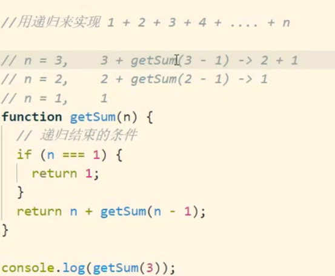

- 菜单树
- 遍历 DOM 树

斐波那契数列 1 1 2 3 5 8 13 21 34

arr[n] =arr[]  n-1 + n-2

---

# 正则表达式

- 了解正则表达式基本语法
- 能够使用JavaScript的正则对象

**基础概念**

**什么是正则表达式**

正则表达式：用于匹配规律规则的表达式，正则通常被用来检索、替换那些符合某个模式(规则)的文本。
正则表达式是对字符串操作的一种逻辑公式，就是用事先定义好的一些特定字符、及这些特定字符的组合，组成一个“规则字符串”，这个“规则字符串”用来表达对字符串的一种过滤逻辑。

**正则表达式的作用**

1. 给定的字符串是否符合正则表达式的过滤逻辑(匹配)
2. 可以通过正则表达式，从字符串中获取我们想要的特定部分(提取)
3. 强大的字符串替换能力(替换)

**正则表达式的测试**

- [在线测试正则](https://c.runoob.com/front-end/854)
- 工具中使用正则表达式
  + sublime/vscode/word
  + 演示替换所有的数字

### 常见正则

必须有数字和字母组合的密码正则表达式

^(?![0-9]+$)(?![a-zA-Z]+$)[0-9A-Za-z]{8,16}$

分开来注释一下：
^ 匹配一行的开头位置
(?![0-9]+$) 预测该位置后面不全是数字
(?![a-zA-Z]+$) 预测该位置后面不全是字母
[0-9A-Za-z] {8,16} 由8-16位数字或这字母组成
$ 匹配行结尾位置

注：(?!xxxx) 是正则表达式的负向零宽断言一种形式，标识预该位置后不是xxxx字符。


### 正则表达式组成

- 普通字符
- 特殊字符(元字符)：正则表达式中有特殊意义的字符

#### 元字符串

| 元字符 | 说明                           |
| ------ | ------------------------------ |
| \d     | 匹配数字                       |
| \b     | 匹配单词边界                   |
| \D     | 匹配任意非数字的字符           |
| \w     | 匹配字母或数字或下划线         |
| \W     | 匹配任意不是字母，数字，下划线 |
| \s     | 匹配任意的空白符               |
| \S     | 匹配任意不是空白符的字符       |
| .      | 匹配除换行符以外的任意单个字符 |
| ^      | 表示匹配行首的文本(以谁开始)   |
| $      | 表示匹配行尾的文本(以谁结束)   |

1）点字符（.)

点字符（.）匹配除回车（\r）、换行(\n) 、行分隔符（\u2028）和段分隔符（\u2029）以外的所有字符。.

匹配除回车（\r）、换行(\n) 

（1）脱字符（^）

如果方括号内的第一个字符是[^]，则表示除了字符类之中的字符，其他字符都可以匹配。比如，[^xyz] 表示除了x、y、z之外都可以匹配。

```
/[^abc]/.test("hello world") // true
/[^abc]/.test("bbc") // false
```

上面代码表示，字符串hello world不包含字母abc中的任一个，所以返回true；字符串bbc不包含abc以外的字母，所以返回false。

如果方括号内没有其他字符，即只有[^]，就表示匹配一切字符，其中包括换行符，而点号（.）是不包括换行符的。

```
var s = 'Please yes\nmake my day!';

s.match(/yes.*day/) // null
s.match(/yes[^]*day/) // [ 'yes\nmake my day']
```

上面代码中，字符串s含有一个换行符，点号不包括换行符，所以第一个正则表达式匹配失败；第二个正则表达式[^]包含一切字符，所以匹配成功。

> 注意，脱字符只有在字符类的第一个位置才有特殊含义，否则就是字面含义。

#### 限定符/量词

| 限定符 | 说明                                       |
| ------ | ------------------------------------------ |
| x*     | 匹配前面的表达式x**重复0次或多次**的字符串 |
| x+     | 匹配任何包含**一个或多个**x的字符串        |
| x?     | 匹配任何包含**零个或一个** *x* 的字符串。  |
| {n}    | 重复n次                                    |
| {n,}   | 重复n次或更多次                            |
| {n,m}  | 重复n到m次                                 |

#### 其它

中括号用于查找某个范围内的字符：

| 表达式 | 描述                           |
| :----- | :----------------------------- |
| [abc]  | 匹配查找方括号之间的任何字符。 |
| [0-9]  | 查找任何从 0 至 9 的数字。     |
| (x\|y) | 查找任何以 \| 分隔的选项。     |

| 或者，选择两者中的一个。**注意|将左右两边分为两部分，而不管左右两边有多长多乱**

[^]  匹配除中括号以内的内容


\ 转义符

() 从两个直接量中选择一个，分组
   eg：gr(a|e)y匹配gray和grey

[\u4e00-\u9fa5]  匹配汉字
[\u4e00-\u9fa5]{2} 匹配2个汉字
^[\u4e00-\u9fa5]{2}$ 精确匹配2个汉字

**简单案例**

验证手机号：

```javascript
^\d{11}$
```

验证邮编：

```javascript
^\d{6}$
```

验证日期 2012-5-01

```javascript
^\d{4}-\d{1,2}-\d{1,2}$
```

验证邮箱 xxx@itcast.cn：

```javascript
^\w+@\w+\.\w+$
```

验证IP地址 192.168.1.10

```javascript
^\d{1,3}\(.\d{1,3}){3}$
```

### RegExp(正则对象)

RegExp：是正则表达式（regular expression）的简写。   正则表达式是描述字符模式的对象。

正则表达式通常被用来检索、替换那些符合某个模式(规则)的文本

#### 正则对象的创建

方式1：  语法 var patt=new RegExp(pattern,modifiers);

pattern：描述了表达式的模式，modifiers：修饰符 （可以不写）

```javascript
var reg = new Regex('\d', 'i');
var reg = new Regex('\d', 'gi');
```

> **注意：**当使用构造函数创造正则对象时，需要常规的字符转义规则（在前面加反斜杠 \）。比如，以下是等价的：
>
> ```javascript
> var re = new RegExp("\\w+");
> ```

方式2：var patt=/pattern/modifiers;

```javascript
var reg = /\d/i;
var reg = /\d/gi;
console.log(typeof(reg)) //object
```

#### 参数

##### 匹配模式 pattern

pattern（模式） 描述了表达式的模式

##### 修饰符 modifiers

modifiers(修饰符) 用于指定全局匹配、区分大小写的匹配和多行匹配

| 修饰符 | 说明                                                 |
| ------ | ---------------------------------------------------- |
| i      | 执行忽略大小写的匹配                                 |
| g      | 执行全局匹配（查找所有匹配而非在找到第一个匹配后停止 |
| gi     | 全局匹配+忽略大小写                                  |
| m      | 执行多行匹配                                         |

```javascript
   var reg = /^\d[a-z]{4}$/
    // 不加m正则用于处理整个字符串
    // var str = '4abcd\n5dsdf';
    var str = '4abcd\r4dsdf';
    // /r和/n为换行符
    console.log(str.match(reg)) //null

    // 加了m后， 会把第一行拿出来和正则表达式reg进行匹配
    var reg = /^\d[a-z]{4}$/m
    var str = '4abcd\r5dsdf';
    console.log(str.match(reg)) //["4abcd", index: 0, input: "4abcd4dsdf", groups: undefined]

    // gm全局匹配 不局限于第一行
    var reg = /^\d[a-z]{4}$/gm
    var str = '4abcd\r4dsdf';
    console.log(str.match(reg)) // ["4abcd", "4dsdf"]
```

g: global

```javascript
   var str = '张三：2500，李四：3000，王五：50000';
    var regExp = /\d+/;  //只返回匹配到的第一个结果，全部匹配需要加g  global
    var regExp = /\d+/;
    var result = regExp.exec(str);
    console.log(result);//["2500", index: 3, input: "张三：2500，李四：3000，王五：50000", groups: undefined]
```

#### 正则对象的方法

#####  test()方法

 正则匹配

test() 方法用于检测一个字符串中含有要匹配模式的文本，有返回 true，否则返回 false。

```javascript
// 匹配日期
var dateStr = '2015-10-10';
var reg = /^\d{4}-\d{1,2}-\d{1,2}$/
console.log(reg.test(dateStr));
var patt = /e/; 
patt.test("The best things in life are free!");
```

#####  exec()方法

exec() 方法用于检索字符串中的正则表达式的匹配。

该方法返回一个数组，其中存放匹配的结果。如果未找到匹配，则返回值为 null。

以下实例用于搜索字符串中的字母 "t":

```javascript
var patt1=new RegExp("t");
console.log(patt1.exec("The best things in life are free"));
// ["t", index: 7, input: "The best things in life are free", groups: undefined]
0: "t"
groups: undefined
index: 7
input: "The best things in life are free"
length: 1
__proto__: Array(0)

var patt = /[a-z]{1,9}/
console.log(patt.exec('aaaaa5s'))
```

##### compile() 方法

compile() 方法用于改变 RegExp。

compile() 既可以改变检索模式，也可以添加或删除第二个参数。

```javascript
var patt1=new RegExp("e"); 
document.write(patt1.test("The best things in life are free")); //true
patt1.compile("d"); 
document.write(patt1.test("The best things in life are free"));//false
```

### 字符串String对象

#### 分组提取  

// 3. 提取日期中的年部分  2015-5-10
var dateStr = '2016-1-5';
// 正则表达式中的()作为分组来使用，获取分组匹配到的结果用RegExp.$1 $2 $3....来获取

```javascript
// 3. 分组提取  
// 3. 提取日期中的年部分  2015-5-10
// 正则表达式中的()作为分组来使用，获取分组匹配到的结果用RegExp.$1 $2 $3....来获取
$0为匹配到的结果
var dateStr = '2016-1-5';
var reg = /(\d{4})-\d{1,2}-\d{1,2}/;
if (reg.test(dateStr)) {
  console.log(RegExp.$1);
}

// 4. 提取邮件中的每一部分
var reg = /(\w+)@(\w+)\.(\w+)(\.\w+)?/;
var str = "123123@xx.com";
if (reg.test(str)) {
  console.log(RegExp.$1);
  console.log(RegExp.$2);
  console.log(RegExp.$3);
}

 // replace第二个参数中只写一个斜杠\，斜杠\会与后面的$发生转义，转义结果还是$，所以必须写两个斜杠\，这样第一个斜杠\将第二个斜杠进行转义。
var regstr = this.value.replace(/([\*\+\.\?\\\{\}])/,'\\$1');
// console.log(regstr);
var reg = new RegExp('^'+regstr);
```

#### search()方法

#### match()方法  匹配

```javascript
// 1. 提取工资
var str = "张三：1000，李四：5000，王五：8000。";
var array = str.match(/\d+/g);
console.log(array);  // ["1000", "5000", "8000"]

// 2. 提取email地址
var str = "123123@xx.com,fangfang@valuedopinions.cn 286669312@qq.com 2、emailenglish@emailenglish.englishtown.com 286669312@qq.com...";
var array = str.match(/\w+@\w+\.\w+(\.\w+)?/g);
console.log(array);  // ["123123@xx.c", "fangfang@valuedopinions.c", "286669312@qq.c", "emailenglish@emailenglish.e", "286669312@qq.c"]
```

####  replace()方法 替换

```javascript
// 1. 替换所有空白
var str = "   123AD  asadf   asadfasf  adf ";
str = str.replace(/\s/g,"xx");
console.log(str);

// 2. 替换所有逗号为点（半角全角）
var str = "abc,efg,123，abc,123，a";
str = str.replace(/,|，/g, ".");
console.log(str);

//3. 将身份证号码中间部分隐藏，替换成星号*  前四后2
var idStr = '130222199412345650';
        var reg =  /\d{4}(\d{12})\d{1}\w/;
        if(reg.test(idStr)) {
            var str = idStr.replace(RegExp.$1,'************');
        }
        console.log(str);
```

### 正则向前查找和向后查找

正向查找：就是匹配前面或后面是什么内容的，所以分类是：正向前查找，正向后查找

负向查找：就是匹配前面或后面不是什么内容的，所以分类是：负向前查找，负向后查找

| `操作符`  | `说明`                  | `描述`                           |
| --------- | ----------------------- | -------------------------------- |
| (?=exp)   | 正向前查找(结果不含exp) | 匹配exp前面的字符                |
| (?<=exp)  | 正向后查找(结果不含exp) | 匹配exp后面的字符(不支持 *1)     |
| (?!exp)   | 负向前查找(结果不含exp) | 匹配后面不是exp的字符            |
| (?< !exp) | 负向后查找(结果不含exp) | 匹配前面不是exp的字符(不支持 *1) |

```javascript
    var str1 = '1123456789000';
    var patt = /(\d)(?=(\d{3})+$)/g;
    var result = str1.replace(patt,'$1,');
    console.log(result);   //1,123,456,789,000

    var str2 = '1123456789000';
    var patt = /(?<=^(\d{3})+)(\d)/g;
    var result = str2.replace(patt,',$2'); //$2代表第二组
    
    console.log(result);   //112,345,678,900,0
```


### 案例：表单验证

```html
QQ号：<input type="text" id="txtQQ"><span></span><br>
邮箱：<input type="text" id="txtEMail"><span></span><br>
手机：<input type="text" id="txtPhone"><span></span><br>
生日：<input type="text" id="txtBirthday"><span></span><br>
姓名：<input type="text" id="txtName"><span></span><br>
```

```javascript
//获取文本框
var txtQQ = document.getElementById("txtQQ");
var txtEMail = document.getElementById("txtEMail");
var txtPhone = document.getElementById("txtPhone");
var txtBirthday = document.getElementById("txtBirthday");
var txtName = document.getElementById("txtName");

//
txtQQ.onblur = function () {
  //获取当前文本框对应的span
  var span = this.nextElementSibling;
  var reg = /^\d{5,12}$/;
  //判断验证是否成功
  if(!reg.test(this.value) ){
    //验证不成功
    span.innerText = "请输入正确的QQ号";
    span.style.color = "red";
  }else{
    //验证成功
    span.innerText = "";
    span.style.color = "";
  }
};

//txtEMail
txtEMail.onblur = function () {
  //获取当前文本框对应的span
  var span = this.nextElementSibling;
  var reg = /^\w+@\w+\.\w+(\.\w+)?$/;
  //判断验证是否成功
  if(!reg.test(this.value) ){
    //验证不成功
    span.innerText = "请输入正确的EMail地址";
    span.style.color = "red";
  }else{
    //验证成功
    span.innerText = "";
    span.style.color = "";
  }
};
```

表单验证部分，封装成函数：

```javascript
var regBirthday = /^\d{4}-\d{1,2}-\d{1,2}$/;
addCheck(txtBirthday, regBirthday, "请输入正确的出生日期");
//给文本框添加验证
function addCheck(element, reg, tip) {
  element.onblur = function () {
    //获取当前文本框对应的span
    var span = this.nextElementSibling;
    //判断验证是否成功
    if(!reg.test(this.value) ){
      //验证不成功
      span.innerText = tip;
      span.style.color = "red";
    }else{
      //验证成功
      span.innerText = "";
      span.style.color = "";
    }
  };
}
```

通过给元素增加自定义验证属性对表单进行验证：

```html
<form id="frm">
  QQ号：<input type="text" name="txtQQ" data-rule="qq"><span></span><br>
  邮箱：<input type="text" name="txtEMail" data-rule="email"><span></span><br>
  手机：<input type="text" name="txtPhone" data-rule="phone"><span></span><br>
  生日：<input type="text" name="txtBirthday" data-rule="date"><span></span><br>
  姓名：<input type="text" name="txtName" data-rule="cn"><span></span><br>
</form>
```

```javascript
// 所有的验证规则
var rules = [
  {
    name: 'qq',
    reg: /^\d{5,12}$/,
    tip: "请输入正确的QQ"
  },
  {
    name: 'email',
    reg: /^\w+@\w+\.\w+(\.\w+)?$/,
    tip: "请输入正确的邮箱地址"
  },
  {
    name: 'phone',
    reg: /^\d{11}$/,
    tip: "请输入正确的手机号码"
  },
  {
    name: 'date',
    reg: /^\d{4}-\d{1,2}-\d{1,2}$/,
    tip: "请输入正确的出生日期"
  },
  {
    name: 'cn',
    reg: /^[\u4e00-\u9fa5]{2,4}$/,
    tip: "请输入正确的姓名"
  }];

addCheck('frm');


//给文本框添加验证
function addCheck(formId) {
  var i = 0,
      len = 0,
      frm =document.getElementById(formId);
  len = frm.children.length;
  for (; i < len; i++) {
    var element = frm.children[i];
    // 表单元素中有name属性的元素添加验证
    if (element.name) {
      element.onblur = function () {
        // 使用dataset获取data-自定义属性的值
        var ruleName = this.dataset.rule;
        var rule =getRuleByRuleName(rules, ruleName);

        var span = this.nextElementSibling;
        //判断验证是否成功
        if(!rule.reg.test(this.value) ){
          //验证不成功
          span.innerText = rule.tip;
          span.style.color = "red";
        }else{
          //验证成功
          span.innerText = "";
          span.style.color = "";
        }
      }
    }
  }
}

// 根据规则的名称获取规则对象
function getRuleByRuleName(rules, ruleName) {
  var i = 0,
      len = rules.length;
  var rule = null;
  for (; i < len; i++) {
    if (rules[i].name == ruleName) {
      rule = rules[i];
      break;
    }
  }
  return rule;
}
```

---

# 附录

### A 代码规范

#### 代码风格

- [JavaScript Standard Style ](https://github.com/feross/standard)
- [Airbnb JavaScript Style Guide() {](https://github.com/airbnb/javascript)

#### 校验工具

- [JSLint](https://github.com/douglascrockford/JSLint)
- [JSHint](https://github.com/jshint/jshint)
- [ESLint](https://github.com/eslint/eslint)

### B Chrome 开发者工具

### C 文档相关工具

- 电子文档制作工具: [docute](https://github.com/egoist/docute)
- 流程图工具：[DiagramDesigner](http://logicnet.dk/DiagramDesigner/)

#### 贪婪模式

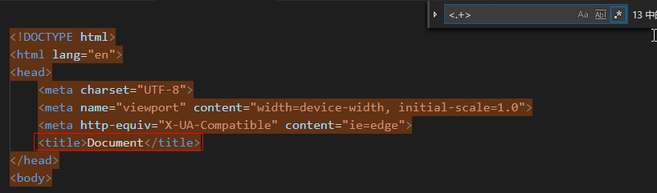

遇到title标签后面的标签时继续向下检索，

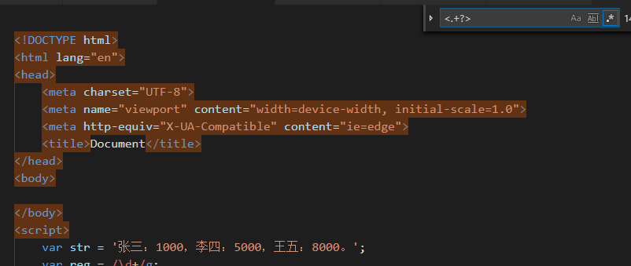

#### 捕获匹配与非捕获匹配

**捕获与引用**

被正则表达式匹配（捕获）到的字符串会被暂存起来。其中，由分组捕获的串会从1开始编号，于是我们可以引用这些串：

```js
var  reg = /(\d{4})-(\d{2})-(\d{2})/
var date = '2010-04-12'
reg.test(date)
RegExp.$1 // 2010
RegExp.$2 // 04
RegExp.$3 // 12
```

$1引用了第一个被捕获的串，$2是第二个，依次类推。

**非捕获型分组**

有时候，我们只是想分个组，而没有捕获的需求，则可以使用非捕获型分组，语法为左括号后紧跟`?:`

```js
var  reg = /(?:\d{4})-(\d{2})-(\d{2})/
var date = '2012-12-21'
reg.test(date)
RegExp.$1 // 12
RegExp.$2 // 21
```

 `var` `reg = /(?:\d{4})-(\d{2})-(\d{2})/` `var` `date = ``'2012-12-21'` `reg.test(date)`   `RegExp.$1 ``// 12` `RegExp.$2 ``// 21`

这个例子中，(?:\d{4})分组不会捕获任何串，所以$1为(\d{2})捕获的串。


## 本地存储localStorage()

这个API的作用是，使得网页可以在浏览器端储存数据。它分成两类：sessionStorage和localStorage。

sessionStorage保存的数据用于浏览器的一次会话，当会话结束（通常是该窗口关闭），数据被清空；localStorage保存的数据长期存在，下一次访问该网站的时候，网页可以直接读取以前保存的数据。除了保存期限的长短不同，这两个对象的属性和方法完全一样。

它们很像cookie机制的强化版，能够动用大得多的存储空间。目前，每个域名的存储上限视浏览器而定，Chrome是2.5MB，Firefox和Opera是5MB，IE是10MB。其中，Firefox的存储空间由一级域名决定，而其他浏览器没有这个限制。也就是说，在Firefox中，a.example.com和b.example.com共享5MB的存储空间。另外，与cookie一样，它们也受同域限制。某个网页存入的数据，只有同域下的网页才能读取。

通过检查window对象是否包含sessionStorage和localStorage属性，可以确定浏览器是否支持这两个对象。

```javascript
function checkStorageSupport() {

  // sessionStorage
  if (window.sessionStorage) {
    return true;
  } else {
    return false;
  }

  // localStorage
  if (window.localStorage) {
    return true;
  } else {
    return false;
  }
}
```

### 存入/读取数据

sessionStorage和localStorage保存的数据，都以“键值对”的形式存在。也就是说，每一项数据都有一个键名和对应的值。所有的数据都是以文本格式保存。

存入数据使用setItem方法。它接受两个参数，第一个是键名，第二个是保存的数据。

```javascript
sessionStorage.setItem("key","value");
localStorage.setItem("key","value");
```

读取数据使用getItem方法。它只有一个参数，就是键名。

```javascript
var valueSession = sessionStorage.getItem("key");
var valueLocal = localStorage.getItem("key");
```

### 清除数据

removeItem方法用于清除某个键名对应的数据。

```javascript
sessionStorage.removeItem('key');
localStorage.removeItem('key');
```

clear方法用于清除所有保存的数据。

```javascript
sessionStorage.clear();
localStorage.clear();
```

### 遍历操作

利用length属性和key方法，可以遍历所有的键。

```javascript
for(var i = 0; i < localStorage.length; i++){
    console.log(localStorage.key(i));
}
```

其中的key方法，根据位置（从0开始）获得键值。

```
localStorage.key(1);
```

- 存储在localStorage、sessionStorage中的内容是以字符串的形式进行存储，因此，我们要储存对象的时候就需要对对象进行序列化，使用JSON.stringify(obj)
- 读取对象形式的字符串需要使用JSON.parse(str),进行反序列化操作

```javascript
 localStorage.setItem('arr',JSON.stringify({
    // localStorage.setItem('arr',{
        a:'1',
        b:'2',
        c: '3'
    }));
    p.innerText = localStorage.getItem('arr');
    var arr = localStorage.getItem('arr');
    // console.log(arr); //[object Object]
    console.log(JSON.parse(arr));

    // localStorage.setItem('arr',JSON.stringify([11,22,33]));
    // p.innerText = localStorage.getItem('arr');
    // var arr = localStorage.getItem('arr');
    // console.log(JSON.parse(arr));

    // console.log(JSON.parse('11,22,33'));
```


## storage事件

当储存的数据发生变化时，会触发storage事件。我们可以指定这个事件的回调函数。

```
window.addEventListener("storage",onStorageChange);
```

回调函数接受一个event对象作为参数。这个event对象的key属性，保存发生变化的键名。

```javascript
function onStorageChange(e) {
     console.log(e.key);    
}
```

ctx.restore()


服务地址为本地ip，127.0.0.1，端口为：8080，文件夹为：js1


1. 下列程序的输出是： console.log("cat" || "dog"); 

A："cat"     B："dog"  C：true  D：false

2. 下列程序的输出是： console.log("cat" && "dog");

A："cat"B："dog"C：trueD：false    

3. 下列程序的输出是： console.log(1 || 0 && 2);

A：0 B：1C：2D：true

4、 console.log(0 || '1' && 2)   

5、下列程序的输出是：_________。 var a = [1, 2]; var b = [1, 2]; console.log(a == b ? true : false);

6、下列程序的输出是：_________。 var a = [1, 2]; var b = a; console.log(a == b ? true : false);

逻辑运算符  先&&   后||

#### Unit4

\6. 对下列程序描述正确的是： for(;;){}

A：报错B：死循环C：没影响，js引擎会忽略这句话D：执行一次

 判断

4. for循环的一般格式为for（初始表达式;条件表达式;末尾循环体）其中三者都可以省略 

5. 下列程序的输出是：_________。 var obj = { 'k1': 1, 'k2': 2 }; for (i in obj) { console.log(i, obj[i]); } 

6.B 判断4 正确

第一个省略代表起始值省略，当你在循环前定义了循环变量的初值时可省

```
第二个是终止条件，当你在循环内部设置break跳出循环时可省
第三个是改变步长，当你在循环体中有可以终止循环的操作时可省
```

填空3：  k1 1 k2 2 

如果两个操作数都是对象，则比较他们是不是同一个对象，操作数是不是指向同一个对象，是则true,否则false

1.A 、2.B 、3.C 4、2   5.false 6.true

#### Unit 5 

\4. 下列程序的输出是： var s = 'helloworld'; console.log(s.slice(-4, -1));

A：ellB：elloC：worlD：orl

\6. 下列程序的输出是： var s = 'helloworld'; console.log(s.substr(1, 3));

A：空字符串   B：helloworld       C：ell          D：el

多选题

\1. 求数组 arr = [1, 2, 3] 的最大值可以用下列哪些方法?

A：Math.max.apply(Math, arr)B：Math.max(arr)C：for循环遍历方式求最大值D：while循环遍历求最大值

判断题

5. 把任意值a转换成字符串只需要执行 String(a) 或 a + ''; 即可。 

 4.D 6.C  多选题 ACD 判断题 5 √

Unit5 Week

4. 字符串查找函数indexOf有可选的第二个参数fromindex。  

5. [a,b)（左闭右开区间）之间的随机整数的表达式为_________。 

4.√  6.Math.floor(Math.random() * (b - a) + a) 

#### Unit6

\1. 如下语句说法正确的是： var arr = new Array(5);

A：只有一个元素，其值为5 B：有5个元素，每个值都为undefinedC：有5个元素，每个值都为nullD：创建了一个空数组，数组中没有任何元素

var arr = [1, 2, 3]; console.log(arr[9]);   //undefined

多选题

\1. splice可以对数组执行什么操作？

A：删除元素B：新增元素C：翻转元素D：替换元素

 \2. 向数组arr的末尾添加一个元素如数值1可以使用下列哪些方法？

A：arr.push(1);B：arr[arr.length] = 1;C：arr = arr.concat(1)D：arr.splice(arr.length, 0, 1);

3. **向数组arr的末尾删除一个元素可以使用下列哪些方法？**

A：arr.pop(1);B：arr.length = arr.length - 1;C：arr = splice(arr.length, 1);D：arr.splice(arr.length - 1, 1);

判断题

1. B  多选题 1.ABD 2.ABCD 3.ABD

#### Unit7

2下列程序的输出是： console.log(add(1, 2)); var add = function (n1, n2) { return n1 + n2; }

A：undefined    B：报错: TypeError: add is not a function


4、下列输出结果

```javascript
   var add = function (n1, n2, n3) {
        console.log(arguments.length);
    }
   console.log(add.length);  
   add(1, 2)
A：3 2   B：2 2  C：3 3  D：2 3
```

多选

1. 以下哪些方法可以正确的创建一个add函数?( )

A：function add(n1, n2) {return n1 + n2;}B：var add = function(n1, n2) {return n1 + n2;}C：var add = function add(n1, n2) {return n1 + n2;}D：var add = new Function('n1', 'n2', 'return n1 + n2;');

\2. 关于自执行函数如下写法正确的是（）

A：(function(){})();B：(function(){}());C：function(){}();D：!function(){}();

\3. 关于call和apply描述正确的是（）

A：call和apply两者功能一样，都是间接调用函数的方法B：使用call和apply的主要目的是改变函数的上下文，即是改变函数中this指向C：apply最多只能有两个参数：新this对象和一个数组D：call可以接受多个参数，第一个参数与apply一样，后面则是一串参数列表

判断 

1. 函数中arguments.callee指向该函数本身。  √

2. js中函数参数是按地址传递。 

3. js没有函数的重载，后定义的函数会覆盖先定义的函数。但通过判断参数个数可以模拟函数重载。

填空

填空题


\2. 下列程序的输出是：_________。 function add(n1, n2) { console.log(arguments.length); } add(1, 2, 3); console.log(add.length);

3 ，2


答案

  2、B 试题解析（选填）: "函数表达式不会提升"

 4、A 

多选 1、ABCD 2、ABD 3、ABCD

判断 3 X 试题解析（选填）: "按值传递。如果参数是对象也是按值传递，只是传递的值是对象的地址。"

4 √

填空 3  

3、2

#### Unit8

\3. 下列关于递归函数说法正确的是？

A：函数直接或者间接调用自己时，则发生了递归B：递归必须至少有一个终止条件C：递归分为递归前进段和递归返回段D：递归算法相对常用的算法如普通循环等，运行效率较低

\5. 关于如下代码说法正确的是： function removeByValue(arr, val) { for (var i = 0; i < arr.length; i++) { if (arr[i] == val) { arr.splice(i, 1); break; } } }

A：作用是根据value值删除指定元素B：连续的指定值会遗漏，比如数组[1, 3, 3, 5]，删除3时C：需要调整为倒序删除D：功能完全正确

\6. 关于如下代码说法正确的是： arr.sort(function(a, b) { return a > b ? 1 : -1 });

A：sort接受一个可选参数，且必须是函数B：功能是倒序排序C：调用sort方法后，arr本身不会被改变D：sort默认是按字符来排序的

1. 操作原数组删除元素的，优先考虑倒序删除。

2. 2. 数组去重的算法，可以利用对象的属性去重，性能较优。

   \1. 对数组中的每一项运行给定函数，且该函数没有返回值的es5迭代方法是_________

   \2. 从数组中筛选符合条件的项使用的es5迭代方法是_________。

   \3. 对数组每一项运行给定函数，每次返回函数调用结果组成的数组的es5迭代方法是_________。

   6. 下列程序的输出是：_________。 arr = [10, 1, 2, 1]; console.log(arr.indexOf(1, 2), arr.lastIndexOf(1, 2));

3. 下列程序的输出是：_________。 arr = [1, 2, 3, 4, 5]; var res = 0; res = arr.reduce(function (prev, item, inedex, array) { return prev + item; }); console.log(res);

4. 如下函数是递归实现斐波那契数列，分别写出当n=1到8的输出是：_________。 function fibonacci(n) { if (n == 1 || n == 2) { return 1; } return fibonacci(n - 1) + fibonacci(n - 2); }

3 ABCD 5、ABC 6、AD

填空1 forEach 2 filter 3map  6. 3 1          7.15     9."1 1 2 3 5 8 13 21"

#### Unit9

\1. 下列程序的输出是： var d = new Date(); console.log(typeof d, d instanceof Date);

A：object trueB：Date trueC：object falseD：Date false

\2. 在 JavaScript 中，可以使用 Date 对象的什么方法返回一个月中的日期？

A：getDateB：getDayC：getMonthD：getTime

\5. 下列程序的输出是： console.log(+new Date('foo-bar 2014'));

A：报错B：输出时间戳C：nullD：NaN


试题解析（选填）: "js会尽可能的转成日期，转成2014年之后有+再转成整数，即时间戳"

\6. 下列程序的输出是： console.log(+new Date('foo-bar'));

A：报错B：输出时间戳C：nullD：NaN

\1. 下列哪些方法可以获取当前时间的毫秒数( )

A：+(new Date())B：Date.now()C：+(Date())D：(new Date()).getTime();

\2. 下列哪些方法可以将字符串 s = '2018'; 转换为时间( )

A：Date.parse(s)B：Date(s)构造函数C：s.toDate()D：s.getTime()

\4. 下列能转成时间对象的有？( )

A：new Date('2000-02-05 01')B：new Date('2000-02-05 01:04')C：new Date('2000-02-05 01:04:05')D：new Date('2000-02-05 01-04')


1. Date类型方法中返回值默认从0开始的有 getMonth()和 getDay() 两种方法。

1 A 2 A 5B 6D

多选1ABD  2AB 4BC

试题解析（选填）: "要注意ios中safafi不支持-分割，只支持/分割"

#### unit_10

4. 如果页面中不存在id为"my-id"的元素，那么document.getElementById('my-id');结果为null。  √

5. load事件是在html结构加载完成之后就触发，无论页面中的图片是否加载完成。 

6. \7. img也有load和error事件，图片加载完成触发load，加载失败触发error事件。

   \8. unload事件在关闭整个浏览器时触发，关闭标签页不会触发。

   \9. keydown和keypress如果按住不放只会触发一次，keyup如果按住不放，会重复触发此事件。

   \10. 对于键盘中的数字字母按键，event.keycode与ASCII码中对应的编码一致。

   \11. js可以通过style属性获取到元素的所有css样式，包括用css设置的样式。

   6. select选择框值改变触发的事件是_______ 

 4对  6错 7 对 8 错 9 错 10对 11错    6"change"

#### unit_10_week

\2. 向数组arr = [1, 2, 3]的头部插入一个元素4可以使用哪些方法？

A：arr.unshift(4)B：arr.shift(4)C：arr.splice(0, 0, 4)D：arr.splice(0, 1, 4)

\3. 下列关于递归函数说法正确的是？

A：函数直接或者间接调用自己时，则发生了递归

B：递归必须至少有一个终止条件

C：递归分为递归前进段和递归返回段

D：递归算法相对常用的算法如普通循环等，运行效率较低

\4. 读代码，下列说法正确的是： 

```
function foo(arr) {
        var res = [];
        var map = {};
        for (var i = 0; i < arr.length; i++) {
            if (!map[arr[i]]) {
                res.push(arr[i]);
                map[arr[i]] = 1;
            }
        }
        return res;
    }
```

A：算法是利用对象属性去除重复元素，性能较优

B：变量res作用是保存非重复元素

C：变量map作用是标记元素是否存在

D：map保存的形式是{'key': 1}，其中key是数组元素

\5. 读代码，下列说法正确的是： 

```
 function removeByValue(arr, val) {
        for (var i = 0; i < arr.length; i++) {
            if (arr[i] == val) {
                arr.splice(i, 1);
                break;
            }
        }
    }
```

A：作用是根据value值删除指定元素B：连续的指定值会遗漏，比如数组[1, 3, 3, 5]，删除3时C：需要调整为倒序删除D：功能完全正确

\7. 关于如下代码说法正确的是： function sort(arr) { for (var i = 1; i < arr.length; i++) { for (var j = 0; j < arr.length - i - 1; j++) { if (arr[j] > arr[j + 1]) { var swap = arr[j]; arr[j] = arr[j + 1]; arr[j + 1] = swap; } } } }

A：算法是基本的冒泡排序法B：数列是倒序排序C：i范围是从1到length，j范围是从0到length-i-1D：if条件中三条语句，作用是使用中间变量，交换arr[i]和arr[j]

2. **如下程序执行后输出的结果是_____。 var arr = [10, 1, 2, 1]; console.log(arr.indexOf(1, 2));**
3. 

```
  function foo() {
        var i = 0;
        return function () {
            console.log(++i);
        }
    }
    var f1 = foo();
    /* 活动对象 */
    var f2 = foo();
    f1();//1
    f1();//2
    f2();//1
```

2.AC  3.ABCD  4.ABCD  5ABC

2.2 3       3. 1、2、1  调用函数f1和函数f2时，自身作用域中没有变量i，向上一级作用域中找var i = 0;

闭包


## JS下

### unit_1

\1. IE和DOM事件流的区别是：

A：执行顺序不一样B：参数不一样C：this指向问题D：参数一样，但事件不加on

1ABC

IE8以下this始终指向Window对象。

判断

\8. ie的事件流是事件冒泡。

\10. 事件流的描述：ie采用事件冒泡的方式，netscape采用事件捕获的方式，dom2级采用先捕获后冒泡的方式。

\11. dom2级事件addEventListener可以有三个参数，第三个参数为true表示在捕获阶段处理事件，默认为true

\12. ie事件处理程序中atachEvent也有三个参数，第三个参数为布尔值，表示捕获或冒泡阶段处理事件。

填空

\1. “DOM2级事件”规定事件有三个阶段，分别是：事件捕获阶段、处于目标阶段 和_________。

\2. “DOM2级事件”addEventListener函数的第三个参数为true表示_________。

\3. ie事件对象中添加事件的方法是_________。

\4. ie事件对象中移除事件的方法是_________。

5. 编写一个跨浏览器的事件处理程序利用的方法（有某个方法则优先使用，没有则降级使用老方法）是_________。

判断：8.对 10对 11错 12错

填空 事件冒泡阶段    在事件捕获阶段处理程序  attachEventdetachEvent     能力检测

### unit_2

选择

\2. 若页面中有id为btn的元素，点击btn元素，下列程序的输出是： var btn = document.getElementById('btn'); document.body.addEventListener('click', func, false); function func(event) { console.log(this === event.target); console.log(this === event.currentTarget); console.log(event.target === event.currentTarget); }

A：false false trueB：true true trueC：true true fasleD：false true false

多选题

\1. 下列可以触发click事件的有？

A：clickB：dbclickC：键盘的enter键D：mouseenter

选择

2：D  多选：ABC

判断  7. 页面没有滚动时：pageX和pageY是相对与浏览器窗口定位的。

8. 鼠标事件中，想要检测按下的是哪个鼠标按键可以通过event.button来判断，为0是左键，为2为右键。

   11、按下鼠标不放mousedown会重复触发。

   \12. 按下键盘某个键不放keydown和keypress会重复触发

填空

\2. ie事件处理程序中，访问事件event的触发元素应该使用：_________。

\3. 鼠标事件中，想要检测鼠标移动的方向应该使用event对象的属性是：_________。  undifined

8：对 11错  12对 

填空： 2： event.srcElement       3 event.wheelDelta

### unit_3

9. ie事件处理程序中，以下使用attachEvent方法是正确的。 document.body.attachEvent('onclick', function() { console.log(1); })        ？？？B

填空

2. “DOM2级事件”addEventListener函数的第三个参数为true表示_________。

\3. 非ie中阻止事件的默认行为的方法（如阻止a标签的跳转）_________。

\4. 非ie中阻止事件进一步的冒泡或捕获的方法是_________。

\5. ie中阻止事件的默认行为应该设置event对象的什么属性为false（如阻止a标签的跳转）_________。

\6. ie中阻止事件进一步的冒泡或捕获应该设置event.cancelBubble为_________。

2在事件捕获阶段处理程序

3prventDefaultstop

4Propagation

5returnValue

6true

```
var link = document.getElementsByClassName('link')[0];
    link.onclick =function(e) {
        console.log(e);
        e.returnValue = false
    }
```

### unit_4正则表达式

多选

\2. 下列可以匹配字符串"abc 123"的正则表达式有：

A：/\d/    B：/\d+/   C：/\b\d/     D：/\b\d+/

\3. 正则表达式的修饰符有：

A：m  B：g   C：a   D：i

\4. 下列能匹配任意字符的有：

A：/[\d\D]/       B：/[\w\W]/    C：/[\s\S]/     D：/[\a\A]/

判断题 2 ABCD  3ABD  4ABC

\s匹配任意的空白符 \b单词边界 m多行匹配

判断

\1. 正则中字符边界用\b表示。

\2. 正则中？如果紧跟在任何量词 *、 +、? 或 {} 的后面，将会使量词变为非贪婪的（匹配尽量少的字符），和缺省使用的贪婪模式（匹配尽可能多的字符）正好相反。

\3. 正则中小数点匹配除换行符之外的任何单个字符。

\4. /abc?/能匹配字符串 ab ，但/(abc)?/不能匹配。

123:AAA 4：B

填空

6. 编写正则表达式，将字符a重复最少3次最多6次，但它是非贪婪匹配的_________。

   \9. 编写正则表达式，匹配字符串结尾的0个或多个空白字符_________

   \10. 编写正则表达式，匹配由abc组成的字符_________。

   \11. 编写正则表达式，匹配由非abc组成的字符_________。

   \12. 编写正则表达式，匹配单字字符（数字、字母、下划线）_________。

6： /a{3,6}?/  9：/\s*$/   10：/[abc]/ 或 /[a-c]/   11：/`[^abc]`/   12 ：/\w/ 或 /[a-zA-Z0-9]/

### unit_5正则对象

\4. 下列程序的输出是： var r = /(a)bc/; var res = 'bcdef'.search(r); console.log(res);

A：nullB：1C：[]D：-1

\5. 下列程序的输出是： var r = /\d/; var s = '1a'; console.log(r.test(s)); console.log(r.test(s));

A：true falseB：false falseC：false trueD：true true

\6. 下列程序的输出是： var r = /\d/g; var s = '1a'; console.log(r.test(s)); console.log(r.test(s));

A：true falseB：false falseC：false trueD：true true


  4：D    5：D     6 ：A

\2. 字符串的哪些方法可以用正则作为参数？

A：matchB：searchC：splitD：replace

2：ABCD

判断题

\3. 下列程序中exec使用循环的方式能够找到全部的匹配项。 var r = /a/g; var str = 'aba'; var array = []; while ((array = r.exec(str)) !== null) { console.log('result is: %s, next index at: %d', array[0], r.lastIndex); }

\4. 字符串的match方法和正则的exec方法返回结果一致，都是数组。

\5. 创建正则可以有两种方式：正则字面量、正则对象。

\6. 正则的lastIndex属性在不设置g全局标志时不存在此属性。

3456:AAAB

填空

填空题

\1. 下列程序的输出是_________。 var r = /\d{2}/; var s = 'abc123def45g'; var res = s.replace(r, '-'); console.log(res);

\2. 下列程序的输出是_________。 var r = /\d{2}/g; var s = 'abc123def45g'; var res = s.replace(r, '-'); console.log(res);

\3. 下列程序的输出是_________。 /a/g.exec('abca') console.log(/a/g.lastIndex);

\4. 下列程序的输出是_________。 var r = /a/g; r.exec('abca') console.log(r.lastIndex);

\5. 下列程序的6次输出分别是什么，每个用逗号分隔_________。 var r = /a/g; console.log(r.test('aba')); console.log(r.lastIndex); console.log(r.test('aba')); console.log(r.lastIndex); console.log(r.test('aba')); console.log(r.lastIndex);

1：abc-3def45g

2：abc-3def-g

3：0

4: 1

5:  true   1   true 3    false 0

### unit_5_week

\9. 正则表达式 /(01|10|1001|0110)*/ 与下列哪个表达式一样：

A：/(0|1)*/B：/(01|01)*/C：/(01|10)*/D：/(11|01)*/  

9:C

\10. 下

### unit_6

1. 访问变量有按值访问和按引用访问，函数参数只能按值传递。

5、延长作用域链原理是 在作用域链的前端临时增加一个变量对象，在代码执行后该变量对象会被立即移除。

\6. 引用类型值在内存中占据空间大小不固定，因此被保存在堆内存中。

\7. 基本类型值在内存中占据固定大小空间，因此被保存在栈内存中。

1 A对    5对   6对    7对


\2. 每个执行环境都对一个_________，它保存着环境中定义的所有变量和函数。

\3. 代码在环境中执行时会创建一个_________确保对变量和函数的有序访问。

12变量对象  13作用域链

6下列程序的输出结果

```
var obj = {
            'k1': 1,
            'k2': {
                'k3': 3
            }
        };
        var copyObj = obj.k2;
        obj.k2 = {
            'k3': 4
        };
console.log(copyObj.k3)
```

7下列程序的输出结果

```
var obj = {
            'k1': 1,
            'k2': {
                'k3': 3
            }
        };
        var copyObj = obj.k2;
        copyObj = {
            'k3': 4
        };
        console.log(obj.k2.k3)
```

6：3 

7: 3

\8. 垃圾收集有引用计数和_________两种方式。

\9. 引用类型值是对象，保存在_________。

\10. 确定一个值是哪种基本类型用_________操作符，确定是哪种引用类型使用_________操作符。

8标记清除堆内存   9typeof     10instanceof

### Unit7

\2. 递归就是在一个函数中通过函数名调用自身。

\3. 递归中通常使用arguments.caller来表示函数自身。

2对 3错 arguments.callee

2. 下列程序的输出是_________。

```javascript
function fib(n) {
            if (n <= 1) {
                return 1;
            }
            console.log(fib);
            return fib(n - 1) + fib(n - 2);
        }
        var anotherFunc = fib;
        fib = function () {
            return 1;
        };
console.log(anotherFunc(5));
```

3、

```
 function a() { var i = 0; function b() { console.log(++i); } return b; } var c = a(); c(); c();
```

2: 2 

3: 1，2      

### unit_9

\4. filter函数的接收两个参数：要在每一项上运行的函数和（可选的）运行该函数的作用域对象。

\5. filter函数的第一个参数是传入的函数，该函数有三个参数，分别是元素的索引、元素的值、被遍历的数组。

\7. 跳出forEach 循环可以采用break或者return false的方式。

\8. 函数式编程要求，对于相同的输入，永远会得到相同的输出，而且没有任何可观察的副作用，也不依赖外部环境的状态。

4：对 5错 7错 8对

填空

7. 下列程序的输出是_________。 var isBiggerThan10 = function (element, index, array) { return element > 10; } var res = [2, 5, 8, 1, 4].some(isBiggerThan10); console.log(res);

8. 下列程序的输出是_________。 var arr = [1, 2, 3, 4, 5, 6]; var res = arr.filter(function(item) { return item % 2; }); console.log(res);

9. 下列程序的输出是_________。 var arr = ['a','', null, undefined, NaN, 'b']; var res = arr.filter(function (item) { return item; }); console.log(res);

   7 false 9[1,3,5]  11  ["a", "b"]

   

   

### Unit10

3. 下列代码中访问first-name属性的方式是错误的。 var person = { 'name' : "john green", 'first-name' : 'john' }; person.first-name

3：对 。解析var person = { 'name' : "john green", 'first-name' : 'john' }; person['first-name']

填空没做

### unit_10_week

\2. 下列哪种方式不能改变作用域链？

A：withB：whileC：try catchD：eval

\3. 下列有关

2:???? B

\1. 闭包会导致变量不会被正常释放，持续占用内存空间，很容易造成内存浪费，所以一般需要一些额外手动的清理机制。

\2. 闭包的创造条件是：存在内、外两层函数，内层函数对外层函数的局部变量进行了引用。

\3. 闭包就是把变量保护起来，让它不受外部污染，用一个内部函数来操作变量，在把它封装在一个外部函数中，且外部函数返回内部函数。

\4. 闭包的作用是读取函数内部的变量，并让这些变量值始终保持在内存中。

\7. 每个函数都包含两个非继承而来的方法：apply()和call()。他们的用途相同，都是在特定的作用域中调用函数。接收参数方面不同，apply()接收两个参数，一个是函数运行的作用域(this)，另一个是参数数组 。

### Unit11

选择2

```javascript
function SuperType() {
            this.property = true;
        }
        SuperType.prototype.getSuperValue = function () {
            return this.property;
        };

        function SubType() {
            this.subproperty = false;
        }
        SubType.prototype = new SuperType();
        SubType.prototype.getSubValue = function () {
            return this.subproperty;
        };
        SubType.prototype.getSuperValue = function () {
            return false;
        };
        var instance = new SubType();
        console.log(SuperType.prototype.isPrototypeOf(instance));
        console.log(SuperType.prototype.isPrototypeOf(instance));
        console.log(SubType.prototype.isPrototypeOf(instance));
        console.log(instance instanceof Object);
```

A：false true false trueB：true true true trueC：false true false falseD：true true false true

2B

1. 组合继承原理：使用原型链实现对原型属性和方法的继承，而通过构造函数实现对实例属性的继承。

   3使用原型的好处是：原型对象上的所有属性和方法，都能被对应的构造函数创建的实例对象共享（这就是 JavaScript 继承机制的基本设计），也就是说，不必在构造函数中定义对象实例的信息，而是可以将这些信息直接添加到原型对象中。

2. JavaScript 中几乎所有的对象都是位于原型链顶端的Object的实例。

1 ：对 3 对 8对

填空

2. 所有的引用类型都继承_________。


4. 检测在原型链下面是否存在某个实例使用的方法是_________。

2：Object 4function isPrototypeOf() { [native code] }