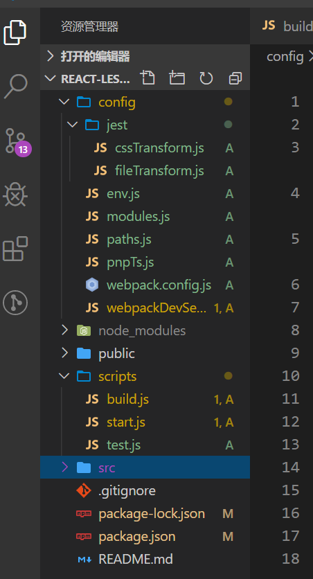
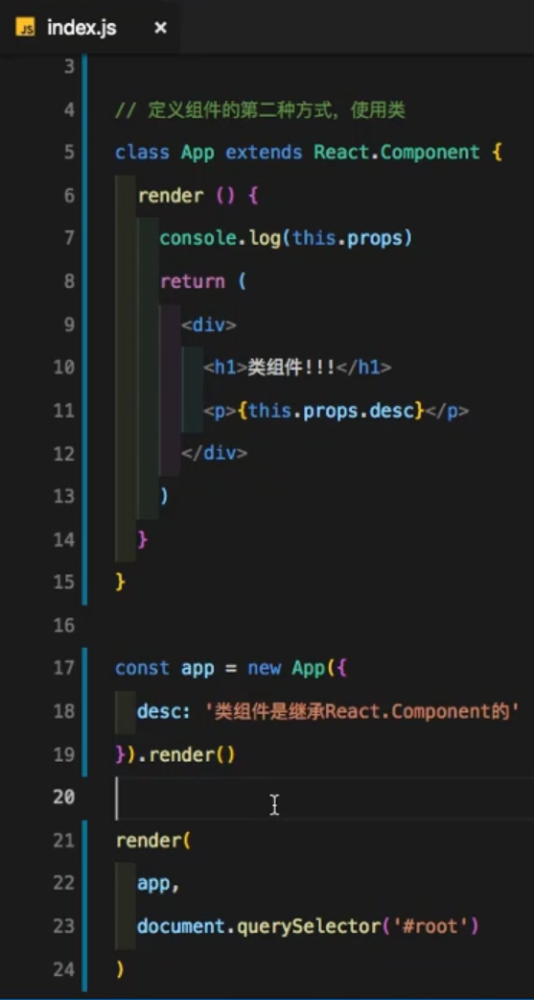
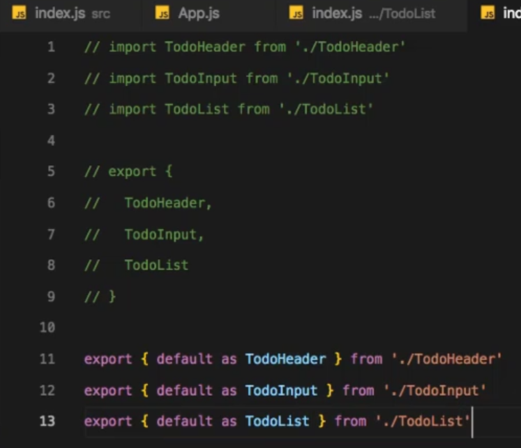
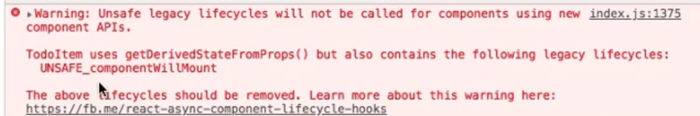
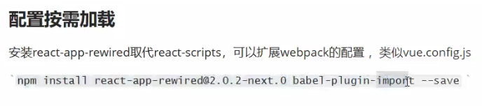
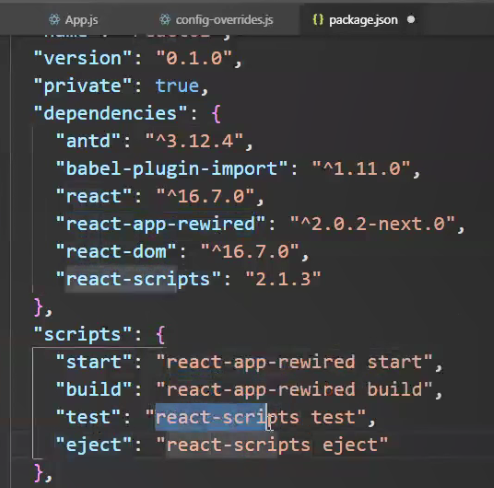
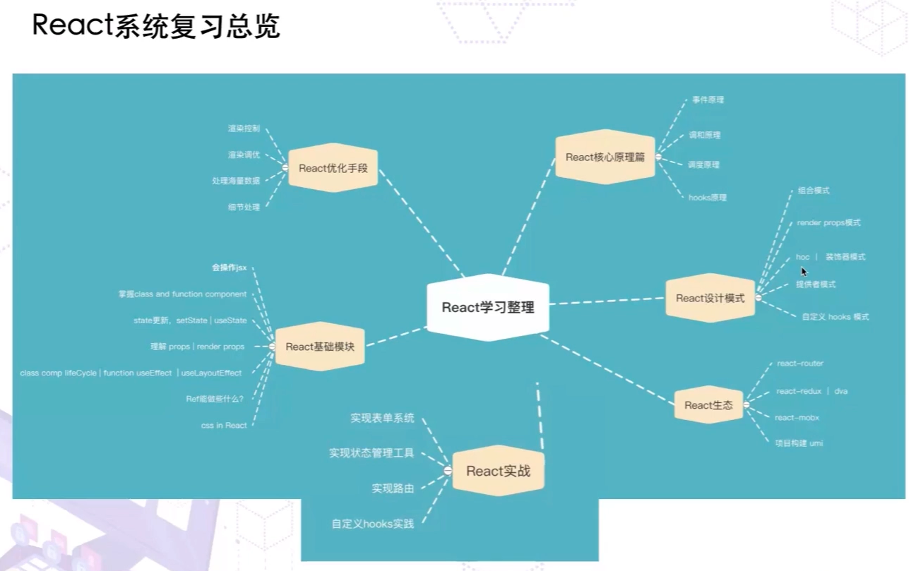

<åßhttps://www.cnblogs.com/katydids/p/10014111.html>

16.8： hooks


React Developer Tools  4.0.6

Vue.js devtools  5.1.1

## ßreact脚手架安装

方式一

```js
npx create-react-app my-app 名字不能有大写字母
cd my-app
npm start
```

npx是一种在npm中安装工具，也可以被单独的下载使用

在npm 5.2.0 的时候发现会买一送一，自动安装了npx。

https://www.jianshu.com/p/a4d2d14f4c0e

Installing react, react-dom, and react-scripts with cra-template...

+ react@16.12.0
+ react-dom@16.12.0
+ cra-template@1.0.0
+ react-scripts@3.3.0

RN  react-native 

VR  react-vr

Web react-dom

```
Inside that directory, you can run several commands:

  npm start
    Starts the development server.

  npm run build
    Bundles the app into static files for production.

  npm test
    Starts the test runner.

  npm run eject
    Removes this tool and copies build dependencies, configuration files
    and scripts into the app directory. If you do this, you can’t go back!

We suggest that you begin by typing:

  cd react-tuts
  npm start
```


输入 npm run eject




```json
  "dependencies": {
    "@babel/core": "7.7.4",
    "@svgr/webpack": "4.3.3",
    "@testing-library/jest-dom": "^4.2.4",
    "@testing-library/react": "^9.4.0",
    "@testing-library/user-event": "^7.2.1",
    "@typescript-eslint/eslint-plugin": "^2.8.0",
    "@typescript-eslint/parser": "^2.8.0",
    "babel-eslint": "10.0.3",
    "babel-jest": "^24.9.0",
    "babel-loader": "8.0.6",
    "babel-plugin-named-asset-import": "^0.3.5",
    "babel-preset-react-app": "^9.1.0",
    "camelcase": "^5.3.1",
    "case-sensitive-paths-webpack-plugin": "2.2.0",
    "css-loader": "3.2.0",
    "dotenv": "8.2.0",
    "dotenv-expand": "5.1.0",
    "eslint": "^6.6.0",
    "eslint-config-react-app": "^5.1.0",
    "eslint-loader": "3.0.2",
    "eslint-plugin-flowtype": "3.13.0",
    "eslint-plugin-import": "2.18.2",
    "eslint-plugin-jsx-a11y": "6.2.3",
    "eslint-plugin-react": "7.16.0",
    "eslint-plugin-react-hooks": "^1.6.1",
    "file-loader": "4.3.0",
    "fs-extra": "^8.1.0",
    "html-webpack-plugin": "4.0.0-beta.5",
    "identity-obj-proxy": "3.0.0",
    "jest": "24.9.0",
    "jest-environment-jsdom-fourteen": "0.1.0",
    "jest-resolve": "24.9.0",
    "jest-watch-typeahead": "0.4.2",
    "mini-css-extract-plugin": "0.8.0",
    "optimize-css-assets-webpack-plugin": "5.0.3",
    "pnp-webpack-plugin": "1.5.0",
    "postcss-flexbugs-fixes": "4.1.0",
    "postcss-loader": "3.0.0",
    "postcss-normalize": "8.0.1",
    "postcss-preset-env": "6.7.0",
    "postcss-safe-parser": "4.0.1",
    "react": "^16.12.0",
    "react-app-polyfill": "^1.0.5",
    "react-dev-utils": "^10.0.0",
    "react-dom": "^16.12.0",
    "resolve": "1.12.2",
    "resolve-url-loader": "3.1.1",
    "sass-loader": "8.0.0",
    "semver": "6.3.0",
    "style-loader": "1.0.0",
    "terser-webpack-plugin": "2.2.1",
    "ts-pnp": "1.1.5",
    "url-loader": "2.3.0",
    "webpack": "4.41.2",
    "webpack-dev-server": "3.9.0",
    "webpack-manifest-plugin": "2.2.0",
    "workbox-webpack-plugin": "4.3.1"
  },
  "scripts": {
    "start": "node scripts/start.js",
    "build": "node scripts/build.js",
    "test": "node scripts/test.js"
  },
```


npm install -g creat-react-app 安装官方脚手架


 code . 打开编辑器


creat-react-app demo01 

src/index.js

```js
import React from 'react';
import ReactDOM from 'react-dom';

ReactDOM.render(<h1>React真酷</h1>, document.querySelector('#root'))
或者
// ReactDOM.render(<App/>, document.querySelector('#root'))
```

src/App.js

```js
import React, { Component } from "react";
export default class App extends Component {
或者
export default class App extends React.Component {

}
```

react16版本之前是diff算法（同步渲染），之后是fiber算法，渲染变为异步的。

，

git checkout -b lesson-01


最简单的index.js

src\index.js 

```js
import React from 'react';
import ReactDOM from 'react-dom';
ReactDOM.render(<h1>你好，react</h1>, document.querySelector('#root'));
```


#### class声明方式

```jsx
export default class App extends Component {
  // 1.当需要状态时，需要构造函数
  constructor(props) {
    super(props);

    // 2.初始化状态
    this.state = {
      count: 0,
      date: new Date()
    };
  }
  // setState 一般在这个生命周期执行。
  componentDidMount() {
    this.timer = setInterval(() => {
      // 3.更新状态
      this.setState({
        date: new Date(),
        count: this.state.count + 1
      });
    }, 1000);
    
    // 注意2：setState()异步的
    this.setState((prevState, prevProps)=>({
        count: prevState.count + 1
    }), () => {
        console.log(this.state.count);//1
    });
    // console.log(this.state.count);0
  }

  componentWillUnmount() {
    clearInterval(this.timer);
  }

}
```



render的第一个参数是元素

16.0之前创建类组件

```
React.createClass(
	render() {
		raturn <h1>类组件</h1>
	}
)
```


# JSX底层原理

react/src/ReactBaseClasses.js

export {Component, PureComponent};

 

### JSX

方法，第一个参数理解为标签名，第二个为标签的属性。

```jsx
const element = (
  <h1 className="greeting">
    Hello, world!
  </h1>
);
const element = React.createElement(
  'h1',
  {className: 'greeting'},
  'Hello, world!'
);
React.createElement() 会预先执行一些检查，以帮助你编写无错代码，但实际上它创建了一个这样的对象：

// 注意：这是简化过的结构
const element = {
  type: 'h1',
  props: {
    className: 'greeting',
    children: 'Hello, world!'
  }
};
```


```js
<h1 id="title" className="bg" style={{color: 'red'}}>
        hello
        <span>world</span>
</h1>

//上面的这段代码很简单，但是我们都知道react是所谓的虚拟dom,当然不可能就是我们看到的这样。当我们将上面的代码经过babel转译后，我们再看看

React.createElement("h1", {
  id: "title",
  className: "bg",
  style: {
    color: 'red'
  }
}, "hello", React.createElement("span", null, "world"));
```

### createElement

1. 那到底React.createElement干了些什么呢？

```tsx
//方法接受三个参数，第一个参数是组件类型，第二个参数是要传递给组件的属性，第三个参数是children。方法最终会返回一个具有以下属性的对象

function createElement(type,config,children){
    let propName;
    const props = {};
    for(propName in config){
        props[propName] = config[propName]
    }
    const childrenLength = arguments.length - 2;   //减掉type config  看看后面还有几个儿子
    if(childrenLength === 1){
        props.children = children;
    }else if(childrenLength > 1){  //如果说儿子的数量大于1的话，props.children就是一个数组
        props.children = Array.from(arguments).slice(2)
    }
    return {type,props}
}

export default {
    createElement
}

/**
React.createElement("h1", {
  id: "title",
  className: "bg",
  style: {
    color: 'red'
  }
}, "hello", React.createElement("span", null, "world"));
 */
```

### Component

```js
/**
 * Base class helpers for the updating state of a component.
 */
function Component(props, context, updater) {
  this.props = props;
  this.context = context;
  // If a component has string refs, we will assign a different object later.
  // ref 有好几个方式创建，字符串的不讲了，一般都是通过传入一个函数来给一个变量赋值 ref 的
  // ref={el => this.el = el} 这种方式最推荐
  // 当然还有种方式是通过 React.createRef 创建一个 ref 变量，然后这样使用
  // this.el = React.createRef()
  // ref={this.el}
  // 关于 React.createRef 就阅读 ReactCreateRef.js 文件了
  this.refs = emptyObject;
  // We initialize the default updater but the real one gets injected by the
  // renderer.
  // 如果你在组件中打印 this 的话，可能看到过 updater 这个属性
  // 有兴趣可以去看看 ReactNoopUpdateQueue 中的内容，虽然没几个 API，并且也基本没啥用，都是用来报警告的
  this.updater = updater || ReactNoopUpdateQueue;
}

Component.prototype.isReactComponent = {};
```

### PureComponent

```js
// 以下做的都是继承功能，让 PureComponent 继承自 Component
function ComponentDummy() {}
ComponentDummy.prototype = Component.prototype;
/**
 * Convenience component with default shallow equality check for sCU.
 */
function PureComponent(props, context, updater) {
  this.props = props;
  this.context = context;
  // If a component has string refs, we will assign a different object later.
  this.refs = emptyObject;
  this.updater = updater || ReactNoopUpdateQueue;
}

const pureComponentPrototype = (PureComponent.prototype = new ComponentDummy());
pureComponentPrototype.constructor = PureComponent;
// Avoid an extra prototype jump for these methods.
Object.assign(pureComponentPrototype, Component.prototype);
// 通过这个变量区别下普通的 Component
pureComponentPrototype.isPureReactComponent = true;

export {Component, PureComponent};
```


### setState

```js
// 我们在组件中调用 setState 其实就是调用到这里了
// 用法不说了，如果不清楚的把上面的注释和相应的文档看一下就行
// 一开始以为 setState 一大堆逻辑，结果就是调用了 updater 里的方法
// 所以 updater 还是个蛮重要的东西
Component.prototype.setState = function(partialState, callback) {
  invariant(
    typeof partialState === 'object' ||
      typeof partialState === 'function' ||
      partialState == null,
    'setState(...): takes an object of state variables to update or a ' +
      'function which returns an object of state variables.',
  );
  this.updater.enqueueSetState(this, partialState, callback, 'setState');
};
```


- 不完全的；部分的；偏袒的；偏爱的

### forceUpdate

默认情况下，一旦组件的state或者props发生变化，组件就会rerender，如果你的组件依赖于外部数据，或者你想将状态管理放到组件之外，此时，你应该使用component.forceUpdate。

调用forceUpdate会触发render方法，并且绕过shouldComponentUpdate。但不会改变其子组件的行为（子组件仍然会执行shouldComponentUpdate）。

也许你听说过redux，专门用于状态管理的，使用它可以将应用的ui部分与state（数据）部分隔离开来管理。 react-redux中间的实现就使用了forceUpdate。下面是其connect方法的一个近似实现：

```js
/**
 * Forces an update. This should only be invoked when it is known with
 * certainty that we are **not** in a DOM transaction.
 *
 * You may want to call this when you know that some deeper aspect of the
 * component's state has changed but `setState` was not called.
 *
 * This will not invoke `shouldComponentUpdate`, but it will invoke
 * `componentWillUpdate` and `componentDidUpdate`.
 *
 * @param {?function} callback Called after update is complete.
 * @final
 * @protected
 */
// 这个 API 用的很好，不清楚作用的看文档吧
Component.prototype.forceUpdate = function(callback) {
  this.updater.enqueueForceUpdate(this, callback, 'forceUpdate');
};
```


### Refs

refs 其实有好几种方式可以创建：

- 字符串的方式，但是这种方式已经不推荐使用
- `ref={el => this.el = el}`
- `React.createRef`

另外对于函数组件来说，是不能使用 `ref` 的，如果你不知道原因的话可以直接阅读 [文档](https://react.docschina.org/docs/refs-and-the-dom.html#refs-与函数式组件)。


```js
// an immutable object with a single mutable value
// 这个代码是不是贼简单，就是让你外部能够通过 current 去拿到 ref
// 但是可能很多人没见过 Object.seal 这个 API
// 直接给不清楚的各位复制了文档：封闭一个对象，阻止添加新属性并将所有现有属性标记为不可配置
export function createRef(): RefObject {
  const refObject = {
    current: null,
  };
  if (__DEV__) {
    Object.seal(refObject);
  }
  return refObject;
}
```


```js
class MyComponent extends React.Component {
  constructor(props) {
    super(props);
    this.myRef = React.createRef();  }
  render() {
    return <div ref={this.myRef} />;  }
}
```

当 ref 被传递给 `render` 中的元素时，对该节点的引用可以在 ref 的 `current` 属性中被访问。

```
const node = this.myRef.current;
```

ref 的值根据节点的类型而有所不同：

- 当 `ref` 属性用于 HTML 元素时，构造函数中使用 `React.createRef()` 创建的 `ref` 接收底层 DOM 元素作为其 `current` 属性。
- 当 `ref` 属性用于自定义 class 组件时，`ref` 对象接收组件的挂载实例作为其 `current` 属性。
- **你不能在函数组件上使用 `ref` 属性**，因为他们没有实例。

```js
function CustomTextInput(props) {
  // 这里必须声明 textInput，这样 ref 才可以引用它  const textInput = useRef(null);
  function handleClick() {
    textInput.current.focus();  }

  return (
    <div>
      <input
        type="text"
        ref={textInput} />      <input
        type="button"
        value="Focus the text input"
        onClick={handleClick}
      />
    </div>
  );
}
```

### **React.Children.map()**

```js
function Father({children}) {
    return(
      <div>
      {React.Children.map(children, (child, index) => {
          ...
      })}
      </div>    
    )        
 }

<Father>
    hello world!
    {() => <p>2333</p>}
</Father>
```

对外接口在原始码中对应为mapChildren，forEachChildren，countChildren，onlyChild，toArray

```js
export {
  forEachChildren as forEach,
  mapChildren as map,
  countChildren as count,
  onlyChild as only,
  toArray,
};

function mapChildren(children, func, context) {
//children为null或者undefined就返回null或者undefined
  if (children == null) {
    return children;
  }
  const result = [];
  mapIntoWithKeyPrefixInternal(children, result, null, func, context);
  return result;
}
```

运行逻辑：类比树的深度优先遍历算法


React.Children.forEach()

#### React.Children.count()

```js
function Father({children}) {
    return(
      <div>
      {React.Children.count(children)}
      </div>    
    )        
 }


<Father>
    hello world!
    {() => <p>2333</p>}
</Father>
```


复合组件

https://react-cn.github.io/react/docs/multiple-components.html


# --------华丽的分割线-----------

### 事件处理

**1.** jsx中this没有默认绑定，需要使用bind绑定，否则this会是undefined。

由于类的方法默认不会绑定this，因此在调用的时候如果忘记绑定，this的值将会是undefined。

通常如果不是直接调用，应该为方法绑定this。

**2.** 这个问题的本质原因如下：

这不是React的原因，这是JavaScript中本来就有的。如果你传递一个函数名给一个变量，然后通过在变量后加括号()来调用这个方法，此时方法内部的this的指向就会丢失。

也就是说在JavaScript中就有这么一个陷阱：

```java
let obj = {
    tmp:'Yes!',
    testLog:function(){
        console.log(this.tmp);
    }
};
obj.testLog();
```

 

经过测试，这样使用obj中的testLog方法时，this指向obj，能够正常输出tmp属性;

现在修改一下代码：

```javascript
let obj = {
    tmp:'Yes!',
    testLog:function(){
        console.log(this.tmp);
    }
};
let tmpLog = obj.testLog;
tmpLog();
```

 

注意到现在没有直接调用obj对象中的testLog方法，而是使用了一个中间变量tmpLog过渡，当使用括号()调用该方法时，方法中的this丢失了指向，会指向window，进而window.tmp未定义就是undefined;

 

**3.** 在React（或者说JSX）中，传递的事件参数不是一个字符串，而是一个实实在在的函数：

这样说，React中的事件名（eg:onClick、onChange）就是所举例子中的中间变量，React在事件发生时调用onClick，由于onClick只是中间变量，所以处理函数中的this指向会丢失，其实真正调用时并不是this.handleClick(),如果是这样调用那么this指向就不会有问题。真正调用时是onClick()。

 

**4.** 为了解决这个问题，我们需要在实例化对象的时候，在构造函数中绑定this，使得无论事件处理函数如何传递，它的this的指向都是固定的，固定指向我们所实例化的对象

解决这个问题的绑定方式有以下几种：

(1). 在构造函数中使用bind绑定this

```javascript
class Button extends React.Component {
 
constructor(props) {
 
    super(props);
    this.handleClick = this.handleClick.bind(this);
  }
 
  handleClick(){
    console.log('this is:', this);
  }
 
  render() {
    return (
      <button onClick={this.handleClick}>
        Click me
      </button>
    );
  }
}
```

 

(2). 在调用的时候使用bind绑定this

```javascript
class Button extends React.Component {
 
  handleClick(){
    console.log('this is:', this);
  }
 
  render() {
    return (
      <button onClick={this.handleClick.bind(this)}>
        Click me
      </button>
    );
  }
}
```

 

(3). 在调用的时候使用箭头函数绑定this

```javascript
class Button extends React.Component {
 
  handleClick(){
    console.log('this is:', this);
  }
 
  render() {
    return (
      <button onClick={()=>this.handleClick()}>
        Click me
      </button>
    );
  }
}
```

 

(4). 使用属性初始化器语法绑定this(实验性)

​    静态方法，this指向当前实例

```javascript
class Button extends React.Component {
 
  handleClick=()=>{
    console.log('this is:', this);
  }
 
  render() {
    return (
      <button onClick={this.handleClick}>
        Click me
      </button>
    );
  }
}
```

#### 比较

方式2和方式3都是在调用的时候再绑定this。

优点：写法比较简单，当组件中没有state的时候就不需要添加类构造函数来绑定this

缺点：每一次调用的时候都会生成一个新的方法实例，因此对性能有影响，并且当这个函数作为属性值传入低阶组件的时候，这些组件可能会进行额外的重新渲染，因为每一次都是新的方法实例作为的新的属性传递。

 

方式1在类构造函数中绑定this，调用的时候不需要再绑定

优点：只会生成一个方法实例，并且绑定一次之后如果多次用到这个方法也不需要再绑定。

缺点：即使不用到state，也需要添加类构造函数来绑定this，代码量多一点。

 

方式4：利用属性初始化语法，将方法初始化为箭头函数，因此在创建函数的时候就绑定了this。

优点：创建方法就绑定this，不需要在类构造函数中绑定，调用的时候不需要再作绑定。结合了方式1、方式2、方式3的优点

缺点：目前仍然是实验性语法，需要用babel转译

 

#### 总结

方式1是官方推荐的绑定方式，也是性能最好的方式。方式2和方式3会有性能影响并且当方法作为属性传递给子组件的时候会引起重渲问题。方式4目前属于实验性语法，但是是最好的绑定方式，需要结合bable转译

注：只要是需要在调用的地方传参，就必须在事件绑定的地方使用bind或者箭头函数，这个没有什么解决方案。


### style样式

行内样式：

驼峰，不加px单位

```js
let styleProps = {
    backgroundColor:'yellow',
    color:'#333',
    marginLeft:30
}
return <li  style={styleProps} >{item}</li>

```


#### classNames 包

https://www.npmjs.com/package/classnames

```
import classNames from 'classnames';
classNames('foo', 'bar'); // => 'foo bar'
classNames('foo', { bar: true }); // => 'foo bar'
classNames({ 'foo-bar': true }); // => 'foo-bar'
classNames({ 'foo-bar': false }); // => ''
classNames({ foo: true }, { bar: true }); // => 'foo bar'
classNames({ foo: true, bar: true }); // => 'foo bar'
 
// lots of arguments of various types
classNames('foo', { bar: true, duck: false }, 'baz', { quux: true }); // => 'foo bar baz quux'
 
// other falsy values are just ignored
classNames(null, false, 'bar', undefined, 0, 1, { baz: null }, ''); // => 'bar 1'
```

#### styled-components包

```
import styled from 'styled-components';
const Button = styled.button`
  color: grey;
`;
class App extends Compent {
	render() {
		return <div>
			<Button></Button>
		</div>
	}
}
```

styled-jsx包

```js
import React, {Component, Fragment} from 'react'; // 碎片
<Fragment>
	<Header/>
	<Content/>
</Fragment> 不会产生额外标签

第二种方法，直接用空标签。
<>
	<Header/>
	<Content/>
</> 不会产生额外标签
```

组件目录下建立一个index.js文件


#### 导入导出简写方式





#### 事件调用

```jsx
export default class CartSample extends Component {
  constructor(props) {
    super(props);

    this.state = {
      goods: [
        { id: 1, text: "商品A", price: 666 },
        { id: 2, text: "商品B", price: 666 }
      ],
      text: "", // 商品名
      cart: [],
      history: [] // 时间旅行
    };

    // 回调写法1
    // this.addGood = this.addGood.bind(this);
  }
   //   写法2
  addGood = () => {
    this.setState(prevState => ({
      goods: [...prevState.goods, { id: 3, text: prevState.text, price: 666 }]
    }));
  };
  
       <button onClick={this.addGood}>添加商品❤️</button>
	第三种
      <button onClick={() => this.addToCart(good)}>加购</button>
```

## props

```
<Header {...props} />
```


### props类型 prop-types

自 React v15.5 起，`React.PropTypes` 已移入另一个包中。请使用 [`prop-types` 库](https://www.npmjs.com/package/prop-types) 代替。 prop-types包

```js
import PropTypes from 'prop-types';

class MyComponent extends React.Component {
  render() {
    // 这必须只有一个元素，否则控制台会打印警告。
    const children = this.props.children;
    return (
      <div>
        {children}
      </div>
    );
  }
}

MyComponent.propTypes = {
  children: PropTypes.element.isRequired,
// 你可以将属性声明为 JS 原生类型，默认情况下
  // 这些属性都是可选的。
  optionalArray: PropTypes.array,
  optionalBool: PropTypes.bool,
  optionalFunc: PropTypes.func,
  optionalNumber: PropTypes.number,
  optionalObject: PropTypes.object,
  optionalString: PropTypes.string,
  optionalSymbol: PropTypes.symbol,
  
     // 任何可被渲染的元素（包括数字、字符串、元素或数组）
  // (或 Fragment) 也包含这些类型。
  optionalNode: PropTypes.node,

  // 一个 React 元素。
  optionalElement: PropTypes.element,

  // 一个 React 元素类型（即，MyComponent）。
  optionalElementType: PropTypes.elementType,

  // 你也可以声明 prop 为类的实例，这里使用
  // JS 的 instanceof 操作符。
  optionalMessage: PropTypes.instanceOf(Message),

  // 你可以让你的 prop 只能是特定的值，指定它为
  // 枚举类型。
  optionalEnum: PropTypes.oneOf(['News', 'Photos']),

  // 一个对象可以是几种类型中的任意一个类型
  optionalUnion: PropTypes.oneOfType([
    PropTypes.string,
    PropTypes.number,
    PropTypes.instanceOf(Message)
  ]),

  // 可以指定一个数组由某一类型的元素组成
  optionalArrayOf: PropTypes.arrayOf(PropTypes.number),

  // 可以指定一个对象由某一类型的值组成
  optionalObjectOf: PropTypes.objectOf(PropTypes.number),

  // 可以指定一个对象由特定的类型值组成
  optionalObjectWithShape: PropTypes.shape({
    color: PropTypes.string,
    fontSize: PropTypes.number
  }),
  
  // An object with warnings on extra properties
  optionalObjectWithStrictShape: PropTypes.exact({
    name: PropTypes.string,
    quantity: PropTypes.number
  }),   

  // 你可以在任何 PropTypes 属性后面加上 `isRequired` ，确保
  // 这个 prop 没有被提供时，会打印警告信息。
  requiredFunc: PropTypes.func.isRequired,

  // 任意类型的数据
  requiredAny: PropTypes.any.isRequired
};
```

https://zh-hans.reactjs.org/docs/typechecking-with-proptypes.html#___gatsby

类组件

```js
import PropTypes from 'prop-types';

class App extends React.Component {
    static propTypes = {
        btnText = PropsType.string
    }
	static defaultProps = {
        btnText: '添加'
    }
    render () {
        return <h1>我是类组件{this.props.btnText}</h1>
    }
}
```


## 富文本

```js
dangerouslySetInnerHTML
dangerouslySetInnerHTML 是 React 为浏览器 DOM 提供 innerHTML 的替换方案。通常来讲，使用代码直接设置 HTML 存在风险，因为很容易无意中使用户暴露于跨站脚本（XSS）的攻击。因此，你可以直接在 React 中设置 HTML，但当你想设置 dangerouslySetInnerHTML 时，需要向其传递包含 key 为 __html 的对象，以此来警示你。例如：

function createMarkup() {
  return {__html: 'First &middot; Second'};
}

function MyComponent() {
  return <div dangerouslySetInnerHTML={createMarkup()} />;
}
```


## state

### ++判断是否可以做为一个state的条件:

​        1、变量如果是通过props从父组件中获取，就不是一个状态

​        2、如果这个变量可以通过其他的状态state或者属性props 通过数据处理得到，就不是一个状态

　　3、如果变量在render中没有使用到，那就不是一个state

​        4、变量在整个生命周期中都保持不变时，也不是一个状态　

 其实使用的时候最多的使用到的就是state和props，他们两个是有很大的区别的，最主要的区别就是：

　　State是可变的，是组件内部维护的一组用于反映组件UI变化的状态集合；

　　而Props对于使用它的组件来说，是只读的，要想修改Props，只能通过该组件的父组件修改。在组件状态上移的场景中，父组件正是通过子组件的Props,          传递给子组件其所需要的状态。

### setState

```js
class Clock extends React.Component {
  constructor(props) {
    super(props);
    this.state = {date: new Date()};
  }

  componentDidMount() {
    this.timerID = setInterval(
      () => this.tick(),
      1000
    );
  }

  componentWillUnmount() {
    clearInterval(this.timerID);
  }

  tick() {
    this.setState({
      date: new Date()
    });
  }

  render() {
    return (
      <div>
        <h1>Hello, world!</h1>
        <h2>It is {this.state.date.toLocaleTimeString()}.</h2>
      </div>
    );
  }
}

ReactDOM.render(
  <Clock />,
  document.getElementById('root')
);
```

### 不要直接修改 State

例如，此代码不会重新渲染组件：

```
// Wrong
this.state.comment = 'Hello';
```

而是应该使用 `setState()`:

```
// Correct
this.setState({comment: 'Hello'});
```

构造函数是唯一可以给 `this.state` 赋值的地方：

### State 的更新可能是异步的

就像下面的例子，企图通过点击事件之后就使用修改之后的state的值，但是会发state中的并没有被立即修改，还是原先的值，我们都知道那是因为　　 　　setState就相当于是一个异步操作，不能立即被修改

　　   

​       那么我们也都知道为了解决上面的问题会有很多方法例如：

##### 传2个参数

方法一：

　　

​       这个回调函数会在修改了state之后才会执行，这就就可以happy的使用修改之后的state的值了

​       方法二：

​     

​       操作异步函数，用的最舒服的还是async / await 啦


 setstate的第二种格式，接收一个回调函数，而不是一个对象，这个回调函数有两个参数，

​    一个是接收前一个状态值作为第一个参数，并将更新后的值作为第二个参数

​    

​     这种写法在这个例子里有点大材小用了，但是在处理复杂数据和逻辑的时候会特别好用 ！


出于性能考虑，React 可能会把多个 `setState()` 调用合并成一个调用。

因为 `this.props` 和 `this.state` 可能会异步更新，所以你不要依赖他们的值来更新下一个状态。

例如，此代码可能会无法更新计数器：

```js
// Wrong
this.setState({
  counter: this.state.counter + this.props.increment,
});
```

要解决这个问题，可以让 `setState()` 接收一个函数而不是一个对象。这个函数用上一个 state 作为第一个参数，将此次更新被应用时的 props 做为第二个参数：

##### 一个参数为Funtion

```
// Correct
this.setState((state, props) => ({
  counter: state.counter + props.increment
}));
```

上面使用了[箭头函数](https://developer.mozilla.org/en/docs/Web/JavaScript/Reference/Functions/Arrow_function)，不过使用普通的函数也同样可以：


```js
// Correct
this.setState(function(state, props) {
  return {
    counter: state.counter + props.increment
  };
});
```


### 什么时候用无状态，有状态组件

function，老爹给什么，就展示什么，

## 事件

```js
export default class App extends Component {
  // 1.当需要状态时，需要构造函数
  constructor(props) {
    super(props);
    this.handleClick = this.handleClick.bind(this)
  }
	handleClick(id){
		console.log(this.state);
    console.log(id); // 不绑定bind，id即为事件对象event
	}
	render() {
		return <div>
			哈哈哈
			<button  
				onClick={this.handleClick}
			/>
			<button  
				onClick={this.handleClick.bind(this，123)} // 这样写，每次render都会bind一次，而写在con
			/>
		<div/>
	}
}
```

const noop = () => {}

空函数

# 二、Hooks

16.8 新增（16.7-alpha）

每一个hook都是有序的存在fiber上的，如果在if里用hook，可能会导致新的hook位置和之前记录的不一致，这样就不知道要跟谁对比了，导致hook功能无效

ahooks

https://ahooks.js.org/zh-CN/hooks/use-request/index


## Ref

```js
React.createRef
React.createRef 创建一个能够通过 ref 属性附加到 React 元素的 ref。

class MyComponent extends React.Component {
  constructor(props) {
    super(props);
    this.inputRef = React.createRef();
  }
  render() {
    return <input type="text" ref={this.inputRef} />;
  }
  componentDidMount() {
    this.inputRef.current.focus();
  }
}
```

## 自定义Hook

### Scene

### LifeCycle

#### useMount

```js
import { useEffect } from 'react';

const useMount = (fn: () => void) => {
  useEffect(() => {
    fn();
  }, []);
};

export default useMount;
```

#### useUnmount

ahooks里设计的不一样

```js
import useLatest from '../useLatest';

const useUnmount = (fn: () => void) => {
  if (process.env.NODE_ENV === 'development') {
    if (typeof fn !== 'function') {
      console.error(`useUnmount expected parameter is a function, got ${typeof fn}`);
    }
  }

  const fnRef = useLatest(fn);

  useEffect(
    () => () => {
      fnRef.current();
    },
    [],
  );
};

import { useRef } from 'react';

function useLatest<T>(value: T) {
  const ref = useRef(value);
  ref.current = value;

  return ref;
}

export default useLatest;
```


### State

#### usePrevious toduibi

平时在实现需求时，经常需要保存上一次渲染时 state 的值，so 这个 hook 就是用来保存上一次渲染状态的。如下所示为实现逻辑，主要用到 useRef.current 来存放变量。

```javascript
import { useRef } from 'react';

function usePrevious<T> (state: T): T|undefined {
  const prevRef = useRef<T>();
  const curRef = useRef<T>();

  prevRef.current = curRef.current;
  curRef.current = state;

  return prevRef.current;
}

export default usePrevious;
```

usePrevious 的使用实例如下所示，当点击按钮使 count 增加时，previous 会保留 count 的上一个值。

```javascript
import React, { useState } from 'react';
import usePrevious from './usePrevious';

const MyPage = () => {
  const [count, setCount] = useState(0);
  const previous = usePrevious(count);

  return (
    <div >
      <div>新值:{count}</div>
      <div>旧值:{previous}</div>
      <button type="button" onClick={() => { setCount(count + 1); }}>
        增加
      </button>
    </div>
  );
};

export default MyPage;
```

作者：我是你的超级英雄
链接：https://juejin.cn/post/6921491766638018573
来源：稀土掘金
著作权归作者所有。商业转载请联系作者获得授权，非商业转载请注明出处。


### Effect

#### useDebounce 对比

防抖在我们日常开发中是非常常见的，比如：按钮点击、文本编辑保存等，为防止用户过于频繁操作，需要进行防抖处理。**防抖的定义：任务频繁触发的情况下，只有任务触发的间隔超过指定间隔的时间，才执行代码一次。**类比于生活中的场景就例如坐公交，在一定时间内，如果有乘客陆续刷卡上车，司机就不会开车，当乘客没有刷卡了，司机才开车。 防抖功能的基本实现和相关注释如下所示

```javascript
function debounce(fn,wait){
    let timeout1;
    return function(){
        clearTimeout(timeout1);  // 重新清零
        let context = this;  // 保存上下文
        let args = arguments; // 获取传入的参数
        timeout1 = setTimeout(()=> {
            fn.apply(context, args);
        },wait)
    }
}
复制代码
```

我们将以上的实现用 hooks 自定义的方式来写，useDebounce hook 相关代码如下，其中传入的两个参数为：fn（要执行的回调方法）和 delay（防抖时间），然后该 hook 返回一个执行方法

```javascript
import { useCallback, useRef } from 'react';

const useDebounce = (fn: Function, delay = 100) => {
  const time1 = useRef<any>();

  return useCallback((...args) => {
    if (time1.current) {
      clearTimeout(time1.current);
    }
    time1.current = setTimeout(() => {
      fn(...args);
    }, delay);
  }, [delay]);
};

export default useDebounce;
复制代码
```

现在我们就可以在相关业务场景中使用这个 useDebounce hook 了，如下所示，我们不断点击 button，count 也不会增加，只有点击间隔超过 3000ms，count 数才会增加。

```javascript
import React, { useCallback, useState } from 'react';
import useDebounce from './useDebounce';

const MyPage = () => {
  const [count, setCount] = useState(0);
  const fun = useCallback(() => {
    setCount(count => count + 1);
  }, []);

  const run = useDebounce(fun, 3000);

  return (
    <div >
      <button type="button" onClick={() => { run(); }}>
        增加 {count}
      </button>
    </div>
  );
};

export default MyPage;
```


作者：我是你的超级英雄
链接：https://juejin.cn/post/6921491766638018573
来源：稀土掘金
著作权归作者所有。商业转载请联系作者获得授权，非商业转载请注明出处。

#### useThrottle 对比

节流在我们日常开发中是非常常见的，比如：滚动条监听、图片放大镜效果功能等，我们不必每次鼠标滚动都触发，这样可以降低计算的频率，而不必去浪费资源。节流的定义：**函数节流是指一定时间内 js 方法只跑一次**。类比于生活中的场景就例如人眨眼睛，就是一定时间内眨一次。 节流功能的基本实现和相关注释如下所示，跟防抖很类似

```javascript
function throttle(fn, wait){
  let timeout;
  return function(){
      if(timeout) return; // 如果已经触发，则不再触发
      let args = arguments;
      let context = this;
      timeout = setTimeout(()=>{
        fn.apply(context,args); // 执行
        timeout = null; // 执行后，将标志设置为未触发
      },wait)
  }
}
复制代码
```

我们将以上的实现用 hooks 自定义的方式来写，useThrottle hook 相关代码如下，其中传入的两个参数为：fn（要执行的回调方法）和 delay（节流时间），然后该 hook 返回一个执行方法

```javascript
import { useCallback, useRef } from 'react';

const useThrottle = (fn: Function, delay = 100) => {
  const time1 = useRef<any>();

  return useCallback((...args) => {
    if (time1.current) {
      return;
    }
    time1.current = setTimeout(() => {
      fn(...args);
      time1.current = null;
    }, delay);
  }, [delay]);
};

export default useThrottle;
复制代码
```

现在我们就可以在相关业务场景中使用这个 useThrottle hook 了，如下所示，我们不断点击 button，count 只会在连续间隔 3000ms 增加一次，不会每次点击都会增加一次。

```javascript
import React, { useCallback, useState } from 'react';
import useThrottle from './useThrottle';

const MyPage = () => {
  const [count, setCount] = useState(0);
  const fun = useCallback(() => {
    setCount(count => count + 1);
  }, []);

  const run = useThrottle(fun, 3000);

  return (
    <div >
      <button type="button" onClick={() => { run(); }}>
        增加 {count}
      </button>
    </div>
  );
};

export default MyPage;
复制代码
```


来源：稀土掘金
著作权归作者所有。商业转载请联系作者获得授权，非商业转载请注明出处。

#### useUpdate toduibi

我们都知道如果想让 function 组件重新渲染，我们不得不更新 state，但是有时候业务需要的 state 是没必要更新的，我们不能仅仅为了让组件会重新渲染而强制让一个 state 做无意义的更新，所以这个时候我们就可以自定义一个更新的 hook 来优雅的实现组件的强制更新，类似于 class 组件的 forceUpdate 的功能，实现代码如下

```javascript
import { useCallback, useState } from 'react';

const useUpdate = () => {
  const [, setState] = useState({});

  return useCallback(() => setState({}), []);
};

export default useUpdate;

复制代码
```

useUpdate 的使用实例如下所示，点击按钮时，调用 update，会看到 Time 的值在变化，说明组件已经强制更新了。

```javascript
import React from 'react';
import useUpdate from './useUpdate';

const MyPage = () => {
  const update = useUpdate();

  return (
    <div >
      <button type="button" onClick={update}>
      Time: {Date.now()}
      </button>
    </div>
  );
};

export default MyPage;
```


#### useTimeout

#### useTimeout  useInterval toduibi

在 hook 中，我们使用 setTimeout 之后，需要在 dom 卸载时，手动进行 clearTimeout 将定时器移除，否则可能造成内存泄漏。假设我们在项目中多次用到，那我们则需要多次重复写移除代码，并且有时候可能由于疏忽，将其遗忘。so，为什么不能将它封装成 hook，在需要的时候调用即可。

```javascript
import { useEffect } from 'react';

function useTimeout (fn: () => void, delay: number) {
  useEffect(() => {
    const timer = setTimeout(() => {
      fn();
    }, delay);
    return () => {
      clearTimeout(timer); // 移除定时器
    };
  }, [delay]);
}

export default useTimeout;
复制代码
```


作者：我是你的超级英雄
链接：https://juejin.cn/post/6921491766638018573
来源：稀土掘金
著作权归作者所有。商业转载请联系作者获得授权，非商业转载请注明出处。

### Dom

### Advanced

### Dev

### -----

### useStorage

```js
    import {useState} from 'react';

    export function useStorage(key){
        let data = localStorage.getItem(key);
        try{
            data = JSON.parse(data);
        }catch(err){
            data = data;
        }

        const [state,setState] = useState(data);

        const setData = function(newData){
            if(typeof newData === 'object'){
                newData = JSON.stringify(newData);
            }
            localStorage.setItem(key,newData);

            setState(newData);
        }

        return [state,setData]
    }
```

### useCachePool

```ts
export interface Cache<T> {
    [key: string]: T;
};

export interface Pool<T, K> {
    add: (key: K, promise: (params) => Promise<T>, data: any) => Promise<T>;
    use: (key: K) => T;
    consume: (key: string) => T;
    checkCache: () => Cache<T>;
    isCached: (key: string) => boolean;
}

export enum PoolStatus {
    IS_EMPTY,
    CACHING,
    CACHED,
    CONSUME_CACHE
};

function changeFactory<K>(key: K, status: PoolStatus) {
    switch (status) {
        case PoolStatus.CACHING:
            return `${key}:caching`;
        case PoolStatus.CACHED:
            return `${key}:cached`;
        case PoolStatus.CONSUME_CACHE:
            return `${key}:consume`;
        default:
            return 'no change';
    }
};

/**
 * 待添加：过期时间
 */

function useCachePool<T, K = string>(): [
    Pool<T, K>, string[]
    ] {
    const [cache, setCache] = useState<Cache<T>>({});
    const [changes, setChanges] = useState<string[]>([changeFactory('', PoolStatus.IS_EMPTY)]);
    const pool: Pool<T, K> = {
        add(key, api, data) {
            return new Promise(resolve => {
                if (!cache[`${key}`]) {
                    api(data).then((res: T) => {
                        setChanges(
                            prevChanges => [...prevChanges, changeFactory(key, PoolStatus.CACHED)]
                        );
                        setCache(cache => ({...cache, [`${key}`]: res}));
                        resolve();
                    });
                } else {
                    setChanges(
                        prevChanges => [...prevChanges, changeFactory(key, PoolStatus.CACHED)]
                    );
                    resolve();
                }
            });
        },
        use(key: K): T {
            return cache[`${key}`];
        },
        consume(key: string): T {
            const res: T = cache[`${key}`];
            setCache(cache => ({...cache, [`${key}`]: null}));
            setChanges(
                prevChanges => prevChanges.filter(change => !change.includes(key))
            );

            return res;
        },
        checkCache(): Cache<T> {
            return cache;
        },
        isCached(key: string): boolean {
            return key.includes('cached');
        }
    };

    return [pool, changes];
};

export default useCachePool;
```


### useMethods

```jsx
function DemoComponent() {
  const [count, setCount] = React.useState(0);

  const { method1, method2, method3 } = useMethods({
    method1() {
      doSomething(count);
    },
    method2() {
      // 直接调用 method1
      this.method1();
      // 其他逻辑
    },
    method3() {
      setCount(3);
      // 更多...
    },
  });

  React.useEffect(() => {
    return () => {
      method1();
    };
  }, []);

  return <ChildComponent onClick={method1} />;
}
```

源码

```js
export default function useMethods<T extends Record<string, (...args: any[]) => any>>(methods: T) {
  const { current } = React.useRef({
    methods,
    func: undefined as T | undefined,
  });
  current.methods = methods;

  // 只初始化一次
  if (!current.func) {
    const func = Object.create(null);
    Object.keys(methods).forEach((key) => {
      // 包裹 function 转发调用最新的 methods
      func[key] = (...args: unknown[]) => current.methods[key].call(current.methods, ...args);
    });
    // 返回给使用方的变量
    current.func = func;
  }

  return current.func as T;
}
```

实现很简单，利用 `useRef` 暂存 `object`，在初始化时给每个值包裹一份 `function`，用于转发获取最新的 `function`。从而既拿到最新值，又可以保证引用值在声明周期内永远不改变。 完美，就这样～

那么是不是 `useCallback` 没有使用场景了呢？答案是否定的，在某些场景下，我们需要通过 `useCallback` 暂存某个状态的闭包的值，以供需求时调用。比如消息弹出框，需要弹出当时暂存的状态信息，而不是最新的信息。

最后，推荐一下我写的状态管理 `heo`， `useMethods` 已经包含其中。后面会分享写 `heo` 库的动机，欢迎大家关注微信公众号 `前端星辰`。

[github.com/MinJieLiu/h…](https://link.juejin.cn?target=https%3A%2F%2Fgithub.com%2FMinJieLiu%2Fheo) ，谢谢大家点个 star 

作者：MinJie
链接：https://juejin.cn/post/7026605205990932494
来源：稀土掘金
著作权归作者所有。商业转载请联系作者获得授权，非商业转载请注明出处。

```ts
import Taro, {useState, useMemo, useEffect, useDidShow, useDidHide} from '@tarojs/taro';

interface Methods<T> {
    [key: string]: (value: T, ...args: any) => T;
};

type BoundMethods<T> = {
    [key in keyof Methods<T>]: (...args: any) => void;
};

export const useMethods = <T>(initialValue: T, methods: Methods<T>): [T, BoundMethods<T>] => {
    const [value, setValue] = useState<T>(initialValue);
    const boundMethods = useMemo(
        () => Object.entries(methods).reduce(
            (methods, [name, fn]) => {
                const method = (...args) => {
                    setValue(value => fn(value, ...args));
                };
                methods[name] = method;
                return methods;
            },
            {}
        ),
        [methods]
    );

    return [value, boundMethods];
}
```


```js
interface LemonTabState {
    currentIndex: number;
    translateX: number;
    screenWidth: number;
    containerWidth: number;
    scroll: number;
    change: boolean;
    init: boolean;
}
const [value, methods] = useMethods<LemonTabState>(
    {
        currentIndex: values.indexOf(current),
        translateX: 0,
        screenWidth: 0,
        containerWidth: 0,
        scroll: 0,
        change: false,
        init: true
    },
    {
        setCurrentIndex(value, index) {
            return {...value, currentIndex: index};
        },
        setTranslateX(value, tx) {
            return {...value, translateX: tx};
        },
        setScreenWidth(value, sw) {
            return {...value, screenWidth: sw};
        },
        setContainerWidth(value, cw) {
            return {...value, containerWidth: cw};
        },
        setScroll(value, scroll) {
            return {...value, scroll};
        },
        setChange(value, change) {
            return {...value, change};
        },
        setInit(value, init) {
            return {...value, init};
        }
    }
);
```


### useCallback坑

大家都知道，普通 `function` 可以变量提升，从而可以互相调用而不用在意编写顺序。如果换成 `useCallback` 实现呢，在 `eslint` 禁用 `var` 的时代，先声明的 `useCallback` 是无法直接调用后声明的函数，更别说递归调用了。

```jsx
const handleClick = React.useCallback(() => {
  // 业务逻辑
  doSomething(count);
}, [count]);

React.useEffect(() => {
  return () => {
    handleClick();
  };
}, []);
```

在组件卸载时，想调用获取最新值，是不是也拿不到最新的状态？其实这不能算 `useCallback` 的坑，`React` 设计如此。

好了，我们列出了一些无论是不是 `useCallback` 的问题。

1. 记忆效果差，依赖值变化则重新创建
2. 想要记忆效果好，又是个闭包，无法获取最新值
3. 上下文调用顺序的问题
4. 组件卸载时获取最新 state 的问题

作者：MinJie
链接：https://juejin.cn/post/7026605205990932494
来源：稀土掘金
著作权归作者所有。商业转载请联系作者获得授权，非商业转载请注明出处。

源码

```jsx
// 装载阶段
function mountCallback<T>(callback: T, deps: Array<mixed> | void | null): T {
  // 获取对应的 hook 节点
  const hook = mountWorkInProgressHook();
  // 依赖为 undefiend，则设置为 null
  const nextDeps = deps === undefined ? null : deps;
  // 将当前的函数和依赖暂存
  hook.memoizedState = [callback, nextDeps];
  return callback;
}

// 更新阶段
function updateCallback<T>(callback: T, deps: Array<mixed> | void | null): T {
  const hook = updateWorkInProgressHook();
  const nextDeps = deps === undefined ? null : deps;
  // 获取上次暂存的 callback 和依赖
  const prevState = hook.memoizedState;
  if (prevState !== null) {
    if (nextDeps !== null) {
      const prevDeps: Array<mixed> | null = prevState[1];
      // 将上次依赖和当前依赖进行浅层比较，相同的话则返回上次暂存的函数
      if (areHookInputsEqual(nextDeps, prevDeps)) {
        return prevState[0];
      }
    }
  }
  // 否则则返回最新的函数
  hook.memoizedState = [callback, nextDeps];
  return callback;
}
```


# 三、生命周期

###  componentWillMount

在render之前执行

17.0版本之后不在使用。

```
UNSAFE_componentWillMount()
```

### componentDidMount

### componentWillReceiveProps

> componentWillReceiveProps:已经更改为UNSAFE_componentWillReceiveProps， 组件将要接收新属性，此时，只要这个方法被触发，就证明父组件为当前子组件传递了新的属性值；
>
> shouldComponentUpdate: 组件是否需要被更新，此时，组件尚未被更新，但是，state 和 props 肯定是最新的

>
>
>
>componentWillUpdate: 已改名为UNSAFE_componentWillUpdate，组件将要被更新，此时，尚未开始更新，内存中的虚拟DOM树还是旧的
>
>
>
>render: 此时，又要重新根据最新的 state 和 props 重新渲染一棵内存中的 虚拟DOM树，当 render 调用完毕，内存中的旧DOM树，已经被新DOM树替换了！此时页面还是旧的
>
>
>
>componentDidUpdate: 此时，页面又被重新渲染了，state 和 虚拟DOM 和 页面已经完全保持同步

组件销毁阶段


###  componentWillUpdate

### componentDidUpdate 

render()


15版本React中的两个生命周期（已废弃）

getDefaultProps

getInitialState


forceUpdate()强制刷新

```jsx
import React, { Component } from "react";

class Lifecycle extends Component {
  constructor(props) {
    super(props);
    console.log("1.构造函数");
    this.state = { msg: "来自属性传递：" + props.prop };
  }

  componentWillMount() {
    // 此时可以访问属性和状态了，可以进行api调用，但没办法做dom相关操作
    console.log("2.组件将要挂载");
  }

  componentDidMount() {
    // 组件已挂载，可进行状态更新操作
    console.log("3.组件已经挂载");
  }

  componentWillReceiveProps() {
    // 父组件传递的属性有变化，做相应响应
    console.log("4.组件属性更新了");
  }

  shouldComponentUpdate() {
    // 组件是否需要更新，返回布尔值，优化点
    console.log("5.组件是否应该更新？");
    return true;
  }
  componentWillUpdate() {
    console.log("6.组件将要更新");
  }
  componentDidUpdate() {
    console.log("7.组件已经更新");
  }

  render() {
    console.log("组件渲染");

    return <div>组件生命周期探究</div>;
  }
}

export default class extends Component {
  constructor(props) {
    super(props);

    this.state = {
      someProp: "some prop"
    };

    setTimeout(() => {
      this.setState({
        someProp: "a new prop"
      });
    }, 2000);
  }

  render() {
    return <Lifecycle prop={this.state.someProp} />;
  }
}
```

## React v16.4 的生命周期

> React v16.4 的生命周期图


### 变更缘由

原来（React v16.0前）的生命周期在React v16推出的[Fiber](https://zhuanlan.zhihu.com/p/26027085)之后就不合适了，因为如果要开启async rendering，在render函数之前的所有函数，都有可能被执行多次。

原来（React v16.0前）的生命周期有哪些是在render前执行的呢？

- componentWillMount
- componentWillReceiveProps
- shouldComponentUpdate
- componentWillUpdate

如果开发者开了async rende  ring，而且又在以上这些render前执行的生命周期方法做AJAX请求的话，那AJAX将被无谓地多次调用。。。明显不是我们期望的结果。而且在componentWillMount里发起AJAX，不管多快得到结果也赶不上首次render，而且componentWillMount在服务器端渲染也会被调用到（当然，也许这是预期的结果），这样的IO操作放在componentDidMount里更合适。

禁止不能用比劝导开发者不要这样用的效果更好，所以除了shouldComponentUpdate，其他在render函数之前的所有函数（componentWillMount，componentWillReceiveProps，componentWillUpdate）都被getDerivedStateFromProps替代。

也就是用一个静态函数getDerivedStateFromProps来取代被deprecate的几个生命周期函数，就是强制开发者在render之前只做无副作用的操作，而且能做的操作局限在根据props和state决定新的state

React v16.0刚推出的时候，是增加了一个componentDidCatch生命周期函数，这只是一个增量式修改，完全不影响原有生命周期函数；但是，到了React v16.3，大改动来了，引入了两个新的生命周期函数。

新引入了两个新的生命周期函数：`getDerivedStateFromProps`，`getSnapshotBeforeUpdate` 

### getDerivedStateFromProps

```
static getDerivedStateFromProps(props, state)
```

`getDerivedStateFromProps` 会在调用 render 方法之前调用，并且在初始挂载及后续更新时都会被调用。它应返回一个对象来更新 state，如果返回 null 则不更新任何内容。


16.3版本后加入了static getDerivedStateFromProps 生命周期。

`getDerivedStateFromProps`本来（React v16.3中）是只在创建和更新（由父组件引发部分），如果不是由父组件引发，那么getDerivedStateFromProps也不会被调用，如自身setState引发或者forceUpdate引发。

> React v16.3 的生命周期图

http://projects.wojtekmaj.pl/react-lifecycle-methods-diagram/

这样的话理解起来有点乱，在React v16.4中改正了这一点，让getDerivedStateFromProps无论是Mounting还是Updating，也无论是因为什么引起的Updating，全部都会被调用，具体可看React v16.4 的生命周期图。

> React v16.4后的getDerivedStateFromProps

**static getDerivedStateFromProps(props, state)** 在组件创建时和更新时的render方法之前调用，它应该返回一个对象来更新状态，或者返回null来不更新任何内容。


getDerivedStateFromProps生命周期不能与componentWillMount同时存在。




### getSnapshotBeforeUpdate

**getSnapshotBeforeUpdate()** 被调用于render之后，可以读取但无法使用DOM。它使您的组件可以在可能更改之前从DOM捕获一些信息（例如滚动位置）。此生命周期返回的任何值都将作为参数传递给componentDidUpdate()。

官网给的例子：todo

```js
class ScrollingList extends React.Component {
  constructor(props) {
    super(props);
    this.listRef = React.createRef();
  }

  getSnapshotBeforeUpdate(prevProps, prevState) {
    // 我们是否要添加新的 items 到列表?
    // 捕捉滚动位置，以便我们可以稍后调整滚动.
    if (prevProps.list.length < this.props.list.length) {
      const list = this.listRef.current;
      return list.scrollHeight - list.scrollTop;
    }
    return null;
  }

  componentDidUpdate(prevProps, prevState, snapshot) {
    // 如果我们有snapshot值, 我们已经添加了 新的items.
    // 调整滚动以至于这些新的items 不会将旧items推出视图。
    // (这边的snapshot是 getSnapshotBeforeUpdate方法的返回值)
    if (snapshot !== null) {
      const list = this.listRef.current;
      list.scrollTop = list.scrollHeight - snapshot;
    }
  }

  render() {
    return (
      <div ref={this.listRef}>{/* ...contents... */}</div>
    );
  }
```


### ajax请求

index.js

```
import * as services from './services';
React.Component.prototype.http = services;

```

.finally 取消加载动画。

### antd配置按需加载



根目录下创建config-overrides.js

```js
const { injectBabelPlugin } = require("react-app-rewired");

module.exports = function override(config, env) {
  // antd按需加载
  config = injectBabelPlugin(
    ["import", { libraryName: "antd", libraryDirectory: "es", style: "css" }],
    config
  );

  // 添加装饰器能力
  config = injectBabelPlugin(
    ["@babel/plugin-proposal-decorators", { legacy: true }],
    config
  );

  return config;
};
```




具名导入导出


## 容器组件VS展示(UI)组件?

容器组件

展示组件：负责根据props显示信息。


非受控组件，受控组件

```js
class Comment extends PureComponent {
  shouldComponentUpdate(nextProps) {
    if (
      nextProps.data.body === this.props.data.body &&
      nextProps.data.author === this.props.data.author
    ) {
      return false;
    }
    return true;
  }

  render() {
    console.log("render");
    return (
      <div>
        <p>{this.props.body}</p>
        <p>------{this.props.author}</p>
      </div>
    );
  }
}
```


### PureComponent React.memo

浅比较

packages\react\src\__tests__\ReactElementClone-test.js

packages\react\src\ReactBaseClasses.js

原则：

1、确保数据类型是值类型  （JSON.stringfy  但是也耗费性能

2、如果是引用类型，确保地址不变，同时不应当有深层次数据变化。


```jsx
import React, { Component, PureComponent } from "react";

// shouldComponentUpdate
// class Comment extends PureComponent {
// //   shouldComponentUpdate(nextProps) {
// //     if (
// //       nextProps.data.body === this.props.data.body &&
// //       nextProps.data.author === this.props.data.author
// //     ) {
// //       return false;
// //     }
// //     return true;
// //   }

//   render() {
//     console.log("render");
//     return (
//       <div>
//         <p>{this.props.body}</p>
//         <p>------{this.props.author}</p>
//       </div>
//     );
//   }
// }
// 方法2 memo
const Comment = React.memo(({ body, author }) => {
  console.log("render");

  return (
    <div>
      <p>{body}</p>
      <p>------{author}</p>
    </div>
  );
});

export default class CommentList extends Component {
  constructor(props) {
    super(props);

    this.state = {
      comments: []
    };
  }

  componentDidMount() {
    setInterval(() => {
      this.setState({
        comments: [
          { body: "react is very good", author: "facebook" },
          { body: "vue is very good", author: "youyuxi" }
        ]
      });
    }, 1000);
  }

  render() {
    return (
      <div>
        {this.state.comments.map((c, i) => (
                //第一行Comment还会再次render（如果data传对象）
                 <Comment key={i} data={c} />
                //
          <Comment key={i} body={c.body} author={c.author} />
                //或者
          <Comment key={i} {...c} />
        ))}
      </div>
    );
  }
}
```

### 源码


## 组件复合

### 类似Vue中插槽

```jsx
import React, { Component } from "react";

//Dialog
function Dialog(props) {
  return (
    <div style={{ border: `4px solid ${props.color || "blue"}` }}>
      {/* 等效vue中匿名插槽 */}
      {props.children}
      {/* 等效vue中具名插槽 */}
      <div className="abc">{props.footer}</div>
    </div>
  );
}

function WelcomeDialog() {
  const confirmBtn = (
    <button onClick={() => alert("react确实好！")}>确定</button>
  );
  return (
    <Dialog color="green" footer={confirmBtn}>
      <h1>欢迎光临</h1>
      <p>感谢使用react！！！</p>
    </Dialog>
  );
}

export default class Composition extends Component {
  render() {
    return (
      <div>
        <WelcomeDialog />
      </div>
    );
  }
}
```


# 四、HOC高阶组件

Higher-Order Component

高阶组件实际是一个函数。


https://juejin.cn/post/6844904050236850184#heading-13

https://juejin.cn/post/6844903782355042312#heading-8


return的是另外一个函数（组件）而不是JSX

```js
import React, { Component } from 'react'

function withCopyright (Comp) {
    return class Hoc extends Component {
        render() {
            console.log('this',this) // Hoc
            console.log(this.props); // {value: "我是value值"}
            // 父组件传给的Hoc的props，但Comp组件未获取props，因此可将props解构传递给Comp组件。
            // const {value} = this.props;
            return (
                <div>
                    高阶组件
                    {/* <Comp/>  不会接收props*/} 
                    {/* <Comp value={value} /> */}
                    <Comp {...this.props}/>
                </div>
            )
        }
    }
}
export default withCopyright;
```


App.js

```js
import React from 'react';
import withCopyright from './withCopyright';

function App(props) {
  return (
    <div className="App">
      111 {props.value}
    </div>
  );
}

export default withCopyright(App);
```

index.js

```js
import React from 'react';
import ReactDOM from 'react-dom';
import App from './App';

ReactDOM.render(<App value='我是value值' />, document.getElementById('root'));	
```

Hoc.js


```js
import Hoc from './components/Hoc';
// 传入stage
ReactDOM.render(<Hoc stage="React" />, document.querySelector('#root'))
```

高阶组件有两种常见的用法：

\1. 属性代理(Props Proxy): 高阶组件通过ComponentClass的props来进行相关操作
\2. 继承反转(Inheritance Inversion)): 高阶组件继承自ComponentClass

### **1. 属性代理(Props Proxy)**

属性代理有如下4点常见作用：

\1. 操作props
\2. 通过refs访问组件实例
\3. 提取state
\4. 用其他元素包裹WrappedComponent，实现布局等目的

#### **(1). 操作props**

可以对原组件的props进行增删改查，通常是查找和增加，删除和修改的话，需要考虑到不能破坏原组件。
下面是添加新的props：

```
function ppHOC(WrappedComponent) {
  return class PP extends React.Component {
    render() {
      const newProps = {
        user: currentLoggedInUser
      }
      return <WrappedComponent {...this.props} {...newProps}/>
    }
  }
}
```

#### **(2). 通过refs访问组件实例**

可以通过ref回调函数的形式来访问传入组件的实例，进而调用组件相关方法或其他操作。
例如：

```
//WrappedComponent初始渲染时候会调用ref回调，传入组件实例，在proc方法中，就可以调用组件方法
function refsHOC(WrappedComponent) {
  return class RefsHOC extends React.Component {
    proc(wrappedComponentInstance) {
      wrappedComponentInstance.method()
    }

    render() {
      const props = Object.assign({}, this.props, {ref: this.proc.bind(this)})
      return <WrappedComponent {...props}/>
    }
  }
}
```

#### **(3). 提取state**

你可以通过传入 props 和回调函数把 state 提取出来，类似于 smart component 与 dumb component。更多关于 dumb and smart component。
提取 state 的例子：提取了 input 的 value 和 onChange 方法。这个简单的例子不是很常规，但足够说明问题。

```js
function ppHOC(WrappedComponent) {
  return class PP extends React.Component {
    constructor(props) {
      super(props)
      this.state = {
        name: ''
      }
      this.onNameChange = this.onNameChange.bind(this)
    }
    onNameChange(event) {
      this.setState({
        name: event.target.value
      })
    }
    render() {
      const newProps = {
        name: {
          value: this.state.name,
          onChange: this.onNameChange
        }
      }
       return <WrappedComponent {...this.props} {...newProps}/>
    }
  }
}

//使用方式如下
@ppHOC
class Example extends React.Component {
  render() {
    //使用ppHOC装饰器之后，组件的props被添加了name属性，可以通过下面的方法，将value和onChange添加到input上面
    //input会成为受控组件
    return <input name="name" {...this.props.name}/>
  }
}
```

#### **(4). 包裹WrappedComponent**

为了封装样式、布局等目的，可以将WrappedComponent用组件或元素包裹起来。
例如:

```
function ppHOC(WrappedComponent) {
  return class PP extends React.Component {
    render() {
      return (
        <div style={{display: 'block'}}>
          <WrappedComponent {...this.props}/>
        </div>
      )
    }
  }
}
```

### **2. 继承反转(Inheritance Inversion)**

HOC继承了WrappedComponent，意味着可以访问到WrappedComponent的state，props，生命周期和render方法。如果在HOC中定义了与WrappedComponent同名方法，将会发生覆盖，就必须手动通过super进行调用。通过完全操作WrappedComponent的render方法返回的元素树，可以真正实现渲染劫持。这种思想具有较强的入侵性。

大致形式如下：

```js
function ppHOC(WrappedComponent) {
  return class ExampleEnhance extends WrappedComponent {
    ...
    componentDidMount() {
      super.componentDidMount();
    }
    componentWillUnmount() {
      super.componentWillUnmount();
    }
    render() {
      ...
      return super.render();
    }
  }
}
```

例如，实现一个显示loading的请求。组件中存在网络请求，完成请求前显示loading，完成后再显示具体内容。
可以用高阶组件实现如下：

```
function hoc(ComponentClass) {
    return class HOC extends ComponentClass {
        render() {
            if (this.state.success) {
                return super.render()
            }
            return <div>Loading...</div>
        }
    }
}

@hoc
export default class ComponentClass extends React.Component {
    state = {
        success: false,
        data: null
    };
    async componentDidMount() {
        const result = await fetch(...请求);          
　　　　 this.setState({
            success: true,
            data: result.data
        });
    }
    render() {
        return <div>主要内容</div>
    }
}
```

#### **(1) 渲染劫持**

继承反转这种模式，可以劫持被继承class的render内容，进行修改，过滤后，返回新的显示内容。
之所以被称为渲染劫持是因为 HOC 控制着 WrappedComponent 的渲染输出，可以用它做各种各样的事。

通过渲染劫持，你可以完成：

在由 render输出的任何 React 元素中读取、添加、编辑、删除 props
读取和修改由 render 输出的 React 元素树
有条件地渲染元素树
把样式包裹进元素树，就行Props Proxy那样包裹其他的元素

注：在 Props Proxy 中不能做到渲染劫持。
虽然通过 WrappedComponent.prototype.render 你可以访问到 render 方法，不过还需要模拟 WrappedComponent 的实例和它的 props，还可能亲自处理组件的生命周期，而不是交给 React。记住，React 在内部处理了组件实例，你处理实例的唯一方法是通过 this 或者 refs。

例如下面，过滤掉原组件中的ul元素：

```js
function hoc(ComponentClass) {
    return class HOC extends ComponentClass {
        render() {
            const elementTree = super.render();
            elementTree.props.children = elementTree.props.children.filter((z) => {
                return z.type !== "ul" && z;
            }
            const newTree = React.cloneElement(elementTree);
            return newTree;
        }
    }
}

@hoc
export default class ComponentClass extends React.Component {
    render() {
        const divStyle = {
            width: '100px',
            height: '100px',
            backgroundColor: 'red'
        };

        return (
            <div>
                <p style={{color: 'brown'}}>啦啦啦</p>
                <ul>
                    <li>1</li>
                    <li>2</li>
                </ul>
                <h1>哈哈哈</h1>
            </div>
        )
    }
}
```

#### **(2) 操作state**

HOC可以读取，编辑和删除WrappedComponent实例的state，可以添加state。不过这个可能会破坏WrappedComponent的state，所以，要限制HOC读取或添加state，添加的state应该放在单独的命名空间里，而不是和WrappedComponent的state混在一起。
例如：通过访问WrappedComponent的props和state来做调试

```js
export function IIHOCDEBUGGER(WrappedComponent) {
  return class II extends WrappedComponent {
    render() {
      return (
        <div>
          <h2>HOC Debugger Component</h2>
          <p>Props</p> <pre>{JSON.stringify(this.props, null, 2)}</pre>
          <p>State</p><pre>{JSON.stringify(this.state, null, 2)}</pre>
          {super.render()}
        </div>
      )
    }
  }
}
```

#### **(3) 条件渲染**

当 this.props.loggedIn 为 true 时，这个 HOC 会完全渲染 WrappedComponent 的渲染结果。（假设 HOC 接收到了 loggedIn 这个 prop）

```
function iiHOC(WrappedComponent) {
  return class Enhancer extends WrappedComponent {
    render() {
      if (this.props.loggedIn) {
        return super.render()
      } else {
        return null
      }
    }
  }
}
```

#### **(4) 解决WrappedComponent名字丢失问题**

用HOC包裹的组件会丢失原先的名字，影响开发和调试。可以通过在WrappedComponent的名字上加一些前缀来作为HOC的名字，以方便调试。
例如：

```
//或
class HOC extends ... {
  static displayName = `HOC(${getDisplayName(WrappedComponent)})`
  ...
}

//getDisplayName
function getDisplayName(WrappedComponent) {
  return WrappedComponent.displayName ||
         WrappedComponent.name ||
         ‘Component’
}
```

**(5) 实际应用**

### 重写组件生命周期

```js
import React, {Component} from "react";
// 高阶组件
const withName = Comp => {
  // 甚至可以重写组件声明周期
  class NewComponent extends Component {
    componentDidMount() {
      console.log("do something");
    }
    render() {
      return <Comp {...this.props} name="高阶组件试用介绍" />;
    }
  }
  // 假设通过某种特殊手段获取了本节课名字
  return NewComponent;
};

function Kaikeba (props) {
    return (
      <div>
        {this.props.stage} - {this.props.name}
      </div>
    );
}
export default withName(Kaikeba);
```

### 链式调用


### 装饰器@


先进行配置

```js
const { injectBabelPlugin } = require("react-app-rewired");
module.exports = function override(config, env) {
  // antd按需加载
  config = injectBabelPlugin(
    ["import", { libraryName: "antd", libraryDirectory: "es", style: "css" }],
    config
  );
  // 添加装饰器能力
  config = injectBabelPlugin(
    ["@babel/plugin-proposal-decorators", { legacy: true }],
    config
  );

  return config;
};
```

该方法废弃了

The "injectBabelPlugin" helper has been deprecated as of v2.0. You can use customize-cra plugins in replacement - https://github.com/arackaf/customize-cra#available-plugins

使用装饰器。组件必须为Class组件,否则报错

```js
Parsing error: Leading decorators must be attached to a class declaration
  4 | @withCopyright
> 5 | function App(props) {
```

Error: Cannot find module '/Users/v_wangshihao01/Desktop/学习/react/react-lesson01/config-overrides’

和SRC同级建config-overrides文件

```
 WARN tsutils@3.17.1 requires a peer of typescript@>=2.8.0 || >= 3.2.0-dev || >= 3.3.0-dev || >= 3.4.0-dev || >= 3.5.0-dev || >= 3.6.0-dev || >= 3.6.0-beta || >= 3.7.0-dev || >= 3.7.0-beta but none is installed. You must install peer dependencies yourself.
这个错误不用管
```

必须安装@babel/plugin-proposal-decorators包才能使用

addDecoratorsLegacy()

Add decorators in legacy mode. Be sure to have `@babel/plugin-proposal-decorators` installed.

0.2.12版本：https://www.npmjs.com/package/customize-cra/v/0.2.12

最新版：https://www.npmjs.com/package/customize-cra

npm i @babel/plugin-proposal-decorators -S

```
Error: Cannot find module '@babel/plugin-proposal-decorators' from '/Users/v_wangshihao01/Desktop/学习/react/react-lesson01'
    at Array.map (<anonymous>)
```


```jsx
import React, {Component} from "react";
const withName = Comp => {
  class NewComponent extends Component {
    componentDidMount() {
      console.log("do something");
    }
    render() {
      return <Comp {...this.props} name="高阶组件试用介绍" />;
    }
  }
  return NewComponent;
};

const withLog = Comp => {
  console.log(Comp.name + "渲染了");
  return props => <Comp {...props} />;
};

@withLog // 可调用多次
@withName
@withLog //
class Kaikeba extends Component {
  render() {
    return (
      <div>
        {this.props.stage} - {this.props.name}
      </div>
    );
  }
}
// Kaikeba 渲染了
//NewComponent 渲染了
export default Kaikeba;
```

#### 沙盒

Parsing error: Using the export keyword between a decorator and a class is not allowed. Please use `export @dec class` instead.

解析错误:不允许在装饰器和类之间使用export关键字。请使用' export @dec class '代替。

https://codesandbox.io/s/7d5nh?file=/src/DecoratorForClass.js

https://codesandbox.io/s/mdrj5?file=/mypreset.js


Vscode

Module build failed (from ./node_modules/babel-loader/lib/index.js):
SyntaxError: Decorators are not officially supported yet in 6.x pending a proposal update.
However, if you need to use them you can install the legacy decorators transform with:

npm install babel-plugin-transform-decorators-legacy --save-dev

and add the following line to your .babelrc file:

{
  "plugins": ["transform-decorators-legacy"]
}

The repo url is: https://github.com/loganfsmyth/babel-plugin-transform-decorators-legacy.
    


## Context

23/24 集

https://zh-hans.reactjs.org/docs/context.html

https://reactjs.org/docs/context.html#gatsby-focus-wrapper

Context 提供了一个无需为每层组件手动添加 props，就能在组件树间进行数据传递的方法。

在一个典型的 React 应用中，数据是通过 props 属性自上而下（由父及子）进行传递的，但这种做法对于某些类型的属性而言是极其繁琐的（例如：地区偏好，UI 主题），这些属性是应用程序中许多组件都需要的。**Context 提供了一种在组件之间共享此类值的方式，而不必显式地通过组件树的逐层传递 props。**

**只有**当组件所处的树中没有匹配到 Provider 时，其 `defaultValue` 参数才会生效。这有助于在不使用 Provider 包装组件的情况下对组件进行测试。注意：将 `undefined` 传递给 Provider 的 value 时，消费组件的 `defaultValue` 不会生效。

```js
// Context 可以让我们无须明确地传遍每一个组件，就能将值深入传递进组件树。
// 为当前的 theme 创建一个 context（“light”为默认值）。
const ThemeContext = React.createContext('light');
class App extends React.Component {
  render() {
    // 使用一个 Provider 来将当前的 theme 传递给以下的组件树。
    // 无论多深，任何组件都能读取这个值。在这个例子中，我们将 “dark” 作为当前的值传递下去。
    return (
      <ThemeContext.Provider value="dark">
        <Toolbar />
      </ThemeContext.Provider>
    );
  }
}

// 中间的组件再也不必指明往下传递 theme 了。
function Toolbar(props) {
  return (
    <div>
      <ThemedButton />
    </div>
  );
}

class ThemedButton extends React.Component {
  // 指定 contextType 读取当前的 theme context。
  // React 会往上找到最近的 theme Provider，然后使用它的值。
  // 在这个例子中，当前的 theme 值为 “dark”。
  static contextType = ThemeContext;
  render() {
    return <Button theme={this.context} />;
  }
}
```

https://dev.tencent.com/u/leochow/p/react-tuts-1901/git/tree/lesson-10


index.js

```js
import React from 'react';
import ReactDOM from 'react-dom';
import App from './App';
import {CounterProvider} from './counterStore'

ReactDOM.render(
    <CounterProvider><App /></CounterProvider>
, document.getElementById('root'));
```

app.js

```js
import React, {createContext} from 'react';
import {Button, Counter} from './components';

class App extends React.Component {
  render() {
    return (
      <>
          <Button type='dec'>-</Button>
            <Counter/>
          <Button type='inc'>+</Button>
      </>
    );
  }
};

export default App;
```

.components/index.js

```js
export {default as Counter} from './counter';
export {default as Button} from './button';
```

components/counter

```js
import React, { Component } from 'react';
import {CounterConsumer} from '../../counterStore'
export class Counter extends Component {
    render() {
        return (
            <CounterConsumer>
                {store => <span>{store.value}</span>}
            </CounterConsumer>
        );
    }
}
export default Counter;
```

components/button.js

```js
import React, { Component } from 'react';
import {CounterConsumer} from '../../counterStore';

export class Button extends Component {
    render() {
        return (
            <CounterConsumer>
                {({dec, inc}) => 
                {
                    const handler = this.props.type === 'inc' ? inc : dec;
                    return <button onClick={handler}>{this.props.children}</button>
                }}
            </CounterConsumer>
        );
    }
}
export default Button;
```

counterStore.js

```js
import React, { Component, createContext } from 'react'
const {
    Provider,
    Consumer: CounterConsumer
} = createContext();

const store = {
}
class CounterProvider extends Component {
    constructor() {
        super();
        this.state = {
            value: 100
        };
    };
    dec = () => {
        this.setState(
            {
                value: this.state.value - 1
            }
        )
    }
    inc = () => {
        this.setState(
            {
                value: this.state.value + 1
            }
        )
    }
    render() {
        return (
            <div>
                <Provider value={{
                    value:this.state.value,
                    dec:this.dec,
                    inc:this.inc
                }}>
                {this.props.children}
                </Provider>
            </div>
        )
    }
}
export {
    CounterProvider,
    CounterConsumer
}
```


### context装饰器写法

```js
import React, {Component} from "react";
const Context = React.createContext();

const store = {
    name: '周杰伦',
    sing() {
        console.log('菊花台');
    }
};
1. 创建上下文
const Context = React.createContext();

const store = {
  name: "开课吧",
  sayHi() {
    console.log(this.name);
  }
};

const withProvider = Comp => props => (
  <Context.Provider value={store}>
    <Comp {...props} />
  </Context.Provider>
);

const withConsumer = Comp => props => (
  <Context.Consumer>
    {/* 必须内嵌一个函数 value即为Provider提供的value*/}
    {value => <Comp {...props} value={value} />}
  </Context.Consumer>
);

@withConsumer
class Inner extends Component {
  render() {
    return <div>{this.props.value.name}</div>;
  }
}

@withProvider
class ContextSample extends Component {
  render() {
    return <div><Inner></Inner></div>;
  }
}
export default ContextSample
```

### useContext

https://zh-hans.reactjs.org/docs/hooks-reference.html#usecontext

```
const value = useContext(MyContext);
```

接收一个 context 对象（`React.createContext` 的返回值）并返回该 context 的当前值。当前的 context 值由上层组件中距离当前组件最近的 `<MyContext.Provider>` 的 `value` prop 决定。

当组件上层最近的 `<MyContext.Provider>` 更新时，该 Hook 会触发重渲染，并使用最新传递给 `MyContext` provider 的 context `value` 值。即使祖先使用 [`React.memo`](https://zh-hans.reactjs.org/docs/react-api.html#reactmemo) 或 [`shouldComponentUpdate`](https://zh-hans.reactjs.org/docs/react-component.html#shouldcomponentupdate)，也会在组件本身使用 `useContext` 时重新渲染。


如果你在接触 Hook 前已经对 context API 比较熟悉，那应该可以理解，`useContext(MyContext)` 相当于 class 组件中的 `static contextType = MyContext` 或者 `<MyContext.Consumer>`。

`useContext(MyContext)` 只是让你能够*读取* context 的值以及订阅 context 的变化。你仍然需要在上层组件树中使用 `<MyContext.Provider>` 来为下层组件*提供* context。

**把如下代码与 Context.Provider 放在一起**

```tsx
const themes = {
  light: {
    foreground: "#000000",
    background: "#eeeeee"
  },
  dark: {
    foreground: "#ffffff",
    background: "#222222"
  }
};

const ThemeContext = React.createContext(themes.light);

function App() {
  return (
    <ThemeContext.Provider value={themes.dark}>
      <Toolbar />
    </ThemeContext.Provider>
  );
}

function Toolbar(props) {
  return (
    <div>
      <ThemedButton />
    </div>
  );
}

function ThemedButton() {
  const theme = useContext(ThemeContext);  return (    <button style={{ background: theme.background, color: theme.foreground }}>      I am styled by theme context!    </button>  );
}
```

对先前 [Context 高级指南](https://zh-hans.reactjs.org/docs/context.html)中的示例使用 hook 进行了修改，你可以在链接中找到有关如何 Context 的更多信息。

登录

```tsx
import React, { useState, ReactNode } from 'react';
import * as auth from  'auth-provider'
import { User } from '../screens/project-list/search-panel';

interface AuthForm {
    username: string;
    password: string;
}

// const AuthContext = React.createContext(undefined);
const AuthContext = React.createContext<{
    user: User | null,
    login: (form: AuthForm) => Promise<void>,
    register: (form: AuthForm) => Promise<void>,
    logout: () => Promise<void>,
} | undefined>(undefined);
// 用于devtool
AuthContext.displayName = 'AuthContext';

// export const AuthProvider = ({children: ReactNode}) => {
export const AuthProvider = ({children}: {children: ReactNode}) => {
    const [user, setUser] = useState<User | null>(null);
    // const login = (form: AuthForm) => auth.login(form).then(user => setUser(user))
    // 消参 point free
    const login = (form: AuthForm) => auth.login(form).then(setUser);
    const register = (form: AuthForm) => auth.register(form).then(setUser);
    const logout = () => auth.logout().then(() => setUser(null))

    return <AuthContext.Provider children={children} value={{user, login, register, logout}} />
};

export const useAuth = () => {
    const context = React.useContext(AuthContext)
    if(!context) {
        throw new Error('useAuth必须在AuthProvider中使用')
    }
    return context;
}
```


### 源码

createContext

```js
function createContext(defaultValue, calculateChangedBits) {
  if (calculateChangedBits === undefined) {
    calculateChangedBits = null;
  } else {
    {
      !(calculateChangedBits === null || typeof calculateChangedBits === 'function') ? warningWithoutStack$1(false, 'createContext: Expected the optional second argument to be a ' + 'function. Instead received: %s', calculateChangedBits) : void 0;
    }
  }

  var context = {
    $$typeof: REACT_CONTEXT_TYPE,
    _calculateChangedBits: calculateChangedBits,
    // As a workaround to support multiple concurrent renderers, we categorize
    // some renderers as primary and others as secondary. We only expect
    // there to be two concurrent renderers at most: React Native (primary) and
    // Fabric (secondary); React DOM (primary) and React ART (secondary).
    // Secondary renderers store their context values on separate fields.
    _currentValue: defaultValue,
    _currentValue2: defaultValue,
    // Used to track how many concurrent renderers this context currently
    // supports within in a single renderer. Such as parallel server rendering.
    _threadCount: 0,
    // These are circular
    Provider: null,
    Consumer: null
  };
  context.Provider = {
    $$typeof: REACT_PROVIDER_TYPE,
    _context: context
  };
  var hasWarnedAboutUsingNestedContextConsumers = false;
  var hasWarnedAboutUsingConsumerProvider = false;

  {
    // A separate object, but proxies back to the original context object for
    // backwards compatibility. It has a different $$typeof, so we can properly
    // warn for the incorrect usage of Context as a Consumer.
    var Consumer = {
      $$typeof: REACT_CONTEXT_TYPE,
      _context: context,
      _calculateChangedBits: context._calculateChangedBits
    }; // $FlowFixMe: Flow complains about not setting a value, which is intentional here

    Object.defineProperties(Consumer, {
      Provider: {
        get: function () {
          if (!hasWarnedAboutUsingConsumerProvider) {
            hasWarnedAboutUsingConsumerProvider = true;
            warning$1(false, 'Rendering <Context.Consumer.Provider> is not supported and will be removed in ' + 'a future major release. Did you mean to render <Context.Provider> instead?');
          }

          return context.Provider;
        },
        set: function (_Provider) {
          context.Provider = _Provider;
        }
      },
      _currentValue: {
        get: function () {
          return context._currentValue;
        },
        set: function (_currentValue) {
          context._currentValue = _currentValue;
        }
      },
      _currentValue2: {
        get: function () {
          return context._currentValue2;
        },
        set: function (_currentValue2) {
          context._currentValue2 = _currentValue2;
        }
      },
      _threadCount: {
        get: function () {
          return context._threadCount;
        },
        set: function (_threadCount) {
          context._threadCount = _threadCount;
        }
      },
      Consumer: {
        get: function () {
          if (!hasWarnedAboutUsingNestedContextConsumers) {
            hasWarnedAboutUsingNestedContextConsumers = true;
            warning$1(false, 'Rendering <Context.Consumer.Consumer> is not supported and will be removed in ' + 'a future major release. Did you mean to render <Context.Consumer> instead?');
          }

          return context.Consumer;
        }
      }
    }); // $FlowFixMe: Flow complains about missing properties because it doesn't understand defineProperty

    context.Consumer = Consumer;
  }

  {
    context._currentRenderer = null;
    context._currentRenderer2 = null;
  }

  return context;
}
```


# 五、状态管理Redux

http://cn.redux.js.org/api/compose


reducer是一个纯函数

同样的输入得到同样的输出。不产生副作用

基本步骤：

1创建reducers

2合并reducers

3createStore

4Provider store={store}  

5 配合react-redux的connect方法 将store与各组件连接 connect(mapStateToProps, {...actionCreators})(YourComponent) , 不用react-redux 就只能通过props一层层的向下传递，很麻烦

6 actionCreators

7 修改reducers

### 手动实现一个redux

```html
<script src="https://cdn.bootcss.com/redux/4.0.4/redux.js"></script>
<body>
    <div id="box">
        <span onclick="store.dispatch({type: 'jian', n: 2})">-</span>
        <span id="count"></span>
        <span onclick="store.dispatch({type: 'jia', n: 2})">+</span>
    </div>
    <script>
        const countState = {
            count: 100
        };
    
        const reducer = (state, action) => {
            console.log('action',action)
            if (!state) {
                state = countState
            }
            switch(action.type) {
                case 'jian': 
                    return {
                        ...state,
                        count: state.count - action.n
                    };
                case 'jia':
                    return {
                        ...state,
                        count: state.count + action.n
                    };
                default:
                    return state
            }
        };

        const createStore = (reducer) => {
            let state = null;
            const getState = () => state;
            const listeners = [];
            const subscribe = listener => listeners.push(listener);
            const dispatch = (action) => {
                state = reducer(state, action);
                // 调用的不一定是renderCount,也有可能是其它的state,不能写死
                // renderCount();
                listeners.forEach(listener => listener());
            };
            dispatch({});
            return {
                getState,
                dispatch,
                subscribe
            }
        }
        const store = createStore(reducer);
        // const store = Redux.createStore(reducer);
        // *** 下次文件改动 reducer方法改变state，并返回一个新的state
        // *** 下次文件改动 createStore 只传一个参数reducer
        const renderCount = () => {
            document.getElementById('count').innerHTML = store.getState().count
        };
        renderCount();
        store.subscribe(renderCount);
    </script>
  <body>
```

### actions

```js
import actionType from './actionType'
// action有两种写法

// 第一种写成一个对象，这是标准的action, 但是，问题是不方便传递动态参数
// export const increment = {
//   type: actionType.CART_AMOUNT_INCREMENT,
//   payload: {
//      id: 123
//  }
// }

// 在工作中，常用的一种方式是使用actionCreator, 它是一个方法，返回一个对象，这个对象才是真正的action，将来dispatch的时候要调用这个方法，例如:
export const increment = (id) => {
  return {
    type: actionType.CART_AMOUNT_INCREMENT,
    payload: {
      id
    }
  }
}

export const decrement = (id) => {
  return {
    type: actionType.CART_AMOUNT_DECREMENT,
    payload: {
      id
    }
  }
}
<button onClick={
  () => {
    this.props.store.dispatch(decrement(item.id))
  }
}>-</button>
<span>{item.amount}</span>
<button onClick={
  () => {
    this.props.store.dispatch(increment(item.id))
  }
}>+</button>
```

最好新建一个actionType.js把所有的actionType写在一块，不容易出错，重复

哪里需要（dispatch和reducer中均需用到action的 type），哪里导入


#### subscribe

store一定要订阅（监听）state的变化，一旦变化（dispatch后），就要重新渲染页面

```js
  getState = () => {
    this.setState({
      cartList: this.props.store.getState().cart
    })
  }

  componentDidMount () {
    this.getState()
    this.props.store.subscribe(this.getState)
  }
```


### reducers

cartList

```js
// 为了避免actionType重复，所以一般会把actionType放在一个文件里统一进行管理，也可以避免写错actionType
import actionType from '../actions/actionType'

// 对于这个购物车来说，这里有一个初始化的状态
const initState = [{
  id: 1,
  title: 'Apple',
  price: 8888.66,
  amount: 10
}, {
  id: 2,
  title: 'Orange',
  price: 4444.66,
  amount: 12
}]

// 创建购物车的reducer, reducer的固定写法是两个参数，第一个就是state并有一个初始值，第二个是action
export default (state = initState, action) => {
  console.log(action)
  // 根据不同的action.type, 做不同的处理， 每次返回一个新的state, 返回的类型要一样。
  switch(action.type) {
    case actionType.CART_AMOUNT_INCREMENT:
      return state.map(item => {
        if (item.id === action.payload.id) {
          item.amount += 1
        }
        return item
      })
    case actionType.CART_AMOUNT_DECREMENT:
      return state.map(item => {
        if (item.id === action.payload.id) {
          item.amount -= 1
        }
        return item
      })
    // 一定要有default, 当actionType不对的时候，就不做任何处理，返回上一次的state
    default:
      return state
  }
}
```


```js
import {combineReducers} from 'redux'
import cartReducer from './cartList'
export default combineReducers({
    cartReducer,
    otherReducer		
});
```


#### combineReducers源码

```js
 getState = () => {
    this.setState({
      cartList: this.props.store.getState().cart
    })
  }

  componentDidMount () {
    this.getState()
    this.props.store.subscribe(this.getState)
  }
```


```js
function combineReducers(reducers) {
  var reducerKeys = Object.keys(reducers);
  var finalReducers = {};
  for (var i = 0; i < reducerKeys.length; i++) {
    var key = reducerKeys[i];
    if (process.env.NODE_ENV !== 'production') {
      if (typeof reducers[key] === 'undefined') {
        warning("No reducer provided for key \"" + key + "\"");
      }
    }
    if (typeof reducers[key] === 'function') {
      finalReducers[key] = reducers[key]; // 最终的reducer对象。
    }
  }
  var finalReducerKeys = Object.keys(finalReducers); // reducer对象key组成的数组。
此处删掉了很多无关警告类代码 // 返回一个新的，结合过的reducer，类型为function，作用是根据不同的action，返回对应的state
  return function combination(state, action) {
    if (state === void 0) {
      state = {};
    }
    var hasChanged = false;
    var nextState = {};
    for (var _i = 0; _i < finalReducerKeys.length; _i++) {
      var _key = finalReducerKeys[_i];
      var reducer = finalReducers[_key]; // 获取各个reducer
      var previousStateForKey = state[_key];// 获取之前该key对应的state。
      var nextStateForKey = reducer(previousStateForKey, action);// 得到各个key对应的新的state

      if (typeof nextStateForKey === 'undefined') {
        var errorMessage = getUndefinedStateErrorMessage(_key, action);
        throw new Error(errorMessage);
      }
      nextState[_key] = nextStateForKey; // 更新nextState对象
      hasChanged = hasChanged || nextStateForKey !== previousStateForKey;
    }

    hasChanged = hasChanged || finalReducerKeys.length !== Object.keys(state).length; ？？？？？？
    return hasChanged ? nextState : state; // 返回state值
  };
}
```


#### void 0

```
1.undefined可以被重写
undefined 在 ES5 中已经是全局对象的一个只读（read-only）属性了，它不能被重写。但是在局部作用域中，还是可以被重写的。

(function() {
  var undefined = 10;
 
  // 10 -- chrome
  alert(undefined);
})();
 
(function() {
  undefined = 10;
 
  // undefined -- chrome
  alert(undefined);
})();
2.为什么选择void 0 作为undefined的替代
MDN中对void有这么一段说明：

The void operator evaluates the given expression and then returns undefined.
1
void 运算符能对给定的表达式进行求值，然后返回 undefined。也就是说，void 后面你随便跟上一个表达式，返回的都是 undefined，如 void (2), void (‘hello’)。并且void是不能被重写的。但为什么是void 0 呢，void 0 是表达式中最短的。用 void 0 代替 undefined 能节省字节。不少 JavaScript 压缩工具在压缩过程中，正是将 undefined 用 void 0 代替掉了。
————————————————
版权声明：本文为CSDN博主「juzipchy」的原创文章，遵循 CC 4.0 BY-SA 版权协议，转载请附上原文出处链接及本声明。
原文链接：https://blog.csdn.net/juzipchy/article/details/86367565
```

## react-redux

不用store通过props的层层传递，

不用手动订阅

dispatch繁琐的写法

```js
import React from 'react'
import { render } from 'react-dom'

// Provider是react-redux提供的一个组件
import { Provider } from 'react-redux'

import App from './App'
import store from './store'

render(
  // 一般就直接把这个组件放在应用程序的最顶层，这个组件必须有一个store属性，这个store属性的值就是咱们创建的那个store
  // 只要在最外层包裹了这个Provider, 那么所有后代组件都可以使用Redux.connect做连接
  <Provider store={store}>
    <App />
  </Provider>,
  document.querySelector('#root')
)
```

### connect

cartList

```js
import React, { Component } from 'react'
// connect方法执行之后是一个高阶组件
import { connect } from 'react-redux'

// 导入actionCreators
import { increment, decrement } from '../../actions/cart'

如果用装饰器
// @connect(mapState, { increment, decrement })
class CartList extends Component {
  render() {
    return (
      <table>
        <thead>
          <tr>
            <th>id</th> 
            <th>商品名称</th>
            <th>价格</th>
            <th>数量</th>
            <th>操作</th>
          </tr>
        </thead>
        <tbody>
          {
            this.props.cartList.map(item => {
              return (
                <tr key={item.id}>
                  <td>{item.id}</td>
                  <td>{item.title}</td>
                  <td>{item.price}</td>
                  <td>
                    <button onClick={this.props.decrement.bind(this, item.id)}>-</button>
                    <span>{item.amount}</span>
                    <button onClick={this.props.increment.bind(this, item.id)}>+</button>
                  </td>
                  <td></td>
                </tr>
              )
            })
          }
        </tbody>
      </table>
    )
  }
}
```

#### mapStateToProps

#### mapDispatchToProps

```js
// mapStateToProps, 这里的state实际上就store.getState()的值
const mapState = (state) => {
  // 这里return了什么，在组件里就可以通过this.props来获取
  return {
    cartList: state.cart
  }
}
// connect方法有四个参数，常用的就是前面两个，
// 第一个参数是mapStateToProps, 作用就是从store里把state注入到当前组件的props上
打印this.props对象，其中有state，而不是store，
点击按钮会报错，所以connect需要传第二个参数才能够进行dispatch
/*<button onClick={
  () => {
    this.props.store.dispatch(decrement(item.id))
  }
}>-</button>*/

写法一：
// 第二个参数可以是mapDispatchToProps, 这个的主要作用是把action生成的方法注入到当前组件的props上，通过一般来说也没必要这样用， 
mapDispatchToProps
/* <button onClick={() => {
	this.props.reduce(item.id)
}}>-</button>*/
// const mapDispatchToProps = dispatch => {
//   return {
//     add: (id) => dispatch(increment(id)),
//     reduce: (id) => dispatch(decrement(id)),
//   }
// }
// export default connect(mapState, mapDispatchToProps)(CartList)

写法二:
// 直接第二个参数传递一个对象，这里面的对象就是actionCreators, 只要传入了actionCreators, 在组件内就通过this.props.actionCreator来调用，
// 这样的话，在调用之后，那个actionCreator就会自动帮你把它内部的action dispatch出去
// 但如果是异步action，当时没有return 任何东西，也就不会dispatch，所以会报错，需要异步中间件来处理，生成新的action， 自己手动dispatch这个action

// <button onClick={this.props.decrement.bind(this, item.id)}>-</button>
export default connect(mapState, {increment, decrement})(CartList)
```

#### bindActionCreators


上面代码我们可以看到是调用了bindActionCreators方法把action绑定到了connect方法中，其中connect方法的作用是连接react组件和redux store，也就是说通过connect方法子组件可以获取store中的state和dispatch。

感觉还是没找到在哪调用的dispatch方法，所以把注意力集中在bindActionCreators方法中，搜了下看到一些解释：`bindActionCreators的作用是将一个或多个action和dispatch组合起来生成mapDispatchToProps需要生成的内容。`
 看代码：

不使用bindActionCreators时候：

```jsx
let actions = {
  onIncrement :  {
    type: types.ADD_ITEM,
    text
  }
}
function mapDispatchToProps(dispatch) {
   return {
         onIncrement: (...args) => dispatch(actions.onIncrement(...args)),
  }
}
```

使用时：

```jsx
let actions = {
  onIncrement :  {
    type: types.ADD_ITEM,
    text
  }
}
function mapDispatchToProps(dispatch) {
    return bindActionCreators({ actions.onIncrement }, dispatch);
}
```

bindActionCreator 的作用其实就是用来将一个对象的值是action creators转成一个同样key的对象，但是转化的这个对象的值，是将action creator包裹在dispatch里的函数。
 也就是说,假设下面的actionCreator.js 我们import进来这个对象

```jsx
export function addTodo(text) {
  return {
    type: 'ADD_TODO',
    text
  }
}

export function removeTodo(id) {
  return {
    type: 'REMOVE_TODO',
    id
  }
}
```

得到的对象为

```tsx
{
   addTodo : text => 
    { 
      type: 'ADD_TODO',
      text
    },
   removeTodo : id => {
      type: 'REMOVE_TODO',
      id
    }
}
```

经过bindActionCreator就会变成

```css
{
   addTodo : text => dispatch(addTodo('text'));
   removeTodo : id => dispatch(removeTodo('id'));
}
```

相当于会dispatch这个action

```undefined
参数：
1、actionCretors 可以是一个对象，也可以是一个单个函数
2、dispatch函数
```

返回：
 单个函数，或者是一个对象。

传入一个function
 如果只是传入一个function，返回的也是一个function

例如：

```tsx
const toggleTodo = (id) => {
    return {
        type: 'TOGGLE_TODO',
        id
    };
};

export { toggleTodo };
let boundActionCreators = bindActionCreators(toggleTodo, dispatch);

//此时boundActionCreators  = (id) => dispatch(toggleTodo(id));
```

所以bindActionCreator比较简单：
 1、判断传入的参数是否是object，如果是函数，就直接返回一个包裹dispatch的函数
 2、如果是object，就根据相应的key，生成包裹dispatch的函数即可

bindActionCreators源码解析

```jsx
function bindActionCreator(actionCreator, dispatch) {
  // 这个函数的主要作用就是返回一个函数，当我们调用返回的这个函数的时候，就会自动的dispatch对应的action
  // 这一块其实可以更改成如下这种形式更好
  // return function(...args) {return dispatch(actionCreator.apply(this, args))}
  return function() { return dispatch(actionCreator.apply(this, arguments)) }
}
```


```jsx
/**
    参数说明： 
        actionCreators: action create函数，可以是一个单函数，也可以是一个对象，这个对象的所有元素都是action create函数
        dispatch: store.dispatch方法
*/
export default function bindActionCreators(actionCreators, dispatch) {
  // 如果actionCreators是一个函数的话，就调用bindActionCreator方法对action create函数和dispatch进行绑定
  if (typeof actionCreators === 'function') {
    return bindActionCreator(actionCreators, dispatch)
  }
  // actionCreators必须是函数或者对象中的一种，且不能是null
  if (typeof actionCreators !== 'object' || actionCreators === null) {
    throw new Error(
      `bindActionCreators expected an object or a function, instead received ${actionCreators === null ? 'null' : typeof actionCreators}. ` +
      `Did you write "import ActionCreators from" instead of "import * as ActionCreators from"?`
    )
  }

  // 获取所有action create函数的名字
  const keys = Object.keys(actionCreators)
  // 保存dispatch和action create函数进行绑定之后的集合
  const boundActionCreators = {}
  for (let i = 0; i < keys.length; i++) {
    const key = keys[i]
    const actionCreator = actionCreators[key]
    // 排除值不是函数的action create
    if (typeof actionCreator === 'function') {
      // 进行绑定
      boundActionCreators[key] = bindActionCreator(actionCreator, dispatch)
    }
  }
  // 返回绑定之后的对象
  /**
      boundActionCreators的基本形式就是
      {
      actionCreator: function() {dispatch(actionCreator.apply(this, arguments))}
      }
  */
  return boundActionCreators
}
```

作者：world_7735
链接：https://www.jianshu.com/p/26356a9c5365
https://redux.js.org/api/bindactioncreators

#### connect源码

```js
export const connect = (mapStateToProps, mapDispatchToProps) => (WrappedComponent) => {
    class ConnectInnerComponent extends Component {
        static contextTypes = {
            store: PropTypes.object.isRequired
        };

        componentDidMount() {
            const {store} = this.context;
            this.listener = store.subscribe(() => {
                this.forceUpdate()
            })
        }

        componentWillUnmount() {
            this.listener()
        }

        render() {
            const {store} = this.context;
            return (
                <WrappedComponent
                    {...this.props}
                    {...mapStateToProps(store.getState())}
                    {...mapDispatchToProps(store.dispatch)}
                />
            )
        }
    }
    return ConnectInnerComponent;
};
```


### 异步action

```js
export const decrementAsync = (id) => {
  setTimeout(() => {
    return {
      type: actionType.CART_AMOUNT_DECREMENT,
      payload: {
        id
      }
    };
  })
}
<button onClick={this.props.decrementAsync.bind(this, item.id)}>延时减1</button>
会报错
redux.js:192 Uncaught Error: Actions must be plain objects. Use custom middleware for async actions.
```

#### Middleware

**它提供的是位于 action 被发起之后，到达 reducer 之前的扩展点。** 你可以利用 Redux middleware 来进行日志记录、创建崩溃报告、调用异步接口或者路由


##### 问题: 记录日志

尝试 #1: 手动记录


##### 尝试 #2: 封装 Dispatch

你可以将上面的操作抽取成一个函数：

```js
function dispatchAndLog(store, action) {
  console.log('dispatching', action)
  store.dispatch(action)
  console.log('next state', store.getState())
}
```

然后用它替换 `store.dispatch()`:

```js
dispatchAndLog(store, addTodo('Use Redux'))
```

你可以选择到此为止，但是每次都要导入一个外部方法总归还是不太方便。


##### 尝试 #3: Monkeypatching Dispatch

如果我们直接替换 store 实例中的 `dispatch` 函数会怎么样呢？Redux store 只是一个包含[一些方法](https://www.cntofu.com/book/4/docs/api/Store.md)的普通对象，同时我们使用的是 JavaScript，因此我们可以这样实现 `dispatch` 的 monkeypatch：

```js
const next = store.dispatch
store.dispatch = function dispatchAndLog(action) {
  console.log('dispatching', action)
  let result = next(action)
  console.log('next state', store.getState())
  return result
}
```

##### 问题: 崩溃报告

如果按照我们的想法，日志记录和崩溃报告属于不同的模块，他们看起来应该像这样：

```js
function patchStoreToAddLogging(store) {
  const next = store.dispatch
  store.dispatch = function dispatchAndLog(action) {
    console.log('dispatching', action)
    let result = next(action)
    console.log('next state', store.getState())
    return result
  }
}

function patchStoreToAddCrashReporting(store) {
  const next = store.dispatch
  store.dispatch = function dispatchAndReportErrors(action) {
    try {
      return next(action)
    } catch (err) {
      console.error('捕获一个异常!', err)
      Raven.captureException(err, {
        extra: {
          action,
          state: store.getState()
        }
      })
      throw err
    }
  }
}
```

如果这些功能以不同的模块发布，我们可以在 store 中像这样使用它们：

```js
patchStoreToAddLogging(store)
patchStoreToAddCrashReporting(store)
```

尽管如此，这种方式看起来还是不是够令人满意。

##### 尝试 #4: 隐藏 Monkeypatching

Monkeypatching 本质上是一种 hack。“将任意的方法替换成你想要的”，此时的 API 会是什么样的呢？现在，让我们来看看这种替换的本质。 在之前，我们用自己的函数替换掉了 `store.dispatch`。如果我们不这样做，而是在函数中**返回**新的 `dispatch` 呢？

```js
function logger(store) {
  const next = store.dispatch

  // 我们之前的做法:
  // store.dispatch = function dispatchAndLog(action) {

  return function dispatchAndLog(action) {
    console.log('dispatching', action)
    let result = next(action)
    console.log('next state', store.getState())
    return result
  }
}
```

```js
function crashReporter(store) {
            const next = store.dispatch
            return function hhhCrashReporter(action) {
                // debugger
                console.log('hhh', action)
                let result = next(action)
                return result
            }
        }
```

我们可以在 Redux 内部提供一个可以将实际的 monkeypatching 应用到 `store.dispatch` 中的辅助方法：

```js
function applyMiddlewareByMonkeypatching(store, middlewares) {
  middlewares = middlewares.slice()
  middlewares.reverse()

  // 在每一个 middleware 中变换 dispatch 方法。
  middlewares.forEach(middleware =>
    store.dispatch = middleware(store)
  )
}
```

然后像这样应用多个 middleware：

```js
applyMiddlewareByMonkeypatching(store, [logger, crashReporter])
```

尽管我们做了很多，实现方式依旧是 monkeypatching。
因为我们仅仅是将它隐藏在我们的框架内部，并没有改变这个事实。

##### ❤重要


**本质就是改变store.dispatch**

**先执行dispatchAndLog ，其中next(指向前一个 middleware 返回的函数：)即为hhhCrashReporter，**

**最后hhhCrashReporter，其中next为store.dispatch。**

执行顺序即为数组正序。


```js
function logger(store) {
	// 这里的 next 必须指向前一个 middleware 返回的函数：
  const next = store.dispatch
}
applyMiddlewareByMonkeypatching(store, [logger, crashReporter])
```


##### 尝试 #5: 移除 Monkeypatching

为什么我们要替换原来的 `dispatch` 呢？当然，这样我们就可以在后面直接调用它，但是还有另一个原因：就是每一个 middleware 都可以操作（或者直接调用）前一个 middleware 包装过的 `store.dispatch`：

```js
function logger(store) {
  // 这里的 next 必须指向前一个 middleware 返回的函数：
  const next = store.dispatch

  return function dispatchAndLog(action) {
    console.log('dispatching', action)
    let result = next(action)
    console.log('next state', store.getState())
    return result
  }
}
```

将 middleware 串连起来的必要性是显而易见的。

如果 `applyMiddlewareByMonkeypatching` 方法中没有在第一个 middleware 执行时立即替换掉 `store.dispatch`，那么 `store.dispatch` 将会一直指向原始的 `dispatch` 方法。也就是说，第二个 middleware 依旧会作用在原始的 `dispatch` 方法。

但是，还有另一种方式来实现这种链式调用的效果。可以让 middleware 以方法参数的形式接收一个 `next()` 方法，而不是通过 store 的实例去获取。


```js
function logger(store) {
  return function wrapDispatchToAddLogging(next) {
    return function dispatchAndLog(action) {
      console.log('dispatching', action)
      let result = next(action)
      console.log('next state', store.getState())
      return result
    }
  }
}
```

现在是[“我们该更进一步”](http://knowyourmeme.com/memes/we-need-to-go-deeper)的时刻了，所以可能会多花一点时间来让它变的更为合理一些。这些串联函数很吓人。ES6 的箭头函数可以使其 [柯里化](https://en.wikipedia.org/wiki/Currying) ，从而看起来更舒服一些:

```js
const logger = store => next => action => {
  console.log('dispatching', action)
  let result = next(action)
  console.log('next state', store.getState())
  return result
}

const crashReporter = store => next => action => {
  try {
    return next(action)
  } catch (err) {
    console.error('Caught an exception!', err)
    Raven.captureException(err, {
      extra: {
        action,
        state: store.getState()
      }
    })
    throw err
  }
}
```

**这正是 Redux middleware 的样子。**

Middleware 接收了一个 `next()` 的 dispatch 函数，并返回一个 dispatch 函数，返回的函数会被作为下一个 middleware 的 `next()`，以此类推。由于 store 中类似 `getState()` 的方法依旧非常有用，我们将 `store` 作为顶层的参数，使得它可以在所有 middleware 中被使用。

##### 尝试 #6: “单纯”地使用 Middleware

我们可以写一个 `applyMiddleware()` 方法替换掉原来的 `applyMiddlewareByMonkeypatching()`。**在新的 `applyMiddleware()` 中，我们取得最终完整的被包装过的 `dispatch()` 函数，并返回一个 store 的副本：**

```js
// 警告：这只是一种“单纯”的实现方式！
// 这 *并不是* Redux 的 API.
function applyMiddleware(store, middlewares) {
  middlewares = middlewares.slice()
  middlewares.reverse()
  const dispatch = store.dispatch
  middlewares.forEach(middleware =>
    dispatch = middleware(store)(dispatch)
  )
  return Object.assign({}, store, { dispatch })
}
```


这与 Redux 中 [`applyMiddleware()`](https://www.cntofu.com/book/4/docs/api/applyMiddleware.md) 的实现已经很接近了，但是**有三个重要的不同之处**：

- 它只暴露一个 [store API](https://www.cntofu.com/book/4/docs/api/Store.md) 的子集给 middleware：[`dispatch(action)`](https://www.cntofu.com/book/4/docs/api/Store.md#dispatch) 和 [`getState()`](https://www.cntofu.com/book/4/docs/api/Store.md#getState)。
- 它用了一个非常巧妙的方式，以确保如果你在 middleware 中调用的是 `store.dispatch(action)` 而不是 `next(action)`，那么这个操作会再次遍历包含当前 middleware 在内的整个 middleware 链。这对异步的 middleware 非常有用，正如我们在[之前的章节](https://www.cntofu.com/book/4/docs/advanced/AsyncActions.md)中提到的。在创建阶段调用 `dispatch` 时你需要特别注意，详见下方警告。
- 为了保证你只能应用 middleware 一次，它作用在 `createStore()` 上而不是 `store` 本身。因此它的签名不是 `(store, middlewares) => store`， 而是 `(...middlewares) => (createStore) => createStore`。

由于在使用之前需要先应用方法到 `createStore()` 之上有些麻烦，`createStore()` 也接受将希望被应用的函数作为最后一个可选参数传入。

##### 警告：在创建阶段 dispatch

执行 `applyMiddleware` 建立你的 middleware 时，`sotre.dispatch` 函数会指向 `createStore` 创建的原生版本。这时进行 dispatch 会导致没有任何 middleware 被应用。如果你准备在创建阶段与另一个 middleware 交互，你恐怕要失望了。由于这个行为出乎意料，如果你尝试在创建阶段结束前 dispatch 一个 action，`applyMiddleware` 会抛出一个错误。想要达到这个目的，你可以通过一个普通对象直接与其他 middleware 通信（例如对于一个负责 API 调用的 middleware，使用 API 客户端对象与之通信），或者使用回调函数等待 middleware 创建完毕。

##### 最终的方法

这是我们刚刚所写的 middleware：

```js
const logger = store => next => action => {
  console.log('dispatching', action)
  let result = next(action)
  console.log('next state', store.getState())
  return result
}

const crashReporter = store => next => action => {
  try {
    return next(action)
  } catch (err) {
    console.error('Caught an exception!', err)
    Raven.captureException(err, {
      extra: {
        action,
        state: store.getState()
      }
    })
    throw err
  }
}
```

然后是将它们引用到 Redux store 中：

```js
import { createStore, combineReducers, applyMiddleware } from 'redux'

const todoApp = combineReducers(reducers)
const store = createStore(
  todoApp,
  // applyMiddleware() 告诉 createStore() 如何处理中间件
  applyMiddleware(logger, crashReporter)
)
```

就是这样！现在任何被发送到 store 的 action 都会经过 `logger` 和 `crashReporter`：

```js
// 将经过 logger 和 crashReporter 两个 middleware！
store.dispatch(addTodo('Use Redux'))
```

##### applymiddleware及其源码

用法如上，可接收中间件作为参数,使得redux在dispatch时，经过各个中间件的处理

解析：https://www.jianshu.com/p/b74b7128b67f

```js
中间件：
const middleware = ({dispatch, getStore})=>(next)=>(action)=>{
       //dosomething
}
```

原理：返回一个函数


```js
import compose from './compose'
/**
 * @param {...Function} middlewares The middleware chain to be applied.
 * @returns {Function} A store enhancer applying the middleware.
 */
export default function applyMiddleware(...middlewares) {
  return (createStore) => (...args) => {
    const store = createStore(...args)
    let dispatch = () => {
      throw new Error(
        'Dispatching while constructing your middleware is not allowed. ' +
          'Other middleware would not be applied to this dispatch.'
      )
    }

    const middlewareAPI = {
      getState: store.getState,
      dispatch: (...args) => dispatch(...args),
    }
    const chain = middlewares.map((middleware) => middleware(middlewareAPI))
    dispatch = compose(...chain)(store.dispatch)

    return {
      ...store,
      dispatch,
    }
  }
}


es5写法：
function applyMiddleware() {
  for (var _len = arguments.length, middlewares = new Array(_len), _key = 0; _key < _len; _key++) {
    middlewares[_key] = arguments[_key];
  }

  return function (createStore) {
    return function () {
      var store = createStore.apply(void 0, arguments);

      var _dispatch = function dispatch() {
        throw new Error("Dispatching while constructing your middleware is not allowed. " + "Other middleware would not be applied to this dispatch.");
      };

      var middlewareAPI = {
        getState: store.getState,
        dispatch: function dispatch() {
          return _dispatch.apply(void 0, arguments);
        }
      };
      var chain = middlewares.map(function (middleware) {
        return middleware(middlewareAPI);
      });
      _dispatch = compose.apply(void 0, chain)(store.dispatch);
      return _objectSpread({}, store, {
        dispatch: _dispatch
      });
    };
  };
}		
```


### redux-thunk中间件

redux-thunk介绍：


左侧写法也可以实现异步，为啥非要用redux-thunk（右侧）【10-9 为什么我们需要redux-thunk？[天下无鱼][shikey.com].mp4】（React17+React Hook+TS4 最佳实践 仿 Jira 企业级项目（完结））

把异步处理的逻辑封装起来，隐藏异步实现细节。


```js
An action creator that returns a function to perform asynchronous dispatch:
const INCREMENT_COUNTER = 'INCREMENT_COUNTER';

function increment() {
  return {
    type: INCREMENT_COUNTER,
  };
}

function incrementAsync() {
  return (dispatch) => {
    setTimeout(() => {
      dispatch(increment());
    }, 1000);
  };
}

An action creator that returns a function to perform conditional dispatch:

function incrementIfOdd() {
  return (dispatch, getState) => {
    const { counter } = getState();
    if (counter % 2 === 0) {
      return;
    }
    dispatch(increment());
  };
}

```

举例：


```js
let store = createStore(reducer, applyMiddleware(thunk))
// 来看一下 thunk。
// Thunk 就是一个返回函数的函数。
// 下面就是一个 thunk。
function makeASandwichWithSecretSauce(forPerson) {
  // 控制反转！
  // 返回一个接收 `dispatch` 的函数。
  // Thunk middleware 知道如何把异步的 thunk action 转为普通 action。
  return function (dispatch) {
    return fetchSecretSauce().then(
      sauce => dispatch(makeASandwich(forPerson, sauce)),
      error => dispatch(apologize('The Sandwich Shop', forPerson, error))
    )
  }
}

// Thunk middleware 可以让我们像 dispatch 普通 action
// 一样 dispatch 异步的 thunk action。
store.dispatch(
  makeASandwichWithSecretSauce('Me')
)
// 它甚至负责回传 thunk 被 dispatch 后返回的值，
// 所以可以继续串连 Promise，调用它的 .then() 方法。

store.dispatch(
  makeASandwichWithSecretSauce('My wife')
).then(() => {
  console.log('Done!')
})

/ 实际上，可以写一个 dispatch 其它 action creator 里
// 普通 action 和异步 action 的 action creator，
// 而且可以使用 Promise 来控制数据流。

function makeSandwichesForEverybody() {
  return function (dispatch, getState) {
    if (!getState().sandwiches.isShopOpen) {

      // 返回 Promise 并不是必须的，但这是一个很好的约定，
      // 为了让调用者能够在异步的 dispatch 结果上直接调用 .then() 方法。

      return Promise.resolve()
    }

    // 可以 dispatch 普通 action 对象和其它 thunk，
    // 这样我们就可以在一个数据流中组合多个异步 action。

    return dispatch(
      makeASandwichWithSecretSauce('My Grandma')
    ).then(() =>
      Promise.all([
        dispatch(makeASandwichWithSecretSauce('Me')),
        dispatch(makeASandwichWithSecretSauce('My wife'))
      ])
    ).then(() =>
      dispatch(makeASandwichWithSecretSauce('Our kids'))
    ).then(() =>
      dispatch(getState().myMoney > 42 ?
        withdrawMoney(42) :
        apologize('Me', 'The Sandwich Shop')
      )
    )
  }
}

// 这在服务端渲染时很有用，因为我可以等到数据
// 准备好后，同步的渲染应用。

import { renderToString } from 'react-dom/server'

store.dispatch(
  makeSandwichesForEverybody()
).then(() =>
  response.send(renderToString(<MyApp store={store} />))
)

// 也可以在任何导致组件的 props 变化的时刻
// dispatch 一个异步 thunk action。

import { connect } from 'react-redux'
import { Component } from 'react'

class SandwichShop extends Component {
  componentDidMount() {
    this.props.dispatch(
      makeASandwichWithSecretSauce(this.props.forPerson)
    )
  }

  componentWillReceiveProps(nextProps) {
    if (nextProps.forPerson !== this.props.forPerson) {
      this.props.dispatch(
        makeASandwichWithSecretSauce(nextProps.forPerson)
      )
    }
  }

  render() {
    return <p>{this.props.sandwiches.join('mustard')}</p>
  }
}

export default connect(
  state => ({
    sandwiches: state.sandwiches
  })
)(SandwichShop)

```

##### 购物车例子

```js
import { createStore, applyMiddleware } from 'redux'
import thunk from 'redux-thunk'
import rootReducer from './reducers'
export default createStore(rootReducer, applyMiddleware(thunk))

actions/cart.js
// 异步action, 使用redux-thunk 之后，就可以在actionCreator里return一个方法，这个方法的参数是dispatch
export const decrement = (id) => {
  return {
    type: actionType.CART_AMOUNT_DECREMENT,
    payload: {
      id
    }
  }
}
// export const decrementAsync = (id) => {
//   return (dispatch) => {
//     setTimeout(() => {
//       dispatch(decrement(id))
//     }, 2000)
//   }
// }
export const decrementAsync = id => dispatch => {
  setTimeout(() => {
    dispatch(decrement(id))
  }, 2000)
}
调用
<button onClick={this.props.decrementAsync.bind(this, item.id)}>延时减1</button>

import rootReducer from './reducers'
import { createStore, applyMiddleware } from 'redux'
import thunk from 'redux-thunk'
export default createStore(rootReducer, applyMiddleware(thunk))
```

```js
/**
 * Composes single-argument functions from right to left. The rightmost
 * function can take multiple arguments as it provides the signature识别标志 for the resulting composite function.
 * @param {...Function} funcs The functions to compose组合.
 * @returns {Function} A function obtained by composing the argument functions
 * from right to left. For example, compose(f, g, h) is identical to doing
 * (...args) => f(g(h(...args))).
 */
  ({ dispatch, getState }) => (next) => (action) => {
    这个action就是action方法里return的东西，先判断是否为函数，如果是函数
    则为异步的，会把dispatch，getState方法传过去，如果是对象，
    if (typeof action === 'function') {
      // 这里边的dispatch，getState就是store.dispatch和getState方法
      return action(dispatch, getState, extraArgument);
    }
    return next(action);
  };

 _dispatch = compose.apply(void 0, chain)(store.dispatch);

function compose() {
  for (var _len = arguments.length, funcs = new Array(_len), _key = 0; _key < _len; _key++) {
    funcs[_key] = arguments[_key];
  }
  if (funcs.length === 0) {
    return function (arg) {
      return arg;
    };
  }
  // 这里如果长度为1
  /* 
funcs[0] = next => action => {
  console.log('dispatching', action)
  let result = next(action)
  console.log('next state', store.getState())
  return result
}
_dispatch = compose.apply(void 0, chain)(store.dispatch);
即为
_dispatch = action => {
  console.log('dispatching', action)
  let result = 
  store.dispatch(action)
  console.log('next state', store.getState())
  return result
}
  */
  if (funcs.length === 1) {
    return funcs[0];
  }
  // 当传入2个func时，compose函数执行完返回一个callback
  	/*  function () {
      return fn1(fn2.apply(void 0, arguments));
    };
    _dispatch = compose.apply(void 0, chain)(store.dispatch)；
    即_dispatch = fn1(fn2(store.dispatch));
    
    当传入3个func时，
     function () {
      return fn1(fn2(fn3.apply(void 0, arguments));
    };
    _dispatch = compose.apply(void 0, chain)(store.dispatch)；
    即_dispatch = fn1(fn2(fn3.(store.dispatch))) 类似于下面的代码
    */
  return funcs.reduce(function (a, b) {
    return function () {
      return a(b.apply(void 0, arguments));
    };
  });
}
```


```js
let fn1 = n => n + 1;
let fn2 = n => n * 2;
let fn3 = n => n + 5;
let fns = [fn1,fn2,fn3];
const comp = funcs => funcs.reduce(function (a, b) {
    return function () {
      return a(b.apply(void 0, arguments));
    };
  });
let finalFn = comp(fns);
console.log(finalFn);
console.log(finalFn(1)); //13
```


#### applyMiddleware源码

简版：

```js
function applyMiddleware(...middlewares) {
  return (createStore) => (reducer, preloadedState, enhancer) => {
    var store = createStore(reducer, preloadedState, enhancer)
    var dispatch = store.dispatch
    var chain = []

    var middlewareAPI = {
      getState: store.getState,
      dispatch: (action) => dispatch(action)
    }
    chain = middlewares.map(middleware => middleware(middlewareAPI))
    dispatch = compose(...chain)(store.dispatch)

    return {
      ...store,
      dispatch
    }
  }
}
```


```js
function applyMiddleware() {
  for (var _len = arguments.length, middlewares = new Array(_len), _key = 0; _key < _len; _key++) {
    middlewares[_key] = arguments[_key];
  }
  
  return function (createStore) {
    return function () {
      var store = createStore.apply(void 0, arguments);
      var _dispatch = function dispatch() {
        throw new Error("Dispatching while constructing your middleware is not allowed. " + "Other middleware would not be applied to this dispatch.");
      };
      var middlewareAPI = {
        getState: store.getState,
        dispatch: function dispatch() {
          return _dispatch.apply(void 0, arguments);
        }
      };
      var chain = middlewares.map(function (middleware) {
        return middleware(middlewareAPI);
      });
      /*上面执行完map方法后，得到数组中的每个元素格式均为
next => action => {
  console.log('dispatching', action)
  let result = next(action)
  console.log('next state', store.getState())
  return result
}*/
      _dispatch = compose.apply(void 0, chain)(store.dispatch);
      return _objectSpread({}, store, {
        dispatch: _dispatch
      });
    };
  };
}
```

#### createStore源码

```js
function createStore(reducer, preloadedState, enhancer) {

  if (typeof preloadedState === 'function' && typeof enhancer === 'undefined') {
    enhancer = preloadedState
    preloadedState = undefined
  }

  if (typeof enhancer !== 'undefined') {
    if (typeof enhancer !== 'function') {
      throw new Error('Expected the enhancer to be a function.')
    }

    // 【1.对中间件进行应用】
    return enhancer(createStore)(reducer, preloadedState)
  }

  if (typeof reducer !== 'function') {
    throw new Error('Expected the reducer to be a function.')
  }

  // 【2.创建store流程】
  // 以下省略
  ...
}
```


#### redux-thunk源码

```js
function createThunkMiddleware(extraArgument) {
  return ({ dispatch, getState }) => (next) => (action) => {
    这个action就是action方法里return的东西，先判断是否为函数，如果是函数
    则为异步的，会把dispatch，getState方法传过去，如果是对象，
    if (typeof action === 'function') {
      // 这里边的dispatch，getState就是store.dispatch和getState方法
      return action(dispatch, getState, extraArgument);
    }
    return next(action);
  };
}
const thunk = createThunkMiddleware();
thunk.withExtraArgument = createThunkMiddleware;
export default thunk;

简写方式：
const thunk = store => next => action =>
  typeof action === 'function'
    ? action(store.dispatch, store.getState)
    : next(action)
```


#### compose(...functions)

从右到左来组合多个函数。

用于组装函数，后面函数的返回值作为前面函数的入参

```
compose(f1, f2, f3)(arg) === f1(f2(f3(arg)))
```

```js
function compose(...funcs) {
  if (funcs.length === 0) {
    return arg => arg
  }

  if (funcs.length === 1) {
    return funcs[0]
  }

  const last = funcs[funcs.length - 1]
  const rest = funcs.slice(0, -1)
  return (...args) => rest.reduceRight((composed, f) => f(composed), last(...args))
}
```

https://github.com/JoV5/blog/issues/1

#### reduceRight

从右到左执行

```js
var numbers = [2, 45, 30, 100];
 
function getSum(total, num) {
    return total - num;
}
function myFunction(item) {
    document.getElementById("demo").innerHTML = numbers.reduceRight(getSum);
}
```

### select

https://github.com/reduxjs/reselect

缓存state，有state派生出新的state，当依赖的state值没变时，不会重复计算。直接返回上次缓存的值。

#### Basic

```js
import { createSelector } from 'reselect'

const selectShopItems = state => state.shop.items
const selectTaxPercent = state => state.shop.taxPercent

const selectSubtotal = createSelector(selectShopItems, items =>
  items.reduce((subtotal, item) => subtotal + item.value, 0)
)

const selectTax = createSelector(
  selectSubtotal,
  selectTaxPercent,
  (subtotal, taxPercent) => subtotal * (taxPercent / 100)
)

const selectTotal = createSelector(
  selectSubtotal,
  selectTax,
  (subtotal, tax) => ({ total: subtotal + tax })
)

const exampleState = {
  shop: {
    taxPercent: 8,
    items: [
      { name: 'apple', value: 1.2 },
      { name: 'orange', value: 0.95 }
    ]
  }
}

console.log(selectSubtotal(exampleState)) // 2.15
console.log(selectTax(exampleState)) // 0.172
console.log(selectTotal(exampleState)) // { total: 2.322 }
```

https://www.cnblogs.com/Ruth92/p/7259005.html

```js
class App extends Component {
	static propTypes = {};  // 省略
	render() {
        const { visibleTodos, visibilityFilter, onAddClick, onTodoClick, onFilterChange } = this.props;
        return (
            <div>
                <AddTodo onAddClick={(text) => onAddClick(text)} />

                <TodoList
                    todos={visibleTodos}
                    onTodoClick={(index) => onTodoClick(index)} />

                <Footer
                    filter={visibilityFilter}
                    onFilterChange={(nextFilter) => onFilterChange(nextFilter)} />
            </div>
        );
	}
}

// 一个 state 计算函数
export const selectTodos = (todos, filter) => {
  switch (filter) {
    case 'SHOW_ALL':
      return todos
    case 'SHOW_COMPLETED':
      return todos.filter(todo => todo.completed)
    case 'SHOW_ACTIVE':
      return todos.filter(todo => !todo.completed)
  }
}

// mapStateToProps 就是一个 selector，每次组件更新的时候就会被调用
// 【缺点】每次组件更新的时候都会重新计算 visibleTodos，如果计算量比较大，会造成性能问题
const mapStateToProps = (state) => ({
    visibleTodos: selectTodos(state.todos, state.visibilityFilter),
    visibilityFilter: state.visibilityFilter
});

const mapDispatchToProps = (dispatch) => ({
    onAddClick: (text) => dispatch(addTodo(text)),
    onTodoClick: (index) => dispatch(toggleTodo(index)),
    onFilterChange: (nextFilter) => dispatch(setVisibilityFilter(nextFilter))
});

export default connect(mapStateToProps, mapDispatchToProps)(App);
```

#### 用select

import { createSelector } from 'reselect';

createSelector 接收2个参数，

一个数组(或参数列表)，item为获取state的函数，

一个state计算函数。

返回一个用于获取新state的函数，可在mapStateToProps中传入state调用。


```js
import { createSelector } from 'reselect';
// 不用 reselect 的缺点：每次组件更新的时候都会重新计算 visibleTodos
/*const mapStateToProps = (state) => ({
    visibleTodos: selectTodos(state.todos, state.visibilityFilter),
    visibilityFilter: state.visibilityFilter
});*/

// 采用 reselect 后，相当于记忆缓存，会缓存状态
// 如果 state.todos 和 state.visibilityFilter 发生变化，它会重新计算 state
// 但是发生在其他部分的 state 变化，就不会重新计算
const getTodos = (state) => state.todos;
const getVisibilityFilter = (state) => state.visibilityFilter;

// getTodos 和 getVisibilityFilter 返回的参数将传入 selectTodos
const getVisibleTodos = createSelector([getTodos, getVisibilityFilter], selectTodos);

const mapStateToProps = (state) => ({
    visibleTodos: getVisibleTodos(state),
    visibilityFilter: state.visibilityFilter
});

const mapDispatchToProps = (dispatch) => ({
    onAddClick: (text) => dispatch(addTodo(text)),
    onTodoClick: (index) => dispatch(toggleTodo(index)),
    onFilterChange: (nextFilter) => dispatch(setVisibilityFilter(nextFilter))
});

/**
 * connect用法：connect(selectors)(App); // selectors 即是一个对象，包含了状态属性和方法
 * connect作用：即使 Dumb 组件从 store 中获取数据
 */
// export default connect(mapStateToProps)(App);
export default connect(mapStateToProps, mapDispatchToProps)(App);
```

#### 业务应用

日期选择器状态使用selector进行缓存

```js
const searchDaySelector = state => state.datacenter.selectDate.searchDay;
const selectDaySelector = state => state.datacenter.selectDate.selectDay;
const isLemonSearchSelector = state => state.datacenter.lemonSite.isLemonSearch;

const lemonDateArrSelector = createSelector(
    searchDaySelector,
    selectDaySelector,
    isLemonSearchSelector,
    ({searchStartDay, searchEndDay}, {startDay, endDay}, isLemonSearch) => {
        let start;
        let end;
        if (isLemonSearch) {
            start = searchStartDay.format('YYYY-MM-DD');
            end = searchEndDay.format('YYYY-MM-DD');
        } else {
            start = startDay;
            end = endDay;
        }

        return rangeDateToEveryDay(startDay, endDay);
    }
);
```


## 调试

1. 开放开发者工具
2. 点击 React 标签
3. 确保选择了提供者节点（或最顶层节点）
4. 控制台直接输入store即可


$r.store.getState() 不管用了
### 方法2，手动挂载到window上

```js
if(process.env.NODE_ENV !== 'production') {
  window.store = myStore;
}
```

### 参考

https://www.likecs.com/ask-270942.html

https://stackoverflow.com/questions/49541235/how-to-get-content-of-redux-store-in-console-without-devtools

### window.\__REDUX_DEVTOOLS_EXTENSION__

### \__REDUX_DEVTOOLS_EXTENSION_COMPOSE__

https://juejin.cn/post/6844903734502227981

## saga

```
const sagaMiddleware = createSagaMiddleware();
const store = createStore(reducer, applyMiddleware(sagaMiddleware));
// sagaMiddleware.run(helloSaga)
sagaMiddleware.run(rootSaga);
```


createStore可接收3个参数

```tsx
const store = createStore(reducer, applyMiddleware(sagaMiddleware));
export const createStore: StoreCreator

export interface StoreCreator {
  <S, A extends Action, Ext, StateExt>(
    reducer: Reducer<S, A>,
    enhancer?: StoreEnhancer<Ext, StateExt>
  ): Store<S & StateExt, A> & Ext
  <S, A extends Action, Ext, StateExt>(
    reducer: Reducer<S, A>,
    preloadedState?: PreloadedState<S>,
    enhancer?: StoreEnhancer<Ext>
  ): Store<S & StateExt, A> & Ext
}
```


### 实践


# 六、路由 Router

[React Router 中文文档](https://github.com/react-guide/react-router-cn)：http://react-guide.github.io/react-router-cn/ 【文档过时 弃】

https://reacttraining.com/react-router/web/guides/quick-start

React Router v4 v5 https://v5.reactrouter.com/web/guides/quick-start

React Router v3 https://github.com/remix-run/react-router/tree/v3.2.6/docs

github docs：https://github.com/rackt/react-router/tree/master/docs

github docs/getting-started/quick-start: https://github.com/remix-run/react-router/blob/main/docs/getting-started/quick-start.md

网友 https://blog.csdn.net/sinat_17775997/article/details/69218382

代码库：reactBywebpack  分支：react-router-dom;

安装：npm install --save react-router-dom

```html
<script src="https://unpkg.com/react-router/umd/ReactRouter.min.js"></>
```

```js
// 使用 ES6 的转译器，如 babel
import { Router, Route, Link } from 'react-router'

// 不使用 ES6 的转译器
var ReactRouter = require('react-router')
var Router = ReactRouter.Router
var Route = ReactRouter.Route
var Link = ReactRouter.Link
```


```js
// using ES6 modules
import { BrowserRouter, Route, Link } from "react-router-dom";

// using CommonJS modules
const BrowserRouter = require("react-router-dom").BrowserRouter;
const Route = require("react-router-dom").Route;
const Link = require("react-router-dom").Link;

<script src="https://unpkg.com/react-router-dom/umd/react-router-dom.min.js"></script>
```


## react-router和react-router-dom

为什么有时候我们看到如下的写法：

写法1:

```
import {Swtich, Route, Router, HashHistory, Link} from 'react-router-dom';
```

写法2:

```
import {Switch, Route, Router} from 'react-router';
import {HashHistory, Link} from 'react-router-dom';
```

先简单说下各自的功能：

`react-router`: 实现了路由的核心功能
`react-router-dom`: 基于`react-router`，加入了在浏览器运行环境下的一些功能，例如：`Link`组件，会渲染一个`a`标签，[Link组件源码`a`标签行](https://github.com/ReactTraining/react-router/blob/master/packages/react-router-dom/modules/Link.js#L76); `BrowserRouter`和`HashRouter`组件，前者使用`pushState`和`popState`事件构建路由，后者使用`window.location.hash`和`hashchange`事件构建路由。

```
**react-router-dom**`,在`react-router`的核心基础上，添加了用于跳转的`Link`组件，和histoy模式下的`BrowserRouter`和hash模式下的`HashRouter`组件等。所谓`**BrowserRouter和HashRouter，也只不过用了history库中createBrowserHistory和createHashHistory方法**
```

作者：我不是外星人
链接：https://juejin.cn/post/6886290490640039943

`react-router-native`: 基于`react-router`，类似`react-router-dom`，加入了`react-native`运行环境下的一些功能


react-router是一个通用组件，可以跨平台

你说的react-router可能特指react-router 4.x以及之前的版本，现在react-router 5之后彻底将原本的针对网页使用的react-router的npm package命名改为了react-router-dom

所以肯定是用react-router-dom，用新不用旧。

## 原理

单页面应用路由实现原理是，切换url，监听url变化，从而渲染不同的页面组件。

主要的方式有`history`模式和`hash`模式。

### 1 history模式原理

#### ①改变路由

**history.pushState**

```
history.pushState(state,title,path)
```

1 `state`：一个与指定网址相关的状态对象， popstate 事件触发时，该对象会传入回调函数。如果不需要可填 null。

2 `title`：新页面的标题，但是所有浏览器目前都忽略这个值，可填 null。

3 `path\`：新的网址，必须与当前页面处在同一个域。浏览器的地址栏将显示这个地址。

**history.replaceState**

```
history.replaceState(state,title,path)
复制代码
```

参数和`pushState`一样，这个方法会修改当前的` history `对象记录， `history.length` 的长度不会改变。

#### ②监听路由

```
**popstate事件**
window.addEventListener('popstate',function(e){
    /* 监听改变 */
})
```

同一个文档的 `history` 对象出现变化时，就会触发` popstate` 事件  `history.pushState` 可以使浏览器地址改变，但是无需刷新页面。**注意⚠️的是：用 `history.pushState()` 或者 `history.replaceState()` 不会触发 `popstate` 事件**。 `popstate` 事件只会在浏览器某些行为下触发, 比如点击后退、前进按钮或者调用 `history.back()、history.forward()、history.go()`方法。

### 2 hash模式原理

#### ①改变路由

```
**window.location.hash**
```

通过`window.location.hash `属性获取和设置 `hash `值。

#### ②监听路由

```
**onhashchange**
window.addEventListener('hashchange',function(e){
    /* 监听改变 */
})
```


React Router 是建立在 [history](https://github.com/rackt/history) 之上的。 简而言之，一个 history 知道如何去监听浏览器地址栏的变化， 并解析这个 URL 转化为 `location` 对象， 然后 router 使用它匹配到路由，最后正确地渲染对应的组件。

常用的 history 有三种形式， 但是你也可以使用 React Router 实现自定义的 history。

- [`browserHistory`](http://react-guide.github.io/react-router-cn/docs/guides/basics/Histories.html#browserHistory)
- [`hashHistory`](http://react-guide.github.io/react-router-cn/docs/guides/basics/Histories.html#hashHistory)
- [`createMemoryHistory`](http://react-guide.github.io/react-router-cn/docs/guides/basics/Histories.html#creatememoryhistory)

### `browserHistory`

Browser history 是使用 React Router 的应用推荐的 history。它使用浏览器中的 [History](https://developer.mozilla.org/en-US/docs/Web/API/History) API 用于处理 URL，创建一个像`example.com/some/path`这样真实的 URL 。


#### 服务器配置

服务器需要做好处理 URL 的准备。处理应用启动最初的 `/` 这样的请求应该没问题，但当用户来回跳转并在 `/accounts/123` 刷新时，服务器就会收到来自 `/accounts/123` 的请求，这时你需要处理这个 URL 并在响应中包含 JavaScript 应用代码。

### `hashHistory`

Hash history 使用 URL 中的 hash（`#`）部分去创建形如 `example.com/#/some/path` 的路由。

#### 我应该使用 `createHashHistory`吗？

Hash history 不需要服务器任何配置就可以运行，如果你刚刚入门，那就使用它吧。但是我们不推荐在实际线上环境中用到它，因为每一个 web 应用都应该渴望使用 `browserHistory`。


### 原生实现HashRoute

箭头hashchange时间，改变state的route，根据不同的route值渲染相应的组件

```jsx
class App extends React.Component {
	constructor(props) {
		super(props);
		this.state = {
			route: window.location.hash.substr(1),
		};
	}
	componentDidMount() {
		window.addEventListener('hashchange', () => {
			this.setState({
				route: window.location.hash.substr(1),
			});
		});
	}

	render() {
		let Child;
		switch (this.state.route) {
			case '/about':
				Child = About;
				break;
			case '/inbox':
				Child = Inbox;
				break;
			default:
				Child = Home;
		}

		return (
			<div>
				<h1>App</h1>
				<ul>
					<li>
						<a href='#/about'>About</a>
					</li>
					<li>
						<a href='#/inbox'>Inbox</a>
					</li>
				</ul>
				<Child />
			</div>
		);
	}
}
```


## 三 理解history库

`react-router`路由离不开`history`库，history专注于记录路由history状态，以及path改变了，我们应该**做写什么**， 在history模式下用`popstate`监听路由变化，在hash模式下用`hashchange`监听路由的变化。

接下来我们看 `Browser`模式下的`createBrowserHistory` 和 `Hash`模式下的 `createHashHistory`方法。

### 1createBrowserHistory

Browser模式下路由的运行 ，一切都从`createBrowserHistory`开始。这里我们参考的history-4.7.2版本，最新版本中api可能有些出入，但是原理都是一样的，在解析history过程中，我们重点关注`setState ,push ,handlePopState,listen`方法

```js
const PopStateEvent = 'popstate'
const HashChangeEvent = 'hashchange'
/* 这里简化了createBrowserHistory，列出了几个核心api及其作用 */
function createBrowserHistory(){
    /* 全局history  */
    const globalHistory = window.history
    /* 处理路由转换，记录了listens信息。 */
    const transitionManager = createTransitionManager()
    /* 改变location对象，通知组件更新 */
    const setState = () => { /* ... */ }
    
    /* 处理当path改变后，处理popstate变化的回调函数 */
    const handlePopState = () => { /* ... */ }
   
    /* history.push方法，改变路由，通过全局对象history.pushState改变url, 通知router触发更新，替换组件 */
    const push=() => { /*...*/ }
    
    /* 底层应用事件监听器，监听popstate事件 */
    const listen=()=>{ /*...*/ } 
    return {
       push,
       listen,
       /* .... */ 
    }
}
```

下面逐一分析各个api,和他们之前的相互作用

```js
const PopStateEvent = 'popstate'
const HashChangeEvent = 'hashchange'
复制代码
```

`**popstate**` 和`**hashchange**`是监听路由变化底层方法。

#### ①setState

```js
const setState = (nextState) => {
    /* 合并信息 */
    Object.assign(history, nextState)
    history.length = globalHistory.length
    /* 通知每一个listens 路由已经发生变化 */
    transitionManager.notifyListeners(
      history.location,
      history.action
    )
  }
```

**代码很简单：通知每个`transitionManager`管理的`listener`路由状态已经更新。**

什么时候绑定`litener`， 我们在接下来的`React-Router`代码中会介绍。

#### ②listen

```js
const listen = (listener) => {
    /* 添加listen */
    const unlisten = transitionManager.appendListener(listener)
    checkDOMListeners(1)

    return () => {
      checkDOMListeners(-1)
      unlisten()
    }
}
```

**checkDOMListeners**

```js
const checkDOMListeners = (delta) => {
    listenerCount += delta
    if (listenerCount === 1) {
      addEventListener(window, PopStateEvent, handlePopState)
      if (needsHashChangeListener)
        addEventListener(window, HashChangeEvent, handleHashChange)
    } else if (listenerCount === 0) {
      removeEventListener(window, PopStateEvent, handlePopState)
      if (needsHashChangeListener)
        removeEventListener(window, HashChangeEvent, handleHashChange)
    }
  }
复制代码
```

listen本质通过`checkDOMListeners`的参数 **1** 或 **-1** 来绑定/解绑  `**popstate**` 事件，当路由发生改变的时候，调用处理函数`**handlePopState**` 。

接下来我们看看`push`方法。

#### ③push ❤

```js
 const push = (path, state) => {
    const action = 'PUSH'
    /* 1 创建location对象 */
    const location = createLocation(path, state, createKey(), history.location)
    /* 确定是否能进行路由转换，还在确认的时候又开始了另一个转变 ,可能会造成异常 */
    transitionManager.confirmTransitionTo(location, action, getUserConfirmation, (ok) => {
      if (!ok)
        return
      const href = createHref(location)
      const { key, state } = location
      if (canUseHistory) {
        /* 改变 url */
        globalHistory.pushState({ key, state }, null, href)
        if (forceRefresh) {
          window.location.href = href
        } else {
          /* 改变 react-router location对象, 创建更新环境 */
          setState({ action, location })
        }
      } else {
        window.location.href = href
      }
    })
  }
复制代码
```

`push ( history.push )` 流程大致是 **首先生成一个最新的`location`对象，然后通过`window.history.pushState`方法改变浏览器当前路由(即当前的path),最后通过`setState`方法通知`React-Router`更新，并传递当前的location对象，由于这次url变化的，是`history.pushState`产生的，并不会触发`popState`方法，所以需要手动`setState`，触发组件更新**。

#### ④handlePopState

最后我们来看看当`popState`监听的函数，当`path`改变的时候会发生什么，

```js
/* 我们简化一下handlePopState */
const handlePopState = (event)=>{
     /* 获取当前location对象 */
    const location = getDOMLocation(event.state)
    const action = 'POP'

    transitionManager.confirmTransitionTo(location, action, getUserConfirmation, (ok) => {
        if (ok) {
          setState({ action, location })
        } else {
          revertPop(location)
        }
    })
}
复制代码
```

`handlePopState `代码很简单 ，判断一下`action类型为pop`,然后 `setState` ，从新加载组件。

### 2 createHashHistory

hash 模式和 history API类似，我们重点讲一下 hash模式下，怎么监听路由，和`push , replace`方法是怎么改变改变路径的。

#### 监听哈希路由变化

```js
  const HashChangeEvent = 'hashchange'
  const checkDOMListeners = (delta) => {
    listenerCount += delta
    if (listenerCount === 1) {
      addEventListener(window, HashChangeEvent, handleHashChange)
    } else if (listenerCount === 0) {
      removeEventListener(window, HashChangeEvent, handleHashChange)
    }
  }
复制代码
```

和之前所说的一样，就是用`hashchange`来监听hash路由的变化。

#### 改变哈希路由

```js
/* 对应 push 方法 */
const pushHashPath = (path) =>
  window.location.hash = path

/* 对应replace方法 */
const replaceHashPath = (path) => {
  const hashIndex = window.location.href.indexOf('#')

  window.location.replace(
    window.location.href.slice(0, hashIndex >= 0 ? hashIndex : 0) + '#' + path
  )
}

复制代码
```
在`**hash**`模式下 ，`history.push` 底层是调用了`**window.location.href**`来改变路由。`history.replace`底层是掉用 `window.location.replace`改变路由。

### 总结

**我们用一幅图来描述了一下`history`库整体流程。**


## 四 核心api

### 1 Router-接收location变化，派发更新流

**`Router` 作用是把 `history location `等路由信息 传递下去**

**Router**

```jsx
/* Router 作用是把 history location 等路由信息 传递下去  */
class Router extends React.Component {
  static computeRootMatch(pathname) {
    return { path: '/', url: '/', params: {}, isExact: pathname === '/' };
  }
  constructor(props) {
    super(props);
    this.state = {
      location: props.history.location
    };
    //记录pending位置
    //如果存在任何<Redirect>，则在构造函数中进行更改
    //在初始渲染时。如果有，它们将在
    //在子组件身上激活，我们可能会
    //在安装<Router>之前获取一个新位置。
    this._isMounted = false;
    this._pendingLocation = null;
    /* 此时的history，是history创建的history对象 */
    if (!props.staticContext) {
      /* 这里判断 componentDidMount 和 history.listen 执行顺序 然后把 location复制 ，防止组件重新渲染 */
      this.unlisten = props.history.listen(location => {
        /* 创建监听者 */
        if (this._isMounted) {
          this.setState({ location });
        } else {
          this._pendingLocation = location;
        }
      });
    }
  }
  componentDidMount() {
    this._isMounted = true;
    if (this._pendingLocation) {
      this.setState({ location: this._pendingLocation });
    }
  }
  componentWillUnmount() {
    /* 解除监听 */
    if (this.unlisten) this.unlisten();
  }
  render() {
    return (
      /*  这里可以理解 react.createContext 创建一个 context上下文 ，保存router基本信息。children */
      <RouterContext.Provider
          children={this.props.children || null}
          value={{
          history: this.props.history,
          location: this.state.location,
          match: Router.computeRootMatch(this.state.location.pathname),
          staticContext: this.props.staticContext
        }}
      />
    );
  }
}
```

总结：

初始化绑定listen, 路由变化,通知改变`location`,改变组件。 react的history路由状态是保存在`React.Content`上下文之间, 状态更新。

**一个项目应该有一个根`Router` ， 来产生切换路由组件之前的更新作用。** **如果存在多个`Router`会造成切换路由，页面不更新的情况。**

### 2 Switch-匹配正确的唯一的路由

根据router更新流，来渲染当前组件。

```jsx
/* switch组件 */
class Switch extends React.Component {
  render() {
    return (
      <RouterContext.Consumer>
        {/* 含有 history location 对象的 context */}
        {context => {
          invariant(context, 'You should not use <Switch> outside a <Router>');
          const location = this.props.location || context.location;
          let element, match;
          //我们使用React.Children.forEach而不是React.Children.toArray（）.find（）
          //这里是因为toArray向所有子元素添加了键，我们不希望
          //为呈现相同的两个<Route>s触发卸载/重新装载
          //组件位于不同的URL。
          //这里只需然第一个 含有 match === null 的组件
          React.Children.forEach(this.props.children, child => {
            if (match == null && React.isValidElement(child)) {
              element = child;
              // 子组件 也就是 获取 Route中的 path 或者 rediect 的 from
              const path = child.props.path || child.props.from;
              match = path
                ? matchPath(location.pathname, { ...child.props, path })
                : context.match;
            }
          });
          return match
            ? React.cloneElement(element, { location, computedMatch: match })
            : null;
        }}
      </RouterContext.Consumer>
    );
  }
}
```

找到与当前path,匹配的组件进行渲染。 通过`pathname`和组件的`path`进行匹配。找到符合path的router组件。

#### matchPath

```js
function matchPath(pathname, options = {}) {
  if (typeof options === "string" || Array.isArray(options)) {
    options = { path: options };
  }

  const { path, exact = false, strict = false, sensitive = false } = options;

  const paths = [].concat(path);

  return paths.reduce((matched, path) => {
    if (!path && path !== "") return null;
    if (matched) return matched;

    const { regexp, keys } = compilePath(path, {
      end: exact,
      strict,
      sensitive
    });
    const match = regexp.exec(pathname);
    /* 匹配不成功，返回null */
    if (!match) return null;

    const [url, ...values] = match;
    const isExact = pathname === url;

    if (exact && !isExact) return null;

    return {
      path, // the path used to match
      url: path === "/" && url === "" ? "/" : url, // the matched portion of the URL
      isExact, // whether or not we matched exactly
      params: keys.reduce((memo, key, index) => {
        memo[key.name] = values[index];
        return memo;
      }, {})
    };
  }, null);
}
复制代码
```

匹配符合的路由。

### 3 Route-组件页面承载容器

```js
/**
 * The public API for matching a single path and rendering.
 */
class Route extends React.Component {
  render() {
    return (
      <RouterContext.Consumer>
        {context => {
          /* router / route 会给予警告警告 */
          invariant(context, "You should not use <Route> outside a <Router>");
          // computedMatch 为 经过 swich处理后的 path
          const location = this.props.location || context.location;
          const match = this.props.computedMatch 
            ? this.props.computedMatch // <Switch> already computed the match for us
            : this.props.path
            ? matchPath(location.pathname, this.props)
            : context.match;
          const props = { ...context, location, match };
          let { children, component, render } = this.props;

          if (Array.isArray(children) && children.length === 0) {
            children = null;
          }

          return (
            <RouterContext.Provider value={props}>
              {props.match
                ? children
                  ? typeof children === "function"
                    ? __DEV__
                      ? evalChildrenDev(children, props, this.props.path)
                      : children(props)
                    : children
                  : component
                  ? React.createElement(component, props)
                  : render
                  ? render(props)
                  : null
                : typeof children === "function"
                ? __DEV__
                  ? evalChildrenDev(children, props, this.props.path)
                  : children(props)
                : null}
            </RouterContext.Provider>
          );
        }}
      </RouterContext.Consumer>
    );
  }
}
复制代码
```

匹配path,渲染组件。作为路由组件的容器,可以根据将实际的组件渲染出来。通过`RouterContext.Consume` 取出当前上一级的`location,match`等信息。作为prop传递给页面组件。使得我们可以在页面组件中的props中获取`location ,match`等信息。

### 4 Redirect-没有符合的路由，那么重定向

重定向组件， 如果来路由匹配上，会重定向对应的路由。

```js
function Redirect({ computedMatch, to, push = false }) {
  return (
    <RouterContext.Consumer>
      {context => {
        const { history, staticContext } = context;
        /* method就是路由跳转方法。 */
        const method = push ? history.push : history.replace;
        /* 找到符合match的location ，格式化location */
        const location = createLocation(
          computedMatch
            ? typeof to === 'string'
              ? generatePath(to, computedMatch.params)
              : {
                  ...to,
                  pathname: generatePath(to.pathname, computedMatch.params)
                }
            : to
        )
        /* 初始化的时候进行路由跳转，当初始化的时候，mounted执行push方法，当组件更新的时候，如果location不相等。同样会执行history方法重定向 */
        return (
          <Lifecycle
              onMount={() => {
              method(location);
            }}
              onUpdate={(self, prevProps) => {
              const prevLocation = createLocation(prevProps.to);
              if (
                !locationsAreEqual(prevLocation, {
                  ...location,
                  key: prevLocation.key
                })
              ) {
                method(location);
              } 
            }}
              to={to}
          />
        );
      }}
    </RouterContext.Consumer>
  );
}

复制代码
```

**初始化的时候进行路由跳转，当初始化的时候，`mounted`执行`push`方法，当组件更新的时候，如果`location`不相等。同样会执行`history`方法重定向。**

## 五 总结 + 流程分析

### 总结

`**history**`提供了核心api，如监听路由，更改路由的方法，已经保存路由状态state。

`**react-router**`提供路由渲染组件，路由唯一性匹配组件，重定向组件等功能组件。

### 流程分析

**当地址栏改变url，组件的更新渲染都经历了什么？😊😊😊** 拿history模式做参考。当url改变，首先触发histoy，调用事件监听`popstate`事件， 触发回调函数`handlePopState`，触发history下面的`setstate`方法，产生新的location对象，然后通知Router组件更新`location`并通过``context上下文传递，`switch`通过传递的更新流，匹配出符合的Route组件渲染，最后有`Route`组件取出`context`内容，传递给渲染页面，渲染更新。

**当我们调用`history.push`方法，切换路由，组件的更新渲染又都经历了什么呢？**

我们还是拿history模式作为参考，当我们调用`history.push`方法，首先调用history的`push`方法，通过`history.pushState`来改变当前`url`，接下来触发history下面的`setState`方法，接下来的步骤就和上面一模一样了，这里就不一一说了。

### 我们用一幅图来表示各个路由组件之间的关系。


希望读过此篇文章的朋友，能够明白react-router的整个流程，代码逻辑不是很难理解。整个流程我给大家分析了一遍，希望同学们能主动看一波源码，把整个流程搞明白。**纸上得来终觉浅,绝知此事要躬行。**


作者：我不是外星人
链接：https://juejin.cn/post/6886290490640039943
来源：稀土掘金
著作权归作者所有。商业转载请联系作者获得授权，非商业转载请注明出处。

## HOOKS

React Router ships with a few [hooks](https://reactjs.org/docs/hooks-intro.html) that let you access the state of the router and perform navigation from inside your components.

Please note: You need to be using React >= 16.8 in order to use any of these hooks!

- [`useHistory`](https://v5.reactrouter.com/web/api/Hooks/usehistory)
- [`useLocation`](https://v5.reactrouter.com/web/api/Hooks/uselocation)
- [`useParams`](https://v5.reactrouter.com/web/api/Hooks/useparams)
- [`useRouteMatch`](https://v5.reactrouter.com/web/api/Hooks/useroutematch)

### [`useHistory`](https://v5.reactrouter.com/web/api/Hooks/usehistory)

The `useHistory` hook gives you access to the [`history`](https://v5.reactrouter.com/web/api/history) instance that you may use to navigate.

```jsx
import { useHistory } from "react-router-dom";

function HomeButton() {
  let history = useHistory();

  function handleClick() {
    history.push("/home");
  }

  return (
    <button type="button" onClick={handleClick}>
      Go home
    </button>
  );
}
```


### [`useLocation`](https://v5.reactrouter.com/web/api/Hooks/uselocation)

The `useLocation` hook returns the [`location`](https://v5.reactrouter.com/web/api/location) object that represents the current URL. You can think about it like a `useState` that returns a new `location` whenever the URL changes.

This could be really useful e.g. in a situation where you would like to trigger a new “page view” event using your web analytics tool whenever a new page loads, as in the following example:

```jsx
import React from "react";
import ReactDOM from "react-dom";
import {
  BrowserRouter as Router,
  Switch,
  useLocation
} from "react-router-dom";
// 访问http://dev.lemon.baidu.com:8080/#/
function usePageViews() {
  let location = useLocation();
  React.useEffect(() => {
    console.log(location) // {hash: "#/", pathname: "/",search: "",state: undefined}
    ga.send(["pageview", location.pathname]);
  }, [location]);
}

function App() {
  usePageViews();
  return <Switch>...</Switch>;
}

ReactDOM.render(
  <Router>
    <App />
  </Router>,
  node
);
```
### [`???useParams`](https://v5.reactrouter.com/web/api/Hooks/useparams)

`useParams` returns an object of key/value pairs of URL parameters. Use it to access `match.params` of the current `<Route>`.

```jsx
import React from "react";
import ReactDOM from "react-dom";
import {
  BrowserRouter as Router,
  Switch,
  Route,
  useParams
} from "react-router-dom";

function BlogPost() {
  let { slug } = useParams();
  return <div>Now showing post {slug}</div>;
}

ReactDOM.render(
  <Router>
    <Switch>
      <Route exact path="/">
        <HomePage />
      </Route>
      <Route path="/blog/:slug">
        <BlogPost />
      </Route>
    </Switch>
  </Router>,
  node
);
```

### ???[`useRouteMatch`](https://v5.reactrouter.com/web/api/Hooks/useroutematch)


## [BrowserRouter](https://v5.reactrouter.com/web/api/BrowserRouter)

A [``](https://v5.reactrouter.com/core/api/Router) that uses the HTML5 history API (`pushState`, `replaceState` and the `popstate` event) to keep your UI in sync with the URL.

```jsx
<BrowserRouter
  basename={optionalString}
  forceRefresh={optionalBool}
  getUserConfirmation={optionalFunc}
  keyLength={optionalNumber}
>
  <App />
</BrowserRouter>
```


### [basename: string](https://v5.reactrouter.com/web/api/BrowserRouter/basename-string)

The base URL for all locations. If your app is served from a sub-directory on your server, you’ll want to set this to the sub-directory. A properly formatted basename should have a leading slash, but no trailing slash.

```jsx
<BrowserRouter basename="/calendar">
    <Link to="/today"/> // renders <a href="/calendar/today">
    <Link to="/tomorrow"/> // renders <a href="/calendar/tomorrow">
    ...
</BrowserRouter>
```


### [getUserConfirmation: func](https://v5.reactrouter.com/web/api/BrowserRouter/getuserconfirmation-func)

A function to use to confirm navigation. Defaults to using [`window.confirm`](https://developer.mozilla.org/en-US/docs/Web/API/Window/confirm).

作用：导航到此页面前执行的函数，默认使用 window.confirm
使用场景：当需要用户进入页面前执行什么操作时可用，不过一般用到的不多。

```jsx
<BrowserRouter
  getUserConfirmation={(message, callback) => {
    // this is the default behavior
    const allowTransition = window.confirm(message);
    callback(allowTransition);
  }}
/>
```


```jsx
const testCallback = () => {
	console.log('testCallback');
};
const getConfirmation = (message, callback) => {
	const allowTransition = window.confirm(message);
	callback(allowTransition);
};
<BrowserRouter
					basename='/calendar'
					getUserConfirmation={getConfirmation(
						'Are you sure?',
						testCallback
					)}
><...
```


### ??[forceRefresh: bool](https://v5.reactrouter.com/web/api/BrowserRouter/forcerefresh-bool)

If `true` the router will use full page refreshes on page navigation. You may want to use this to imitate the way a traditional server-rendered app would work with full page refreshes between page navigation.

作用：当浏览器不支持 HTML5 的 history API 时强制刷新页面。
使用场景：同上。

```jsx
<BrowserRouter forceRefresh={true} />
```

```jsx
const supportsHistory = 'pushState' in window.history
<BrowserRouter forceRefresh={!supportsHistory} />
```

### ??[keyLength: number](https://v5.reactrouter.com/web/api/BrowserRouter/keylength-number)

The length of `location.key`. Defaults to 6.

作用：设置它里面路由的 `location.key` 的长度。默认是6。（key的作用：点击同一个链接时，每次该路由下的 `location.key`都会改变，可以通过 key 的变化来刷新页面。）
使用场景：按需设置。

```jsx
<BrowserRouter keyLength={12} />
```


### [children: node](https://v5.reactrouter.com/web/api/BrowserRouter/children-node)

The child elements to render.

Note: On React < 16 you must use a [single child element](https://facebook.github.io/react/docs/react-api.html#reactchildrenonly) since a render method cannot return more than one element. If you need more than one element, you might try wrapping them in an extra `<div>`.

## [HashRouter](https://v5.reactrouter.com/web/api/HashRouter)

A `<Router>`that uses the hash portion of the URL (i.e. `window.location.hash`) to keep your UI in sync with the URL.

**IMPORTANT NOTE:** Hash history does not support `location.key` or `location.state`. In previous versions we attempted to shim the behavior but there were edge-cases we couldn’t solve. Any code or plugin that needs this behavior won’t work. As this technique is only intended to support legacy browsers, we encourage you to configure your server to work with `<BrowserHistory>` instead.

Hash history 不支持 `location.key` 和 `location.state`。另外由于该技术只是用来支持旧版浏览器，因此更推荐大家使用 BrowserRouter，此API不再作多余介绍。

```jsx
<HashRouter
  basename={optionalString}
  getUserConfirmation={optionalFunc}
  hashType={optionalString}
>
  <App />
</HashRouter>
```

### [basename: string](https://v5.reactrouter.com/web/api/HashRouter/basename-string)

The base URL for all locations. A properly formatted basename should have a leading slash, but no trailing slash.

```jsx
<HashRouter basename="/calendar"/>
<Link to="/today"/> // renders <a href="#/calendar/today">
```

### [getUserConfirmation: func](https://v5.reactrouter.com/web/api/HashRouter/getuserconfirmation-func)

A function to use to confirm navigation. Defaults to using [`window.confirm`](https://developer.mozilla.org/en-US/docs/Web/API/Window/confirm).

```jsx
<HashRouter
  getUserConfirmation={(message, callback) => {
    // this is the default behavior
    const allowTransition = window.confirm(message);
    callback(allowTransition);
  }}
/>
```

### [hashType: string](https://v5.reactrouter.com/web/api/HashRouter/hashtype-string)

The type of encoding to use for `window.location.hash`. Available values are:

- `"slash"` - Creates hashes like `#/` and `#/sunshine/lollipops`
- `"noslash"` - Creates hashes like `#` and `#sunshine/lollipops`
- `"hashbang"` - Creates [“ajax crawlable”](https://developers.google.com/webmasters/ajax-crawling/docs/learn-more) (deprecated by Google) hashes like `#!/` and `#!/sunshine/lollipops`

Defaults to `"slash"`.


## [Link](https://v5.reactrouter.com/web/api/Link)

Provides declarative, accessible navigation around your application.

```jsx
<Link to="/about">About</Link>
```

### [to: string](https://v5.reactrouter.com/web/api/Link/to-string)

A string representation of the Link location, created by concatenating the location’s pathname, search, and hash properties.

```jsx
<Link to="/courses?sort=name" />
```

### [❤to: object](https://v5.reactrouter.com/web/api/Link/to-object)

An object that can have any of the following properties:

- `pathname`: A string representing the path to link to.
- `search`: A string representation of query parameters.
- `hash`: A hash to put in the URL, e.g. `#a-hash`.
- `state`: State to persist to the `location`.

作用：携带参数跳转到指定路径
作用场景：比如你点击的这个链接将要跳转的页面需要展示此链接对应的内容，又比如这是个支付跳转，需要把商品的价格等信息传递过去。

```js
<Link to={{
  pathname: '/course',
  search: '?sort=name',
  state: { price: 18 }
}} />
```

```jsx
<Link
  to={{
    pathname: "/courses",
    search: "?sort=name",
    hash: "#the-hash",
    state: { fromDashboard: true }
  }}
/>
```

### [to: function](https://v5.reactrouter.com/web/api/Link/to-function)

A function to which current location is passed as an argument and which should return location representation as a string or as an object

```jsx
<Link to={location => ({ ...location, pathname: "/courses" })} />
<Link to={location => `${location.pathname}?sort=name`} />
```

### [replace: bool](https://v5.reactrouter.com/web/api/Link/replace-bool)

When `true`, clicking the link will replace the current entry in the history stack instead of adding a new one.

为 true 时，点击链接后将使用新地址替换掉上一次访问的地址，什么意思呢，比如：你依次访问 '/one' '/two' '/three' ’/four' 这四个地址，如果回退，将依次回退至 '/three' '/two' '/one' ，这符合我们的预期，假如我们把链接 '/three' 中的 replace 设为 true 时。依次点击 one two three four 然后再回退会发生什么呢？会依次退至 '/three' '/one'！ 为此我做了个在线 demo，大家可以调试体会一下 !

```jsx
<Link to="/courses" replace />
```

### [innerRef: function](https://v5.reactrouter.com/web/api/Link/innerref-function)

As of React Router 5.1, if you are using React 16 you should not need this prop because we [forward the ref](https://reactjs.org/docs/forwarding-refs.html) to the underlying `<a>`. Use a normal `ref` instead.

Allows access to the underlying `ref` of the component.

```jsx
<Link
  to="/"
  innerRef={node => {
    // `node` refers to the mounted DOM element
    // or null when unmounted
  }}
/>
```

### [innerRef: RefObject](https://v5.reactrouter.com/web/api/Link/innerref-refobject)

As of React Router 5.1, if you are using React 16 you should not need this prop because we [forward the ref](https://reactjs.org/docs/forwarding-refs.html) to the underlying `<a>`. Use a normal `ref` instead.

Get the underlying `ref` of the component using [`React.createRef`](https://reactjs.org/docs/refs-and-the-dom.html#creating-refs).

```jsx
let anchorRef = React.createRef()

<Link to="/" innerRef={anchorRef} />
```


### [component: React.Component](https://v5.reactrouter.com/web/api/Link/component-reactcomponent)

If you would like utilize your own navigation component, you can simply do so by passing it through the `component` prop.

```jsx
const FancyLink = React.forwardRef((props, ref) => (
  <a ref={ref} {...props}>💅 {props.children}</a>
))

<Link to="/" component={FancyLink} />
```

### ???[others](https://v5.reactrouter.com/web/api/Link/others)

You can also pass props you’d like to be on the `<a>` such as a `title`, `id`, `className`, etc.

## [NavLink](https://v5.reactrouter.com/web/api/NavLink)

A special version of the [`Link`](https://v5.reactrouter.com/Link.md) that will add styling attributes to the rendered element when it matches the current URL.

这是 `<Link>` 的特殊版，顾名思义这就是为页面导航准备的。因为导航需要有 “激活状态”。

```jsx
<NavLink to="/about">About</NavLink>
```

### [activeClassName: string](https://v5.reactrouter.com/web/api/NavLink/activeclassname-string)

The class to give the element when it is active. The default given class is `active`. This will be joined with the `className` prop.

导航选中激活时候应用的样式名，默认样式名为 `active`

```jsx
<NavLink to="/faq" activeClassName="selected">
  FAQs
</NavLink>
```

### [activeStyle: object](https://v5.reactrouter.com/web/api/NavLink/activestyle-object)

The styles to apply to the element when it is active.

```jsx
<NavLink
  to="/faq"
  activeStyle={{
    fontWeight: "bold",
    color: "red"
  }}
>
  FAQs
</NavLink>
```

### [exact: bool](https://v5.reactrouter.com/web/api/NavLink/exact-bool)

When `true`, the active class/style will only be applied if the location is matched exactly.

```jsx
<NavLink exact to="/profile">
  Profile
</NavLink>
```

### [strict: bool](https://v5.reactrouter.com/web/api/NavLink/strict-bool)

When `true`, the trailing slash on a location’s `pathname` will be taken into consideration when determining if the location matches the current URL. See the [`Route strict`](https://v5.reactrouter.com/core/api/Route/strict-bool) documentation for more information.

若为 true，只有当访问地址后缀斜杠严格匹配（有或无）时激活样式才会应用

```jsx
<NavLink strict to="/events/">
  Events
</NavLink>
```

### [isActive: func](https://v5.reactrouter.com/web/api/NavLink/isactive-func)

A function to add extra logic for determining whether the link is active. This should be used if you want to do more than verify that the link’s pathname matches the current URL’s `pathname`.

决定导航是否激活，或者在导航激活时候做点别的事情。不管怎样，它不能决定对应页面是否可以渲染。

//用于添加额外逻辑以确定链接是否处于活动状态的功能。 //如果您要做的不仅仅是验证链接的路径名是否与当前URL匹配，那么应该使用此方法

```jsx
<NavLink
  to="/events/123"
  isActive={(match, location) => {
    if (!match) {
      return false;
    }

    // only consider an event active if its event id is an odd number
    const eventID = parseInt(match.params.eventID);
    return !isNaN(eventID) && eventID % 2 === 1;
  }}
>
  Event 123
</NavLink>
```

### [???location: object](https://v5.reactrouter.com/web/api/NavLink/location-object)

The [`isActive`](https://v5.reactrouter.com/web/api/NavLink/isactive-func) compares the current history location (usually the current browser URL). To compare to a different location, a [`location`](https://v5.reactrouter.com/core/api/location) can be passed.

### [???aria-current: string](https://v5.reactrouter.com/web/api/NavLink/aria-current-string)

The value of the `aria-current` attribute used on an active link. Available values are:

- `"page"` - used to indicate a link within a set of pagination links
- `"step"` - used to indicate a link within a step indicator for a step-based process
- `"location"` - used to indicate the image that is visually highlighted as the current component of a flow chart
- `"date"` - used to indicate the current date within a calendar
- `"time"` - used to indicate the current time within a timetable
- `"true"` - used to indicate if the NavLink is active
- `"false"` - used to prevent assistive technologies from reacting to a current link (a use case would be to prevent multiple aria-current tags on a single page)

Defaults to `"page"`.


## [??MemoryRouter](https://v5.reactrouter.com/web/api/MemoryRouter)

A [``](https://v5.reactrouter.com/Router.md) that keeps the history of your “URL” in memory (does not read or write to the address bar). Useful in tests and non-browser environments like [React Native](https://facebook.github.io/react-native/).

```jsx
<MemoryRouter
  initialEntries={optionalArray}
  initialIndex={optionalNumber}
  getUserConfirmation={optionalFunc}
  keyLength={optionalNumber}
>
  <App />
</MemoryRouter>
```

### [initialEntries: array](https://v5.reactrouter.com/web/api/MemoryRouter/initialentries-array)

An array of `location`s in the history stack. These may be full-blown location objects with `{ pathname, search, hash, state }` or simple string URLs.

```jsx
<MemoryRouter
  initialEntries={["/one", "/two", { pathname: "/three" }]}
  initialIndex={1}
>
  <App />
</MemoryRouter>
```


## Route

匹配path,渲染组件。作为路由组件的容器,可以根据将实际的组件渲染出来。

### [Route render methods](https://v5.reactrouter.com/web/api/Route/route-render-methods)

The recommended method of rendering something with a `<Route>` is to use `children` elements, as shown above. There are, however, a few other methods you can use to render something with a `<Route>`. These are provided mostly for supporting apps that were built with earlier versions of the router before hooks were introduced.

- [component](https://v5.reactrouter.com/web/api/Route/component)
- render
- [`` function](https://v5.reactrouter.com/web/api/Route/children-func)

You should use only one of these props on a given `<Route>`. See their explanations below to understand the differences between them.

component形式每次都会重新生成一个组件。

### [component](https://v5.reactrouter.com/web/api/Route/component)

A React component to render only when the location matches. It will be rendered with [route props](https://v5.reactrouter.com/web/api/Route/route-props).

```jsx
import React from "react";
import ReactDOM from "react-dom";
import { BrowserRouter as Router, Route } from "react-router-dom";

// All route props (match, location and history) are available to User
function User(props) {
  return <h1>Hello {props.match.params.username}!</h1>;
}

ReactDOM.render(
  <Router>
    <Route path="/user/:username" component={User} />
  </Router>,
  node
);
```

When you use `component` (instead of `render` or `children`, below) the router uses [`React.createElement`](https://facebook.github.io/react/docs/react-api.html#createelement) to create a new [React element](https://facebook.github.io/react/docs/rendering-elements.html) from the given component. That means if you provide an inline function to the `component` prop, you would create a new component every render. This results in the existing component unmounting and the new component mounting instead of just updating the existing component. When using an inline function for inline rendering, use the `render` or the `children` prop (below).

### [render: func](https://v5.reactrouter.com/web/api/Route/render-func)

This allows for convenient inline rendering and wrapping without the undesired remounting explained above.

Instead of having a new [React element](https://facebook.github.io/react/docs/rendering-elements.html) created for you using the [`component`](https://v5.reactrouter.com/web/api/Route/component) prop, you can pass in a function to be called when the location matches. The `render` prop function has access to all the same [route props](https://v5.reactrouter.com/web/api/Route/route-props) (match, location and history) as the `component` render prop.

```jsx
import React from "react";
import ReactDOM from "react-dom";
import { BrowserRouter as Router, Route } from "react-router-dom";

// convenient inline rendering
ReactDOM.render(
  <Router>
    <Route path="/home" render={() => <div>Home</div>} />
  </Router>,
  node
);

// wrapping/composing
// You can spread routeProps to make them available to your rendered Component
function FadingRoute({ component: Component, ...rest }) {
  return (
    <Route
      {...rest}
      render={routeProps => (
        <FadeIn>
          <Component {...routeProps} />
        </FadeIn>
      )}
    />
  );
}

ReactDOM.render(
  <Router>
    <FadingRoute path="/cool" component={Something} />
  </Router>,
  node
);
```

**Warning:** `<Route component>` takes precedence over `<Route render>` so don’t use both in the same `<Route>`.

### [children: func](https://v5.reactrouter.com/web/api/Route/children-func)

Sometimes you need to render whether the path matches the location or not. In these cases, you can use the function `children` prop. It works exactly like `render` except that it gets called whether there is a match or not.

The `children` render prop receives all the same [route props](https://v5.reactrouter.com/web/api/Route/route-props) as the `component` and `render` methods, except when a route fails to match the URL, then `match` is `null`. This allows you to dynamically adjust your UI based on whether or not the route matches. Here we’re adding an `active` class if the route matches

```jsx
import React from "react";
import ReactDOM from "react-dom";
import {
  BrowserRouter as Router,
  Link,
  Route
} from "react-router-dom";

function ListItemLink({ to, ...rest }) {
  return (
    <Route
      path={to}
      children={({ match }) => (
        <li className={match ? "active" : ""}>
          <Link to={to} {...rest} />
        </li>
      )}
    />
  );
}

ReactDOM.render(
  <Router>
    <ul>
      <ListItemLink to="/somewhere" />
      <ListItemLink to="/somewhere-else" />
    </ul>
  </Router>,
  node
);
```


### [Route props](https://v5.reactrouter.com/web/api/Route/route-props)

All three [render methods](https://v5.reactrouter.com/web/api/Route/route-render-methods) will be passed the same three route props

- [match](https://v5.reactrouter.com/web/api/match)
- [location](https://v5.reactrouter.com/web/api/location)
- [history](https://v5.reactrouter.com/web/api/history)


### [path: string | string[\]](https://v5.reactrouter.com/web/api/Route/path-string-string)

Any valid URL path or array of paths that [`path-to-regexp@^1.7.0`](https://github.com/pillarjs/path-to-regexp/tree/v1.7.0) understands.

```jsx
<Route path="/users/:id">
  <User />
</Route>
<Route path={["/users/:id", "/profile/:id"]}>
  <User />
</Route>
```

Routes without a `path` *always* match.

不加path属性都能匹配到显示。

### [exact: bool](https://v5.reactrouter.com/web/api/Route/exact-bool)

是否开启精准匹配

When `true`, will only match if the path matches the `location.pathname` *exactly*.

```jsx
<Route exact path="/one">
  <About />
</Route>
```

|  path  | location.pathname |  exact  | matches? |
| :----: | :---------------: | :-----: | :------: |
| `/one` |    `/one/two`     | `true`  |    no    |
| `/one` |    `/one/two`     | `false` |   yes    |

### [strict: bool](https://v5.reactrouter.com/web/api/Route/strict-bool)

When `true`, a `path` that has a trailing slash will only match a `location.pathname` with a trailing slash. This has no effect when there are additional URL segments in the `location.pathname`.

```jsx
<Route strict path="/one/">
  <About />
</Route>
```

|  path   | location.pathname | matches? |
| :-----: | :---------------: | :------: |
| `/one/` |      `/one`       |    no    |
| `/one/` |      `/one/`      |   yes    |
| `/one/` |    `/one/two`     |   yes    |

**Warning:** `strict` can be used to enforce that a `location.pathname` has no trailing slash, but in order to do this both `strict` and `exact` must be `true`.

```jsx
<Route exact strict path="/one">
  <About />
</Route>
```

|  path  | location.pathname | matches? |
| :----: | :---------------: | :------: |
| `/one` |      `/one`       |   yes    |
| `/one` |      `/one/`      |    no    |
| `/one` |    `/one/two`     |    no    |

trailing slash

- **网络**斜线；反斜杠；拖尾斜杠

### ？？？[location: object](https://v5.reactrouter.com/web/api/Route/location-object)

A `<Route>` element tries to match its `path` to the current history location (usually the current browser URL). However, a [`location`](https://v5.reactrouter.com/location.md) with a different `pathname` can also be passed for matching.

This is useful in cases when you need to match a `<Route>` to a location other than the current history location, as shown in the [Animated Transitions](https://reacttraining.com/react-router/web/example/animated-transitions) example.

If a `<Route>` element is wrapped in a `<Switch>` and matches the location passed to the `<Switch>` (or the current history location), then the `location` prop passed to `<Route>` will be overridden by the one used by the `<Switch>` (given [here](https://github.com/ReactTraining/react-router/blob/master/packages/react-router/modules/Switch.js#L51)).


### [sensitive: bool](https://v5.reactrouter.com/web/api/Route/sensitive-bool)大小写

When `true`, will match if the path is **case sensitive**.

```jsx
<Route sensitive path="/one">
  <About />
</Route>
```

|  path  | location.pathname | sensitive | matches? |
| :----: | :---------------: | :-------: | :------: |
| `/one` |      `/one`       |  `true`   |   yes    |
| `/One` |      `/one`       |  `true`   |    no    |
| `/One` |      `/one`       |  `false`  |   yes    |

### element

```jsx
const App = () => (
    <BrowserRouter>
        <Routes>
            <Route path="/" element={<Layout />}>
                <Route index element={<JSONSchemaEditorVisualDemo />} />
                <Route path="jsf" element={<JSONSchemaFormDemo />} />
                <Route path="upload" element={<Upload />} />
            </Route>
        </Routes>
    </BrowserRouter>
);
```

```jsx
import {Link, Outlet} from 'react-router-dom';

const Layout = () => (
    <div>
        <nav>
            <ul>
                <li>
                    <Link to="/">json-schema-editor-visual</Link>
                </li>
                <li>
                    <Link to="/jsf">json-schema-form</Link>
                </li>
                <li>
                    <Link to="/upload">upload</Link>
                </li>
            </ul>
        </nav>
        <Outlet />
    </div>
);

export default Layout;
```


## [Switch](https://v5.reactrouter.com/web/api/Switch)

找到与当前path匹配的第一个route组件，进行渲染，然后停止往下查找

不用的话，可能会出现渲染多个route

http://t.csdn.cn/qJK6B

Renders the first child` <Route/>` or` <Redirect/>`  that matches the location.

`<Switch>` is unique in that it renders a route *exclusively*. In contrast, every `<Route>` that matches the location renders *inclusively*. Consider these routes:

```jsx
import { Route } from "react-router";

let routes = (
  <div>
    <Route path="/about">
      <About />
    </Route>
    <Route path="/:user">
      <User />
    </Route>
    <Route>
      <NoMatch />
    </Route>
  </div>
);
```

### [???location: object](https://v5.reactrouter.com/web/api/Switch/location-object)

A [`location`](https://v5.reactrouter.com/web/api/location) object to be used for matching children elements instead of the current history location (usually the current browser URL).

### [children: node](https://v5.reactrouter.com/web/api/Switch/children-node)

All children of a `<Switch>` should be `<Route>` or `<Redirect>` elements. Only the first child to match the current location will be rendered.

`<Route>` elements are matched using their `path` prop and `<Redirect>` elements are matched using their `from` prop. A `<Route>` with no `path` prop or a `<Redirect>` with no `from` prop will always match the current location.

When you include a `<Redirect>` in a `<Switch>`, it can use any of the `<Route>`'s location matching props: `path`, `exact`, and `strict`. `from` is just an alias for the `path` prop.

If a `location` prop is given to the `<Switch>`, it will override the `location` prop on the matching child element.

```jsx
import { Redirect, Route, Switch } from "react-router";

let routes = (
  <Switch>
    <Route exact path="/">
      <Home />
    </Route>
    <Route path="/users">
      <Users />
    </Route>
    <Redirect from="/accounts" to="/users" />
    <Route>
      <NoMatch />
    </Route>
  </Switch>
);
```


## Redirect

Rendering a `<Redirect>` will navigate to a new location. The new location will override the current location in the history stack, like server-side redirects (HTTP 3xx) do.

Rendering a `<Redirect>` will navigate to a new location. The new location will override the current location in the history stack, like server-side redirects (HTTP 3xx) do.

```jsx
<Route exact path="/">
  {loggedIn ? <Redirect to="/dashboard" /> : <PublicHomePage />}
</Route>
```

### [to: string](https://v5.reactrouter.com/web/api/Redirect/to-string)

The URL to redirect to. Any valid URL path that [`path-to-regexp@^1.7.0`](https://github.com/pillarjs/path-to-regexp/tree/v1.7.0) understands. All URL parameters that are used in `to` must be covered by `from`.

```jsx
<Redirect to="/somewhere/else" />
```

### [to: object](https://v5.reactrouter.com/web/api/Redirect/to-object)

A location to redirect to. `pathname` can be any valid URL path that [`path-to-regexp@^1.7.0`](https://github.com/pillarjs/path-to-regexp/tree/v1.7.0) understands.

```jsx
<Redirect
  to={{
    pathname: "/login",
    search: "?utm=your+face",
    state: { referrer: currentLocation }
  }}
/>
```

The `state` object can be accessed via `this.props.location.state` in the redirected-to component. This new `referrer` key (which is not a special name) would then be accessed via `this.props.location.state.referrer` in the `Login` component pointed to by the pathname `'/login'`

### [push: bool](https://v5.reactrouter.com/web/api/Redirect/push-bool)

When `true`, redirecting will push a new entry onto the history instead of replacing the current one.

```jsx
<Redirect push to="/somewhere/else" />
```

### [from: string](https://v5.reactrouter.com/web/api/Redirect/from-string)

A pathname to redirect from. Any valid URL path that [`path-to-regexp@^1.7.0`](https://github.com/pillarjs/path-to-regexp/tree/v1.7.0) understands. All matched URL parameters are provided to the pattern in `to`. Must contain all parameters that are used in `to`. Additional parameters not used by `to` are ignored.

**Note:** This can only be used to match a location when rendering a `<Redirect>` inside of a `<Switch>`. See [``](https://v5.reactrouter.com/web/api/Switch/children-node) for more details.

```jsx
<Switch>
  <Redirect from="/old-path" to="/new-path" />
  <Route path="/new-path">
    <Place />
  </Route>
</Switch>

// Redirect with matched parameters
<Switch>
  <Redirect from="/users/:id" to="/users/profile/:id" />
  <Route path="/users/profile/:id">
    <Profile />
  </Route>
</Switch>
```

### [exact: bool](https://v5.reactrouter.com/web/api/Redirect/exact-bool)

Match `from` exactly; equivalent to [Route.exact](https://v5.reactrouter.com/web/api/Route/exact-bool).

**Note:** This can only be used in conjunction with `from` to exactly match a location when rendering a `<Redirect>` inside of a `<Switch>`. See [``](https://v5.reactrouter.com/web/api/Switch/children-node) for more details.

```jsx
<Switch>
  <Redirect exact from="/" to="/home" />
  <Route path="/home">
    <Home />
  </Route>
  <Route path="/about">
    <About />
  </Route>
</Switch>
```

### [strict: bool](https://v5.reactrouter.com/web/api/Redirect/strict-bool)

Match `from` strictly; equivalent to [Route.strict](https://v5.reactrouter.com/web/api/Route/strict-bool).

**Note:** This can only be used in conjunction with `from` to strictly match a location when rendering a `<Redirect>` inside of a `<Switch>`. See [``](https://v5.reactrouter.com/web/api/Switch/children-node) for more details.

```jsx
<Switch>
  <Redirect strict from="/one/" to="/home" />
  <Route path="/home">
    <Home />
  </Route>
  <Route path="/about">
    <About />
  </Route>
</Switch>
```

### [sensitive: bool](https://v5.reactrouter.com/web/api/Redirect/sensitive-bool)

Match `from` case sensitive; equivalent to [Route.sensitive](https://v5.reactrouter.com/web/api/Route/sensitive-bool).


### [withRouter](https://reacttraining.com/react-router/web/api/withRouter)

You can get access to the [`history`](https://reacttraining.com/react-router/web/api/history) object’s properties and the closest [``](https://reacttraining.com/react-router/web/api/Route)'s [`match`](https://reacttraining.com/react-router/web/api/match) via the `withRouter` higher-order component. `withRouter` will pass updated `match`, `location`, and `history` props to the wrapped component whenever it renders.

```js
import React from "react";
import {
  BrowserRouter as Router,
  Switch,
  Route,
  Link
} from "react-router-dom";
// Although the page does not ever refresh, notice how
// React Router keeps the URL up to date as you navigate
// through the site. This preserves the browser history,
// making sure things like the back button and bookmarks
// work properly.

export default function BasicExample() {
  return (
    <Router>
      <div>
        <ul>
          <li>
            <Link to="/">Home</Link>
          </li>
          <li>
            <Link to="/about">About</Link>
          </li>
          <li>
            <Link to="/dashboard">Dashboard</Link>
          </li>
        </ul>

        {/*
        Switch组件保证每次只渲染一个路由Route，否则重定向组件可能会一直报错
          A <Switch> looks through all its children <Route>
          elements and renders the first one whose path
          matches the current URL. Use a <Switch> any time
          you have multiple routes, but you want only one
          of them to render at a time
        */}
        <Switch>
          <Route exact path="/">
            <Home />
          </Route>
          <Route path="/about">
            <About />
          </Route>
          <Route path="/dashboard">
            <Dashboard />
          </Route>
        </Switch>
      </div>
    </Router>
  );
}

// You can think of these components as "pages"
// in your app.

function Home() {
  return (
    <div>
      <h2>Home</h2>
    </div>
  );
}

function About() {
  return (
    <div>
      <h2>About</h2>
    </div>
  );
}

function Dashboard() {
  return (
    <div>
      <h2>Dashboard</h2>
    </div>
  );
}
```


```js
import React, { Component } from 'react'
import { Route, NavLink as Link, Redirect, Switch } from 'react-router-dom'
import {
  Artical,
  ArticalDetail,
  Home,
  Users,
  NotFound
} from './views'
export default class App extends Component {
  state={
    isLogin: false
  }
  render () {
    return (
      <div>
        <ul>
          <li><Link to="/home">首页</Link></li>
          <li><Link to="/artical">文章</Link></li>
          <li><Link to="/users">用户</Link></li>
        </ul>
        <Switch>
          <Route component={Home} path="/home"/>
          <Route component={Artical} path="/artical" exact />
          <Route component={ArticalDetail} path="/artical/:id" />
          <Route path="/users" render={(routeProps) => {
            return this.state.isLogin ? <Users {...routeProps} id={1}/> : <div>请登录</div>
          }} />
          <Route component={NotFound} path="/404" />
          <Redirect to="/home" from="/" exact />
          <Redirect to="/404" />
        </Switch>
      </div>
    )
  }
}
```


# 七、其它

## componentDidCatch

```js
 componentDidCatch(err) {
        const weirwood = globalData.get('weirwood');
        // 上报当前页面报错信息
        weirwood && weirwood.error.captureException(err);
}
```


# 常见错误

1、props作为state

不要将props作为state，因为construtor只执行一次。

props修改后，state不会再执行更新，需借助UNSAFE_componentWillReceiveProps


```js
constructor (props) {
	this.state = {
  	txt: props.txt
	}
}
render() {
	return (
  	<div>
    {this.state.txt}
    
    </div>
  )
}
```

新版

```
static getDerivedStateFromProps (props) {
	return {
		txt: props.txt
	}
}
```


### Can't perform a React state update on an unmounted component. This is a no-op

```
index.js:1 Warning: Can't perform a React state update on an unmounted component. This is a no-op, but it indicates a memory leak in your application. To fix, cancel all subscriptions and asynchronous tasks in a useEffect cleanup function.
    in UserList (created by Context.Consumer)
    in withRouter(UserList) (created by Context.Consumer)
```

这个报错是因为对已经卸载的组件进行了state的更新

原先代码


```css
componentWillUnmount() {
   
  }
```

修改后


```jsx
componentWillUnmount() {
    this.setState = (state, callback) => {
      return
  }
  }
```


作者：王十六Jojia
链接：https://www.jianshu.com/p/2f220b1023a2
来源：简书
著作权归作者所有。商业转载请联系作者获得授权，非商业转载请注明出处。


### createContext默认值不生效


exprot default 不能直接导出一个

### default as

export {default as ToDoList} from ‘./toDoList’;


https://dev.tencent.com/u/leochow/p/react-tuts-1901/git/tree/lesson-10


vs code报错：对修饰器的实验支持是一项将在将来版本中更改的功能。设置"experimentalDecorators"选项以删除此警告。

https://www.cnblogs.com/TJ-Wong/p/10212764.html


git checkout -b ‘分支名称’

code . 打开编辑器

vue官方化

react社区化

# Github package.json文件版本

React 16 + babel-core 6

```
{
  "name": "webpack",
  "version": "1.0.0",
  "description": "",
  "main": "main.js",
  "scripts": {
    "test": "echo \"Error: no test specified\" && exit 1",
    "build": "webpack --env production --config config/webpack.config.js ",
    "dev": "webpack-dev-server --env development --config config/webpack.config.js"
  },
  "keywords": [],
  "author": "",
  "license": "ISC",
  "devDependencies": {
    "@babel/core": "^7.14.6",
    "@babel/plugin-transform-modules-commonjs": "^7.14.5",
    "babel-core": "^6.26.3",
    "babel-loader": "^7.1.4",
    "babel-plugin-component": "^1.1.1",
    "babel-preset-env": "^1.7.0",
    "babel-preset-react": "^6.24.1",
    "babel-preset-stage-2": "^6.24.1",
    "clean-webpack-plugin": "^3.0.0",
    "copy-webpack-plugin": "^5.0.4",
    "css-loader": "^3.1.0",
    "file-loader": "^4.1.0",
    "html-webpack-plugin": "^3.2.0",
    "mockjs": "^1.0.1-beta3",
    "node-sass": "^4.12.0",
    "sass-loader": "^7.1.0",
    "style-loader": "^0.23.1",
    "url-loader": "^2.1.0",
    "webpack": "^4.38.0",
    "webpack-cli": "^3.3.6",
    "webpack-dev-server": "^3.7.2",
    "webpack-merge": "^4.2.1"
  },
  "dependencies": {
    "antd": "^4.16.3",
    "axios": "^0.19.0",
    "react": "^16.9.0",
    "react-dom": "^16.9.0",
    "react-router-dom": "^5.0.1",
    "swiper": "^4.5.0"
  }
}
```

去掉以下包

```
"babel-core": "^6.26.3",
    "babel-plugin-component": "^1.1.1",
    "babel-preset-env": "^1.7.0",
    "babel-preset-react": "^6.24.1",
    "babel-preset-stage-2": "^6.24.1",
```


babel配置文件不再用下

```
{
    "compact": false,
    "presets": [
        [
            "env",
            {
                "modules": false
            }
        ],
        "stage-2",
        "react"
    ]
    // "exclude": "/node_modules/"
}
```


# package.json最新版本

```json
{
  "name": "webpack",
  "version": "1.0.0",
  "description": "",
  "main": "main.js",
  "scripts": {
    "test": "echo \"Error: no test specified\" && exit 1",
    "build": "webpack --env production --config config/webpack.config.js ",
    "dev": "webpack-dev-server --env development --config config/webpack.config.js"
  },
  "keywords": [],
  "author": "",
  "license": "ISC",
  "devDependencies": {
    "@babel/core": "^7.6.4",
    "@babel/preset-env": "^7.6.3",
    "@babel/preset-react": "^7.14.5",
    "babel-loader": "^8.0.6",
    "clean-webpack-plugin": "^4.0.0-alpha.0",
    "copy-webpack-plugin": "^5.0.4",
    "css-loader": "^5.2.6",
    "file-loader": "^4.1.0",
    "html-loader": "^0.5.5",
    "html-webpack-plugin": "^3.2.0",
    "marked": "^2.0.7",
    "mockjs": "^1.0.1-beta3",
    "node-sass": "^4.12.0",
    "sass-loader": "^7.1.0",
    "style-loader": "^2.0.0",
    "url-loader": "^2.1.0",
    "webpack": "^4.40.2",
    "webpack-cli": "^3.3.9",
    "webpack-dev-server": "^3.11.2",
    "webpack-merge": "^4.2.1"
  },
  "dependencies": {
    "antd": "^4.16.3",
    "axios": "^0.19.0",
    "react": "^16.9.0",
    "react-dom": "^16.9.0",
    "react-router-dom": "^5.0.1",
    "swiper": "^4.5.0"
  }
}
```

.bebelrc

```
{
    "compact": false,
    "presets": ["@babel/preset-react"]
    // "presets": [
    //     [
    //         "env",
    //         {
    //             "modules": false
    //         }
    //     ],
    //     "stage-2",
    //     "react"
    // ]
    // "exclude": "/node_modules/"
}
```


# 其它：


## **Portals**

```html
<html>
  <body>
    <div id="app-root"></div>
    <div id="modal-root"></div>
  </body>
</html>
```


```jsx
// 在 DOM 中有两个容器是兄弟级 （siblings）
const appRoot = document.getElementById('app-root');
const modalRoot = document.getElementById('modal-root');

class Modal extends React.Component {
  constructor(props) {
    super(props);
    this.el = document.createElement('div');
  }

  componentDidMount() {
    // 在 Modal 的所有子元素被挂载后，
    // 这个 portal 元素会被嵌入到 DOM 树中，
    // 这意味着子元素将被挂载到一个分离的 DOM 节点中。
    // 如果要求子组件在挂载时可以立刻接入 DOM 树，
    // 例如衡量一个 DOM 节点，
    // 或者在后代节点中使用 ‘autoFocus’，
    // 则需添加 state 到 Modal 中，
    // 仅当 Modal 被插入 DOM 树中才能渲染子元素。
    modalRoot.appendChild(this.el);
  }

  componentWillUnmount() {
    modalRoot.removeChild(this.el);
  }

  render() {
    return ReactDOM.createPortal(
      this.props.children,
      this.el
    );
  }
}
```


```jsx
class Parent extends React.Component {
  constructor(props) {
    super(props);
    this.state = {clicks: 0};
    this.handleClick = this.handleClick.bind(this);
  }

  handleClick() {
    // 当子元素里的按钮被点击时，
    // 这个将会被触发更新父元素的 state，
    // 即使这个按钮在 DOM 中不是直接关联的后代
    this.setState(state => ({
      clicks: state.clicks + 1
    }));
  }

  render() {
    return (
      <div onClick={this.handleClick}>
        <p>Number of clicks: {this.state.clicks}</p>
        <p>
          Open up the browser DevTools
          to observe that the button
          is not a child of the div
          with the onClick handler.
        </p>
        <Modal>
          <Child />
        </Modal>
      </div>
    );
  }
}

function Child() {
  // 这个按钮的点击事件会冒泡到父元素
  // 因为这里没有定义 'onClick' 属性
  return (
    <div className="modal">
      <button>Click</button>
    </div>
  );
}

ReactDOM.render(<Parent />, appRoot);
```

# 未分类
## forwardRef
见 frontEndNotes/11React/React进阶实战/React进阶.md
三 ref高阶用法

# react 18

```js
import * as React from 'react'
import { createRoot } from 'react-dom/client'

import App from './App'
import '../src/assets/fonts/iconfont.css'
import './assets/style/reset.scss'

const container = document.getElementById('root')

createRoot(container).render(<App/>)
```


# 复习


