Todo:

https://webpack.docschina.org/plugins/terser-webpack-plugin/

3 =>4 注意事项

https://webpack.docschina.org/migrate/4/#deprecatedremoved-plugins

4 =>5 注意事项

https://webpack.docschina.org/migrate/5/

5特性：

https://blog.csdn.net/Qianliwind/article/details/109390355


## 大佬们

羽雀

https://www.yuque.com/office/yuque/0/2020/xmind/685693/1603718750956-91d61fa1-2ae9-432b-84a2-c172b3752c13.xmind?from=https%3A%2F%2Fwww.yuque.com%2Fwanggangfeng%2Fbsp75t%2Fra3r9i

自己导图

https://www.yuque.com/haozi-u6mzc/qh61er/vsld0x

webpack 中那些最易混淆的 5 个知识点

https://juejin.cn/post/6844904007362674701#heading-1

其它：

## 面试题

1. `loader`

   自己如何写一个`loader`

2. `plugin`

   自己如何写一个`plugin`

3. `webpack`原理之普通打包

4. `webpack`原理之多文件打包

5. `webpack`原理之提取公共文件

6. `webpack` 如何做到 tree shaking

7. `webpack`配置文件基本概念

8. `webpack`构建流程

9. 前端模块化的理解

10. 打包很慢，怎么解决？

11. 打包出来的文件很大，怎么解决？

我们知道， VSCode 对于代码的自动提示是根据成员的类型推断出来的，换句话说，如果 VSCode 知道当前变量的类型，就可以给出正确的智能提示。即便你没有使用 TypeScript 这种类型友好的语言，也可以通过类型注释的方式去标注变量的类型。

默认 VSCode 并不知道 Webpack 配置对象的类型，我们通过 import 的方式导入 Webpack 模块中的 Configuration 类型，然后根据类型注释的方式将变量标注为这个类型，这样我们在编写这个对象的内部结构时就可以有正确的智能提示了，具体代码如下所示：

```js
// ./webpack.config.js
import { Configuration } from 'webpack'
/**
 * @type {Configuration}
 */

const config = {
  entry: './src/index.js',
  output: {
    filename: 'bundle.js'
  }
}

module.exports = config
```

需要注意的是：我们添加的 import 语句只是为了导入 Webpack 配置对象的类型，这样做的目的是为了标注 config 对象的类型，从而实现智能提示。在配置完成后一定要记得注释掉这段辅助代码，因为在 Node.js 环境中默认还不支持 import 语句，如果执行这段代码会出现错误。

https://kaiwu.lagou.com/course/courseInfo.htm?courseId=88#/detail/pc?id=2262

```
使用 import 语句导入 Configuration 类型的方式固然好理解，但是在不同的环境中还是会有各种各样的问题，例如我们这里在 Node.js 环境中，就必须要额外注释掉这个导入类型的语句，才能正常工作。

所以我一般的做法是直接在类型注释中使用 import 动态导入类型，具体代码如下：

复制代码
// ./webpack.config.js
/** @type {import('webpack').Configuration} */
const config = {
  entry: './src/index.js',
  output: {
    filename: 'bundle.js'
  }
}
module.exports = config
这种方式同样也可以实现载入类型，而且相比于在代码中通过 import 语句导入类型更为方便，也更为合理。
```

不过需要注意一点，这种导入类型的方式并不是 ES Modules 中的 [Dynamic Imports](https://developer.mozilla.org/zh-CN/docs/Web/JavaScript/Reference/Statements/import#动态import)，而是 TypeScript 中提供特性。虽然我们这里只是一个 JavaScript 文件，但是在 VSCode 中的类型系统都是基于 TypeScript 的，所以可以直接按照这种方式使用，详细信息你可以参考这种 [import-types](https://www.typescriptlang.org/docs/handbook/jsdoc-supported-types.html#import-types) 的文档。

其次，这种 @type 类型注释的方式是基于 [JSDo](https://jsdoc.app/)[c](https://jsdoc.app/tags-type.html) 实现的。JSDoc 中类型注释的用法还有很多，详细可以参考[官方文档中对 @type 标签的介绍](https://jsdoc.app/tags-type.html)。

Module 1 是header.js

### 如何写一个loader

```js
const marked = require('marked');

module.exports = source => {
    console.log('source', source);
    // return 'hello loader ~'
    // return 'console.log("hello loader ~")'


     // 1. 将 markdown 转换为 html 字符串
  const html = marked(source)
  // html => '<h1>About</h1><p>this is a markdown file.</p>'
  // 2. 将 html 字符串拼接为一段导出字符串的 JS 代码
  const code = `module.exports = ${JSON.stringify(html)}`
  return code 
  // code => 'export default "<h1>About</h1><p>this is a markdown file.</p>"'
}
```


loader要返回一段JS代码


bundle.js

```js
/* 1 */
/***/ (function(module, exports) {

module.exports = "<h1 id=\"about\">About</h1>\n<p>this is a markdown file.</p>\n"

/***/ })
```

#### loader中的this指的是？


### 如何写一个plugin

```js
// ./remove-comments-plugin.js
// 所以我们这里定义一个 RemoveCommentsPlugin 类型，然后在这个类型中定义一个 apply 方法，这个方法会在 Webpack 启动时被调用，它接收一个 compiler 对象参数，这个对象是 Webpack 工作过程中最核心的对象，里面包含了我们此次构建的所有配置信息，我们就是通过这个对象去注册钩子函数，具体代码如下：
class RemoveCommentsPlugin {
    apply (compiler) {
      console.log('RemoveCommentsPlugin 启动')
      // compiler => 包含了我们此次构建的所有配置信息
      compiler.hooks.emit.tap('RemoveCommentsPlugin', compilation => {
        // compilation => 可以理解为此次打包的上下文
        for (const name in compilation.assets) {
        //   console.log(name) // 输出文件名称
            // console.log(compilation.assets[name].source()) // 输出文件内容
            if (name.endsWith('.js')) {
                const contents = compilation.assets[name].source()
                const noComments = contents.replace(/\/\*{2,}\/\s?/g, '')
                compilation.assets[name] = {
                  source: () => noComments,
                  size: () => noComments.length
                }
            }
        }
      })
    }
}

module.exports = RemoveCommentsPlugin; 
// 拉勾网
```


#### [compier](https://webpack.docschina.org/api/compiler-hooks/#failed)钩子

| 事件钩子      | 触发时机                                            | 参数        | 类型              |
| ------------- | --------------------------------------------------- | ----------- | ----------------- |
| entry-option  | 初始化 option                                       | -           | SyncBailHook      |
| run           | 开始编译                                            | compiler    | AsyncSeriesHook   |
| compile       | 真正开始的编译，在创建 compilation 对象之前         | compilation | SyncHook          |
| compilation   | 生成好了 compilation 对象，可以操作这个对象啦       | compilation | SyncHook          |
| make          | 从 entry 开始递归分析依赖，准备对每个模块进行 build | compilation | AsyncParallelHook |
| after-compile | 编译 build 过程结束                                 | compilation | AsyncSeriesHook   |
| emit          | 在将内存中 assets 内容写到磁盘文件夹之前            | compilation | AsyncSeriesHook   |
| after-emit    | 在将内存中 assets 内容写到磁盘文件夹之后            | compilation | AsyncSeriesHook   |
| done          | 完成所有的编译过程                                  | stats       | AsyncSeriesHook   |
| failed        | 编译失败的时候                                      | error       | SyncHook          |

#### [compilation](https://webpack.docschina.org/api/compilation-hooks/)

| 事件钩子              | 触发时机                                                     | 参数                 | 类型            |
| --------------------- | ------------------------------------------------------------ | -------------------- | --------------- |
| normal-module-loader  | 普通模块 loader，真正（一个接一个地）加载模块图(graph)中所有模块的函数。 | loaderContext module | SyncHook        |
| seal                  | 编译(compilation)停止接收新模块时触发。                      | -                    | SyncHook        |
| optimize              | 优化阶段开始时触发。                                         | -                    | SyncHook        |
| optimize-modules      | 模块的优化                                                   | modules              | SyncBailHook    |
| optimize-chunks       | 优化 chunk                                                   | chunks               | SyncBailHook    |
| additional-assets     | 为编译(compilation)创建附加资源(asset)。                     | -                    | AsyncSeriesHook |
| optimize-chunk-assets | 优化所有 chunk 资源(asset)。                                 | chunks               | AsyncSeriesHook |
| optimize-assets       | 优化存储在 compilation.assets 中的所有资源(asset)            | assets               | AsyncSeriesHook |


作者：菜的黑人牙膏
链接：https://juejin.cn/post/6844903789804126222
来源：掘金
著作权归作者所有。商业转载请联系作者获得授权，非商业转载请注明出处。

### 报错

 npx webpack
Cannot read property 'tap' of undefined

原因：html-webpack-pluginv版本太高 5了，回退到3 "html-webpack-plugin": "^3.2.0",


### 1.module chunk 和 bundle 的区别是什么？

##### module

- **Module**：模块，在 Webpack 里一切皆模块，一个模块对应着一个文件。Webpack 会从配置的 Entry 开始递归找出所有依赖的模块。

##### chunk

- **Chunk**：代码块，一个 Chunk 由多个模块组合而成，用于代码合并与分割。

当我们写的module源文件传入到webpack进行打包时，webpack会根据文件引用关系生产chunk文件，webpack会对这个chunk文件进行一些操作

一般一个chunk对应一个bundle，比如上图中的utils.js ----> chunks1 ---> uitls.bundle.js;

但也有例外,比如下图中，我用MiniCssExtractPlugin从chunks 0中抽离出了index.bundle.css文件。（chunk通常存在于内存中）


index.js 文件做一些简单的修改，引入 css 文件和 common.js：

```js
import './index.css';
const { log } = require('./common');
log('webpack');
```

```js
{
    entry: {
        index: "../src/index.js",
        utils: '../src/utils.js',
    },
    output: {
        filename: "[name].bundle.js", // 输出 index.js 和 utils.js
    },
    module: {
        rules: [
            {
                test: /\.css$/,
                use: [
                    MiniCssExtractPlugin.loader, // 创建一个 link 标签
                    'css-loader', // css-loader 负责解析 CSS 代码, 处理 CSS 中的依赖
                ],
            },
        ]
    }
    plugins: [
        // 用 MiniCssExtractPlugin 抽离出 css 文件，以 link 标签的形式引入样式文件
        new MiniCssExtractPlugin({
            filename: 'index.bundle.css' // 输出的 css 文件名为 index.css
        }),
    ]
}
```

我们运行一下 webpack，看一下打包的结果：


我们可以看出，index.css 和 common.js 在 index.js 中被引入，打包生成的 index.bundle.css 和 index.bundle.js 都属于 chunk 0，utils.js 因为是独立打包的，它生成的 utils.bundle.js 属于 chunk 1。


作者：卤蛋实验室链接：https://juejin.cn/post/6844904007362674701来源：掘金著作权归作者所有。商业转载请联系作者获得授权，非商业转载请注明出处。

##### bundle

webpack 处理好chunk文件后，最后会输出Bundle文件，这个Bundle文件包含了经过加载和编译的最终源文件，所以它可以直接在浏览器中运行。


本质：

module，chunk和Bundle其实就是同一份逻辑代码在不同转换场景下取的名字

我们直接写出来的是module，webpack处理时是chunk，最终浏览器可直接运行的是bundle

详解：

https://juejin.cn/post/6844904007362674701#heading-0


 npx webpack --version

webpack-cli 4.0.0-beta.2
webpack 4.44.1

./node_modules/.bin/webpack --version


```
➜  webpack-cli-demo npm run -v
6.14.5
➜  webpack-cli-demo npx webpack --version
4.39.3
```


npx webpack webpack.test.js


production: 打包后的js为压缩过的


hash

chunk hash

contenthash


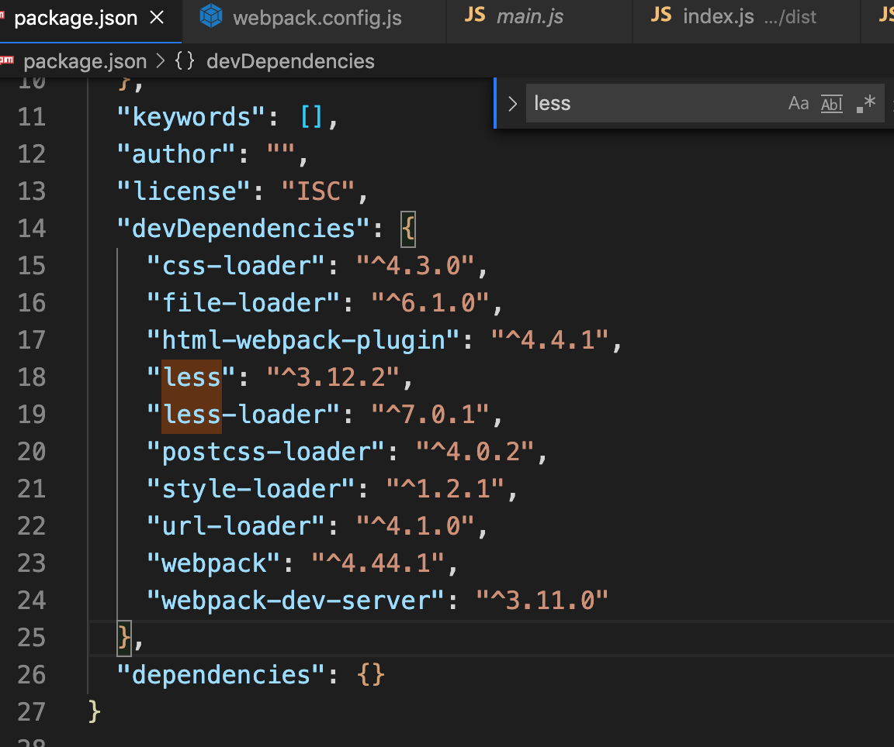

localhost 找不到

switchhost 没关闭

Cannot use [chunkhash] 

Cannot use [chunkhash] or [contenthash] for chunk in '[name]_[chunkhash:8].js' (use [hash] instead)

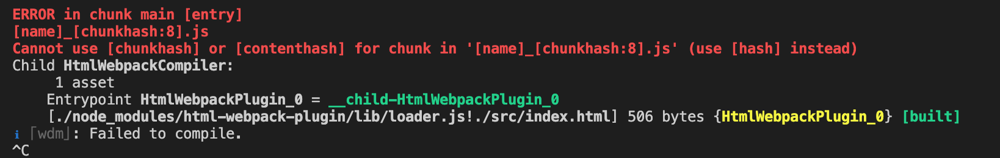

原因:

```
output: {
        path: path.resolve(__dirname, 'dist'),
        filename: '[name]_[chunkhash:8].js'
        // filename: '[name]_[hash:8].js'
    },
```

`nrm`的安装使用

作用：提供了一些最常用的NPM包镜像地址，能够让我们快速的切换安装包时候的服务器地址；
什么是镜像：原来包刚一开始是只存在于国外的NPM服务器，但是由于网络原因，经常访问不到，这时候，我们可以在国内，创建一个和官网完全一样的NPM服务器，只不过，数据都是从人家那里拿过来的，除此之外，使用方式完全一样；

1. 运行`npm i nrm -g`全局安装`nrm`包；
2. 使用`nrm ls`查看当前所有可用的镜像源地址以及当前所使用的镜像源地址；
3. 使用`nrm use npm`或`nrm use taobao`切换不同的镜像源地址；

> 注意： nrm 只是单纯的提供了几个常用的 下载包的 URL地址，并能够让我们在 这几个 地址之间，很方便的进行切换，但是，我们每次装包的时候，使用的 装包工具，都是  npm

在网页中会引用哪些常见的静态资源？

- JS

- .js  .jsx  .coffee  .ts（TypeScript  类 C# 语言）

- CSS

- .css  .less   .sass  .scss

- Images

- .jpg   .png   .gif   .bmp   .svg

- 字体文件（Fonts）

- .svg   .ttf   .eot   .woff   .woff2

- 模板文件

- .ejs   .jade  .vue【这是在webpack中定义组件的方式，推荐这么用】

**网页中引入的静态资源多了以后有什么问题？？？**

1. 网页加载速度慢， 因为 我们要发起很多的二次请求；
2. 要处理错综复杂的依赖关系

**如何解决上述两个问题**

1. 合并、压缩、精灵图、图片的Base64编码
2. 可以使用之前学过的requireJS、也可以使用webpack可以解决各个包之间的复杂依赖关系；

webpack 是前端的一个项目构建工具，它是基于 Node.js 开发出来的一个前端工具；

本质上，*webpack* 是一个现代 JavaScript 应用程序的*静态模块打包器(module bundler)*。当 webpack 处理应用程序时，它会递归地构建一个*依赖关系图(dependency graph)*，其中包含应用程序需要的每个模块，然后将所有这些模块打包成一个或多个 *bundle*。

**如何完美实现上述的2种解决方案**

1. 使用Gulp， 是基于 task 任务的；小巧灵活
2. 使用Webpack， 是基于整个项目进行构建的；

- 借助于webpack这个前端自动化构建工具，可以完美实现资源的合并、打包、压缩、混淆等诸多功能。
- 根据官网的图片介绍webpack打包的过程。
- [webpack官网](http://webpack.github.io/)

#### 报错1

// Cannot use [chunkhash] or [contenthash] for chunk in '[name].[contenthash:8].js' (use [hash] instead)

 filename: '[name].[contenthash:8].js'

热替换影响了chunkhash的使用，你要确保hotModuleReplacementPlugin(）函数没在生产环境下执行，


### 2.`filename` 和 `chunkFilename` 的区别

https://juejin.cn/post/6844904007362674701#heading-2

### 3.`webpackPrefetch`、`webpackPreload` 和 `webpackChunkName` 到底是干什么的？

https://juejin.cn/post/6844904007362674701#heading-6

##### 一句话总结：

`webpackChunkName` 是为预加载的文件取别名，`webpackPrefetch` 会在浏览器闲置下载文件，`webpackPreload` 会在父 chunk 加载时并行下载文件。

### 4.[`hash`、`chunkhash`、`contenthash` 有什么不同](https://juejin.cn/post/6844904007362674701#heading-10)

##### hash

hash 计算是跟整个项目的构建相关，我们做一个简单的 demo。

沿用案例 1 的 demo 代码，文件目录如下：

```
src/
├── index.css
├── index.html
├── index.js
└── utils.js
```

webpack 的核心配置如下（省略了一些 module 配置信息）：

```js
{
    entry: {
        index: "../src/index.js",
        utils: '../src/utils.js',
    },
    output: {
        filename: "[name].[hash].js",  // 改为 hash
    },
    ......
    plugins: [
        new MiniCssExtractPlugin({
            filename: 'index.[hash].css' // 改为 hash
        }),
    ]
}
```

生成的文件名如下：


我们可以发现，生成文件的 hash 和项目的构建 hash 都是一模一样的。


##### chunkhash

因为 hash 是项目构建的哈希值，项目中如果有些变动，hash 一定会变，比如说我改动了 utils.js 的代码，index.js 里的代码虽然没有改变，但是大家都是用的同一份 hash。hash 一变，缓存一定失效了，这样子是没办法实现 CDN 和浏览器缓存的。

chunkhash 就是解决这个问题的，它根据不同的入口文件(Entry)进行依赖文件解析、构建对应的 chunk，生成对应的哈希值。

我们再举个例子，我们对 utils.js 里文件进行改动：

```js
export function square(x) {
    return x * x;
}

// 增加 cube() 求立方函数
export function cube(x) {
    return x * x * x;
}
```

然后把 webpack 里的所有 hash 改为 chunkhash：

```js
{
    entry: {
        index: "../src/index.js",
        utils: '../src/utils.js',
    },
    output: {
        filename: "[name].[chunkhash].js", // 改为 chunkhash
    },
          
    ......
    
    plugins: [
        new MiniCssExtractPlugin({
            filename: 'index.[chunkhash].css' // // 改为 chunkhash
        }),
    ]
}
```

构建结果如下：


我们可以看出，chunk 0 的 hash 都是一样的，chunk 1 的 hash 和上面的不一样。

假设我又把 utils.js 里的 cube() 函数去掉，再打包：


对比可以发现，只有 chunk 1 的 hash 发生变化，chunk 0 的 hash 还是原来的。

##### contenthash

我们更近一步，index.js 和 index.css 同为一个 chunk，如果 index.js 内容发生变化，但是 index.css 没有变化，打包后他们的 hash 都发生变化，这对 css 文件来说是一种浪费。如何解决这个问题呢？

contenthash 将根据资源内容创建出唯一 hash，也就是说文件内容不变，hash 就不变。

我们修改一下 webpack 的配置：

```js
{
    entry: {
        index: "../src/index.js",
        utils: '../src/utils.js',
    },
    output: {
        filename: "[name].[chunkhash].js",
    },
    ......
    plugins: [
        new MiniCssExtractPlugin({
            filename: 'index.[contenthash].css' // 这里改为 contenthash
        }),
    ]
}
```

我们对 index.js 文件做了 3  次修改（就是改了改 log 函数的输出内容，过于简单就先不写了），然后分别构建，结果截图如下：

略。。。

我们可以发现，css 文件的 hash 都没有发生改变。


图片的文件指纹设置

设置file-loader的name，使用hash。

占位符名称及含义

- ext   资源后缀名
- name   文件名称
- path   文件的相对路径
- folder  文件所在的文件夹
- contenthash  文件的内容hash，默认是md5生成
- hash     文件内容的hash，默认是md5生成
- emoji     一个随机的指代文件内容的emoj

```js
const path = require('path');

module.exports = {
    entry: './src/index.js',
    output: {
        filename:'bundle.js',
        path:path.resolve(__dirname, 'dist')
    },
    module:{
        rules:[{
            test:/\.(png|svg|jpg|gif)$/,
            use:[{
                loader:'file-loader',
                options:{
                    name:'img/[name][hash:8].[ext]'
                }
            }]
        }]
    }
}
```

##### 一句话总结：

hash 计算与整个项目的构建相关；

chunkhash 计算与同一 chunk 内容相关；

contenthash 计算与文件内容本身相关。

##### HashedModuleIdsPlugin

原因是 module identifier，因为 index 新引入的模块改变了以后所有模块的 id 值，所以 detail 文件中引入的模块 id 值发生了改变，于是 detail 的 chunkhash 也随着发生改变。

不用怕，webpack已经提供方案了，解决方案是将默认的数字 id 命名规则换成路径的方式。webpack 4 中当 mode 为 development 会默认启动，但是production环境还是默认的id方式，webpack也提供了相应的plugin来解决这个问题

```
plugins: [
    new webpack.HashedModuleIdsPlugin(),
],
```

加上这个plugin后，再走一遍上述代码的变更，你会发现第一次、第二次的变更后，detail的hash串仍然没有变化，符合预期。

作者：飞翔的大象
链接：https://juejin.cn/post/6850418120436711432
来源：稀土掘金
著作权归作者所有。商业转载请联系作者获得授权，非商业转载请注明出处。


作者：卤蛋实验室
链接：https://juejin.cn/post/6844904007362674701
来源：掘金
著作权归作者所有。商业转载请联系作者获得授权，非商业转载请注明出处。

## 一、基础

### webpack安装

1. 运行`npm i webpack -g`全局安装webpack，这样就能在全局使用webpack的命令
2. 在项目根目录中运行`npm i webpack --save-dev`安装到项目依赖中  本地安装

**初步使用webpack打包构建列表隔行变色案例**

1. 运行`npm init`初始化项目，使用npm管理项目中的依赖包
2. 创建项目基本的目录结构
3. 使用`cnpm i jquery --save`安装jquery类库
4. 创建`main.js`并书写各行变色的代码逻辑：

```
	// 导入jquery类库
    import $ from 'jquery'

    // 设置偶数行背景色，索引从0开始，0是偶数
    $('#list li:even').css('backgroundColor','lightblue');
    // 设置奇数行背景色
    $('#list li:odd').css('backgroundColor','pink');
```

5. 直接在页面上引用`main.js`会报错，因为浏览器不认识`import`这种高级的JS语法，需要使用webpack进行处理，webpack默认会把这种高级的语法转换为低级的浏览器能识别的语法；

    刚才运行的命令格式：    webpack  要打包的文件的路径  打包好的输出文件的路径

6. 运行`webpack 入口文件路径 输出文件路径`对`main.js`进行处理：

```
webpack src/js/main.js dist/bundle.js
```


二、简化打包命令

使用webpack的配置文件简化打包时候的命令

1. 在项目根目录中创建`webpack.config.js`
2. 由于运行webpack命令的时候，webpack需要指定入口文件和输出文件的路径，所以，我们需要在`webpack.config.js`中配置这两个路径：

```js
    // 导入处理路径的模块
    var path = require('path');
    // 导出一个配置对象，将来webpack在启动的时候，会默认来查找webpack.config.js，并读取这个文件中导出的配置对象，来进行打包处理
    module.exports = {
        entry: path.resolve(__dirname, 'src/js/main.js'), // 项目入口文件
        output: { // 配置输出选项
            path: path.resolve(__dirname, 'dist'), // 配置输出的路径
            filename: 'bundle.js' // 配置输出的文件名
        }
    }
```

// 当我们在 控制台，直接输入 webpack 命令执行的时候，webpack 做了以下几步：

1. 首先，webpack 发现，我们并没有通过命令的形式，给它指定入口和出口
2. webpack 就会去 项目的 根目录中，查找一个叫做 `webpack.config.js` 的配置文件
3. 当找到配置文件后，webpack 会去解析执行这个 配置文件，当解析执行完配置文件后，就得到了 配置文件中导出的配置对象；
4. 当 webpack 拿到 配置对象后，就拿到了 配置对象中，指定的 入口  和 出口，然后进行打包构建；


### config可以为数组

在上一课时中我们也提到过，Webpack 的配置文件除了可以导出一个配置对象，还可以导出一个数组，数组中每一个元素就是一个单独的打包配置，那这样就可以在一次打包过程中同时执行多个打包任务。

例如，我们这里导出一个数组，然后在这个数组中添加两个打包配置，它们的 entry 都是 src 中的 main.js，不过它们输出的文件名不同，具体代码如下：

复制代码

```java
// ./webpack.config.js

module.exports = [

  {

    entry: './src/main.js',

    output: {

      filename: 'output1.js'

    }

  },

  {

    entry: './src/main.js',

    output: {

      filename: 'output2.js'

    }

  }

]
```

这么配置的话，再次打包就会有两个打包子任务工作，我们的 dist 中生成的结果也就是两个文件，具体结果如下：


了解了 Webpack 这种配置用法过后，我们再次回到配置文件中，遍历刚刚定义的数组，为每一个模式单独创建一个打包配置，这样就可以一次性生成所有模式下的不同结果，这比我们一个一个去试验的效率更高，而且对比起来也更明显。

### mode

$ npx webpack --mode=production

，我们再次运行 Webpack 打包，不过这一次我们不再使用 production 模式，而是使用 none，也就是不开启任何内置功能和插件

$ npx webpack --mode=none

### entry


### output

```
output: {
	path: path.join(__dirname, '../', 'dist'),
	filename:
		NODE_ENV === 'production'
			? '[name].[contenthash:10].js'
			: '[name].[hash:10].js',
	publicPath: '/assets/',
},
```

#### path

#### filename

#### [publicPath](https://webpack.docschina.org/configuration/output/#outputpublicpath)

> 为项目中的所有资源指定一个基础路径，它被称为公共路径(publicPath)。

而关于如何应用该路径并没有说清楚...

其实这里说的所有资源的基础路径是指项目中引用css，js，img等资源时候的一个基础路径，这个基础路径要配合具体资源中指定的路径使用，所以其实打包后资源的访问路径可以用如下公式表示：

```text
静态资源最终访问路径 = output.publicPath + 资源loader或插件等配置路径
```

总而言之， *`devServer.publicPath`* 的意义就是**决定外部能以怎样的路径通过 devServer来访问构建在内存中的文件**，这个字段未显式设定时，则会去沿用 `output.publicPath` 字段的显式值（如果有的话，否则就用自己的 `default` 值）。*`output.publicPath`* 的意义是**用来为构建的文件生成满足特定需求的前缀，并将这个前缀提供给需要的 resolver、plugin 或者其他的配置字段**。


作者：YeLqgd
链接：https://www.jianshu.com/p/7d43d45b3ebf 来源：简书

#### library

关于libraryTarget和library的配置关系

实际上，在做library打包的时候是，`libraryTarget`和`library`是有一定的关系的，需要配合使用

- `library`作为核心，代表要生成一个全局变量
- `libraryTarget`意思是这个全局变量挂在哪里，如果是`umd`，那么二者是没有关系的，如果是`this`,就代表我们的库不再支持AMD,commonJS,esm等模块形式，而是将全局变量注入到全局的this上面。其中`libraryTarget`可以取值`umd`、`this`、`window`、`global`(nodeJs下)等值，一般我们在封装一个库的时候，会选择`umd`

关于`libraryTarget`和`library`，其实其内容也是比较多的，这里我们只做简单的介绍，如果你的真的需要去打包这样的库的话，再去翻阅相关资料

作者：喜剧之王爱创作
链接：https://www.jianshu.com/p/d3194d82bdfb
来源：简书
著作权归作者所有。商业转载请联系作者获得授权，非商业转载请注明出处。

#### libraryTarget

### loader

配置模块处理规则，读取、解析规则。

loader 可以将文件从不同的语言（如 TypeScript）转换为 JavaScript，或将内联图像转换为 data URL。loader 甚至允许你直接在 JavaScript 模块中 `import` CSS文件！

*loader* 让 webpack 能够去处理那些非 JavaScript 文件（webpack 自身只理解 JavaScript）。loader 可以将所有类型的文件转换为 webpack 能够处理的有效[模块](https://www.webpackjs.com/concepts/modules)，然后你就可以利用 webpack 的打包能力，对它们进行处理。

本质上，webpack loader 将所有类型的文件，转换为应用程序的依赖图（和最终的 bundle）可以直接引用的模块。

file-loader url-loader babel-loader ts-loader eslint-loader thread-loader多进程

#### 打包css文件

lInk因为css文件，会发起二次请求。

1. 运行`cnpm i style-loader css-loader --save-dev`
2. 修改`webpack.config.js`这个配置文件：

```
module: { // 用来配置第三方loader模块的
        rules: [ // 文件的匹配规则
            { test: /\.css$/, use: ['style-loader', 'css-loader'] }//处理css文件的规则
        ]
    }
```

3. 注意：`use`表示使用哪些模块来处理`test`所匹配到的文件；`use`中**相关loader模块的调用顺序是从后向前调用的；**

顺序

注：1.遇到后缀为.css的文件，webpack先用css-loader加载器去解析这个文件，遇到“@import”等语句就将相应样式文件引入（所以如果没有css-loader，就没法解析这类语句），最后计算完的css，将会使用style-loader生成一个内容为最终解析完的css代码的style标签，放到head标签里。

​       2.loader是有顺序的，webpack肯定是先将所有css模块依赖解析完得到计算结果再创建style标签。因此应该把style-loader放在css-loader的前面（webpack loader的执行顺序是从右到左）。

作者：dayindayout

链接：https://www.jianshu.com/p/cbd3375e2575


#### 打包less文件

1. 运行`cnpm i less-loader less -D`
2. 修改`webpack.config.js`这个配置文件：

```
{ test: /\.less$/, use: ['style-loader', 'css-loader', 'less-loader'] },
```

#### 打包sass文件

1. 运行`cnpm i sass-loader node-sass --save-dev`
2. 在`webpack.config.js`中添加处理sass文件的loader模块：
3. 数组中顺序不能变

```
{ test: /\.scss$/, use: ['style-loader', 'css-loader', 'sass-loader'] }
```

#### JS ts

- TypeScript: 3.6.3+
- webpack: 5.x+ (please use `ts-loader` 8.x if you need webpack 4 support)
- node: 12.x+

```
npm i ts-loader@8.2.0 -d
```

配置tsconfig文件

起初只配置如下

```json
{
  "compilerOptions": {
    "sourceMap": true
  }
}
```

但会报错

Uncaught Error: Module parse failed: Unexpected token (5:12)
File was processed with these loaders:
 * ./node_modules/ts-loader/index.js

react You may need an additional loader to handle the result of these loader

然后照着webpack官网tsconfig.json进行配置，报错消失

https://webpack.js.org/guides/typescript/#root

```
{
  "compilerOptions": {
    "sourceMap": true,
    "outDir": "./dist/",
    "noImplicitAny": true,
    "module": "es6",
    "target": "es5",
    "jsx": "react",
    "allowJs": true,
    "moduleResolution": "node"
  }
}
```

TS7026: JSX element implicitly has type 'any' because no interface 'JSX.IntrinsicElements' exists.

```
[tsl] ERROR in /Users/wangshihao/Desktop/github/reactByWebpack/src/pages/index/home/index.tsx(1,19)
      TS7016: Could not find a declaration file for module 'react'. '/Users/wangshihao/Desktop/github/reactByWebpack/node_modules/react/index.js' implicitly has an 'any' type.
  Try `npm i --save-dev @types/react` if it exists or add a new declaration (.d.ts) file containing `declare module 'react';`
```


npm i --save-dev @types/react

```
 TS1259: Module '"/Users/wangshihao/Desktop/github/reactByWebpack/node_modules/@types/react/index"' can only be default-imported using the 'allowSyntheticDefaultImports' flag
```

https://zhuanlan.zhihu.com/p/29022311

```
入坑angular之后，遇到的坑之一：
使用蚂蚁的这里例子可用 nzDisabledDate 和 nzDisabledTime 分别禁止选择部分日期和时间报错。
具体报错信息如下：
Module '"date-fns/difference_in_calendar_days"' can only be default-imported using the 'allowSyntheticDefaultImports' flag
解决方案：
将原来直接引入：import differenceInCalendarDays from 'date-fns/difference_in_calendar_days';
改为 import * as differenceInCalendarDays from 'date-fns/difference_in_calendar_days';

 import * as differenceInCalendarDays from ‘date-fns/difference_in_calendar_days’;
以上会将若干export导出的内容组合成一个对象返回；而以下只会导出这个默认的对象作为一个对象；

 import differenceInCalendarDays from 'date-fns/difference_in_calendar_days’; 
非常感谢，最后附上参考地址：http://www.imooc.com/article/283589
```

因为需要这样导入 React：

```js
import * as React from 'react'
```

而 JavaScript 下是这样写的：

```js
import React from 'react'
```

感觉上 TypeScript 的写法很不自然，但其实在 tsconfig.json 里面添加一行配置就能恢复以前的自然感了

```json
allowSyntheticDefaultImports: "true" // 允许对不包含默认导出的模块使用默认导入。这个选项不会影响生成的代码，只会影响类型检查。
```

@types/react/index.d.ts

```
export = React;
export as namespace React;
declare namespace React {
	type Ref<T> = RefCallback<T> | RefObject<T> | null;
	type Key = string | number;
  interface ReactElement<P = any, T extends string | 	JSXElementConstructor<any> = string | JSXElementConstructor<any>> {
        type: T;
        props: P;
        key: Key | null;
    }
    function createElement(...略)
    function cloneElement<P
}
```


##### 资料

https://www.kancloud.cn/xiaoxina/ts-tutorial/1647475

[精读《@types react 值得注意的 TS 技巧》](https://zhuanlan.zhihu.com/p/129632306)

[深入理解TypeScript](https://jkchao.github.io/typescript-book-chinese/typings/ambient.html#%E5%A3%B0%E6%98%8E%E6%96%87%E4%BB%B6)


####  打包图片路径

使用webpack处理css中的路径

1. 运行`cnpm i url-loader file-loader --save-dev`
2. 在`webpack.config.js`中添加处理url路径的loader模块：

```
{ test: /\.(png|jpg|gif)$/, use: 'url-loader' }
```

3. **可以通过`limit`指定进行base64编码的图片大小；只有小于指定字节（byte）的图片才会进行base64编码：**

**可以减少二次请求，小图片转成base64,大图片不需要**

当引用图片大小 大于或等于limit大小时，

则不会被转为base64格式的字符串， 图片的url地址为真实的路径。如果 图片小于给定的 limit 值，则会被转为 base64的字符串

```
{ test: /\.(png|jpg|gif)$/, use: 'url-loader?limit=43960' },
```

```
 { test: /\.(jpg|png|gif|bmp|jpeg)$/, use: 'url-loader?limit=7631&name=[hash:8]-[name].[ext]' }, 
```

`[name].[ext]`

name为原图片的名字。

[ext] 结尾与原图片后缀名相同。


```js
rules: [
            {
                test: /\.(png|jpe?g|gif)$/,
                use: {
                    loader: "url-loader",
                    options: {
                        name: "[name]_[hash].png",
                        outputPath: "images/",
                        limit: 1024
                    }
                }
            }
        ]
```

指定静态文件输入地址。

```js
 {
     test: /\.(png|gif|jpe?g)$/,
     use: [{
         loader:'url-loader',
         options:{
           	limit:10000,
         		outputPath:'static/images'
         }
     }]
 }
```

子组件通过Vue的自定义属性:src使用图片，

```js
<template>
    <div class="wrap">这是HOME页
        
    </div>

</template>
<script>
import image from '../../../static/01.jpg'
export default {
    data(){
        return{
            image
        }
    }
}
</script>
```

打包字体

```js
{ test: /\.(ttf|eot|svg|woff|woff2)$/, use: 'url-loader' }, // 处理 字体文件的 loader 
```


#### ❤实现一个loader

this不能是箭头函数

```js
module.exports = function(source) {
	console.log(this.query) // 即配置对象
  return source.replace("kkb", "word");
};
```

1小时04分

loader的配置选项option如何获取

```
{name: 'kkb'}
```


```js
const loaderUtils = require("loader-utils");
module.exports = function(source) {
  const options = loaderUtils.getOptions(this);
  
  //定义一个异步处理，告诉webpack,这个loader里有异步事件,在里面调用下这个异步
  const callback = this.async();
  setTimeout(() => {
    const result = source.replace("webpack", options.name);
    callback(null, result);
  }, 100);
};
```


```JS
const path = require("path");
const CopyrightWebpackPlugin = require("./plugins/copyright-webpack-plugin");

module.exports = {
  mode: "development",
  entry: {
    main: "./index.js"
  },
  output: {
    path: path.resolve(__dirname, "dist"),
    filename: "[name].js"
  },
  resolveLoader: {
    // loader的名字不需要叫.js，优先从node_modules找这俩loader，./loader其次
    modules: ["node_modules", "./loader"]
  },
  module: {
    // 从后向前
    rules: [
      {
        test: /\.js$/,
        use: [
          {
            loader: "replaceLoader"
          },
          {
            loader: "replaceLoaderAsync",
            options: {
              name: "kkb"
            }
          }
        ]
      }
    ]
  },
  plugins: [
    new CopyrightWebpackPlugin({
      name: "开课吧"
    })
  ]
};

```

##### less-loader

```js
//loader/less-loader
const less = require("less");
function loader(source) {
  const callback = this.async();
  less.render(source, function (err, res) {
    let { css } = res;
    callback(null, css);
  });
}
module.exports = loader;
```

##### Source Map

```
有些时候，除了将原内容转换返回之外，还需要返回原内容对应的Source Map，比如我们转换less和scss代码，以及babel-loader转换ES6代码，为了方便调试，需要将Source Map也一起随着内容返回。
//loader/less-loader
const less = require("less");
function loader(source) {
  const callback = this.async();
  less.render(source,{sourceMap: {}}, function (err, res) {
    let { css, map } = res;
    callback(null, css, map);
  });
}
module.exports = loader;
复制代码
　　这样我们在下一个loader就能接收到less-loader返回的sourceMap了，但是需要注意的是：

Source Map生成很耗时，通常在开发环境下才会生成Source Map，其它环境下不用生成。Webpack为loader提供了this.sourceMap这个属性来告诉loader当前构建环境用户是否需要生成Source Map。

作者：谢小飞
链接：https://juejin.cn/post/6888936770692448270
来源：稀土掘金
著作权归作者所有。商业转载请联系作者获得授权，非商业转载请注明出处。
```

##### resolveLoader

我们可以在loader中配置本地loader的相对路径或者绝对路径，但是这样写起来比较繁琐，我们可以利用webpack提供的`resolveLoader`属性，来告诉webpack应该去哪里解析本地loader。

```js
module.exports = {
  module: {
    rules: [{
      test: /\.less/,
      use: [
        {
          loader: 'style-loader',
        },
        {
          loader: 'less-loader',
        },
      ],
    }]
  },
  resolveLoader:{
    modules: [path.resolve(__dirname, 'loader'), 'node_modules']
  }
}
复制代码
```

　　这样webpack会先去loader文件夹下找loader，没有找到才去node_modules；因此我们写的loader尽量不要和第三方loader重名，否则会导致第三方loader被覆盖加载

##### 处理参数

　　我们在配置loader时，经常会给loader传递参数进行配置，一般是通过options属性来传递的，也有像`url-loader`通过字符串来传参：

```js
{
  test: /\.(jpg|png|gif|bmp|jpeg)$/,
  use: 'url-loader?limt=1024&name=[hash:8].[ext]'
}
复制代码
```

　　webpack也提供了`query属性`来获取传参；但是`query属性`很不稳定，如果像上面的通过字符串来传参，query就返回字符串格式，通过options方式就会返回对象格式，这样不利于我们处理。因此我们借助一个官方的包`loader-utils`帮助处理，它还提供了很多有用的工具。

```js
const { 
  getOptions,
  parseQuery,
  stringifyRequest,
} = require("loader-utils");

module.exports = function (source, map) {
  //获取options参数
  const options = getOptions(this);
  //解析字符串为对象
  parseQuery("?param1=foo")
  //将绝对路由转换成相对路径
  //以便能在require或者import中使用以避免绝对路径
  stringifyRequest(this, "test/lib/index.js")
}
复制代码
```

　　常用的就是`getOptions`将处理后的参数返回出来，它内部的实现逻辑也非常的简单，也是根据`query属性`进行处理，如果是字符串的话调用`parseQuery`方法进行解析，源码如下：

```js
//loader-utils/lib/getOptions.js
'use strict';
const parseQuery = require('./parseQuery');
function getOptions(loaderContext) {
  const query = loaderContext.query;
  if (typeof query === 'string' && query !== '') {
    return parseQuery(loaderContext.query);
  }
  if (!query || typeof query !== 'object') {
    return {};
  }
  return query;
}
module.exports = getOptions;
复制代码
```

　　获取到参数后，我们还需要对获取到的`options`参数进行完整性校验，避免有些参数漏传，如果一个个判断校验比较繁琐，这就用到另一个官方包`schema-utils`：

```js
const { getOptions } = require("loader-utils");
const { validate } = require("schema-utils");
const schema = require("./schema.json");
module.exports = function (source, map) {
  const options = getOptions(this);
  const configuration = { name: "Loader Name"};
  validate(schema, options, configuration);
  //省略其他代码
}
复制代码
```

　　`validate`函数并没有返回值，打印返回值发现是`undefined`，因为如果参数不通过的话直接会抛出`ValidationError`异常，直接进程中断；这里引入了一个`schema.json`，就是我们对`options``中参数进行校验的一个json格式的对应表：

```json
{
    "type": "object",
    "properties": {
        "source": {
            "type": "boolean"
        },
        "name": {
            "type": "string"
        },
    },
    "additionalProperties": false
}
复制代码
```

　　`properties`中的健名就是我们需要检验的`options`中的字段名称，`additionalProperties`代表了是否允许`options`中还有其他额外的属性。

作者：谢小飞
链接：https://juejin.cn/post/6888936770692448270
来源：稀土掘金
著作权归作者所有。商业转载请联系作者获得授权，非商业转载请注明出处。

##### markdown-loader

```js
const marked = require('marked');

// module.exports = source => {
module.exports = function(source) {
    console.log('this', this); // source # About 王石浩 this is a markdown file.
    console.log('source', source); // source # About 王石浩 this is a markdown file.
    // return 'hello loader ~'
    // return 'console.log("hello loader ~")' // 这段代码会

// 方法1 只用markdown-loader 处理
//      // 1. 将 markdown 转换为 html 字符串
//   const html = marked(source)
  // html => '<h1>About</h1><p>this is a markdown file.</p>'
  // 2. 将 html 字符串拼接为一段导出字符串的 JS 代码
//   const code = `module.exports = ${JSON.stringify(html)}`
//   return code 
//   // code => 'export default "<h1>About</h1><p>this is a markdown file.</p>"'


    // 方法2 生成的html，交由html-loader进行处理

    const html = marked(source);
    // console.log('html: ', html); 
    // html:  <h1 id="about">About</h1>
    // {/* <p>王石浩 this is a markdown file.</p> */}
    return html;
}
```


### plugins

#### html-webpack-plugin

插件配置启动页面

由于使用`--contentBase`指令的过程比较繁琐，需要指定启动的目录，同时还需要修改index.html中script标签的src属性，所以推荐大家使用`html-webpack-plugin`插件配置启动页面.

 <!-- 当使用 html-webpack-plugin 之后，我们不再需要手动处理 bundle.js 的引用路径了，因为 这个插件，已经帮我们自动 创建了一个 合适的 script , 并且，引用了 正确的路径 -->

  <!-- <script src="/bundle.js"></script> -->

1. 运行`cnpm i html-webpack-plugin --save-dev`安装到开发依赖
2. 修改`webpack.config.js`配置文件如下：

```js
    // 导入处理路径的模块
    var path = require('path');
    // 导入自动生成HTMl文件的插件
    var htmlWebpackPlugin = require('html-webpack-plugin');

    module.exports = {
        entry: path.resolve(__dirname, 'src/js/main.js'), // 项目入口文件
        output: { // 配置输出选项
            path: path.resolve(__dirname, 'dist'), // 配置输出的路径
            filename: 'bundle.js' // 配置输出的文件名
        },
        plugins:[ // 添加plugins节点配置插件
            new htmlWebpackPlugin({ // 创建一个 在内存中 生成 HTML  页面的插件
                template:path.resolve(__dirname, 'src/index.html'),//// 指定 模板页面，将来会根据指定的页面路径，去生成内存中的 页面
                filename:'index.html'//自动生成的HTML文件的名称
            })
        ]
    }
```

3. 修改`package.json`中`script`节点中的dev指令如下：

```
"dev": "webpack-dev-server"
```

4. 将index.html中script标签注释掉，因为`html-webpack-plugin`插件会自动把bundle.js注入到index.html页面中！

#### 插件汇总：

webpack有一个丰富的插件界面。webpack中的大部分功能都使用这个插件接口。这使得webpack变得**灵活**。


| Name                          | 描述                                                         |                      |
| :---------------------------- | :----------------------------------------------------------- | -------------------- |
| AggressiveSplittingPlugin     | 将原始块分割成更小的块                                       |                      |
| BabelMinifyWebpackPlugin      | 用babel-minify缩小                                           |                      |
| BannerPlugin                  | 将横幅添加到每个生成的块的顶部                               |                      |
| CleanWebpackPlugin            | 在为生产环境编译文件的时候，先把 `build或dist` (就是放生产环境用的文件) 目录里的文件先清除干净，再生成新的。 | clean-webpack-plugin |
| CommonsChunkPlugin            | 提取块之间共享的通用模块                                     |                      |
| ComponentWebpackPlugin        | 在webpack中使用组件                                          |                      |
| CompressionWebpackPlugin      | 准备资源的压缩版本以通过Content-Encoding为其提供服务         |                      |
| ContextReplacementPlugin      | 覆盖需求表达式的推断上下文                                   |                      |
| DefinePlugin                  | 允许在编译时配置全局常量                                     |                      |
| DllPlugin                     | 拆分包以显着提高构建时间                                     |                      |
| EnvironmentPlugin             | 在process.env键上使用DefinePlugin的简写                      |                      |
| ExtractTextWebpackPlugin      | 从捆绑文件中提取文本（CSS）到单独的文件中                    |                      |
| HotModuleReplacementPlugin    | 启用热模块更换（HMR）                                        |                      |
| HtmlWebpackPlugin             | 轻松创建HTML文件来为您的软件包提供服务                       |                      |
| I18nWebpackPlugin             | 将i18n支持添加到您的软件包                                   |                      |
| IgnorePlugin                  | 从捆绑中排除某些模块                                         |                      |
| LimitChunkCountPlugin         | 设置分块的最小/最大限制以更好地控制分块                      |                      |
| LoaderOptionsPlugin           | 用于从webpack 1迁移到2                                       |                      |
| MinChunkSizePlugin            | 保持块大小超过指定的限制                                     |                      |
| NoEmitOnErrorsPlugin          | 出现编译错误时跳过发射阶段                                   |                      |
| NormalModuleReplacementPlugin | 替换与正则表达式匹配的资源                                   |                      |
| NpmInstallWebpackPlugin       | 在开发过程中自动安装缺失的依赖项                             |                      |
| ProvidePlugin                 | 使用模块而不必使用import / require                           |                      |
| SourceMapDevToolPlugin        | 对源地图进行更精细的控制                                     |                      |
| UglifyjsWebpackPlugin         | 启用对项目中UglifyJS版本的控制                               |                      |
| ZopfliWebpackPlugin           | 使用node-zopfli准备压缩版本的资产                            |                      |

有关更多第三方插件，请参阅[awesome-webpack中](https://github.com/webpack-contrib/awesome-webpack#webpack-plugins)的列表。


##### AggressiveSplittingPlugin

`AggressiveSplittingPlugin` 可以将 bundle 拆分成更小的 chunk，直到各个 chunk 的大小达到 `option` 设置的 `maxSize`。它通过目录结构将模块组织在一起。

它记录了在 webpack 记录里的分离点，并尝试按照它开始的方式还原分离。这确保了在更改应用程序后，旧的分离点（和 chunk）是可再使用的，因为它们可能早已在客户端的缓存中。因此强烈推荐使用记录。

仅有在 chunk 超过规定的 `minSize` 时才会保存在记录里。可以确保 chunk 随着应用程序的增加而增加，而不是每次改变的时候创建很多的 chunk。

如果模块更改，chunk 可能会无效。无效 chunk 中的模块会回到模块池(module pool)中，会同时创建一个新的模块。

```javascript
new webpack.optimize.AggressiveSplittingPlugin(options)
```

选项

```javascript
{
  minSize: 30000, //Byte, split point. Default: 30720
  maxSize: 50000, //Byte, maxsize of per file. Default: 51200
  chunkOverhead: 0, //Default: 0
  entryChunkMultiplicator: 1, //Default: 1
}
```

例子

[http2-aggressive-splitting](https://github.com/webpack/webpack/tree/master/examples/http2-aggressive-splitting)


##### jarvis

通过浏览器展示结果，它能收集webpack编译或者运行阶段的信息。

https://blog.csdn.net/achenyuan/article/details/80871055

##### speed-measure-webpack-plugin

`speed-measure-webpack-plugin`：简称 SMP，分析出 Webpack 打包过程中 Loader 和 Plugin 的耗时，有助于找到构建过程中的性能瓶颈。

https://juejin.cn/post/6887863430510968839#heading-1

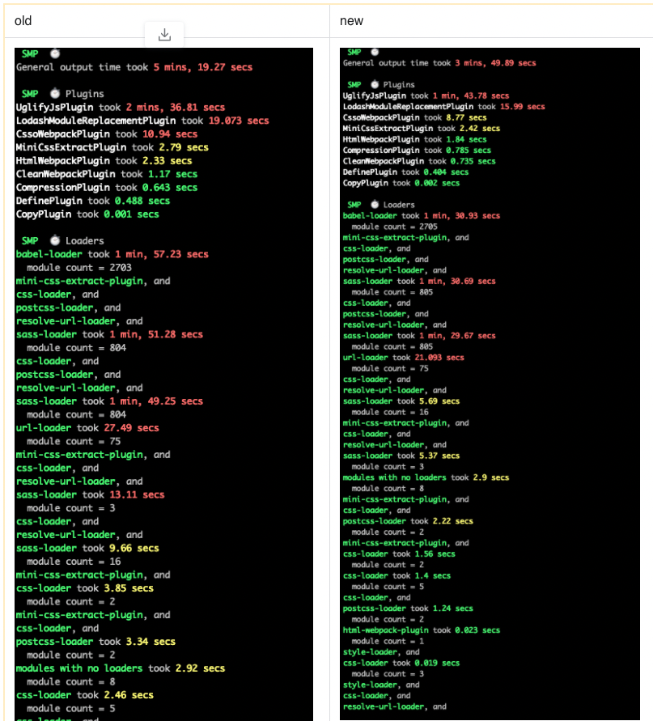


###### taro中引入speed-mearsure-webpack-plugin

https://mp.weixin.qq.com/s/Z79QhAlP8tBQn3mXQ11byQ

taro/packages/taro-mini-runner/src/index.ts

**3. 速度优化，耗时缩短至三分之一****—**

我们已经了解了 Taro 生成的 webpack 配置，也掌握了修改这些配置的方法，接下来就是考虑修改 webpack 配置，来优化编译打包速度。我这里是引入了 `speed-measure-webpack-plugin`。该插件可以统计出编译打包过程中，plugin 和 loader 的耗时情况，可以帮助我们明确优化方向。


###### taro

1. 整体 5.6G
2. .git blob 二进制对象有 4.6G
3. 依赖包 node_modules 有784M
4. src 仅有17M

主要步骤如下：安装依赖包 + 构建产物

1. 之前因为无百度的npm源，所以在agile机器上编译缓慢，因此维护了一个node_modules.tar.gz，每次在构建流水线上花大量时间在解压缩上
2. 后来有百度的npm源之后，改成了 prepare_build_env 函数，每次通过install安装依赖包

```
// 安装依赖包function prepare_build_env() {    export PATH=$NODEJS_BIN_LATEST:$PATH

    echo "this is build-env: $BUILDENV"
    npm config set registry http://registry.npm.baidu-int.com    npm install    echo "finish swan: prepare_build_env"}

// build构建产物npm run build:h5_$1
```


##### webpack-dashboard

```
  "scripts": {
    "start": "webpack-dashboard -- webpack-dev-server  --env development --config config/webpack.config.js"
  },
```

下方为错误配置

```
  "scripts": {
    "start": "webpack-dev-server  webpack-dashboard --env development --config config/webpack.config.js"
  },
```


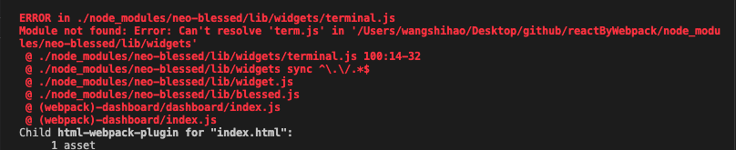

### module


### devtool(source-map)

sourse-map(源代码地图) ，里面都有个 map 了，肯定是映射的意思。sourse-map 就是一份**源码和转换后代码的映射文件**。具体的原理内容较多，感兴趣的同学可以自行搜索，我这里就不多言了。 


如果再仔细看一下，就发现这 13 种大部分都是 `eval`、`cheap`、`inline` 和 `module`这 4 个词排列组合的，我做了个简单的表格，比官网上直白多了：

| 参数                         | 参数解释                                                     |
| ---------------------------- | ------------------------------------------------------------ |
| eval                         | 打包后的模块都使用 `eval()` 执行，行映射可能不准；不产生独立的 map 文件 速度最快 |
| cheap                        | map 映射只显示行不显示列，忽略源自 loader 的 source map  较快 |
| inline                       | 将.map作为DataURI嵌入,映射文件以 base64 格式编码，加在 bundle 文件最后，不产生独立的 map 文件 |
| module                       | 增加对 loader source map 和第三方模块的映射                  |
|                              |                                                              |
| source-map                   | 产出.map文件                                                 |
| cheap-sourse-map             | cheap，就是廉价的意思，它不会产生列映射，相应的体积会小很多，我们和 sourse-map 的打包结果比一下，只有原来的 1/4 。 |
| eval-source-map              | 每一个模块在执行eval()过程之后，并且会为每一个模块生成sourcemap文件，生成的sourcemap文件通过DataURL的方式添加 |
| inline-source-map            | 映射文件以 base64 格式编码，加在 bundle 文件最后，不产生独立的 map 文件。加入 map 文件后，我们可以明显的看到包体积变大了； |
| cheap-eval-source-map        | 跟eval-source-map相同，唯一不同的就是增加了”cheap”，”cheap”是指忽略了行信息。这个属性同时也不会生成不同loader模块之间的sourcemap。 |
| cheap-module-eval-source-map | 与cheap-eval-source-map相同，但是包含了不同loader模块之间的sourcemap |

#### Eval 模式

首先 eval 模式，这个模式刚刚已经单独看过了，它就是将模块代码放到 eval 函数中执行，并且通过 sourceURL 标注所属文件路径，在这种模式下没有 Source Map 文件，所以只能定位是哪个文件出错

每个module会封装到 eval 里包裹起来执行，并且会在末尾追加注释 //@ sourceURL.


首先来看 eval 模式。在去具体了解 Webpack eval 模式的 Source Map 之前，我们需要先了解一下 JavaScript 中 eval 的一些特点。

eval 其实指的是 JavaScript 中的一个函数，可以用来运行字符串中的 JavaScript 代码。例如下面这段代码，字符串中的 console.log("foo~") 就会作为一段 JavaScript 代码被执行：

复制代码

```java
const code = 'console.log("foo~")'

eval(code) // 将 code 中的字符串作为 JS 代码执行
```

在默认情况下，这段代码运行在一个临时的虚拟机环境中，我们在控制台中就能够看到：


其实我们可以通过 sourceURL 来声明这段代码所属文件路径，接下来我们再来尝试在执行的 JavaScript 字符串中添加一个 sourceURL 的声明，具体操作如下：


具体就是在 eval 函数执行的字符串代码中添加一个注释，注释的格式：# sourceURL=./path/to/file.js，这样的话这段代码就会执行在指定路径下。

在了解了 eval 函数可以通过 sourceURL 指定代码所属文件路径这个特点过后，我们再来尝试使用这个叫作 eval 模式的 Source Map。

我们回到 Webpack 的配置文件中，将 devtool 属性设置为 eval，具体如下：

复制代码

```java
// ./webpack.config.js

module.exports = {

  devtool: 'eval'

}
```

然后我们回到命令行终端再次运行打包，打包过后，找到生成的 bundle.js 文件，你会发现每个模块中的代码都被包裹到了一个 eval 函数中，而且每段模块代码的最后都会通过 sourceURL 的方式声明这个模块对应的源文件路径，具体如下：


那此时如果我们回到浏览器运行这里的 bundle.js，一旦出现错误，浏览器的控制台就可以定位到具体是哪个模块中的代码，具体效果如下：


但是当你点击控制台中的文件名打开这个文件后，看到的却是打包后的模块代码，而并非我们真正的源代码，具体如下：


综上所述，在 eval 模式下，Webpack 会将每个模块转换后的代码都放到 eval 函数中执行，并且通过 sourceURL 声明对应的文件路径，这样浏览器就能知道某一行代码到底是在源代码的哪个文件中。

因为在 eval 模式下并不会生成 Source Map 文件，所以它的构建速度最快，但是缺点同样明显：它只能定位源代码的文件路径，无法知道具体的行列信息。


#### source-map

source-map 是最大而全的，会生成独立 map 文件：


注意下图光标的位置，source-map 会显示报错的**行列**信息：

会显示编辑器源代码


#### cheap-sourse-map

**cheap，就是廉价的意思，只能定位到行，而定位不到列。它不会产生列映射(自己实际打印也没有准确定位到列的位置**，而且不是源代码)，相应的体积会小很多，我们和 sourse-map 的打包结果比一下，只有原来的 1/4 。


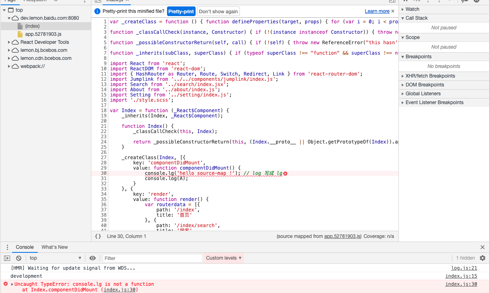

#### eval-source-map

eval-source-map 会以 eval() 函数打包运行模块，不产生独立的 map 文件，会显示报错的**行列**信息：

eval-source-map 模式除了定位文件，还可以定位具体的行列信息。相比于 eval 模式，每个module会通过eval()来执行，并且生成一个DataUrl形式的SourceMap.可以反推出源代码，具体效果如下：

**必须装有babel插件的预设才能看到具体报错的列信息。**


```js
// index.bundle.js 文件

!function(e) {
    // ......
    // 省略不重要的代码
    // ......
}([function(module, exports) {
    eval("console.lg('hello source-map !');//# sourceURL=[module]\n//# sourceMappingURL=data:application/json;charset=utf-8;base64,eyJ2ZXJzaW9uIjozLCJzb3VyY2VzIjpbIndlYnBhY2s6Ly8vLi4vc3JjL2luZGV4Mi5qcz9mNmJjIl0sIm5hbWVzIjpbImNvbnNvbGUiLCJsZyJdLCJtYXBwaW5ncyI6IkFBQUFBLE9BQU8sQ0FBQ0MsRUFBUixDQUFXLG9CQUFYIiwiZmlsZSI6IjAuanMiLCJzb3VyY2VzQ29udGVudCI6WyJjb25zb2xlLmxnKCdoZWxsbyBzb3VyY2UtbWFwICEnKSJdLCJzb3VyY2VSb290IjoiIn0=\n//# sourceURL=webpack-internal:///0\n")
}
]);
```


#### cheap-module-eval-source-map 

慢慢地我们就发现 Webpack 中这些模式的名字不是随意的，好像都有某种规律。这里就是在 cheap-eval-source-map 的基础上多了一个 module，具体效果如下图：


**这种模式同样也只能定位到行**，它的特点相比于 cheap-eval-source-map 并不明显 ，如果你没有发现差异，可以再去看看上一种模式，仔细做一个对比，相信对比之后你会发现，cheap-module-eval-source-map 中定位的源代码与我们编写的源代码是一模一样的，而 cheap-eval-source-map 模式中定位的源代码是经过 ES6 转换后的结果，具体对比如下（左图是 cheap-eval-source-map）：


这也是为什么之前我要给 JS 文件配置 Loader 的原因：因为这种名字中带有 module 的模式，解析出来的源代码是没有经过 Loader 加工的，**而名字中不带 module 的模式（左图），解析出来的源代码是经过 Loader 加工后的结果**。也就是说如果我们想要还原一模一样的源代码，就需要选择 cheap-module-eval-source-map 模式。

了解了这些过后，你基本上就算通盘了解了 **Webpack 中所有 Source Map 模式之间的差异**，因为其它的模式无外乎就是这几个特点的排列组合罢了。


#### Sourcemap 文件

Source Map（源代码地图）就是解决此类问题最好的办法，从它的名字就能够看出它的作用：映射转换后的代码与源代码之间的关系。一段转换后的代码，通过转换过程中生成的 Source Map 文件就可以逆向解析得到对应的源代码。


目前很多第三方库在发布的文件中都会同时提供一个 .map 后缀的 Source Map 文件。例如 jQuery。我们可以打开它的 Source Map 文件看一下，如下图所示：


这是一个 JSON 格式的文件，为了更容易阅读，我提前对该文件进行了格式化。这个 JSON 里面记录的就是转换后和转换前代码之间的映射关系，主要存在以下几个属性：

version 是指定所使用的 Source Map 标准版本；
sources 中记录的是转换前的源文件名称，因为有可能出现多个文件打包转换为一个文件的情况，所以这里是一个数组；
names 是源代码中使用的一些成员名称，我们都知道一般压缩代码时会将我们开发阶段编写的有意义的变量名替换为一些简短的字符，这个属性中记录的就是原始的名称；
mappings 属性，这个属性最为关键，它是一个叫作 base64-VLQ 编码的字符串，里面记录的信息就是转换后代码中的字符与转换前代码中的字符之间的映射关系，具体如下图所示：


#### 其它特殊：

#### inline-source-map

它跟普通的 source-map 效果相同，只不过这种模式下 Source Map 文件不是以物理文件存在，而是以 data URLs 的方式出现在代码中。我们前面遇到的 eval-source-map 也是这种 inline 的方式。


映射文件以 base64 格式编码，加在 bundle 文件最后，不产生独立的 map 文件。加入 map 文件后，我们可以明显的看到包体积变大了；


```
// index.bundle.js 文件

!function(e) {

}([function(e, t) {
    console.lg("hello source-map !")
}
]);
//# sourceMappingURL=data:application/json;charset=utf-8;base64,eyJ2ZXJzaW9uIjozLCJzb3VyY2VzIjpbIndlYnBhY2s6Ly8vd2VicGFjay9ib290c3RyYXAiLCJ3ZWJwYWNrOi8vLy4uL3NyYy9pbmRleDIuanMiXSwibmFtZXMiOlsiaW5zdGFsbGVkTW9kdWxlcyIsIl9fd2VicGFja19yZXF1aXJ......

// base64 太长了，我删了一部分，领会精神
```


除此之外，还有几个特殊一点的模式，我们单独介绍一下：

- inline-source-map 模式

它跟普通的 source-map 效果相同，只不过这种模式下 Source Map 文件不是以物理文件存在，而是以 data URLs 的方式出现在代码中。我们前面遇到的 eval-source-map 也是这种 inline 的方式。

- hidden-source-map 模式

在这个模式下，我们在开发工具中看不到 Source Map 的效果，但是它也确实生成了 Source Map 文件，这就跟 jQuery 一样，虽然生成了 Source Map 文件，但是代码中并没有引用对应的 Source Map 文件，开发者可以自己选择使用。

- nosources-source-map 模式：

在这个模式下，我们能看到错误出现的位置（包含行列位置），但是点进去却看不到源代码。这是为了保护源代码在生产环境中不暴露。


作者：卤蛋实验室
链接：https://juejin.cn/post/6844904007362674701

文件1

'source-map'


devtool: 'cheap-source-map'


#### hidden-source-map 模式

在这个模式下，我们在开发工具中看不到 Source Map 的效果，但是它也确实生成了 Source Map 文件，这就跟 jQuery 一样，虽然生成了 Source Map 文件，但是代码中并没有引用对应的 Source Map 文件，开发者可以自己选择使用。

#### nosources-source-map 模式：

在这个模式下，我们能看到错误出现的位置（包含行列位置），但是点进去却看不到源代码。这是为了保护源代码在生产环境中不暴露。

#### 常用配置：

上面的几个例子都是演示，结合官网推荐和实际经验，常用的配置其实是这几个：

**cheap-module-eval-source-map**

这个一般是开发环境（dev）推荐使用，在构建速度报错提醒上做了比较好的均衡。

首先开发过程中（开发环境），我会选择 cheap-module-eval-source-map，原因有以下三点：

- 我使用框架的情况会比较多，以 React 和 Vue.js 为例，无论是 JSX 还是 vue 单文件组件，Loader 转换后差别都很大，我需要调试 Loader 转换前的源代码。
- 一般情况下，我编写的代码每行不会超过 80 个字符，对我而言能够定位到行到位置就够了，而且省略列信息还可以提升构建速度。
- 虽然在这种模式下启动打包会比较慢，但大多数时间内我使用的 webpack-dev-server 都是在监视模式下重新打包，它重新打包的速度非常快。

#### none

至于发布前的打包，也就是生产环境的打包，我选择 none，它不会生成 Source Map。原因很简单：

- 首先，Source Map 会暴露我的源代码到生产环境。如果没有控制 Source Map 文件访问权限的话，但凡是有点技术的人都可以很容易的复原项目中涉及的绝大多数源代码，这非常不合理也不安全，我想很多人可能都忽略了这个问题。
- 其次，调试应该是开发阶段的事情，你应该在开发阶段就尽可能找到所有问题和隐患，而不是到了生产环境中再去全民公测。如果你对自己的代码实在没有信心，我建议你选择 nosources-source-map 模式，这样出现错误可以定位到源码位置，也不至于暴露源码。

当然这些选择不是绝对的，我们理解这些模式之间的差异的目的，就是为了可以在不同环境中快速选择一个合适的模式，而不是寻求一个通用法则，开发行业也根本不会有绝对的通用法则！

除此之外，我还要强调一点，Source Map 并不是 Webpack 特有的功能，它们两者的关系只是：Webpack 支持 Source Map。大多数的构建或者编译工具也都支持 Source Map。希望你不要把它们二者捆绑到一起，混为一谈。

###  dev-server(热更新)

1. 由于每次重新修改代码之后，都需要手动运行webpack打包的命令，比较麻烦，所以使用`webpack-dev-server`来实现代码实时打包编译，当修改代码之后，会自动进行打包构建。
2. 运行`cnpm i webpack-dev-server --save-dev`安装到开发依赖
3. 安装完成之后，在命令行直接运行`webpack-dev-server`来进行打包，发现报错，此时需要借助于`package.json`文件中的指令，来运行`webpack-dev-server`命令，在`scripts`节点下新增`"dev": "webpack-dev-server"`指令，发现可以进行实时打包，**但是dist目录下并没有生成`bundle.js`文件，这是因为`webpack-dev-server`将打包好的文件放在了内存中**

- **把`bundle.js`放在内存中的好处是：由于需要实时打包编译，所以放在内存中速度会非常快**

- 这个时候访问webpack-dev-server启动的`http://localhost:8080/`网站，发现是一个文件夹的面板，需要点击到src目录下，才能打开我们的index首页，此时引用不到bundle.js文件，需要修改index.html中script的src属性为:`<script src="../bundle.js"></script>`

  （ 我们可以认为， webpack-dev-server 把打包好的 文件，以一种虚拟的形式，托管到了 咱们项目的 根目录中，虽然我们看不到它，但是，可以认为， 和 dist  src   node_modules  平级，有一个看不见的文件，叫做 bundle.js）

- 为了能在访问`http://localhost:8080/`的时候直接访问到index首页，可以使用`--contentBase src`指令来修改dev指令，指定启动的根目录：(即服务指到哪个目录)

```
 "dev": "webpack-dev-server --contentBase src"
```

 同时修改index页面中script的src属性为`<script src="bundle.js"></script>`

```js
// 启用热更新的 第2步
const webpack = require('webpack')

devServer: { // 这是配置 dev-server 命令参数的第二种形式，相对来说，这种方式麻烦一些
    //  --open --port 3000 --contentBase src --hot
    open: true, // 自动打开浏览器
    port: 3000, // 设置启动时候的运行端口
    contentBase: 'src', // 指定托管的根目录
    hot: true // 启用热更新 的 第1步  
  },
  plugins: [ // 配置插件的节点
    new webpack.HotModuleReplacementPlugin(), // new 一个热更新的 模块对象， 这是 启用热更新的第 3 步
    })
  ],
```

--contentBase src表示默认打开src网页

#### hot

--hot  热启动，不会刷新页面（针对CSS)，修改代码后不会打包整个bundle.js而是更新部分片段。

启用webpack的热模块更换功能：

请注意，[`webpack.HotModuleReplacementPlugin`](https://webpack.js.org/plugins/hot-module-replacement-plugin/)完全启用HMR是必需的。**如果使用`webpack`或`webpack-dev-server`启动了该`--hot`选项，则该插件将自动添加**，因此您可能无需将其添加到中`webpack.config.js`。有关更多信息，请参见[HMR概念页面](https://webpack.js.org/concepts/hot-module-replacement/)。

自动打开浏览器、热更新和配置浏览器的默认端口号

老方式1(忽略)：

- 修改`package.json`的script节点如下，其中`--open`表示自动打开浏览器，`--port 4321`表示打开的端口号为4321，`--hot`表示启用浏览器热更新：

```
"dev": "webpack-dev-server --hot --port 4321 --open"
```

对于开启 HMR 特性的环境中，我们可以访问到全局的 module 对象中的 hot 成员，这个成员是一个对象，这个对象就是 HMR API 的核心对象，它提供了一个 accept 方法，用于注册当某个模块更新后的处理函数。accept 方法第一个参数接收的就是所监视的依赖模块路径，第二个参数就是依赖模块更新后的处理函数。

那我们这里先尝试注册 ./editor 模块更新过后的处理函数，第一个参数就是 editor 模块的路径，第二个参数则需要我们传入一个函数，然后在这个函数中打印一个消息，具体代码如下：

复制代码
// ./main.js

// ... 原本的业务代码

module.hot.accept('./editor', () => {
  // 当 ./editor.js 更新，自动执行此函数
  console.log('editor 更新了～～')
})
完成过后，我们打开命令行终端再次启动 webpack-dev-server 命令，然后回到浏览器，打开开发人员工具。

此时，如果我们修改了 editor 模块，保存过后，浏览器的控制台中就会自动打印我们上面在代码中添加的消息，而且浏览器也不会自动刷新了。

那也就是说一旦这个模块的更新被我们手动处理了，就不会触发自动刷新；反之，如果没有手动处理，热替换会自动 fallback（回退）到自动刷新。

https://kaiwu.lagou.com/course/courseInfo.htm?courseId=88#/detail/pc?id=2268


#### hotOnly

一般配置了热更新会先进行热更新，如果失败则刷新，如果配置了hotOnly则热更新失败也不刷新。


官方解释：启用热模块更换（请参阅参考资料[`devServer.hot`](https://webpack.js.org/configuration/dev-server/#devserverhot)），而无需页面刷新作为构建失败的后备。

HRM

```
if(module.hot) {
	module.hot.accept('./a', () => {
		console.log(111)
	})
}
```

常见问题
如果你刚开始使用 Webpack 的 HMR 特性，肯定会遇到一些问题，接下来我分享几个最容易发生的问题。

第一个问题，如果处理热替换的代码（处理函数）中有错误，结果也会导致自动刷新。例如我们这里在处理函数中故意加入一个运行时错误，代码如下：

复制代码
// ./src/main.js
// ... 其他代码
module.hot.accept('./editor', () => {
  // 刻意造成运行异常
  undefined.foo()
})
直接测试你会发现 HMR 不会正常工作，而且根本看不到异常，效果如下图：


这是因为 HMR 过程报错导致 HMR 失败，HMR 失败过后，会自动回退到自动刷新，页面一旦自动刷新，控制台中的错误信息就会被清除，这样的话，如果不是很明显的错误，就很难被发现。

在这种情况下，我们可以使用 hotOnly 的方式来解决，因为现在使用的 hot 方式，如果热替换失败就会自动回退使用自动刷新，而 hotOnly 的情况下并不会使用自动刷新。

**关于框架的 HMR，因为在大多数情况下是开箱即用的，所以这里不做过多介绍，详细可以参考：**

**React HMR 方案；**https://github.com/gaearon/react-hot-loader
**Vue.js HMR 方案。**https://vue-loader.vuejs.org/guide/hot-reload.html


vue-cli中配置

```js
  devServer: {
    clientLogLevel: 'warning',
    historyApiFallback: {
      rewrites: [
        { from: /.*/, to: path.posix.join(config.dev.assetsPublicPath, 'index.html') },
      ],
    },
    hot: true,
    contentBase: false, // since we use CopyWebpackPlugin.
    compress: true,
    host: HOST || config.dev.host,
    port: PORT || config.dev.port,
    open: config.dev.autoOpenBrowser,
    overlay: config.dev.errorOverlay
      ? { warnings: false, errors: true }
      : false,
    publicPath: config.dev.assetsPublicPath,
    proxy: config.dev.proxyTable,
    quiet: true, // necessary for FriendlyErrorsPlugin
    watchOptions: {
      poll: config.dev.poll,
    }
  },
```


#### lemon-smart

dev.js

```js
const proxyFlag = '/custom_proxy';
const {host, baseUrl, passUrl, ubcUrl, imUrl, imTokenHost} = {
    online: {
        host: 'https://lemon.baidu.com',
        passUrl: 'https://wappass.baidu.com'
    },
    preonline: {
        host: 'http://lemon-preonline.baidu.com',
      
module.exports = {
    env: {
        NODE_ENV: '"development"', // 线下：development， 预上线：preonline, 线上：online
        HOST: isWeb ? JSON.stringify(proxyFlag) : JSON.stringify(host),
        IS_MOCK: env === 'mock',
        BASE_URL: JSON.stringify(baseUrl || host)
    },
    h5: {
        devServer: {
            proxy: {
                [proxyFlag]: {
                    target: host,
                    pathRewrite: {
                        [proxyFlag]: ''
                    },
                    secure: false,
                    changeOrigin: true
                },
                '/rest/**': { // 消息中台，websocket连接之前先去获取token的线下地址
                    target: imTokenHost
                }
            }
        },
```


http.js

```
const request = async (url, data = {}, method) => {
const urlRequest = getHttpUrl(url);
```


```js
// 获取httpUrl
export const getHttpUrl = url => {
    if (process.env.IS_MOCK) {
        url = url.replace('/lemon/api', '');
    }
    return utils.isWeb()
        ? process.env.NODE_ENV === 'development' ? `${requestDomain}${url}` : url
        : /(http|https):\/\/([\w.]+\/?)\S*/.test(url) ? url : `${requestDomain}${url}`;
};

export const requestDomain = process.env.HOST;
```

#### contentBase

https://v4.webpack.docschina.org/configuration/dev-server/#devserver-contentbase

webpack-dev-server 默认会将构建结果和输出文件全部作为开发服务器的资源文件，只要通过 Webpack 打包能够输出的文件都可以直接被访问到。但是如果你还有一些没有参与打包的静态文件也需要作为开发服务器的资源被访问，那你就需要额外通过配置“告诉” webpack-dev-server。

具体的方法就是在 webpack-dev-server 的配置对象中添加一个对应的配置。我们回到配置文件中，找到 devServer 属性，它的类型是一个对象，**我们可以通过这个 devServer 对象的 contentBase 属性指定额外的静态资源路径**。这个 contentBase 属性可以是一个字符串或者数组，也就是说你可以配置一个或者多个路径。具体配置如下：

[你一定能看懂的关于 devServer.publicPath、output.publicPath 和 output.path 的意义的阐述 - 简书 (jianshu.com)](https://www.jianshu.com/p/7d43d45b3ebf)

如果我们把 `devServer.contentBase` 设置成 `production` 环境的 `build` 的目录时，那么如果这个目录上存在文件，这个文件就可以在 `devServer` 开启时通过对应的路径去访问。比如我现在 `build/static/media` 下存在 `timg.fbfdb0cd.1.jpeg` 这样一个文件，那么在我们把 `devServer.contentBase` 设置为 `build` 后，通过 `devServer` 访问 `http://localhost:8080/static/media/timg.fbfdb0cd.1.jpeg` 就可以得到该图片：

是一只柴犬。当然，通过一个服务器按照对应路径找到这只柴犬是必然的事情，这里突出的重点是，**如果开发时在内存和 `contentBase` 下真实的磁盘路径中存在着同样文件名的文件，那么 `devServer` 返回的是内存的那个。**


作者：YeLqgd
链接：https://www.jianshu.com/p/7d43d45b3ebf
来源：简书
著作权归作者所有。商业转载请联系作者获得授权，非商业转载请注明出处。


告诉服务器从哪个目录中提供内容。只有在你想要提供静态文件时才需要。[`devServer.publicPath`](https://v4.webpack.docschina.org/configuration/dev-server/#devserver-publicpath-) 将用于确定应该从哪里提供 bundle，并且此选项优先。

> 推荐使用一个绝对路径。

默认情况下，将使用当前工作目录作为提供内容的目录。将其设置为 `false` 以禁用 `contentBase`

**webpack.config.js**

```javascript
module.exports = {
  devServer: {
    contentBase: path.join(__dirname, 'public')
  }
};
```

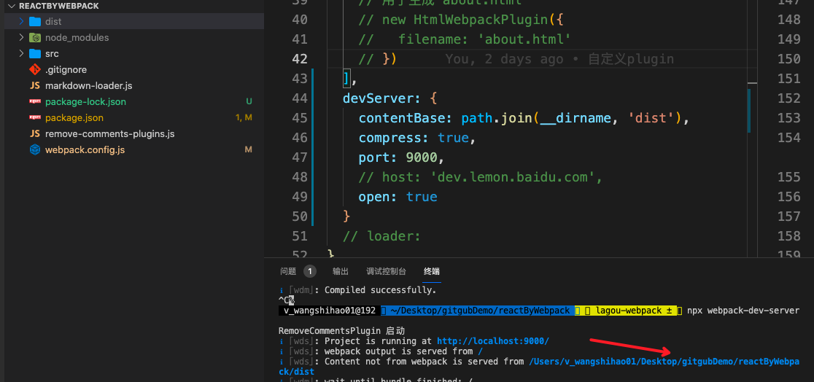

contentBase可以理解为webpack-dev-server单独提供多一个静态服务器的功能，然后这个静态服务器是以contentBase指定的目录为根目录的。以下图文理，当访问[http://localhost:8081/](https://links.jianshu.com/go?to=http%3A%2F%2Flocalhost%3A8081%2F)时，显示的是aaa文件夹下的所有文件或文件夹。


https://www.jianshu.com/p/5af0dc8f8b26

自己写：

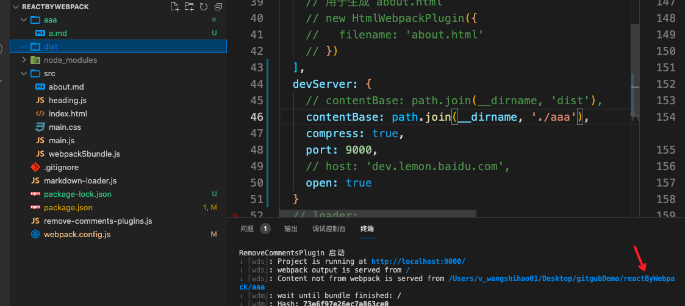


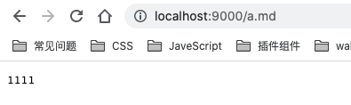

也可以从多个目录提供内容：

**webpack.config.js**

```javascript
module.exports = {
  //...
  devServer: {
    contentBase: [path.join(__dirname, 'public'), path.join(__dirname, 'assets')]
  }
};
```

CLI 用法

```bash
webpack-dev-server --content-base /path/to/content/dir
```

#### `devServer.publicPath` 🔑 

string

此路径下的打包文件可在浏览器中访问。

假设服务器运行在 `http://localhost:8080` 并且 [`output.filename`](https://v4.webpack.docschina.org/configuration/output/#output-filename) 被设置为 `bundle.js`。默认 `devServer.publicPath` 是 `'/'`，所以你的包(bundle)可以通过 `http://localhost:8080/bundle.js` 访问。

修改 `devServer.publicPath`，将 bundle 放在指定目录下：

**webpack.config.js**

```javascript
module.exports = {
  devServer: {
    publicPath: '/assets/'
  }
};
```

现在可以通过 `http://localhost:8080/assets/bundle.js` 访问 bundle。

> 确保 `devServer.publicPath` 总是以斜杠(/)开头和结尾。

也可以使用一个完整的 URL。这是 [模块热替换](https://v4.webpack.docschina.org/concepts/hot-module-replacement/) 所必需的。

**webpack.config.js**

```javascript
module.exports = {
  devServer: {
    publicPath: 'http://localhost:8080/assets/'
  }
};
```

可以通过 `http://localhost:8080/assets/bundle.js` 访问 bundle。


#### proxy

这里我们假定 GitHub 的 API 就是我们应用的后端服务，那我们的目标就是将 GitHub API 代理到本地开发服务器中。

我们可以先在浏览器中尝试访问其中的一个接口，具体结果如下图：


GitHub API 的 Endpoint 都是在根目录下，也就是说不同的 Endpoint 只是 URL 中的路径部分不同，例如 https://api.github.com/users 和 https://api.github.com/events。

知道 API 地址的规则过后，我们回到配置文件中，在 devServer 配置属性中添加一个 proxy 属性，这个属性值需要是一个对象，对象中的每个属性就是一个代理规则配置。

属性的名称是需要被代理的请求路径前缀，一般为了辨别，我都会设置为 /api。值是所对应的代理规则配置，我们将代理目标地址设置为 https://api.github.com，具体代码如下：

复制代码
// ./webpack.config.js
module.exports = {
  // ...
  devServer: {
    proxy: {
      '/api': {
        target: 'https://api.github.com'
      }
    }
  }
}
那此时我们请求 http://localhost:8080/api/users ，就相当于请求了 https://api.github.com/api/users。

而我们真正希望请求的地址是 https://api.github.com/users，所以对于代理路径开头的 /api 我们要重写掉。我们可以添加一个 pathRewrite 属性来实现代理路径重写，重写规则就是把路径中开头的 /api 替换为空，pathRewrite 最终会以正则的方式来替换请求路径。

```js
// ./webpack.config.js
module.exports = {
  // ...
  devServer: {
    proxy: {
      '/api': {
        target: 'https://api.github.com',
        pathRewrite: {
          '^/api': '' // 替换掉代理地址中的 /api
        }
      }
    }
  }
}
```


这样我们代理的地址就正常了。

除此之外，我们还需设置一个 changeOrigin 属性为 true。这是因为默认代理服务器会以我们实际在浏览器中请求的主机名，也就是 localhost:8080 作为代理请求中的主机名。而一般服务器需要根据请求的主机名判断是哪个网站的请求，那 localhost:8080 这个主机名，对于 GitHub 的服务器来说，肯定无法正常请求，所以需要修改。

将代理规则配置的 changeOrigin 属性设置为 true，就会以实际代理请求地址中的主机名去请求，也就是我们正常请求这个地址的主机名是什么，实际请求 GitHub 时就会设置成什么。

```js
// ./webpack.config.js
module.exports = {
  // ...
  devServer: {
    proxy: {
      '/api': {
        target: 'https://api.github.com',
        pathRewrite: {
          '^/api': '' // 替换掉代理地址中的 /api
        },
        changeOrigin: true // 确保请求 GitHub 的主机名就是：api.github.com
      }
    }
  }
}
```

完成以后，打开命令行终端，运行 webpack-dev-server。然后打开浏览器，这里我们直接尝试请求 http://localhost:8080/api/users，得到的就是 GitHub 的用户数据。 因为这个地址已经被代理到了 GitHub 的用户数据接口。

```
devServer: {
    proxy: {
      '/api': {
        target: 'https://api.github.com'
       }
    }
}
```

##### api

```js
// ./webpack.config.js
module.exports = {
  // ...
  devServer: {
    proxy: {
      '/api': {
        target: 'https://api.github.com',
        pathRewrite: {
          '^/api': '' // 替换掉代理地址中的 /api
        },
        changeOrigin: true // 确保请求 GitHub 的主机名就是：api.github.com
      }
    }
  }
}
```

#### historyApiFallback

####  compress

启动压缩

​    compress: true,
​    host: HOST || config.dev.host,
​    port: PORT || config.dev.port,
​    open: config.dev.autoOpenBrowser,
​    overlay: config.dev.errorOverlay
​      ? { warnings: false, errors: true }
​      : false,
​    publicPath: config.dev.assetsPublicPath,
​    proxy: config.dev.proxyTable,
​    quiet: true, // necessary for FriendlyErrorsPlugin
​    watchOptions: {
​      poll: config.dev.poll,
​    }

#### static

```
devServer: {
  static: {
    directory: path.resolve(__dirname, '../dist'),
  },
},
```


#### 报错

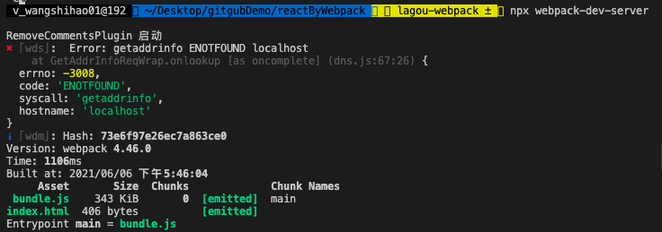

https://segmentfault.com/a/1190000022760916

热更新原理见priority文件的 8.说一下 Webpack 的热更新原理吧


####   资料

https://github.com/chimurai/http-proxy-middleware

https://github.com/http-party/node-http-proxy

https://www.codercto.com/a/39104.html

http://www.manongjc.com/article/10179.html

https://segmentfault.com/a/1190000016314976

https://segmentfault.com/a/1190000009821129

https://blog.csdn.net/zongzhiyuan/article/details/53700294

https://developer.mozilla.org/zh-CN/docs/Web/Security/Same-origin_policy

### copy-webpack-plugin静态资源拷贝

https://www.tingno.com/archives/356

将单个文件或整个目录复制到构建目录.

有些时候，我们需要使用已有的JS文件、CSS文件（本地文件），但是不需要 `webpack` 编译。例如，我们在 `public/index.html` 中引入了 `public` 目录下的 `js` 或 `css` 文件。这个时候，如果直接打包，那么在构建出来之后，肯定是找不到对应的 `js` / `css` 了。

https://juejin.cn/post/6844904084927938567#heading-0


但是在实际使用 Webpack 时，我们一般都会把 copy-webpack-plugin 这种插件留在上线前的那一次打包中使用，而开发过程中一般不会用它。因为在开发过程中，我们会频繁重复执行打包任务，假设这个目录下需要拷贝的文件比较多，如果每次都需要执行这个插件，那打包过程开销就会比较大，每次构建的速度也就自然会降低。

#### 报错

compilation.getCache is not a function

版本太高


5版本,传入的数组

https://www.npmjs.com/package/copy-webpack-plugin/v/5.1.2

[copy-webpack-plugin] patterns must be an array

```js
new CopyWebpackPlugin([
      'public'
])
```


```js
module.exports = {
  plugins: [
    new CopyPlugin([
      'relative/path/to/file.ext',
      '/absolute/path/to/file.ext',
      'relative/path/to/dir',
      '/absolute/path/to/dir',
      '**/*',
      {
        from: '**/*',
        globOptions: {
          dot: false,
        },
      },
    ]),
  ],
};
```

#### 9版本

传入的是对象

```js
const CopyPlugin = require("copy-webpack-plugin");

module.exports = {
  plugins: [
    new CopyPlugin({
      patterns: [
        { from: "source", to: "dest" },
        { from: "other", to: "public" },
      ],
    }),
  ],
};
```


### resolve 配置

`resolve` 配置 `webpack` 如何寻找模块所对应的文件。`webpack` 内置 `JavaScript` 模块化语法解析功能，默认会采用模块化标准里约定好的规则去寻找，但你可以根据自己的需要修改默认的规则。

1. modules

`resolve.modules` 配置 `webpack` 去哪些目录下寻找第三方模块，默认情况下，只会去 `node_modules` 下寻找，如果你我们项目中某个文件夹下的模块经常被导入，不希望写很长的路径，那么就可以通过配置 `resolve.modules` 来简化。

```
//webpack.config.js
module.exports = {
    //....
    resolve: {
        modules: ['./src/components', 'node_modules'] //从左到右依次查找
    }
}
```

这样配置之后，我们 `import Dialog from 'dialog'`，会去寻找 `./src/components/dialog`，不再需要使用相对路径导入。如果在 `./src/components` 下找不到的话，就会到 `node_modules` 下寻找。

https://webpack.docschina.org/configuration/resolve/#resolvemodules

```js
resolve: {
    // modules: ['../src/components', '../node_modules'], // no
    // modules: ['../src/components', 'node_modules'], // yes
    modules: [path.resolve(__dirname, 'src/components'), 'node_modules'], // yes
}
```

```
import Menu from 'menu';
```

src/components/menu/index.js


#### alias

1. alias

`resolve.alias` 配置项通过别名把原导入路径映射成一个新的导入路径，例如：

```js
//webpack.config.js
module.exports = {
    //....
    resolve: {
        alias: {
            'react-native': '@my/react-native-web' //这个包名是我随便写的哈
            '@': resolve('src')// 这样配置后 @ 可以指向 src 目录
        }
    }
}
```

例如，我们有一个依赖 `@my/react-native-web` 可以实现 `react-native` 转 `web`。我们代码一般下面这样:

```js
import { View, ListView, StyleSheet, Animated } from 'react-native';
```

配置了别名之后，在转 web 时，会从 `@my/react-native-web` 寻找对应的依赖。

当然啦，如果某个依赖的名字太长了，你也可以给它配置一个短一点的别名，这样用起来比较爽，尤其是带有 `scope` 的包。

[webpack + ts 配置路径别名无死角方法总结 - TateWang - 博客园 (cnblogs.com)](https://www.cnblogs.com/pomelott/p/14418191.html)

[采用webpack配置路径别名(alias) - 掘金 (juejin.cn)](https://juejin.cn/post/7008748509864296456)

找不到模块的话，需要配置tsconfig.json

```json
{
  "compilerOptions": {
 	 //...
    "baseUrl": ".",
    "paths": {
      "src": ["src/*"],
      "@common/*": ["src/common/*"],
     },
  }
}
```

检测webpack配置

```
resolve: {
	//...
	alias: {
		'@components': path.resolve(__dirname, '../', 'src/components'),
		'@common': path.resolve(__dirname, '../', 'src/common'),
		src: path.resolve(__dirname, '../', 'src'),
	},
	// extensions: ['.js', '.jsx', '.json', '.tsx'], // 表示这几个文件的后缀名可以省略不写
	// extensions: ['.js', '.jsx', '.json', '.tsx', 'ts'], // 表示这几个文件的后缀名可以省略不写
	extensions: ['.js', '.jsx', '.json', '.tsx', '.ts'], // 表示这几个文件的后缀名可以省略不写
},
```


#### [extensions](https://www.webpackjs.com/configuration/resolve/#resolve-extensions)

1. extensions

```
array
```

自动解析确定的扩展。默认值为：

```js
extensions: [".js", ".json"]
```

能够使用户在引入模块时不带扩展：

```js
import File from '../path/to/file'
```

> 使用此选项，会**覆盖默认数组**，这就意味着 webpack 将不再尝试使用默认扩展来解析模块。对于使用其扩展导入的模块，例如，`import SomeFile from "./somefile.ext"`，要想正确的解析，一个包含“*”的字符串必须包含在数组中。

适配多端的项目中，可能会出现 `.web.js`, `.wx.js`，例如在转web的项目中，我们希望首先找 `.web.js`，如果没有，再找 `.js`。我们可以这样配置:

```js
//webpack.config.js
module.exports = {
    //....
    resolve: {
        extensions: ['web.js', '.js'] //当然，你还可以配置 .json, .css
    }
}
```

首先寻找 `../dialog.web.js` ，如果不存在的话，再寻找 `../dialog.js`。这在适配多端的代码中非常有用，否则，你就需要根据不同的平台去引入文件(以牺牲了速度为代价)。

```js
import dialog from '../dialog';
```

当然，配置 `extensions`，我们就可以缺省文件后缀，在导入语句没带文件后缀时，会自动带上`extensions` 中配置的后缀后，去尝试访问文件是否存在，因此要将高频的后缀放在前面，并且数组不要太长，减少尝试次数。如果没有配置 `extensions`，默认只会找对对应的js文件。

1. enforceExtension

如果配置了 `resolve.enforceExtension` 为 `true`，那么导入语句不能缺省文件后缀。

1. mainFields

有一些第三方模块会提供多份代码，例如 `bootstrap`，可以查看 `bootstrap` 的 `package.json` 文件：

```
{
    "style": "dist/css/bootstrap.css",
    "sass": "scss/bootstrap.scss",
    "main": "dist/js/bootstrap",
}
复制代码
```

`resolve.mainFields` 默认配置是 `['browser', 'main']`，即首先找对应依赖 `package.json` 中的 `brower` 字段，如果没有，找 `main` 字段。

如：`import 'bootstrap'` 默认情况下，找得是对应的依赖的 `package.json` 的 `main` 字段指定的文件，即 `dist/js/bootstrap`。

假设我们希望，`import 'bootsrap'` 默认去找 `css` 文件的话，可以配置 `resolve.mainFields` 为:

```
//webpack.config.js
module.exports = {
    //....
    resolve: {
        mainFields: ['style', 'main'] 
    }
}
复制代码
```


作者：刘小夕
链接：https://juejin.cn/post/6844904084927938567

### babel配置

实现使用babel

处理高级JS语法(如ES6 ES7) 转成ES5

官⽅方⽹网站:https://babeljs.io/

中⽂文⽹网站:https://www.babeljs.cn/setup#installation

1. 运行`cnpm i babel-core babel-loader babel-plugin-transform-runtime --save-dev`安装babel的相关loader包

   babel-loader是webpack 与 babel的通信桥梁梁，不不会做把es6转成es5的 ⼯工作，这部分⼯工作需要⽤用到@babel/preset-env来做 

   @babel/preset-env⾥里里包含了了es6转es5的转换规则

2. 运行`cnpm i babel-preset-es2015 babel-preset-stage-0 --save-dev`安装babel转换的语法

3. 在`webpack.config.js`中添加相关loader模块，其中需要注意的是，一定要把`node_modules`文件夹添加到排除项：

```js
{ test: /\.js$/, use: 'babel-loader', exclude: /node_modules/ }
```

4. 在项目根目录中添加`.babelrc`文件，并修改这个配置文件如下：

   To start, you can use the [env preset](https://babeljs.io/docs/plugins/preset-env), which enables transforms for ES2015+

   注意：语法插件`babel-preset-es2015`可以更新为`babel-preset-env`，它包含了所有的ES相关的语法；

   npm install @babel/preset-env --save-dev

```js
{
    "presets":["es2015", "stage-0"],
    "plugins":["transform-runtime"]
}
或者
{
  "presets": ["@babel/preset-env"]
}
```

npx webpack即可看到打包后的文件

5. 有些浏览器不支持Promise，需要引入pol

   这时候需要借助 @babel/polyfill，把es的新特性都装进来，来弥补低版本浏览器器中缺失的 特性。以全局变量量的⽅方式注⼊入进来的。windows.Promise，它会造成全局对象的 污染

   https://www.babeljs.cn/docs/babel-polyfill

   npm install --save @babel/polyfill

   因为打包后的文件体积较大，可以使用按需加载 开课吧第9期webpack2第49分钟

     

   ```js
   options: {
    [ presets: [
   "@babel/preset-env",
   {
     targets: {
       edge: "17",
       firefox: "60",
       chrome: "67",
       safari: "11.1"
       },
   
   useBuiltIns: "usage"//按需注⼊入 }
   ] ]
   }
   ```

   当我们开发的是组件库，⼯工具库这些场景的时候，polyfill就不不适合了了，因 为polyfill是注⼊入到全局变量量，window下的，会污染全局环境，所以推荐闭 包⽅方式:@babel/plugin-transform-runtime

#### plugin-transform-runtime


## 二、高级特性


### 多页应用打包（多入口)

有时，我们的应用不一定是一个单页应用，而是一个多页应用，那么如何使用 `webpack` 进行打包呢。为了生成目录看起来清晰，不生成单独的 `map` 文件。

```js
//webpack.config.js
const path = require('path');
const HtmlWebpackPlugin = require('html-webpack-plugin');
module.exports = {
    entry: {
        index: './src/index.js',
        login: './src/login.js'
    },
    output: {
        path: path.resolve(__dirname, 'dist'),
        filename: '[name].[hash:6].js'
    },
    //...
    plugins: [
        new HtmlWebpackPlugin({
            template: './public/index.html',
            filename: 'index.html' //打包后的文件名
        }),
        new HtmlWebpackPlugin({
            template: './public/login.html',
            filename: 'login.html' //打包后的文件名
        }),
    ]
}
复制代码
```

如果需要配置多个 `HtmlWebpackPlugin`，那么 `filename` 字段不可缺省，否则默认生成的都是 `index.html`，如果你希望 `html` 的文件名中也带有 `hash`，那么直接修改 `fliename` 字段即可，例如: `filename: 'login.[hash:6].html'`。

生成目录如下:

```
.
├── dist
│   ├── 2.463ccf.js
│   ├── assets
│   │   └── thor_e09b5c.jpeg
│   ├── css
│   │   ├── index.css
│   │   └── login.css
│   ├── index.463ccf.js
│   ├── index.html
│   ├── js
│   │   └── base.js
│   ├── login.463ccf.js
│   └── login.html
复制代码
```

看起来，似乎是OK了，不过呢，查看 `index.html` 和 `login.html` 会发现，都同时引入了 `index.f7d21a.js` 和 `login.f7d21a.js`，通常这不是我们想要的，我们希望，`index.html` 中只引入 `index.f7d21a.js`,`login.html` 只引入 `login.f7d21a.js`

`HtmlWebpackPlugin` 提供了一个 `chunks` 的参数，可以接受一个数组，配置此参数仅会将数组中指定的js引入到html文件中，此外，如果你需要引入多个JS文件，仅有少数不想引入，还可以指定 `excludeChunks` 参数，它接受一个数组。

```
//webpack.config.js
module.exports = {
    //...
    plugins: [
        new HtmlWebpackPlugin({
            template: './public/index.html',
            filename: 'index.html', //打包后的文件名
            chunks: ['index']
        }),
        new HtmlWebpackPlugin({
            template: './public/login.html',
            filename: 'login.html', //打包后的文件名
            chunks: ['login']
        }),
    ]
}
复制代码
```

执行 `npm run build`，可以看到 `index.html` 中仅引入了 `index` 的 `JS` 文件，而 `login.html` 中也仅引入了 `login` 的 `JS` 文件，符合我们的预期。


作者：刘小夕
链接：https://juejin.cn/post/6844904084927938567

### [css抽离](https://webpack.docschina.org/plugins/mini-css-extract-plugin/)

Mini CSS Extract Plugin

CSS打包我们前面已经说过了，不过呢，有些时候，我们可能会有抽离CSS的需求，即将CSS文件单独打包，这可能是因为打包成一个JS文件太大，影响加载速度，也有可能是为了缓存(例如，只有JS部分有改动)，还有可能就是“我高兴”：我想抽离就抽离，谁也管不着。

不管你是因为什么原因要抽离CSS，只要你有需求，我们就可以去实现。(https://kaiwu.lagou.com/course/courseInfo.htm?courseId=88#/detail/pc?id=2270)

首先，安装 `loader`:

```
npm install mini-css-extract-plugin -D
```

安装完成过后，我们回到 Webpack 的配置文件。具体配置如下：


```js
// ./webpack.config.js
const MiniCssExtractPlugin = require('mini-css-extract-plugin')
module.exports = {
  mode: 'none',
  entry: {
    main: './src/index.js'
  },
  output: {
    filename: '[name].bundle.js'
  },
  module: {
    rules: [
      {
        test: /\.css$/,
        use: [
          // 'style-loader', // 将样式通过 style 标签注入
          MiniCssExtractPlugin.loader,
          'css-loader'
        ]
      }
    ]
  },
  plugins: [
    new MiniCssExtractPlugin()
  ]
}
```

我们这里先导入这个插件模块，导入过后我们就可以将这个插件添加到配置对象的 plugins 数组中了。这样 Mini CSS Extract Plugin 在工作时就会自动提取代码中的 CSS 了。

除此以外，Mini CSS Extract Plugin 还需要我们使用 MiniCssExtractPlugin 中提供的 loader 去替换掉 style-loader，以此来捕获到所有的样式。

这样的话，打包过后，样式就会存放在独立的文件中，直接通过 link 标签引入页面。

不过这里需要注意的是，如果你的 CSS 体积不是很大的话，提取到单个文件中，效果可能适得其反，因为单独的文件就需要单独请求一次。个人经验是如果 CSS 超过 200KB 才需要考虑是否提取出来，作为单独的文件。

#### 更复杂场景

> mini-css-extract-plugin` 和 `extract-text-webpack-plugin` 相比:

1. 异步加载
2. 不会重复编译(性能更好)
3. 更容易使用
4. 只适用CSS

修改我们的配置文件：

```js
//webpack.config.js
const MiniCssExtractPlugin = require('mini-css-extract-plugin');
module.exports = {
    plugins: [
        new MiniCssExtractPlugin({
            filename: 'css/[name].css'
            //个人习惯将css文件放在单独目录下
            //publicPath:'../'   //如果你的output的publicPath配置的是 './' 这种相对路径，那么如果将css文件放在单独目录下，记得在这里指定一下publicPath 
        })
    ],
    module: {
        rules: [
            {
                test: /\.(le|c)ss$/,
                use: [
                    MiniCssExtractPlugin.loader, //替换之前的 style-loader
                    'css-loader',
                    {
                        loader: 'postcss-loader',
                        options: {
                            plugins: function () {
                                return [
                                    require('autoprefixer')({
                                        "overrideBrowserslist": [
                                            "defaults"
                                        ]
                                    })
                                ]
                            }
                        }
                    },
                    'less-loader'
                ],
                exclude: /node_modules/
            }
        ]
    }
}
复制代码
```

现在，我们重新编译：`npm run build`，目录结构如下所示:

```
.
├── dist
│   ├── assets
│   │   ├── alita_e09b5c.jpg
│   │   └── thor_e09b5c.jpeg
│   ├── css
│   │   ├── index.css
│   │   └── index.css.map
│   ├── bundle.fb6d0c.js
│   ├── bundle.fb6d0c.js.map
│   └── index.html
复制代码
```

前面说了最好新建一个 `.browserslistrc` 文件，这样可以多个 `loader` 共享配置，所以，动手在根目录下新建文件 (`.browserslistrc`)，内容如下（你可以根据自己项目需求，修改为其它的配置）:

```
last 2 version
> 0.25%
not dead
复制代码
```

修改 `webpack.config.js`：

```
//webpack.config.js
const MiniCssExtractPlugin = require('mini-css-extract-plugin');
module.exports = {
    //...
    plugins: [
        new MiniCssExtractPlugin({
            filename: 'css/[name].css' 
        })
    ],
    module: {
        rules: [
            {
                test: /\.(c|le)ss$/,
                use: [
                    MiniCssExtractPlugin.loader,
                    'css-loader', {
                        loader: 'postcss-loader',
                        options: {
                            plugins: function () {
                                return [
                                    require('autoprefixer')()
                                ]
                            }
                        }
                    }, 'less-loader'
                ],
                exclude: /node_modules/
            },
        ]
    }
}
复制代码
```

要测试自己的 `.browserlistrc` 有没有生效也很简单，直接将文件内容修改为 `last 1 Chrome versions` ，然后对比修改前后的构建出的结果，就能看出来啦。

可以查看更多[browserslistrc]配置项([github.com/browserslis…](https://github.com/browserslist/browserslist))

更多配置项，可以查看[mini-css-extract-plugin](https://github.com/webpack-contrib/mini-css-extract-plugin)


### css文件压缩

使用 `mini-css-extract-plugin`，`CSS` 文件默认不会被压缩，如果想要压缩，需要配置 `optimization`，首先安装 `optimize-css-assets-webpack-plugin`.

这里我们发现 JavaScript 文件正常被压缩了，而样式文件并没有被压缩。

这是因为，Webpack 内置的压缩插件仅仅是针对 JS 文件的压缩，其他资源文件的压缩都需要额外的插件。

```
npm install optimize-css-assets-webpack-plugin -D
```

修改webpack配置：

```js
//webpack.config.js
const OptimizeCssPlugin = require('optimize-css-assets-webpack-plugin');

module.exports = {
    entry: './src/index.js',
    plugins: [
        new OptimizeCssPlugin()
    ],
}
```

注意，这里将 `OptimizeCssPlugin` 直接配置在 `plugins` 里面，那么 `js` 和 `css` 都能够正常压缩，如果你将这个配置在 `optimization`，那么需要再配置一下 `js` 的压缩(开发环境下不需要去做CSS的压缩，因此后面记得将其放到 `webpack.config.prod.js` 中哈)。

配置完之后，测试的时候发现，抽离之后，修改 `css` 文件时，第一次页面会刷新，但是第二次页面不会刷新 —— 好嘛，我平时的业务中用不着抽离 `css`，这个问题搁置了好多天(准确来说是忘记了)。

3月8号再次修改这篇文章的时候，正好看到了 `MiniCssExtractPlugin.loader` 对应的 `option` 设置，我们再次修改下对应的 `rule`。

```js
module.exports = {
    rules: [
        {
            test: /\.(c|le)ss$/,
            use: [
                {
                    loader: MiniCssExtractPlugin.loader,
                    options: {
                        hmr: isDev,
                        reloadAll: true,
                    }
                }
            ],
            exclude: /node_modules/
        }
    ]
}
```


作者：刘小夕
链接：https://juejin.cn/post/6844904084927938567
来源：掘金
著作权归作者所有。商业转载请联系作者获得授权，非商业转载请注明出处。


#### 拉勾

使用了 Mini CSS Extract Plugin 过后，样式就被提取到单独的 CSS 文件中了。但是这里同样有一个小问题。

我们回到命令行，这里我们以生产模式运行打包。那按照之前的了解，生产模式下会自动压缩输出的结果，我们可以打开打包生成的 JS 文件。具体结果如下：


然后我们再打开输出的样式文件。具体结果如下：


这里我们发现 JavaScript 文件正常被压缩了，而样式文件并没有被压缩。

这是因为，Webpack 内置的压缩插件仅仅是针对 JS 文件的压缩，其他资源文件的压缩都需要额外的插件。

Webpack 官方推荐了一个 [Optimize CSS Assets Webpack Plugin](https://www.npmjs.com/package/optimize-css-assets-webpack-plugin) 插件。我们可以使用这个插件来压缩我们的样式文件。

我们回到命令行，先来安装这个插件，具体命令如下：


复制代码

```
$ npm i optimize-css-assets-webpack-plugin --save-dev
```

安装完成过后，我们回到配置文件中，添加对应的配置。具体代码如下：


复制代码

```
// ./webpack.config.js
const MiniCssExtractPlugin = require('mini-css-extract-plugin')
const OptimizeCssAssetsWebpackPlugin = require('optimize-css-assets-webpack-plugin')
module.exports = {
  mode: 'none',
  entry: {
    main: './src/index.js'
  },
  output: {
    filename: '[name].bundle.js'
  },
  module: {
    rules: [
      {
        test: /\.css$/,
        use: [
          MiniCssExtractPlugin.loader,
          'css-loader'
        ]
      }
    ]
  },
  plugins: [
    new MiniCssExtractPlugin(),
    new OptimizeCssAssetsWebpackPlugin()
  ]
}
```

这里同样先导入这个插件，导入完成以后我们把这个插件添加到 plugins 数组中。

那此时我们再次回到命令行运行打包。

打包完成过后，我们的样式文件就会以压缩格式输出了。具体结果如下：


不过这里还有个额外的小点，可能你会在这个插件的官方文档中发现，文档中的这个插件并不是配置在 plugins 数组中的，而是添加到了 optimization 对象中的 minimizer 属性中。具体如下：


复制代码

```
// ./webpack.config.js
const MiniCssExtractPlugin = require('mini-css-extract-plugin')
const OptimizeCssAssetsWebpackPlugin = require('optimize-css-assets-webpack-plugin')
module.exports = {
  mode: 'none',
  entry: {
    main: './src/index.js'
  },
  output: {
    filename: '[name].bundle.js'
  },
  optimization: {
    minimizer: [
      new OptimizeCssAssetsWebpackPlugin()
    ]
  },
  module: {
    rules: [
      {
        test: /\.css$/,
        use: [
          MiniCssExtractPlugin.loader,
          'css-loader'
        ]
      }
    ]
  },
  plugins: [
    new MiniCssExtractPlugin()
  ]
}
```

那这是为什么呢？

其实也很简单，如果我们配置到 plugins 属性中，那么这个插件在任何情况下都会工作。而配置到 minimizer 中，就只会在 minimize 特性开启时才工作。

所以 Webpack 建议像这种压缩插件，应该我们配置到 minimizer 中，便于 minimize 选项的统一控制。

但是这么配置也有个缺点，此时我们再次运行生产模式打包，打包完成后再来看一眼输出的 JS 文件，此时你会发现，原本可以自动压缩的 JS，现在却不能压缩了。具体 JS 的输出结果如下：


那这是因为我们设置了 minimizer，Webpack 认为我们需要使用自定义压缩器插件，那内部的 JS 压缩器就会被覆盖掉。我们必须手动再添加回来。

内置的 JS 压缩插件叫作 terser-webpack-plugin，我们回到命令行手动安装一下这个模块。


复制代码

```
$ npm i terser-webpack-plugin --save-dev
```

安装完成过后，这里我们再手动添加这个模块到 minimizer 配置当中。具体代码如下：


复制代码

```
// ./webpack.config.js
const MiniCssExtractPlugin = require('mini-css-extract-plugin')
const OptimizeCssAssetsWebpackPlugin = require('optimize-css-assets-webpack-plugin')
const TerserWebpackPlugin = require('terser-webpack-plugin')
module.exports = {
  mode: 'none',
  entry: {
    main: './src/index.js'
  },
  output: {
    filename: '[name].bundle.js'
  },
  optimization: {
    minimizer: [
      new TerserWebpackPlugin(),
      new OptimizeCssAssetsWebpackPlugin()
    ]
  },
  module: {
    rules: [
      {
        test: /\.css$/,
        use: [
          MiniCssExtractPlugin.loader,
          'css-loader'
        ]
      }
    ]
  },
  plugins: [
    new MiniCssExtractPlugin()
  ]
}
```

那这样的话，我们再次以生产模式运行打包，JS 文件和 CSS 文件就都可以正常压缩了。


###  静态资源拷贝


### 其它

ProvidePlugin

https://juejin.cn/post/6844904084927938567#heading-1

按需加载

https://juejin.cn/post/6844904084927938567#heading-4


### [**tree Shaking**](https://webpack.docschina.org/guides/tree-shaking/#root)

26分

*tree shaking* 是一个术语，通常用于描述移除 JavaScript 上下文中的未引用代码(dead-code)。该功能会在生成模式会自动开启。

webpack2.x开始⽀持 tree shaking概念，顾名思义，"摇树"，只⽀持ES module的引⼊方式!

https://kaiwu.lagou.com/course/courseInfo.htm?courseId=88#/detail/pc?id=2269


dev模式下，不会帮助我们把没有引用的代码去掉

$ npx webpack --mode=none

#### optimization

usedExports - 打包结果中只导出外部用到的成员；

minimize - 压缩打包结果。

```js
 //webpack.config.js
optimization: {
    usedExports: true,
    minimize: true
}

//package.json
"sideEffects":false
"sideEffects":['*.css','@babel/polyfill'] // 正常对所有模块进⾏tree shaking
```


```js
 //expo.js
export const add = (a, b) => {
  console.log(a + b);
};
export const minus = (a, b) => {
  console.log(a - b);
};
//index.js
import { add } from "./expo";
add(1, 2);
```


其实，这是因为在最新版本（8.x）的 babel-loader 中，已经自动帮我们关闭了对 ES Modules 转换的插件，你可以参考对应版本 babel-loader 的[源码](https://github.com/babel/babel-loader/blob/v8.1.0/src/injectCaller.js)，核心代码如下：

##### 结合 babel-loader 的问题

因为早期的 Webpack 发展非常快，那变化也就比较多，所以当我们去找资料时，得到的结果不一定适用于当前我们所使用的版本。而 Tree-shaking 的资料更是如此，很多资料中都表示“*为 JS 模块配置 babel-loader，会导致 Tree-shaking 失效*”。

针对这个问题，这里我统一说明一下：

首先你需要明确一点：**Tree-shaking 实现的前提是 ES Modules**，也就是说：最终**交给 Webpack 打包的代码，必须是使用 ES Modules 的方式来组织的模块化**。

为什么这么说呢？

我们都知道 Webpack 在打包所有的模块代码之前，先是将模块根据配置交给不同的 Loader 处理，最后再将 Loader 处理的结果打包到一起。

很多时候，我们为了更好的兼容性，会选择使用 [babel-loader](https://github.com/babel/babel-loader) 去转换我们源代码中的一些 ECMAScript 的新特性。而 Babel 在转换 JS 代码时，很有可能处理掉我们代码中的 ES Modules 部分，把它们转换成 CommonJS 的方式，如下图所示：


当然了，Babel 具体会不会处理 ES Modules 代码，取决于我们有没有为它配置使用转换 ES Modules 的插件。

很多时候，我们为 Babel 配置的都是一个 preset（预设插件集合），而不是某些具体的插件。例如，目前市面上使用最多的 [@babel/preset-env](https://babeljs.io/docs/en/babel-preset-env)，这个预设里面就有[转换 ES Modules 的插件](https://babeljs.io/docs/en/babel-plugin-transform-modules-commonjs)。所以当我们使用这个预设时，代码中的 ES Modules 部分就会被转换成 CommonJS 方式。那 Webpack 再去打包时，拿到的就是以 CommonJS 方式组织的代码了，所以 Tree-shaking 不能生效。

那我们这里具体来尝试一下。为了可以更容易分辨结果，我们只开启 usedExports，完整配置如下：

复制代码

```js
// ./webpack.config.js

module.exports = {

  mode: 'none',

  entry: './src/main.js',

  output: {

    filename: 'bundle.js'

  },

  module: {

    rules: [

      {

        test: /\.js$/,

        use: {

          loader: 'babel-loader',

          options: {

            presets: [

              ['@babel/preset-env']

            ]

          }

        }

      }

    ]

  },

  optimization: {

    usedExports: true

  }

}
```

配置完成过后，我们打开命令行终端，运行 Webpack 打包命令，然后再找到 bundle.js，具体结果如下：


仔细查看你会发现，结果并不是像刚刚说的那样，这里 usedExports 功能仍然正常工作了，此时，如果我们压缩代码，这些未引用的代码依然会被移除。这也就说明 Tree-shaking 并没有失效。

那到底是怎么回事呢？为什么很多资料都说 babel-loader 会导致 Tree-shaking 失效，但当我们**实际尝试**后又发现并没有失效？

其实，这是因为在最新版本（8.x）的 babel-loader 中，已经自动帮我们关闭了对 ES Modules 转换的插件，你可以参考对应版本 babel-loader 的[源码](https://github.com/babel/babel-loader/blob/v8.1.0/src/injectCaller.js)，核心代码如下：


通过查阅 babel-loader 模块的源码，我们发现它已经在 injectCaller 函数中标识了当前环境支持 ES Modules。

然后再找到我们所使用的 @babal/preset-env 模块源码，部分核心代码如下：


在这个模块中，根据环境标识自动禁用了对 ES Modules 的转换插件，所以**经过 babel-loader 处理后的代码默认仍然是 ES Modules，那 Webpack 最终打包得到的还是 ES Modules 代码，Tree-shaking 自然也就可以正常工作了**。

我们也可以在 babel-loader 的配置中强制开启 ES Modules 转换插件来试一下，具体配置如下：

复制代码

```js
// ./webpack.config.js

module.exports = {

  mode: 'none',

  entry: './src/main.js',

  output: {

    filename: 'bundle.js'

  },

  module: {

    rules: [

      {

        test: /\.js$/,

        use: {

          loader: 'babel-loader',

          options: {

            presets: [

              ['@babel/preset-env', { modules: 'commonjs' }]

            ]

          }

        }

      }

    ]

  },

  optimization: {

    usedExports: true

  }

}
```

给 Babel preset 添加配置的方式比较特别，这里很多人都会配错，一定要注意。它需要把预设数组中的成员定义成一个数组，然后这个数组中的第一个成员就是所使用的 preset 的名称，第二个成员就是给这个 preset 定义的配置对象。

我们在这个对象中将 modules 属性设置为 "commonjs"，默认这个属性是 auto，也就是根据环境判断是否开启 ES Modules 插件，我们设置为 commonjs 就表示我们强制使用 Babel 的 ES Modules 插件把代码中的 ES Modules 转换为 CommonJS。

完成以后，我们再次打开命令行终端，运行 Webpack 打包。然后找到 bundle.js，结果如下：


此时，你就会发现 usedExports 没法生效了。即便我们开启压缩代码，Tree-shaking 也会失效。

总结一下，这里通过实验发现，最新版本的 babel-loader 并不会导致 Tree-shaking 失效。如果你不确定现在使用的 babel-loader 会不会导致这个问题，最简单的办法就是在配置中将 @babel/preset-env 的 modules 属性设置为 false，确保不会转换 ES Modules，也就确保了 Tree-shaking 的前提。

另外，我们刚刚探索的过程也值得你仔细再去琢磨一下，通过这样的探索能够帮助你了解很多背后的原因，做到“知其然，知其所以然”。

#### concatenateModules

合并模块（扩展）
除了 usedExports 选项之外，我们还可以使用一个 concatenateModules 选项继续优化输出。

普通打包只是将一个模块最终放入一个单独的函数中，如果我们的模块很多，就意味着在输出结果中会有很多的模块函数。

concatenateModules 配置的作用就是尽可能将所有模块合并到一起输出到一个函数中，这样既提升了运行效率，又减少了代码的体积。

我们回到配置文件中，这里我们在 optimization 属性中开启 concatenateModules。同时，为了更好地看到效果，我们先关闭 minimize，具体配置如下：

```js
// ./webpack.config.js
module.exports = {
  optimization: {
    // 模块只导出被使用的成员
    usedExports: true,
    // 尽可能合并每一个模块到一个函数中
    concatenateModules: true,
    // 压缩输出结果
    minimize: false
  }
}
```

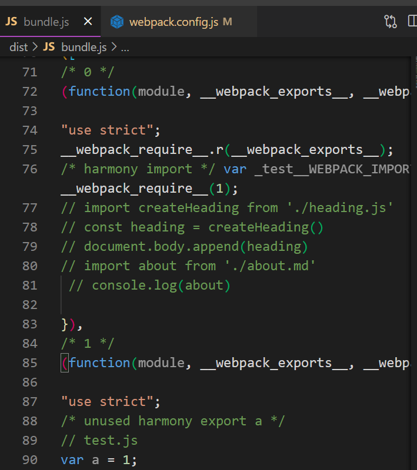

开启之后

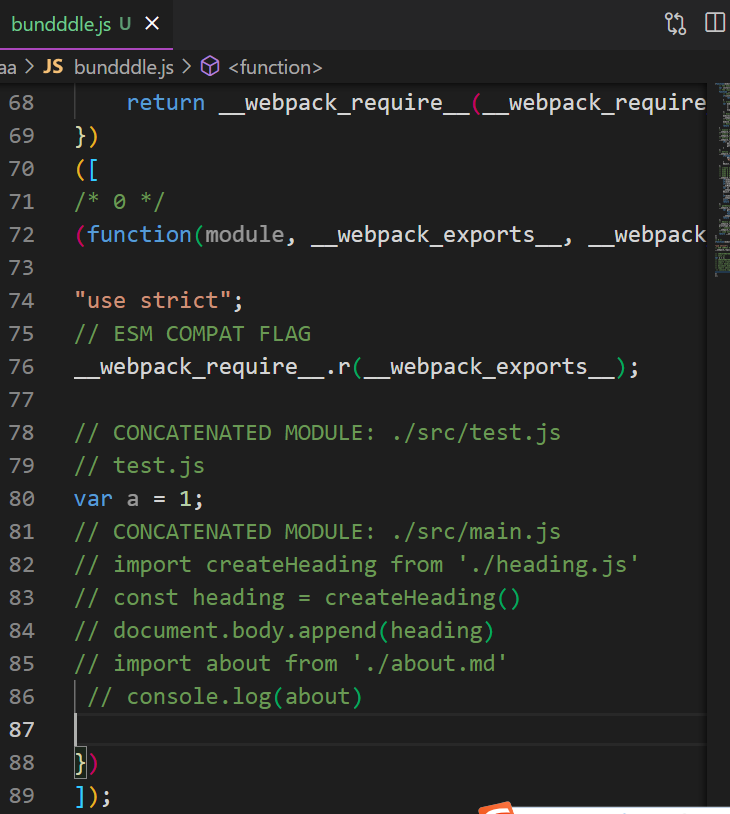


#### sideEffects

Webpack 4 中新增了一个 sideEffects 特性，它允许我们通过配置标识我们的代码是否有副作用，从而提供更大的压缩空间。

> TIPS：模块的副作用指的就是模块执行的时候除了导出成员，是否还做了其他的事情。

这个特性一般只有我们去开发一个 npm 模块时才会用到。因为官网把对 sideEffects 特性的介绍跟 Tree-shaking 混到了一起，所以很多人误认为它们之间是因果关系，其实它们没有什么太大的关系。

使用 sideEffects 这个功能的前提是确定你的代码没有副作用，或者副作用代码没有全局影响，否则打包时就会误删掉你那些有意义的副作用代码。

示例：

https://kaiwu.lagou.com/course/courseInfo.htm?courseId=88#/detail/pc?id=2269

```js
// ./src/components/button.js
console.log('Button component~') // 副作用代码

export default () => {
  return document.createElement('button')
}

我们再到打包入口文件（main.js）中去载入 components 中的 Button 成员，具体代码如下：

// ./src/main.js
import { Button } from './components'
document.body.appendChild(Button())
```

但是由于这些成员所属的模块中有副作用代码，所以就导致最终 Tree-shaking 过后，这些模块并不会被完全移除。

可能你会认为这些代码应该保留下来，而实际情况是，这些模块内的副作用代码一般都是为这个模块服务的，例如这里我添加的 console.log，就是希望表示一下当前这个模块被加载了。但是最终整个模块都没用到，也就没必要留下这些副作用代码了。

所以说，**Tree-shaking 只能移除没有用到的代码成员，而想要完整移除没有用到的模块，那就需要开启 sideEffects 特性了**。

##### sideEffects 作用

我们打开 Webpack 的配置文件，在 optimization 中开启 sideEffects 特性，具体配置如下：

```js
// ./webpack.config.js

module.exports = {
  mode: 'none',
  entry: './src/main.js',
  output: {
    filename: 'bundle.js'
  },
  optimization: {
    sideEffects: true
  }
}
```

> TIPS：注意这个特性在 production 模式下同样会自动开启。

那此时 Webpack 在打包某个模块之前，会先检查这个模块所属的 package.json 中的 sideEffects 标识，以此来判断这个模块是否有副作用，如果没有副作用的话，这些没用到的模块就不再被打包。换句话说，即便这些没有用到的模块中存在一些副作用代码，我们也可以通过 package.json 中的 sideEffects 去强制声明没有副作用。

那我们打开项目 package.json 添加一个 sideEffects 字段，把它设置为 false，具体代码如下：

```json
{
  "name": "09-side-effects",
  "version": "0.1.0",
  "author": "zce <w@zce.me> (https://zce.me)",
  "license": "MIT",
  "scripts": {
    "build": "webpack"
  },
  "devDependencies": {
    "webpack": "^4.43.0",
    "webpack-cli": "^3.3.11"
  },
  "sideEffects": false
}
```

这样就表示我们这个项目中的所有代码都没有副作用，让 Webpack 放心大胆地去“干”。

完成以后我们再次运行打包，然后同样找到打包输出的 bundle.js 文件，结果如下：略

此时那些没有用到的模块就彻底不会被打包进来了。那这就是 sideEffects 的作用。

这里设置了两个地方：

- webpack.config.js 中的 sideEffects 用来开启这个功能；
- package.json 中的 sideEffects 用来标识我们的代码没有副作用。

目前很多第三方的库或者框架都已经使用了 sideEffects 标识，所以我们再也不用担心为了一个小功能引入一个很大体积的库了。例如，某个 UI 组件库中只有一两个组件会用到，那只要它支持 sideEffects，你就可以放心大胆的直接用了。

##### sideEffects 注意

使用 sideEffects 这个功能的前提是确定你的代码没有副作用，或者副作用代码没有全局影响，否则打包时就会误删掉你那些有意义的副作用代码。

例如，我这里准备的 extend.js 模块：

```js
// ./src/extend.js
// 为 Number 的原型添加一个扩展方法
Number.prototype.pad = function (size) {
  const leadingZeros = Array(size + 1).join(0)
  return leadingZeros + this
}
```

在这个模块中并没有导出任何成员，仅仅是在 Number 的原型上挂载了一个 pad 方法，用来为数字添加前面的导零，这是一种很早以前常见的基于原型的扩展方法。

我们回到 main.js 中去导入 extend 模块，具体代码如下：

```js
// ./src/main.js
import './extend' // 内部包含影响全局的副作用

console.log((8).pad(3)) // => '0008'
```

因为这个模块确实没有导出任何成员，所以这里也就不需要提取任何成员。导入过后就可以使用它为 Number 提供扩展方法了。

这里为 Number 类型做扩展的操作就是 extend 模块对全局产生的副作用。

此时如果我们还是通过 package.json 标识我们代码没有副作用，那么再次打包过后，就会出现问题。我们可以找到打包结果，如下图所示：


我们看到，对 Number 的扩展模块并不会打包进来。

缺少了对 Number 的扩展操作，我们的代码再去运行的时候，就会出现错误。这种扩展的操作属于对全局产生的副作用。

这种基于原型的扩展方式，在很多 Polyfill 库中都会大量出现，比较常见的有 [es6-promise](https://github.com/stefanpenner/es6-promise)，这种模块都属于典型的副作用模块。

除此之外，我们在 JS 中直接载入的 CSS 模块，也都属于副作用模块，同样会面临这种问题。

所以说不是所有的副作用都应该被移除，有一些必要的副作用需要保留下来。

最好的办法就是在 package.json 中的 sideEffects 字段中标识需要保留副作用的模块路径（可以使用通配符），具体配置如下：


```js
{
  "name": "09-side-effects",
  "version": "0.1.0",
  "author": "zce <w@zce.me> (https://zce.me)",
  "license": "MIT",
  "scripts": {
    "build": "webpack"
  },
  "devDependencies": {
    "webpack": "^4.43.0",
    "webpack-cli": "^3.3.11"
  },
  "sideEffects": [
    "./src/extend.js",
    "*.css"
  ]
}
```

这样 Webpack 的 sideEffects 就不会忽略确实有必要的副作用模块了。

### [代码分割/分离](https://webpack.docschina.org/guides/code-splitting/)

**code-splitting**

代码分离是 webpack 中最引人注目的特性之一。此特性能够把代码分离到不同的 bundle 中，然后可以按需加载或并行加载这些文件。代码分离可以用于获取更小的 bundle，以及控制资源加载优先级，如果使用合理，会极大影响加载时间。

常用的代码分离方法有三种：

- **入口起点**：使用 [`entry`](https://webpack.docschina.org/configuration/entry-context) 配置手动地分离代码。
- **防止重复**：使用 [Entry dependencies](https://webpack.docschina.org/configuration/entry-context/#dependencies) 或者 [`SplitChunksPlugin`](https://webpack.docschina.org/plugins/split-chunks-plugin) 去重和分离 chunk。
- **动态导入**：通过模块的内联函数调用来分离代码。


https://kaiwu.lagou.com/course/courseInfo.htm?courseId=88#/detail/pc?id=3336

主要在2尾3开始

```
import _ from "lodash";
console.log(_.join(['a','b','c','****']))
```

假如我们引⼊⼀个第三⽅的⼯工具库，体积为1mb，而我们的业务逻辑代码也有 1mb，那么打包出来的体积⼤⼩会在2mb

```
导致问题:
 体积⼤大，加载时间⻓长
 业务逻辑会变化，第三⽅工具库不会，所以业务逻辑⼀一变更，第三⽅工具库也
```

要跟着变。

引⼊代码分割的概念:

```js
 //lodash.js
import _ from "lodash";
window._ = _;
//index.js 注释掉lodash引⽤用 //import _ from "lodash";
console.log(_.join(['a','b','c','****']))
//webpack.config.js
entry: {
    lodash: "./lodash.js",
    index: "./index.js" 
}, //指定打包后的资源位置 output: {
  path: path.resolve(__dirname, "./build"),
  filename: "[name].js"
}
```

一般 entry 属性中只会配置一个打包入口，如果我们需要配置多个入口，可以把 entry 定义成一个对象。注意：这里 entry 是定义为对象而不是数组，如果是数组的话就是把多个文件打包到一起，还是一个入口。

一旦我们的入口配置为多入口形式，那输出文件名也需要修改，因为两个入口就有两个打包结果，不能都叫 bundle.js。我们可以在这里使用 [name] 这种占位符来输出动态的文件名，[name] 最终会被替换为入口的名称。

除此之外，在配置中还通过 html-webpack-plugin 分别为 index 和 album 页面生成了对应的 HTML 文件。

完成配置之后，我们就可以打开命令行终端，运行 Webpack 打包，那此次打包会有两个入口。打包完成后，我们找到输出目录，这里就能看到两个入口文件各自的打包结果了，如下图所示：


但是这里还有一个小问题，我们打开任意一个输出的 HTML 文件，具体结果如下图：


你就会发现 index 和 album 两个打包结果都被页面载入了，而我们希望的是每个页面只使用它对应的那个输出结果。

所以这里还需要修改配置文件，我们回到配置文件中，找到输出 HTML 的插件，默认这个插件会自动注入所有的打包结果，如果需要指定所使用的 bundle，我们可以通过 HtmlWebpackPlugin 的 chunks 属性来设置。我们分别为两个页面配置使用不同的 chunk，具体配置如下：

TIPS：每个打包入口都会形成一个独立的 chunk（块）。

复制代码
// ./webpack.config.js
const HtmlWebpackPlugin = require('html-webpack-plugin')
module.exports = {
  entry: {
    index: './src/index.js',
    album: './src/album.js'
  },
  output: {
    filename: '[name].bundle.js' // [name] 是入口名称
  },
  // ... 其他配置
  plugins: [
    new HtmlWebpackPlugin({
      title: 'Multi Entry',
      template: './src/index.html',
      filename: 'index.html',
      chunks: ['index'] // 指定使用 index.bundle.js
    }),
    new HtmlWebpackPlugin({
      title: 'Multi Entry',
      template: './src/album.html',
      filename: 'album.html',
      chunks: ['album'] // 指定使用 album.bundle.js
    })
  ]
}
完成以后我们再次回到命令行终端，然后运行打包，打包结果如下图：


这一次打包的结果就完全正常了。

那这就是配置多入口打包的方法，以及如何指定在 HTML 中注入的 bundle。


#### 提取公共模块

多入口打包本身非常容易理解和使用，但是它也存在一个小问题，就是不同的入口中一定会存在一些公共使用的模块，如果按照目前这种多入口打包的方式，就会出现多个打包结果中有相同的模块的情况。

例如我们上述案例中，index 入口和 album 入口中就共同使用了 global.css 和 fetch.js 这两个公共的模块。这里是因为我们的示例比较简单，所以重复的影响没有那么大，但是如果我们公共使用的是 jQuery 或者 Vue.js 这些体积较大的模块，那影响就会比较大，不利于公共模块的缓存。

所以我们还需要把这些公共的模块提取到一个单独的 bundle 中。Webpack 中实现公共模块提取非常简单，我们只需要在优化配置中开启 splitChunks 功能就可以了，具体配置如下：
// ./webpack.config.js
module.exports = {
  entry: {
    index: './src/index.js',
    album: './src/album.js'
  },
  output: {
    filename: '[name].bundle.js' // [name] 是入口名称
  },
  optimization: {
    splitChunks: {
      // 自动提取所有公共模块到单独 bundle
      chunks: 'all'
    }
  }
  // ... 其他配置
}
我们回到配置文件中，这里在 optimization 属性中添加 splitChunks 属性，那这个属性的值是一个对象，这个对象需要配置一个 chunks 属性，我们这里将它设置为 all，表示所有公共模块都可以被提取。

完成以后我们打开命令行终端，再次运行 Webpack 打包，打包结果如下图：


此时在我们的 dist 下就会额外生成一个 JS 文件，在这个文件中就是 index 和 album 中公共的模块部分了。

除此之外，splitChunks 还支持很多高级的用法，可以实现各种各样的分包策略，这些我们可以在[文档](https://webpack.js.org/plugins/split-chunks-plugin/)中找到对应的介绍。


其实code Splitting概念 与 webpack并没有直接的关系，只不不过webpack 中提供了了⼀一种更更加⽅方便便的⽅方法供我们实现代码分割

基于https://webpack.js.org/plugins/split-chunks-plugin/

```js
module.exports = {
  //...
  optimization: {
    splitChunks: {
      chunks: 'async', // 对同步 initial，异步 async，所有的模块 有效 all
      minSize: 20000, // 最⼩小尺⼨寸，当模块⼤大于30kb
      minRemainingSize: 0,
      maxSize: 0, //对模块进⾏行行⼆二次分割时使⽤用，不不推荐使⽤用
      minChunks: 1, //打包⽣生成的chunk⽂文件最少有⼏几个chunk引⽤用了了这
个模块
      maxAsyncRequests: 30,
      maxInitialRequests: 30,
      automaticNameDelimiter: '~',
      enforceSizeThreshold: 50000,
      cacheGroups: {
        defaultVendors: {
          test: /[\\/]node_modules[\\/]/,
          priority: -10,
          reuseExistingChunk: true
        },
        default: {
          minChunks: 2,
          priority: -20,
          reuseExistingChunk: true
        }
      }
    }
  }
};
```


#### 动态导入

除了多入口打包的方式，Code Splitting 更常见的实现方式还是结合 ES Modules 的动态导入特性，从而实现按需加载。

按需加载是开发浏览器应用中一个非常常见的需求。一般我们常说的按需加载指的是加载数据或者加载图片，但是我们这里所说的按需加载，指的是在应用运行过程中，需要某个资源模块时，才去加载这个模块。这种方式极大地降低了应用启动时需要加载的资源体积，提高了应用的响应速度，同时也节省了带宽和流量。

Webpack 中支持使用动态导入的方式实现模块的按需加载，而且所有动态导入的模块都会被自动提取到单独的 bundle 中，从而实现分包。

相比于多入口的方式，动态导入更为灵活，因为我们可以通过代码中的逻辑去控制需不需要加载某个模块，或者什么时候加载某个模块。而且我们分包的目的中，很重要的一点就是让模块实现按需加载，从而提高应用的响应速度。

接下来，我们具体来看如何使用动态导入特性，这里我已经设计了一个可以发挥按需加载作用的场景，具体效果如下图所示：


在这个应用的主体区域，如果我们访问的是首页，它显示的是一个文章列表，如果我们访问的是相册页，它显示的就是相册列表。

回到代码中，我们来看目前的实现方式，具体结构如下：

复制代码
.
├── src
│   ├── album
│   │   ├── album.css
│   │   └── album.js
│   ├── common
│   │   ├── fetch.js
│   │   └── global.css
│   ├── posts
│   │   ├── posts.css
│   │   └── posts.js
│   ├── index.html
│   └── index.js
├── package.json
└── webpack.config.js
文章列表对应的是这里的 posts 组件，而相册列表对应的是 album 组件。我在打包入口（index.js）中同时导入了这两个模块，然后根据页面锚点的变化决定显示哪个组件，核心代码如下：

复制代码
// ./src/index.js
import posts from './posts/posts'
import album from './album/album'
const update = () => {
  const hash = window.location.hash || '#posts'
  const mainElement = document.querySelector('.main')
  mainElement.innerHTML = ''
  if (hash === '#posts') {
    mainElement.appendChild(posts())
  } else if (hash === '#album') {
    mainElement.appendChild(album())
  }
}
window.addEventListener('hashchange', update)
update()
在这种情况下，就可能产生资源浪费。试想一下：如果用户只需要访问其中一个页面，那么加载另外一个页面对应的组件就是浪费。

如果我们采用动态导入的方式，就不会产生浪费的问题了，因为所有的组件都是惰性加载，只有用到的时候才会去加载。具体实现代码如下：

复制代码

```js
// ./src/index.js
// import posts from './posts/posts'
// import album from './album/album'

const update = () => {
  const hash = window.location.hash || '#posts'
  const mainElement = document.querySelector('.main')
  mainElement.innerHTML = ''
  
  if (hash === '#posts') {
    // mainElement.appendChild(posts())
    import('./posts/posts').then(({ default: posts }) => {
      mainElement.appendChild(posts())
    })
  } else if (hash === '#album') {
    // mainElement.appendChild(album())
    import('./album/album').then(({ default: album }) => {
      mainElement.appendChild(album())
    })
  }
}

window.addEventListener('hashchange', update)

update()
```

P.S. 为了动态导入模块，可以将 import 关键字作为函数调用。当以这种方式使用时，import 函数返回一个 Promise 对象。这就是 ES Modules 标准中的 Dynamic Imports。

这里我们先移除 import 这种静态导入，然后在需要使用组件的地方通过 import 函数导入指定路径，那这个方法返回的是一个 Promise。在这个 Promise 的 then 方法中我们能够拿到模块对象。由于我们这里的 posts 和 album 模块是以默认成员导出，所以我们需要解构模块对象中的 default，先拿到导出成员，然后再正常使用这个导出成员。

完成以后，Webpack Dev Server 自动重新打包，我们再次回到浏览器，此时应用仍然是可以正常工作的。

那我们再回到命令行终端，重新运行打包，然后看看此时的打包结果具体是怎样的。打包完成以后我们打开 dist 目录，具体结果如下图所示：


此时 dist 目录下就会额外多出三个 JS 文件，其中有两个文件是动态导入的模块，另外一个文件是动态导入模块中公共的模块，这三个文件就是由动态导入自动分包产生的。

以上就是动态导入在 Webpack 中的使用。整个过程我们无需额外配置任何地方，只需要按照 ES Modules 动态导入的方式去导入模块就可以了，Webpack 内部会自动处理分包和按需加载。

如果你使用的是 Vue.js 之类的 SPA 开发框架的话，那你项目中路由映射的组件就可以通过这种动态导入的方式实现按需加载，从而实现分包。

#### 魔法注释

默认通过动态导入产生的 bundle 文件，它的 name 就是一个序号，这并没有什么不好，因为大多数时候，在生产环境中我们根本不用关心资源文件的名称。

但是如果你还是需要给这些 bundle 命名的话，就可以使用 Webpack 所特有的魔法注释去实现。具体方式如下：


```javascript
// 魔法注释
import(/* webpackChunkName: 'posts' */'./posts/posts')
  .then(({ default: posts }) => {
    mainElement.appendChild(posts())
  })
```

所谓魔法注释，就是在 import 函数的形式参数位置，添加一个行内注释，这个注释有一个特定的格式：webpackChunkName: ''，这样就可以给分包的 chunk 起名字了。

完成过后，我们再次打开命令行终端，运行 Webpack 打包，那此时我们生成 bundle 的 name 就会使用刚刚注释中提供的名称了，具体结果如下：


除此之外，魔法注释还有个特殊用途：如果你的 chunkName 相同的话，那相同的 chunkName 最终就会被打包到一起，例如我们这里可以把这两个 chunkName 都设置为 components，然后再次运行打包，那此时这两个模块都会被打包到一个文件中，具体操作如下图所示：


借助这个特点，你就可以根据自己的实际情况，灵活组织动态加载的模块了。

#### 写在最后

最后我们来总结一下今天的核心内容，我们介绍了为什么要进行分包，以及 Webpack Code Splitting 的两种实现方式，分别是多入口打包和动态导入，其中动态导入会更常用到。

在这里，我想跟你再额外聊几句我的看法，其实从事开发工作就是不断“制造”问题，再不断解决问题。也正是在这样的一个制造问题解决问题的过程中，行业的技术、标准、工具不断迭代，不断完善，这是一个向好的过程。作为开发人员千万不要怕麻烦，应该多思考，多积累，才能更好地适应，甚至是引领行业的变化。

### [externals](https://www.webpackjs.com/configuration/externals/)

`externals` 配置选项提供了「从输出的 bundle 中排除依赖」的方法。相反，所创建的 bundle 依赖于那些存在于用户环境(consumer's environment)中的依赖。此功能通常对 **library 开发人员**来说是最有用的，然而也会有各种各样的应用程序用到它。

### [manifest](https://www.webpackjs.com/concepts/manifest/)


```js
//生成 manifest 方便定位对应的资源文件
const ManifestPlugin = require('webpack-manifest-plugin');
plugins: [
        new ManifestPlugin({
            fileName: '../server/asset-manifest.json',
        })
    ],
```

**asset-manifest.json**

```
{
  "libs.js": "/js/libs.8bd07674.js",
  "main.css": "/css/main.ca28e53a.css",
  "main.js": "/js/main.e01b1bed.js",
  "img/img.f9bd91f4.jpg": "/img/img.f9bd91f4.jpg"
}
```


## 三、性能优化

#### 3.1、优化构建速度

#### [Define Plugin](https://webpack.docschina.org/plugins/dll-plugin/)

首先是 DefinePlugin，DefinePlugin 是用来为我们代码中注入全局成员的。在 production 模式下，默认通过这个插件往代码中注入了一个 process.env.NODE_ENV。很多第三方模块都是通过这个成员去判断运行环境，从而决定是否执行例如打印日志之类的操作。

这里我们来单独使用一下这个插件。我们回到配置文件中，DefinePlugin 是一个内置的插件，所以我们先导入 webpack 模块，然后再到 plugins 中添加这个插件。这个插件的构造函数接收一个对象参数，对象中的成员都可以被注入到代码中。具体代码如下：


```
// ./webpack.config.js
const webpack = require('webpack')
module.exports = {
/  // ... 其他配置
  plugins: [
    new webpack.DefinePlugin({
      API_BASE_URL: 'https://api.example.com'
    })
  ]
}
```

例如我们这里通过 DefinePlugin 定义一个 API_BASE_URL，用来为我们的代码注入 API 服务地址，它的值是一个字符串。

然后我们回到代码中打印这个 API_BASE_URL。具体代码如下：


```
// ./src/main.js
console.log(API_BASE_URL)
```

完成以后我们打开控制台，然后运行 webpack 打包。打包完成过后我们找到打包的结果，然后找到 main.js 对应的模块。具体结果如下：


这里我们发现 DefinePlugin 其实就是把我们配置的字符串内容直接替换到了代码中，而目前这个字符串的内容为 https://api.example.com，字符串中并没有包含引号，所以替换进来语法自然有问题。

正确的做法是传入一个字符串字面量语句。具体实现如下：


复制代码

```
// ./webpack.config.js
const webpack = require('webpack')
module.exports = {
  // ... 其他配置
  plugins: [
    new webpack.DefinePlugin({
      // 值要求的是一个代码片段
      API_BASE_URL: '"https://api.example.com"'
    })
  ]
}
```

这样代码内的 API_BASE_URL 就会被替换为 "https://api.example.com"。具体结果如下：


另外，这里有一个非常常用的小技巧，如果我们需要注入的是一个值，就可以通过 JSON.stringify 的方式来得到表示这个值的字面量。这样就不容易出错了。具体实现如下：


复制代码

```
// ./webpack.config.js
const webpack = require('webpack')
module.exports = {
  // ... 其他配置
  plugins: [
    new webpack.DefinePlugin({
      // 值要求的是一个代码片段
      API_BASE_URL: JSON.stringify('https://api.example.com')
    })
  ]
}
```

DefinePlugin 的作用虽然简单，但是却非常有用，我们可以用它在代码中注入一些可能变化的值。


#### IgnorePlugin

`webpack` 的内置插件，作用是忽略第三方包指定目录。

例如: `moment` (2.24.0版本) 会将所有本地化内容和核心功能一起打包，我们就可以使用 `IgnorePlugin` 在打包时忽略本地化内容。

```js
//webpack.config.js
module.exports = {
    //...
    plugins: [
        //忽略 moment 下的 ./locale 目录
        new webpack.IgnorePlugin(/^\.\/locale$/, /moment$/)
    ]
}
```

在使用的时候，如果我们需要指定语言，那么需要我们手动的去引入语言包，例如，引入中文语言包:

```js
import moment from 'moment';
import 'moment/locale/zh-cn';// 手动引入
```

`index.js` 中只引入 `moment`，打包出来的 `bundle.js` 大小为 `263KB`，如果配置了 `IgnorePlugin`，单独引入 `moment/locale/zh-cn`，构建出来的包大小为 `55KB`。

#### noParse

如果一些第三方模块没有AMD/CommonJS规范版本，可以使用 `noParse` 来标识这个模块，这样 `Webpack` 会引入这些模块，但是不进行转化和解析，从而提升 `Webpack` 的构建性能 ，例如：`jquery` 、`lodash`。

[noParse](http://webpack.html.cn/configuration/module.html) 属性的值是一个正则表达式或者是一个 `function`。

```
//webpack.config.js
module.exports = {
    //...
    module: {
        noParse: /jquery|lodash/
    }
}
复制代码
```

我当前的 `webpack-optimize` 项目中，没有使用 `jquery` 或者是 `lodash`。

因此新建一个项目测试，只引入 `jquery` 和 `loadsh`，然后配置 `noParse` 和不配置 `noParse`，分别构建比对时间。

配置`noParse` 前，构建需要 `2392ms`。配置了 `noParse` 之后，构建需要 `1613ms`。 如果你使用到了不需要解析的第三方依赖，那么配置 `noParse` 很显然是一定会起到优化作用的。

#### happypack

由于有大量文件需要解析和处理，构建是文件读写和计算密集型的操作，特别是当文件数量变多后，`Webpack` 构建慢的问题会显得严重。文件读写和计算操作是无法避免的，那能不能让 `Webpack` 同一时刻处理多个任务，发挥多核 CPU 电脑的威力，以提升构建速度呢？

`HappyPack` 就能让 `Webpack` 做到这点，它把任务分解给多个子进程去并发的执行，子进程处理完后再把结果发送给主进程。

首先需要安装 `happypack`:

```js
npm install happypack -D
```

修改配置文件:

```js
const Happypack = require('happypack');
module.exports = {
    //...
    module: {
        rules: [
            {
                test: /\.js[x]?$/,
                use: 'Happypack/loader?id=js',
                include: [path.resolve(__dirname, 'src')]
            },
            {
                test: /\.css$/,
                use: 'Happypack/loader?id=css',
                include: [
                    path.resolve(__dirname, 'src'),
                    path.resolve(__dirname, 'node_modules', 'bootstrap', 'dist')
                ]
            }
        ]
    },
    plugins: [
        new Happypack({
            id: 'js', //和rule中的id=js对应
            //将之前 rule 中的 loader 在此配置
            use: ['babel-loader'] //必须是数组
        }),
        new Happypack({
            id: 'css',//和rule中的id=css对应
            use: ['style-loader', 'css-loader','postcss-loader'],
        })
    ]
}
```

`happypack` 默认开启 `CPU核数 - 1` 个进程，当然，我们也可以传递 `threads` 给 `Happypack`。


https://user-gold-cdn.xitu.io/2020/3/14/170d9bf27caaa71c?imageView2/0/w/1280/h/960/format/webp/ignore-error/1

把/webp去掉

(https://user-gold-cdn.xitu.io/2020/3/14/170d9bf27caaa71c?imageView2/0/w/1280/h/960/format/ignore-error/1)

说明：当 `postcss-loader` 配置在 `Happypack` 中，必须要在项目中创建 `postcss.config.js`。

```
//postcss.config.js
module.exports = {
    plugins: [
        require('autoprefixer')()
    ]
}
复制代码
```

否则，会抛出错误: `Error: No PostCSS Config found`

另外，当你的项目不是很复杂时，不需要配置 `happypack`，因为进程的分配和管理也需要时间，并不能有效提升构建速度，甚至会变慢。

#### [DllPlugin](https://webpack.docschina.org/plugins/dll-plugin/)

有些时候，如果所有的JS文件都打成一个JS文件，会导致最终生成的JS文件很大，这个时候，我们就要考虑拆分 `bundles`。

`DllPlugin` 和 `DLLReferencePlugin` 可以实现拆分 `bundles`，并且可以大大提升构建速度，`DllPlugin` 和 `DLLReferencePlugin` 都是 `webpack` 的内置模块。

我们使用 `DllPlugin` 将不会频繁更新的库进行编译，当这些依赖的版本没有变化时，就不需要重新编译。我们新建一个 `webpack` 的配置文件，来专门用于编译动态链接库，例如名为: `webpack.config.dll.js`，这里我们将 `react` 和 `react-dom` 单独打包成一个动态链接库。

```js
//webpack.config.dll.js
const webpack = require('webpack');
const path = require('path');

module.exports = {
    entry: {
        react: ['react', 'react-dom']
    },
    mode: 'production',
    output: {
        filename: '[name].dll.[hash:6].js',
        path: path.resolve(__dirname, 'dist', 'dll'),
        library: '[name]_dll' //暴露给外部使用
        //libraryTarget 指定如何暴露内容，缺省时就是 var
    },
    plugins: [
        new webpack.DllPlugin({
            //name和library一致
            name: '[name]_dll', 
            path: path.resolve(__dirname, 'dist', 'dll', 'manifest.json') //manifest.json的生成路径
        })
    ]
}
```

在 `package.json` 的 `scripts` 中增加:

```
{
    "scripts": {
        "dev": "NODE_ENV=development webpack-dev-server",
        "build": "NODE_ENV=production webpack",
        "build:dll": "webpack --config webpack.config.dll.js"
    },
}
```

执行 `npm run build:all`，可以看到 `dist` 目录如下，之所以将动态链接库单独放在 `dll` 目录下，主要是为了使用 `CleanWebpackPlugin` 更为方便的过滤掉动态链接库。

```
dist
└── dll
    ├── manifest.json
    └── react.dll.9dcd9d.js
```

`manifest.json` 用于让 `DLLReferencePlugin` 映射到相关依赖上。

修改 `webpack` 的主配置文件: `webpack.config.js` 的配置：

```js
//webpack.config.js
const webpack = require('webpack');
const path = require('path');
module.exports = {
    //...
    devServer: {
        contentBase: path.resolve(__dirname, 'dist')
    },
    plugins: [
        new webpack.DllReferencePlugin({
            manifest: path.resolve(__dirname, 'dist', 'dll', 'manifest.json')
        }),
        new CleanWebpackPlugin({
            cleanOnceBeforeBuildPatterns: ['**/*', '!dll', '!dll/**'] //不删除dll目录
        }),
        //...
    ]
}
```

使用 `npm run build` 构建，可以看到 `bundle.js` 的体积大大减少。

修改 `public/index.html` 文件，在其中引入 `react.dll.js`

```
<script src="/dll/react.dll.9dcd9d.js"></script>
复制代码
```

> 构建速度


> 包体积


#### 其它

优化babel-loader、

ParralleiUglifyPlugin、自动刷新、热更新

#### 按需加载

官方文档推荐：使用 babel-plugin-import（推荐）。

```js
// .babelrc or babel-loader option
{
  "plugins": [
    ["import", {
      "libraryName": "antd",
      "libraryDirectory": "es",
      "style": "css" // `style: true` 会加载 less 文件
    }]
  ]
}
```

然后只需从 antd 引入模块即可，无需单独引入样式。 实现按需加载,仅仅会加载用到的组件的js 和css，按需加载方式居于.babel配置

```
// babel-plugin-import 会帮助你加载 JS 和 CSS
import { DatePicker } from 'antd';
```

其实就相当于简化了，不用这样写了

```
import Button from 'antd/lib/button';
```

作者：mylittleZ
链接：https://juejin.cn/post/6844903887661432840
来源：掘金

#### 3.2、优化产出代码

使用生产环境、

小图片base64编码

bundle加hash

懒加载

scope hosting


Further information on duplicates

https://stackoverflow.com/questions/49163156/how-to-remove-duplicate-ant-design-components-across-chunks


https://github.com/FormidableLabs/webpack-dashboard/issues/255

https://nicedoc.io/FormidableLabs/inspectpack#diagnosing-duplicates

https://github.com/FormidableLabs/inspectpack

https://formidable.com/blog/2018/finding-webpack-duplicates-with-inspectpack-plugin/

https://developers.google.com/web/fundamentals/performance/webpack/monitor-and-analyze

https://formidable.com/blog/2018/finding-webpack-duplicates-with-inspectpack-plugin/

#### [使用CDN](https://webpack.docschina.org/configuration/externals/#root)

#### 提取公共代码

V3 => V4

`CommonsChunkPlugin` 已被移除。可以使用 [`optimization.splitChunks`](https://webpack.docschina.org/configuration/optimization/#optimizationsplitchunks) 来代替。

查阅 [`optimization.splitChunks`](https://webpack.docschina.org/configuration/optimization/#optimizationsplitchunks) 文档了解更多相关细节。其默认配置可能已经满足你的需求。

注：当计算生成 HTML 时，你可以使用 `optimization.splitChunks.chunks: "all"`， 该优化配置在较多项目中被使用。

**SplitChunksPlugin**

最初，chunks（以及内部导入的模块）是通过内部 webpack 图谱中的父子关系关联的。`CommonsChunkPlugin` 曾被用来避免他们之间的重复依赖，但是不可能再做进一步的优化。

从 webpack v4 开始，移除了 `CommonsChunkPlugin`，取而代之的是 `optimization.splitChunks`。

默认

开箱即用的 `SplitChunksPlugin` 对于大部分用户来说非常友好。

默认情况下，它只会影响到按需加载的 chunks，因为修改 initial chunks 会影响到项目的 HTML 文件中的脚本标签。

webpack 将根据以下条件自动拆分 chunks：

- 新的 chunk 可以被共享，或者模块来自于 `node_modules` 文件夹
- 新的 chunk 体积大于 20kb（在进行 min+gz 之前的体积）
- 当按需加载 chunks 时，并行请求的最大数量小于或等于 30
- 当加载初始化页面时，并发请求的最大数量小于或等于 30

当尝试满足最后两个条件时，最好使用较大的 chunks。


### 参考资料

https://serverless-action.com/fontend/webpack/%E9%80%9F%E5%BA%A6%E5%88%86%E6%9E%90%EF%BC%9A%E4%BD%BF%E7%94%A8speed-measure-webpack-plugin.html

## -------------分割线-----------

### 打包分析

script中加入 --profile --json > stats.json

生成了一个stats.json文件。上传到下面的网址

github.com/webpack/analyse


webpack.js.org/guides/code-splitting/#bundle-analysis


Command+shift+P 

Coverage 

Unused btyes vates 代码未使用率

34分

### Prefetching/Preloading modules

点击后，执行XX.js中的事件


https://webpack.js.org/guides/code-splitting/#prefetchingpreloading-modules


## webpack5

https://blog.csdn.net/Qianliwind/article/details/109390355

### cache

\1. 开发环境增加持久缓存: cache

```js
./webpack.cache.config.js
...
module.exports = {
  ...
  cache: {
    type: 'filesystem',
    cacheLocation: path.resolve(__dirname, '.appcache'),
    buildDependencies: {
      config: [__filename],
    },
  },
  ...
}
```

可以看到，初次构建完整花费了 3282ms，而在不修改代码进行再次构建的情况下，只花费了不到原先时间的 1/10。在修改代码文件的新情况下也只花费了 628ms，多花费的时间体现在构建被修改的文件的编译上，这就实现了上一课时所寻求的**生产环境下的增量构建**。

##### Cache 基本配置

在 Webpack 4 中，cache 只是单个属性的配置，所对应的赋值为 true 或 false，用来代表是否启用缓存，或者赋值为对象来表示在构建中使用的缓存对象。而在 Webpack 5 中，cache 配置除了原本的 true 和 false 外，还增加了许多子配置项，例如：

cache.type：缓存类型。值为 'memory'或‘filesystem’，分别代表基于内存的临时缓存，以及基于文件系统的持久化缓存。在选择 filesystem 的情况下，下面介绍的其他属性生效。

cache.cacheDirectory：缓存目录。默认目录为 node_modules/.cache/webpack。

cache.name：缓存名称。同时也是 cacheDirectory 中的子目录命名，默认值为 Webpack 的 ${config.name}-${config.mode}。

cache.cacheLocation：缓存真正的存放地址。默认使用的是上述两个属性的组合：path.resolve(cache.cacheDirectory, cache.name)。该属性在赋值情况下将忽略上面的 cacheDirectory 和 name 属性。

————————————————

##### 单个模块的缓存失效

Webpack 5 会跟踪每个模块的依赖项：fileDependencies、contextDependencies、missingDependencies。当模块本身或其依赖项发生变更时，Webpack 能找到所有受影响的模块，并重新进行构建处理。

这里需要注意的是，对于 node_modules 中的第三方依赖包中的模块，出于性能考虑，Webpack 不会跟踪具体模块文件的内容和修改时间，而是依据依赖包里package.json 的 name 和 version 字段来判断模块是否发生变更。因此，单纯修改 node_modules 中的模块内容，在构建时不会触发缓存的失效。

全局的缓存失效
当模块代码没有发生变化，但是构建处理过程本身发生变化时（例如升级了 Webpack 版本、修改了配置文件、改变了环境变量等），也可能对构建后的产物代码产生影响。因此在这种情况下不能复用之前缓存的数据，而需要让全局缓存失效，重新构建并生成新的缓存。在 Webpack 5 中共提供了 3 种不同维度的全局缓存失效配置。

##### buildDependencies

第一种配置是cache.buildDependencies，用于指定可能对构建过程产生影响的依赖项。

它的默认选项是{defaultWebpack: ["webpack/lib"]}。这一选项的含义是，当 node_modules 中的 Webpack 或 Webpack 的依赖项（例如 watchpack 等）发生变化时，当前的构建缓存即失效。

上述选项是默认内置的，无须写在项目配置文件中。配置文件中的 buildDenpendencies 还支持增加另一种选项 {config: [__filename]}，它的作用是当配置文件内容或配置文件依赖的模块文件发生变化时，当前的构建缓存即失效。

##### version

第二种配置是 cache.version。当配置文件和代码都没有发生变化，但是构建的外部依赖（如环境变量）发生变化时，预期的构建产物代码也可能不同。这时就可以使用 version 配置来防止在外部依赖不同的情况下混用了相同的缓存。例如，可以传入 cache: {version: process.env.NODE_ENV}，达到当不同环境切换时彼此不共用缓存的效果。

##### name

缓存的名称除了作为默认的缓存目录下的子目录名称外，也起到区分缓存数据的作用。例如，可以传入 cache: {name: process.env.NODE_ENV}。这里有两点需要补充说明：

name 的特殊性：与 version 或 buildDependencies 等配置不同，name 在默认情况下是作为缓存的子目录名称存在的，因此可以利用 name保留多套缓存。在 name 切换时，若已存在同名称的缓存，则可以复用之前的缓存。与之相比，当其他全局配置发生变化时，会直接将之前的缓存失效，即使切换回之前已缓存过的设置，也会当作无缓存处理。

当 cacheLocation 配置存在时，将忽略 name 的缓存目录功能，上述多套缓存复用的功能也将失效。

##### 其他

除了上述介绍的配置项外，cache 还支持其他属性：managedPath、hashAlgorithm、store、idleTimeout 等，具体功能可以通过官方文档进行查询。

此外，在 Webpack 4 中，部分插件是默认启用缓存功能的（例如压缩代码的 Terser 插件等），项目在生产环境下构建时，可能无意识地享受缓存带来的效率提升，但是在 Webpack 5 中则不行。无论是否设置 cache 配置，Webpack 5 都将忽略各插件的缓存设置（例如 TerserWebpackPlugin），而由引擎自身提供构建各环节的缓存读写逻辑。因此，项目在迁移到 Webpack 5 时都需要通过上面介绍的 cache 属性来单独配置缓存。
————————————————
版权声明：本文为CSDN博主「Qianliwind」的原创文章，遵循CC 4.0 BY-SA版权协议，转载请附上原文出处链接及本声明。
原文链接：https://blog.csdn.net/Qianliwind/article/details/109390355


\2. 优化moduleId和chunkId


​    optimization.chunkIds:'deterministic';


\3. 优化了tree shaking


​    移除 JavaScript 上下文中的未引用代码: 核心: optimization.innerGraph


\4. 可以生成es6的代码


\5. splitChunk


​    Minsize, vendors


\6. Module Federation


​    被引用chunk可以exposes出module, 通过remotes引用, 甚至各个chunk可以shared

### [EnvironmentPlugin](https://www.webpackjs.com/plugins/environment-plugin/)

`EnvironmentPlugin` 是一个通过 [`DefinePlugin`](https://www.webpackjs.com/plugins/define-plugin) 来设置 [`process.env`](https://nodejs.org/api/process.html#process_process_env) 环境变量的快捷方式。

#### 用法

The `EnvironmentPlugin` accepts either an array of keys. `EnvironmentPlugin` 可以接收键数组或将键映射到其默认值的对象。（译者注：键是指要设定的环境变量名）

```javascript
new webpack.EnvironmentPlugin(['NODE_ENV', 'DEBUG'])
```

上面的写法和下面这样使用 `DefinePlugin` 的效果相同：

```javascript
new webpack.DefinePlugin({
  'process.env.NODE_ENV': JSON.stringify(process.env.NODE_ENV),
  'process.env.DEBUG': JSON.stringify(process.env.DEBUG)
})
```

> 使用不存在的环境变量会导致一个 "`EnvironmentPlugin` - `${key}` environment variable is undefined" 错误。

## ❤打包原理

这里我们先提炼出 Webpack 核心工作过程中的关键环节，明确“查阅”源码的思路：

1. Webpack CLI 启动打包流程；
2. 载入 Webpack 核心模块，创建 Compiler 对象；
3. 使用 Compiler 对象开始编译整个项目；
4. 从入口文件开始，解析模块依赖，形成依赖关系树；
5. 递归依赖树，将每个模块交给对应的 Loader 处理；
6. 合并 Loader 处理完的结果，将打包结果输出到 dist 目录。


在前面的课时中我们已经对 Webpack 两个最重要的特性：Loader 和插件机制有了深入的了解，今天我们再来解读一下 Webpack 的运行机制和核心工作原理。

### 工作过程简介

其实 Webpack 官网首屏的英雄区就已经很清楚地描述了它的工作原理，如下图所示：


那这里我们先来快速理解一下 Webpack 打包的核心工作过程。我们以一个普通的前端项目为例，项目中一般都会散落着各种各样的代码及资源文件，如下图所示：


比如 JS、CSS、图片、字体等，这些文件在 Webpack 的思想中都属于当前项目中的一个模块。Webpack 可以通过打包，将它们最终聚集到一起。Webpack 在整个打包的过程中：

- 通过 Loader 处理特殊类型资源的加载，例如加载样式、图片；
- 通过 Plugin 实现各种自动化的构建任务，例如自动压缩、自动发布。

具体来看打包的过程，Webpack 启动后，会根据我们的配置，找到项目中的某个指定文件（一般这个文件都会是一个 JS 文件）作为入口。然后顺着入口文件中的代码，根据代码中出现的 import（ES Modules）或者是 require（CommonJS）之类的语句，解析推断出来这个文件所依赖的资源模块，然后再分别去解析每个资源模块的依赖，周而复始，最后形成整个项目中所有用到的文件之间的依赖关系树，下面这个动画生动的演示了这个过程：


有了这个依赖关系树过后， Webpack 会遍历（递归）这个依赖树，找到每个节点对应的资源文件，然后根据配置选项中的 Loader 配置，交给对应的 Loader 去加载这个模块，最后将加载的结果放入 bundle.js（打包结果）中，从而实现整个项目的打包，具体操作可以参考下面的动画：


对于依赖模块中无法通过 JavaScript 代码表示的资源模块，例如图片或字体文件，一般的 Loader 会将它们单独作为资源文件拷贝到输出目录中，然后将这个资源文件所对应的访问路径作为这个模块的导出成员暴露给外部。

整个打包过程中，Loader 机制起了很重要的作用，因为如果没有 Loader 的话，Webpack 就无法实现各种各样类型的资源文件加载，那 Webpack 也就只能算是一个用来合并 JS 模块代码的工具了。

至于自定义插件机制，在 04 课时中我们也详细介绍过了，它并不会影响 Webpack 的核心工作过程，只是 Webpack 为了提供一个强大的扩展能力，它为整个工作过程的每个环节都预制了一个钩子，也就是说我们可以通过插件往 Webpack 工作过程的任意环节植入一些自定义的任务，从而扩展 Webpack 打包功能以外的能力。

至此，你就已经了解到了 Webpack 的核心工作过程。


### 工作原理剖析

对于一般的应用开发过程来说，了解以上这些内容基本上就足以应对了，但如果你想了解 Webpack 整个工作过程的细节，那么你就需要更深入地了解刚刚说到的每一个环节，它们落实到代码层面到底做了些什么，或者说是如何实现的。

在这种情况下，我们就必须有针对性的去“查阅”Webpack 的源代码了。注意这里我们强调的是“查阅”，而不是“阅读”。

至于为什么要扣这个字眼，我们先卖个关子，今天的最后再来解释。

既然是“查阅”，我们就必须要有个线索，否则挨个去看每个源代码，就是无意义的阅读。这里我们的思路就是顺着前面刚刚介绍的 Webpack 打包的核心工作过程，提炼出关键环节，然后再有针对性地去找每个环节的实现方式就可以了。

这里我们先提炼出 Webpack 核心工作过程中的关键环节，明确“查阅”源码的思路：

1. Webpack CLI 启动打包流程；
2. 载入 Webpack 核心模块，创建 Compiler 对象；
3. 使用 Compiler 对象开始编译整个项目；
4. 从入口文件开始，解析模块依赖，形成依赖关系树；
5. 递归依赖树，将每个模块交给对应的 Loader 处理；
6. 合并 Loader 处理完的结果，将打包结果输出到 dist 目录。

接下来我们将对上述关键环节中的部分内容进行详细介绍。


#### 一、Webpack CLI

从 Webpack 4 开始 Webpack 的 CLI 部分就被单独抽到了 [webpack-cli](https://github.com/webpack/webpack-cli) 模块中，目的是为了增强 Webpack 本身的灵活性。所以这一部分的内容我们需要找到 webpack-cli 所对应的源码。

我们这里分析的是 v3.3.11 版本的 webpack-cli，你可以参考该版本的[源码固定链接](https://github.com/webpack/webpack-cli/tree/v3.3.11)。

> P.S. 目前 webpack-cli 官方仓库默认分支下的代码不是 3.x 版本的。

Webpack CLI 的作用就是将 CLI 参数和 Webpack 配置文件中的配置整合，得到一个完整的配置对象。

**这部分操作在 webpack-cli 的入口文件 bin/cli.js 中**，这个文件中内容比较多，我们这里只截取部分核心代码，你可以对照截图中的行号找到源代码中对应的位置。

首先，Webpack CLI 会通过 yargs 模块解析 CLI 参数，所谓 CLI 参数指的就是我们在运行 webpack 命令时通过命令行传入的参数，例如 --mode=production，具体位置如下：


```js
yargs.parse(process.argv.slice(2), (err, argv, output) => {
			console.log('process.argv: ', process.argv);
  		console.log('argv: ', argv);
		}
)
执行打包命令npx webpack --mode=production
打印结果如下
process.argv:  [
  '/usr/local/bin/node',
  '/Users/v_wangshihao01/Desktop/gitgubDemo/reactByWebpack/node_modules/.bin/webpack',
  '--mode=production'
]
```

```js
argv:  {
  _: [],
  cache: null,
  bail: null,
  profile: null,
  color: { level: 3, hasBasic: true, has256: true, has16m: true },
  colors: { level: 3, hasBasic: true, has256: true, has16m: true },
  mode: 'production',
  'info-verbosity': 'info',
  infoVerbosity: 'info',
  '$0': 'node_modules/.bin/webpack'
}
```

紧接着后面，调用了 bin/utils/convert-argv.js 模块，将得到的命令行参数转换为 Webpack 的配置选项对象，具体操作如下：


在 convert-argv.js 工作过程中，首先为传递过来的命令行参数设置了默认值，然后判断了命令行参数中是否指定了一个具体的配置文件路径，如果指定了就加载指定配置文件，反之则需要根据默认配置文件加载规则找到配置文件，具体代码如下：


找到配置文件过后，将配置文件中的配置和 CLI 参数中的配置合并，如果出现重复的情况，会优先使用 CLI 参数，最终得到一个完整的配置选项。

有了配置选项过后，(回到cli.js中)开始载入 Webpack 核心模块，传入配置选项，创建 Compiler 对象，这个 Compiler 对象就是整个 Webpack 工作过程中最核心的对象了，负责完成整个项目的构建工作。


#### 二、创建 Compiler 对象

compiler 对象代表了完整的 webpack 环境配置。这个对象在启动 webpack 时被一次性建立，并配置好所有可操作的设置，包括 options，loader 和 plugin。当在 webpack 环境中应用一个插件时，插件将收到此 compiler 对象的引用。可以使用 compiler 来访问 webpack 的主环境。

随着 Webpack CLI 载入 Webpack 核心模块，整个执行过程就到了 Webpack 模块中，所以这一部分的代码需要回到 Webpack 模块中，我这里分析的是 v4.43.0 版本的 Webpack，可参考这个版本的[源代码的固定链接](https://github.com/webpack/webpack/tree/v4.43.0)。

同样，这里我们需要找到这个模块的入口文件，也就是 webpack/lib/webpack.js 文件。这个文件导出的是一个用于创建 Compiler 的函数，具体如下：


在这个函数中，首先校验了外部传递过来的 options 参数是否符合要求，紧接着判断了 options 的类型。

根据这个函数中的代码，我们发现 **options 不仅仅可以是一个对象，还可以是一个数组。如果我们传入的是一个数组，那么 Webpack 内部创建的就是一个 MultiCompiler，也就是说 Webpack 应该支持同时开启多路打包，配置数组中的每一个成员就是一个独立的配置选项。**

而**如果我们传入的是普通的对象，就会按照我们最熟悉的方式创建一个 Compiler 对象，进行单线打包**。


我们顺着主线接着往下看，如下图所示：**在创建了 Compiler 对象过后，Webpack 就开始注册我们配置中的每一个插件了**，因为再往后 Webpack 工作过程的生命周期就要开始了，所以必须先注册，这样才能确保插件中的每一个钩子都能被命中。


##### compile的内部实现

```js
class Compiler extends Tapable {
  constructor(context) {
    super();
    this.hooks = {
      /** @type {SyncBailHook<Compilation>} */
      shouldEmit: new SyncBailHook(["compilation"]),
      /** @type {AsyncSeriesHook<Stats>} */
      done: new AsyncSeriesHook(["stats"]),
      /** @type {AsyncSeriesHook<>} */
      additionalPass: new AsyncSeriesHook([]),
      /** @type {AsyncSeriesHook<Compiler>} */
      ......
      ......
      some code
    };
    ......
    ......
    some code
}
```

可以看到， Compier继承了Tapable,  并且在实例上绑定了一个hook对象， 使得Compier的实例compier可以像这样使用

```js
compiler.hooks.compile.tapAsync(
  'afterCompile',
  (compilation, callback) => {
    console.log('This is an example plugin!');
    console.log('Here’s the `compilation` object which represents a single build of assets:', compilation);

    // 使用 webpack 提供的 plugin API 操作构建结果
    compilation.addModule(/* ... */);

    callback();
  }
);
```


作者：菜的黑人牙膏
链接：https://juejin.cn/post/6844903789804126222
来源：掘金
著作权归作者所有。商业转载请联系作者获得授权，非商业转载请注明出处。

#### 三、开始构建 

完成 Compiler 对象的创建过后，紧接着这里的代码开始判断配置选项中是否启用了监视模式，具体操作如下：


- 如果是监视模式就调用 Compiler 对象的 watch 方法，以监视模式启动构建，但这不是我们主要关心的主线。
- 如果不是监视模式就调用 Compiler 对象的 run 方法，开始构建整个应用。

这个 run 方法定义在 Compiler 类型中，具体文件在 webpack 模块下的 lib/Compiler.js 中，代码位置如下：


这个方法内部就是先触发了beforeRun 和 run 两个钩子，然后最关键的是调用了当前对象的 compile 方法，真正开始编译整个项目，具体代码位置如下：


##### compile方法/ Compilation对象

compile 方法内部主要就是创建了一个 Compilation 对象，这个对象我们在 04 课时中有提到，Compilation 字面意思是“合集”，实际上，你就可以理解为一次构建过程中的上下文对象，里面包含了这次构建中全部的资源和信息。


**创建完 Compilation 对象过后，紧接着触发了一个叫作 make 的钩子，进入整个构建过程最核心的 make 阶段。**

#### 四、make 阶段

make 阶段主体的目标就是：**根据 entry 配置找到入口模块，开始依次递归出所有依赖，形成依赖关系树，然后将递归到的每个模块交给不同的 Loader 处理。**


由于这个阶段的调用过程并不像之前一样，直接调用某个对象的某个方法，而是采用事件触发机制，让外部监听这个 make 事件的地方开始执行，所以从这里往后的代码可能找起来会费点劲儿。

这里我简单提示一下：想要知道这个事件触发后，哪些地方会开始执行，前提是得知道哪里注册了这个叫作 make 的事件。

##### Tapable

Webpack 的插件系统是基于官方自己的 Tapable 库实现的，我们想要知道在哪里注册了某个事件，必须要知道如何注册的事件。Tapable 的注册方式具体如下：


所以，我们只需要通过开发工具搜索源代码中的 make.tap，就应该能够找到事件注册的位置，具体操作如下：


这里搜索到了六个插件中都注册了 make 事件，这些插件实际上是前面创建 Compiler 对象的时候创建的，刚刚因为没有影响，所以我们就忽略了：


因为我们默认使用的就是单一入口打包的方式，所以这里最终会执行其中的 SingleEntryPlugin。


这个插件中调用了 Compilation 对象的 addEntry 方法，开始解析我们源代码中的入口文件，以此开始“顺藤摸瓜”式的寻找。

因为时间的关系，我在这里就不再带你继续一步一步的往后探索每一个阶段了，你可以顺着我们刚刚的思路，私下继续去尝试。

对于 make 阶段后续的流程，这里我们概括一下：

1. SingleEntryPlugin 中调用了 Compilation 对象的 addEntry 方法，开始解析入口；
2. addEntry 方法中又调用了 _addModuleChain 方法，将入口模块添加到模块依赖列表中；
3. 紧接着通过 Compilation 对象的 buildModule 方法进行模块构建；
4. buildModule 方法中执行具体的 Loader，处理特殊资源加载；
5. build 完成过后，通过 [acorn](https://github.com/acornjs/acorn) 库生成模块代码的 AST 语法树；
6. 根据语法树分析这个模块是否还有依赖的模块，如果有则继续循环 build 每个依赖；
7. 所有依赖解析完成，build 阶段结束；
8. 最后合并生成需要输出的 bundle.js 写入 dist 目录。

### 写在最后

今天的内容，我算是抛砖引玉，围绕着 Webpack 打包的核心工作过程，单独通过查阅对应源码的方式，深入理解了一下 Webpack “前半程”的工作原理，其实我重点想跟你分享的是**如何通过查阅源码来增强对技术理解的方式**。

最后再来解释一下，为什么我要说查阅源代码而不是阅读源代码。

其实我是想说，现在市面上很多的资料动不动就跟你说：“你一定要阅读 XXX 项目的源码”。而当你真的相信了这种说法，自己花费时间去尝试阅读源码的时候，大多数结果都是感觉看不懂，即使是你耗费了很多的时间，把 XXX 项目的源码啃下来了，结果仍然感觉没有太大进步。我不敢说这种“啃源码”的方式一点意义没有，只是投入回报比太低了。

原因是，很多时候你都是为了证明你看过源码而去看的源码，这种目的就决定了，你的效率和效果都不会很好。为什么这么说呢？

因为我们阅读源代码的目的，很多时候都是为了去看某个问题在内部具体是如何实现的。这种情况下我们都是带着问题去看的源码，这种阅读源码的情况越多，积累的就更多，解决问题的能力自然就可以得到提升。

打个比方，源码就好像是牛津词典一样，你是应该没事抱着它一页一页的读，还是应该遇到不懂的单词再去查呢？答案显而易见。

所以说，学习任何东西都需要一个清晰的目标，带着问题，一边学习一边找答案，而不是漫无目的学到哪里是哪里。

 

第02讲：如何使用 Webpack 实现模块化打包？

00:00

 Webpack原理与实践

 

### postcss

#### 坑1 TypeError: this.getOptions is not a function

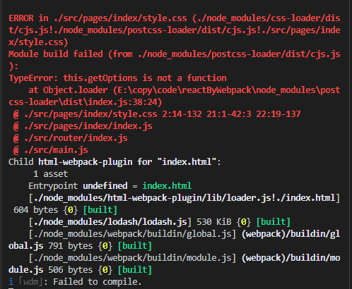

问题的分析：这个实际上就是 postcss-loader 的版本过高，不兼容 getOptions 函数方法，所以需要对 postcss-loader 进行降级处理


```
"postcss": "^8.2.6",
    "postcss-loader": "^5.0.0",
    "postcss-nested": "^5.0.3",
    "precss": "^4.0.0",
```

npm uninstall postcss-loader

npm install postcss-loader@4.2.0

#### 坑2 前缀不生效

autoprefixer官方文档https://github.com/postcss/autoprefixer

因为postCss版本更新，之前版本的配置已无效：

https://www.cnblogs.com/tdd-qdkfgcs/p/11330883.html


https://blog.csdn.net/qq_40143581/article/details/106499881

方法1 package.json文件中添加

```
"browserslist": [
    "defaults",
    "not ie <= 8",
    "last 2 versions",
    "> 1%",
    "iOS >= 7",
    "Android >= 4.0"
  ]
```

postcss.config.js

```
module.exports = {
    plugins: [
        require('precss'),
        require('autoprefixer')()
    ]
}
```

方法2：

不在package.json写，直接改postcss.config.js

```js
module.exports = {
    plugins: [
        require('precss'),
        require('autoprefixer')({
            overrideBrowserslist: [
                "defaults",
                "not ie <= 8",
                "last 2 versions",
                "> 1%",
                "iOS >= 7",
                "Android >= 4.0"
              ]
        })
    ]
}
```

https://blog.csdn.net/weixin_41877243/article/details/101295001?utm_medium=distribute.pc_relevant.none-task-blog-BlogCommendFromMachineLearnPai2-2.control&depth_1-utm_source=distribute.pc_relevant.none-task-blog-BlogCommendFromMachineLearnPai2-2.control

taro中

https://taro-docs.jd.com/taro/docs/2.x/css-modules

****

相关文章

[babel-preset-env：你需要的唯一Babel插件](https://segmentfault.com/p/1210000008466178)
[Runtime transform 运行时编译es6](


```js
  .rem2 {
    margin-top: 30px;
    height: 375px;
    width: 375px;
    border: 1px solid blue;/*no*/
  }
  
  这里的1px不会转换成rem单位
  
```


## CLI工具

```
npx create-react-app jira --template typescript
```


## errors

### l


TypeError: loaderContext.getOptions is not a function

"ts-loader": "^9.2.5",

https://github.com/TypeStrong/ts-loader/issues/595

